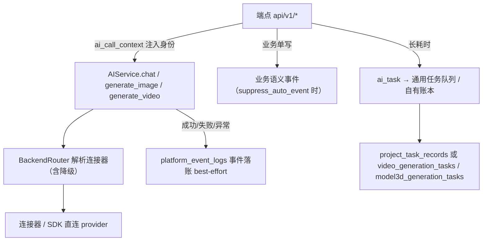
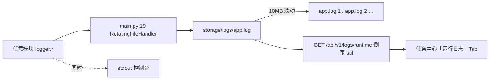

# 系统交互关系与调用链（AI 调用 / 任务 / 事件）

来源：`AIService` 收口、`ai_task`、任务重试与事件重发实现。最后更新：2026-09-11。

## 1. 一次 AI 调用的完整链路

要点：
- 事件记录在 `AIService` 收口，端点不再手写同义事件；`project_id`/`ref_id`/`retry_payload` 由上下文带入。
- 任务记录在端点显式创建（`ai_task` 或 `queue.create_task`），与事件是两套。
- 直连 provider 的旁路（embedding、STT、model3d）自己记事件，不经 `AIService`。

## 2. 失败后的两条恢复路径

| 路径 | 入口 | 真源 | 适用 |
|---|---|---|---|
| 事件重发 | `POST /api/v1/logs/{id}/retry` | 事件的 `retry_payload_json` | image / video / llm 调用失败 |
| 任务重试 | `POST /api/v1/tasks/{task_id}/retry` | 账本的 `request_json` | video_generation / model3d_generation（`kind=generation`） |

两者都会**产生新任务/新事件**并保留原记录；重发事件之间的链路用 `retry_of` / `retried_by` 串起。

## 3. 任务中心的数据来源聚合

`GET /api/v1/tasks` 聚合：
1. 通用内存队列（`core/task_queue`，含从 `project_task_records` 恢复的任务）
2. `video_generation_tasks`
3. `model3d_generation_tasks`
4. 历史下载任务表（迁移中）

前端任务中心三 Tab：任务（本接口）/ 事件日志（`/api/v1/logs`）/ 运行日志（`/api/v1/logs/runtime`）。

## 3.1 运行日志（进程日志）链路

- 落盘配置：`backend/app/main.py:19` 的 `RotatingFileHandler`（10MB 滚动、保留若干份），
  实际产物在 `backend/storage/logs/app.log[.N]`。
- 读取：`GET /api/v1/logs/runtime` 倒序 tail，支持 level / 关键词过滤与 `before` 游标。
- 定位差异：**事件日志**是业务审计流（表 `platform_event_logs`，带重发参数）；
  **运行日志**是进程输出（文件），排障时含 provider/SDK 原始错误（如
  `[ERROR] [OpenAISDK-Image] OpenAI API error: ...`），但不驱动任何业务恢复。

## 4. 前端入口

| 页面 | 路径 | 说明 |
|---|---|---|
| 任务中心 | `/tasks` | 三 Tab；失败任务可取消/删除/重试；详情含诊断与事件时间线 |
| 事件日志 | `/tasks`（事件日志 Tab） | 场景筛选（需与后端 scene 同步）、详情、重发、运行日志 |
