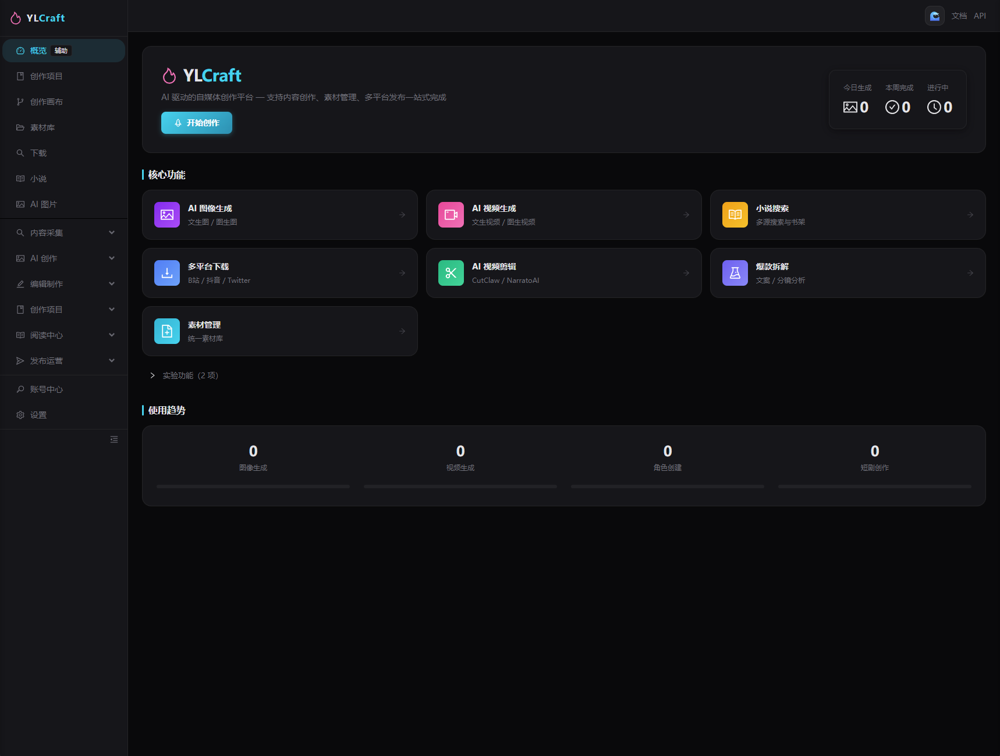
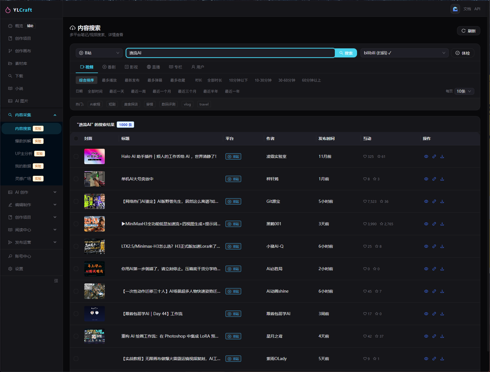
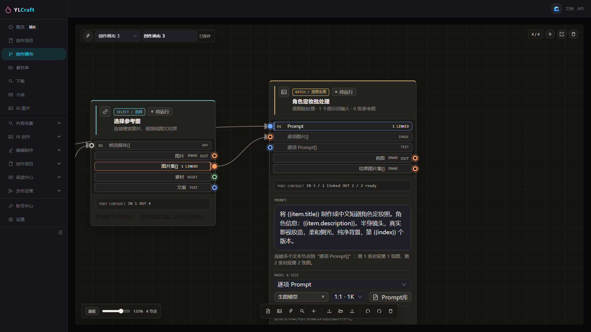
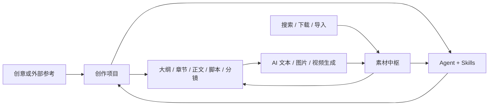

# YLCraft

> 一个把创意、参考素材和 AI 生成结果沉淀为可复用资产的开源内容生产工作台。

YLCraft 面向不想只停留在聊天框里的内容创作者：小说与短剧团队、摄影师、COSER、电商运营和自媒体创作者。它将素材中枢、创作项目、可视化工作流、模型配置与 Agent + Skill Runtime 连接为一个可持续使用的创作环境。

## 界面预览

### 内容生产中枢

从一个轻量的概览进入创作、素材、图像、视频、下载、剪辑和发布等工作区。



### 内容采集

按平台、媒体类型、排序和时长检索公开内容，将可用参考纳入后续项目和素材工作流。



### 创作画布

将参考图、Prompt、模型和批量生成组织为可追踪的类型化节点工作流；结果可回流到创作项目和素材中枢。



相比“AI 对话 + 一堆提示词文件”，YLCraft 围绕三件实际的事设计：

1. **降低门槛**：用户面对项目、角色、章节、参考图和产物，而不需要先理解 Tool schema、Prompt 管线或运行记录。
2. **直观展示**：版本、执行轨迹、生成媒体、来源证据和素材血缘在对应业务工作台里可见、可比较、可继续操作。
3. **节省 Token**：下载、导入、格式转换、校验、批处理和持久化等确定性工作由服务与脚本完成；模型专注理解、规划和创作。

## 当前可用能力

| 工作区 | 能力 |
| --- | --- |
| **素材中枢** | 导入、存储、检索、版本化图片、视频、音频、文本和生成结果，并保留来源与血缘。 |
| **创作项目** | 从创意进入大纲、项目圣经、章节规划、正文、脚本、分镜、参考卡和生成媒体。 |
| **Story Cockpit / Writer Room** | 支持场景节拍、角色演绎、正文候选、人味润色、审稿、连续性事实、伏笔和受控提升为正式正文。 |
| **创作画布** | 独立的节点式工作流画布，编排文本、Prompt、模型、图片、平台搜索、图片处理、批量生图和类型化变量连线。 |
| **Prompt 参考库** | 浏览本地优先缓存的双语提示词、标签、模型分组与参考图，并插入画布和生图流程。 |
| **AI 模型配置** | 通过统一连接器配置 LLM、图像、视频、TTS、STT 与 Embedding 模型。 |
| **智能体与 Skills** | 提供 thread 对话、上下文快照、记忆、工具轨迹、文件化 Skill 与 Supervisor 子智能体委派。 |
| **采集与发布** | 提供平台搜索、下载与导入、任务诊断，以及已接入平台上的受控发布能力。 |

## 产品主链路


```mermaid
flowchart LR
  Idea["创意或外部参考"] --> Project["创作项目"]
  Search["搜索 / 下载 / 导入"] --> Assets["素材中枢"]
  Project --> Content["大纲 / 章节 / 正文 / 脚本 / 分镜"]
  Assets --> Content
  Content --> Generate["AI 文本 / 图片 / 视频生成"]
  Generate --> Assets
  Project --> Agent["Agent + Skills"]
  Assets --> Agent
  Agent --> Project
```

## 快速开始

### 环境要求

- Python 3.10+
- Node.js 18+
- PostgreSQL 16 + pgvector
- Redis 可选。本地开发时任务队列会降级到内存模式
- 视频与媒体工作流需要 FFmpeg
- **3D 模型处理需要 Blender 4.5+**（前端 3D 查看器不需要，只有后端处理需要）

### 关于 Blender 这个依赖

后端用 Blender 的**无头命令行**处理 3D 模型，能力都在 `backend/app/core/blender.py` 与 `backend/app/services/model3d/blender_scripts/`：

| 脚本 | 作用 |
|---|---|
| `convert.py` | 格式转换（glb/gltf/fbx/obj 互转）、减面、剥离骨骼、按映射给骨骼改名 |
| `preview.py` | 渲染模型预览图（素材库卡片用；没有它模型会显示成「加载失败」） |
| `skeleton_report.py` | 导出骨骼树并推断 Mixamo 对应关系 |
| `upright.py` | 扶正绑定姿势（有些模型的 rest pose 是躺着的，靠自带动画才站起来） |
| `retarget_bake.py` | 把别的模型的动作套到这个模型上（通用动作库） |

**没有装 Blender 会怎样**：这些能力会**显式降级**而不是假装成功——模型照常入库与查看，只是没有预览图、格式转换与动作套用会明确报「Blender 不可用」。绑骨（调腾讯云）不受影响。

安装方式（任选其一）：

```bash
# Windows
winget install BlenderFoundation.Blender.LTS.4.5

# Linux（snap 版本较新；发行版仓库里的常常偏旧）
sudo snap install blender --classic
#   或者官网下载 tar.xz 解压后软链到 PATH

# macOS
brew install --cask blender
```

程序会**自动查找** Blender：环境变量 `BLENDER_PATH` → 常见安装位置（Windows 的 `Program Files\Blender Foundation\*`、Linux 的 `/usr/bin/blender`、`/usr/local/bin/blender`、`/snap/bin/blender`、macOS 的 `/Applications/Blender.app`）→ PATH。装在别处时用环境变量指一下即可：

```bash
BLENDER_PATH=/opt/blender-4.5/blender
```

Linux 上无需图形界面，`--background` 模式不依赖 X11/显示器。

### 1. 启动 PostgreSQL 与 Redis

仓库中的 Compose 文件只用于启动本地基础设施：

```bash
docker compose up -d postgres redis
```

其中凭证只适合本地开发。不要暴露数据库端口，也不要在共享或生产环境复用该开发密码。

### 1.1 使用 CNB 云原生开发（单容器模式）

仓库通过 `.cnb.yml` 的 `vscode` 事件与 `.ide/Dockerfile` 提供 CNB 云原生开发环境。
`.ide/Dockerfile` 已安装 `code-server`，因此采用**单容器模式**启动：
开发环境与 code-server 运行在同一容器内，既可直接使用 WebIDE，也可通过 VSCode 远程开发。

点击 CNB 仓库页面的「云原生开发」按钮即可一键进入开发环境。

### 2. 配置后端

```bash
cd backend
cp .env.example .env
```

Windows PowerShell：

```powershell
Copy-Item .env.example .env
```

编辑 `backend/.env`，填入数据库连接和准备使用的模型供应商配置。API Key、Cookie、浏览器导出文件和本地凭证必须只保存在被忽略的本地文件中。

### 3. 执行迁移并启动 API

```bash
cd backend
python -m venv venv
# Linux/macOS
source venv/bin/activate
# Windows PowerShell
# .\venv\Scripts\Activate.ps1
pip install -r requirements.txt
alembic upgrade head

# ⚠️ --host 必须是 0.0.0.0，不能写 127.0.0.1
#
# 写 127.0.0.1 时后端只监听回环网卡：前端页面照样打得开（图片走相对路径
# /api/v1/proxy/image，由 vite 转发到后端），但一旦后端进程没起，
# 搜索结果里的图片就全是浏览器的破图图标，**且没有任何提示** ——
# 看起来像"手机端图片被防盗链拦了"，实际是后端没在跑/没监听局域网。
#
# 0.0.0.0 = 监听所有网卡，本机和手机（192.168.x.x）都能直连 8000 端口。
# 调试时把 --host 写死成 127.0.0.1 是常见习惯，但它会让局域网访问直接不可用。
uvicorn app.main:app --reload --host 0.0.0.0 --port 8000

# Windows 必须追加 --loop，否则浏览器类功能（Cookie 获取）全部失败：
#   --reload 会让 uvicorn 选 SelectorEventLoop，它在 Windows 不支持创建子进程，
#   Patchright 无法启动浏览器。详见 backend/app/core/win_loop.py。
# Windows 实测：--reload 会挂住 worker，因此本机不使用 --reload。
uvicorn app.main:app --host 0.0.0.0 --port 8000 --loop app.core.win_loop:new_loop
```

### 4. 启动前端

```bash
cd frontend
npm install
npm run dev
```

打开 `http://localhost:3000`，或以终端实际输出的 Vite 地址为准。API 文档在 `http://127.0.0.1:8000/docs`。

### 5.（可选）用手机在同一局域网访问

前后端都监听 `0.0.0.0` 时，手机连同一个 Wi-Fi 即可访问：

```bash
# Windows
ipconfig | findstr IPv4        # 找到 WLAN 那行的 192.168.x.x
```

手机浏览器打开 `http://<那个IP>:3000`（例如 `http://192.168.18.73:3000`）。

排查顺序（图片全是破图时按这个顺序查）：

1. 手机能打开页面，但图片全裂 → **后端没起，或 `--host` 写成了 127.0.0.1**。
   封面是相对路径 `/api/v1/proxy/image?url=…`，由 vite 转发给后端；
   后端不通时浏览器只显示破图图标，没有报错，**很容易误判成"图片防盗链"**。
   验证：`curl http://<本机IP>:8000/api/v1/proxy/image?url=<任意图片URL>`，
   返回 200 + 图片二进制即后端正常。
2. 页面整个打不开 → 检查 Windows 防火墙是否放行 3000/8000 入站，
   以及手机和电脑是否真的在同一网段（注意访客网络/AP 隔离会阻断）。
3. 页面能开但接口报 502 → vite 代理拿不到后端，同第 1 条。

### 6. 浏览器登录 profile 会越跑越大（可安全清理缓存）

采集用的 Chromium profile 在 `backend/data/browser_profiles/<平台>/`，
每跑一次 Patchright 都会增长 —— 实测 9 个平台合计 **1.2 GB**，
但**其中约 1.15 GB 是 Chromium 缓存，不是 cookie**：

| 内容 | 小红书单平台实测 | 能否删 |
|------|-----------------|--------|
| `Default/Cache` | 377 MB（单文件 `data_3` 就 108 MB） | **可随时删** |
| `Default/Code Cache` | 27 MB | **可随时删** |
| `Default/Network/Cookies` | < 0.1 MB | ❌ **删了要重新登录** |
| `Default/Local Storage`、`Sessions` | 很小 | ❌ **删了要重新登录** |

PowerShell 清理（**先关掉后端**，否则文件被占用）：

```powershell
Get-ChildItem backend\data\browser_profiles -Recurse -Directory |
  Where-Object { $_.Name -in 'Cache','Code Cache','GPUCache','DawnGraphiteCache','DawnWebGPUCache' } |
  ForEach-Object { Remove-Item $_.FullName -Recurse -Force -ErrorAction SilentlyContinue }
```

⚠️ 这些目录已被 `.gitignore` 忽略（`backend/data/`），**不要提交**：
`Default/Network/Cookies` 是各平台的登录态，泄漏等于账号被直接冒用。

### 可选：初始化小说阅读子模块

```bash
git submodule update --init --recursive
```

## 首次使用建议

1. 进入 **设置**，添加文字或图片模型连接器。
2. 在 **创作项目** 新建项目。
3. 完成大纲、项目圣经与章节规划，再在单章的 **Writer Room** 中创作。
4. 从 **素材中枢** 或 **Prompt 参考库** 加入角色和视觉参考。
5. 生成正文、脚本、分镜或图片。只有通过项目或素材中枢持久化的产物，才会成为可追溯素材。
6. 使用 **智能体** 执行工具化工作；写入、删除、发布和高成本动作仍要求显式确认。

需要自由编排视觉工作流时，使用 **创作画布**。画布与项目关系图谱刻意分离：画布负责组织可复用流程，项目和素材中枢仍是业务事实与血缘的唯一来源。

## 架构速览

```text
frontend/                   React 18 + TypeScript + Vite + Ant Design
backend/app/api/v1/         FastAPI HTTP 边界
backend/app/services/       Agent、项目、素材、AI、画布与平台等领域服务
backend/app/db/models/      SQLModel 数据模型
backend/alembic/            数据库迁移
backend/app/skills/         内置文件化 Skills
docs/architecture/          系统与 API 的事实来源文档
openspec/changes/           进行中与已归档的实现规格
```

- **前端**：React、TypeScript、Vite、Ant Design。
- **后端**：FastAPI、SQLModel、PostgreSQL + pgvector、Alembic。
- **AI 与集成**：可配置供应商连接器、适用场景下的 OpenAI 兼容协议、ComfyUI、媒体工具、平台适配器与任务诊断。

## 安全与合规使用

- 不要提交 `.env`、供应商密钥、Cookie、浏览器导出文件、数据库导出、生成媒体、本地备份、日志、证书或私钥。
- 将 `backend/.env.example` 复制为本地 `.env` 使用；示例文件可提交，`.env` 已被忽略。
- 贡献或发布前运行：

  ```bash
  python tools/audit_public_release.py
  ```

- 漏洞报告见 [SECURITY.md](SECURITY.md)，完整发布检查见 [docs/SECURITY_RELEASE.md](docs/SECURITY_RELEASE.md)。
- 平台接入只能用于你有权使用的账号、数据和权限范围。不要在 Issue、PR 或日志中提交真实账号 Cookie。

## 文档入口

| 文档 | 用途 |
| --- | --- |
| [文档地图](docs/README.md) | 维护中的文档结构入口。 |
| [系统架构](docs/architecture/YLCRAFT_SYSTEM_ARCHITECTURE.md) | 产品边界、运行时模型、数据归属和模块状态。 |
| [API 清单](docs/architecture/API_SURFACE.md) | 当前 HTTP API 契约。 |
| [创作项目指南](docs/guides/creative-project-loop.md) | 项目、内容、素材与生成工作流。 |
| [智能体中心](docs/agent/agent-center.md) | 对话工作台与运行时行为。 |
| [Agent Skill Runtime](docs/agent/agent-skill-runtime.md) | Skill 包、路由与审批契约。 |
| [AI 协作协议](docs/AI_HANDOFF_PROTOCOL.md) | 多电脑、多 AI 协作开发规则。 |

## 开发约定

提交 PR 前至少执行：

```bash
python tools/audit_public_release.py
cd frontend && npm run build
```

修改 API、数据模型、Agent Tool、Skill 或工作流时，应在同一改动中更新其所属 OpenSpec 与架构/API 文档。详见 [AGENTS.md](AGENTS.md)。

## 许可证

本项目采用 [Apache License 2.0](LICENSE) 开源。你可以自由使用、修改、分发和商用，但需保留版权与许可证声明。详见 [LICENSE](LICENSE)。
