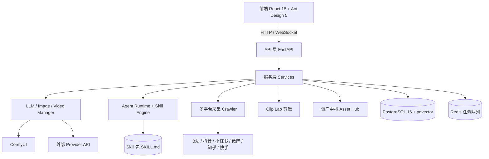

# YLCraft — 总体设计与架构

> 本文是 YLCraft 的单一事实来源：产品定位、技术栈、系统架构、模块现状与文档导航。
> 最后更新：2026-08-13。详细子领域设计见 `docs/architecture/`，Agent 与平台接入见 `docs/agent/`、`docs/platform/`，必要交接记录见 `docs/devlog/`。

当前交付快照：Agent/Skill Runtime、Asset Hub、独立 Canvas、提示词参考库、叙事运行时和 Story Production Desk 已进入可用主线；`/story` 已恢复为“项目总览 + 单章工作室”的显式双工作面，项目资料与章节生产分层展示。`/video-gen` 已具备文生/图生视频、素材库首帧、提示词模板、持久任务恢复和 Asset Hub 回流；`/model-3d` 已具备配置驱动的提交、轮询、下载与资产血缘。剩余工作主要是外部供应商/平台凭证下的真实验收、番茄接口补抓、健康 Agent 后端下的多轮恢复验收，以及 Story UI 的后续分组件收束。

设计定位（Design Read）：面向内容创作者的 AI 创作平台，覆盖电商 / 摄影 / 短剧三大场景；以「素材资产中枢 + Agent Skill 运行时」为底座，把高频创作流程沉淀为可复用、可审批的 Skill。

---

## 一、产品定位与总目标

YLCraft 是面向内容创作者的逸流创作平台，把分散的生成、剪辑、采集能力串成「创作项目 → 素材 → 下载 → 生图」的闭环，并用 Agent Skill 把最佳实践固化下来。

四大核心能力：

| 能力 | 说明 |
|------|------|
| 爆款拆解 | 输入链接 → 文案结构 + 脚本分镜 + 仿写提示词 |
| AI 生成 | 多 Provider 统一调度文生图 / 图生视频 / 语音 |
| 素材与资产 | 下载、采集、生成产出统一进入资产中枢，支持谱系与混合检索 |
| Agent 协作 | 智能体工作台 + 文件化 Skill 运行时，流程可沉淀、可审批、可复用 |

目标用户：电商运营（商品种草视频）、摄影工作室（客片精修 / 写真 MV）、短剧创作者（AI 短剧漫剧）、COSER（Live2D 生产线，规划中）。

总目标不是堆功能，而是让「一次做对的流程」能被后续任务直接调用，而不是每次从零开始。

### 1.1 相比直接使用 AI + Skills 的产品约束

YLCraft 不与通用 AI 比拼聊天框，而是把 AI + Skills 变成普通创作者能直接使用的生产工具。所有模块和交互必须同时接受三条约束：

1. **降低门槛**：用户只需要表达目标和选择内容，不必先理解 Prompt 工程、Tool schema、Run、Memory 或文件目录。
2. **直观展示**：输入、执行过程、确认、版本、素材和最终产物应在业务界面中可见、可比较、可继续操作，而不是只存在于模型上下文或日志里。
3. **节省 Token**：确定性的搜索、下载、格式转换、批处理、持久化、校验和数据搬运优先交给脚本与服务；模型只处理理解、判断、规划和创作。

这三条不是宣传文案。新增页面、Agent 工具或工作流时，应说明它降低了什么门槛、展示了什么业务结果，以及哪些步骤无需模型参与。

---

## 二、参考项目与外部参考

> 外部参考项目统一 clone 在 `F:\PycharmProjects\YLCraft-refs\`（不在 git 内，仅供本地对照参考）。完整索引与能力矩阵见 `docs/reference/REF_PROJECTS.md`。

### 2.1 参考项目清单

已在 `F:\PycharmProjects\YLCraft-refs\` 完成 clone，路径为 `F:\PycharmProjects\YLCraft-refs\{项目名}`。

| 项目 | GitHub | Stars | 参考内容 |
|------|--------|-------|----------|
| **Jellyfish** | `Forget-C/Jellyfish` | — | Provider 注册表模式、LangChain Agent 实现、frozen dataclass |
| **ArcReel** | `ArcReel/ArcReel` | — | Protocol 接口 + Dataclass 请求/响应 + Registry 注册表 + 异步轮询 |
| **CutClaw** | `GVCLab/CutClaw` | 574 | LLM Agent Tool Calling 驱动视频剪辑、节拍检测、VLM 美学评分 |
| **NarratoAI** | `linyqh/NarratoAI` | 8788 | Pipeline 流水线、字幕分析、Provider 双模式调用、FFmpeg 硬件加速 |
| **montage-ai** | `mfahsold/montage-ai` | — | MoE 多专家协作架构、Control Plane 冲突解决、人工审核分流 |
| **MoneyPrinterTurbo** | `harry0703/MoneyPrinterTurbo` | — | YAML 配置驱动、Voice 前缀路由模式、g4f 免费兜底 |
| **ai-fusion-video** | `Stonewuu/ai-fusion-video` | — | Java Agent 全流程分镜视频流水线、`.agents` 目录结构 |
| **waoowaoo** | `saturndec/waoowaoo` | 7.8k | TypeScript 全栈 Next.js、`features/` 功能分层、Prisma 数据层、工业级 AI 影视生产链路 |

### 2.2 设计思想提炼

```
ArcReel ──────────→ Protocol 接口 + 能力声明
     └─────────────→ 异步轮询重试（poll_with_retry）
     └─────────────→ 自定义 Provider 工厂

Jellyfish ────────→ Provider 注册表模式
     └─────────────→ frozen/slots dataclass 设计

CutClaw ──────────→ LLM Agent Tool Calling
     └─────────────→ litellm 统一调用层
     └─────────────→ 节拍检测 + VLM 美学评分

NarratoAI ────────→ Provider 双模式（原 Gemini + OpenAI）
     └─────────────→ PromptManager 模板系统
     └─────────────→ 异步批量 VLM 分析
     └─────────────→ FFmpeg 硬件加速

montage-ai ───────→ MoE 多专家 + Control Plane
     └─────────────→ 冲突检测 + 置信度过滤
     └─────────────→ 自动/人工分流

MoneyPrinterTurbo → YAML 配置驱动
     └─────────────→ Voice 前缀路由
     └─────────────→ g4f 免费兜底

ai-fusion-video ────→ Agent 流水线串联（剧本→分镜→素材→视频）
     └─────────────→ 多 Agent 协同分工

waoowaoo ───────────→ features/ 功能模块分层
     └─────────────→ Prisma ORM 数据层
     └─────────────→ i18n 多语言提示词工程
```

---

## 三、技术栈（当前）

| 维度 | 选型 |
|------|------|
| 后端框架 | FastAPI + Uvicorn |
| ORM | SQLModel（异步 asyncpg / 同步 psycopg2） |
| 数据库 | PostgreSQL 16 + pgvector（关系 + 向量 + 全文检索） |
| 数据库迁移 | Alembic（禁止 `create_all`） |
| 向量嵌入 | sentence-transformers（paraphrase-multilingual-MiniLM-L12-v2，384 维） |
| 前端框架 | React 18 + TypeScript |
| 构建工具 | Vite 5 |
| UI 库 | Ant Design 5（zh_CN），主题走 `THEME` 常量，禁硬编码色值 |
| 路由 | react-router-dom 6 |
| 任务队列 | Redis（可选）/ 内存模式自动降级 |
| 视频处理 | FFmpeg + yt-dlp |
| 语音识别 | faster-whisper |
| 3D 处理 | trimesh + assimp（glb/fbx） |
| 部署 | Docker Compose 单容器（PostgreSQL + Redis） |

---

## 四、系统总体架构



分层职责：

- 表现层：前端页面与组件，统一走 `THEME` 主题与 Ant Design 组件。
- API 层：REST 路由（`/api/v1/...`），请求 / 响应用 Pydantic 模型，错误统一 `HTTPException`。
- 服务层：业务逻辑编排，不直接操作 HTTP；跨服务通过依赖注入。
- 数据层：PostgreSQL + pgvector，迁移只走 Alembic；向量检索用参数化原生 SQL。
- 外部集成：ComfyUI、各平台采集、外部模型 Provider。

---

## 五、核心模块现状

状态口径：

- **完整**：代码完成且可运行（可能仍需配置 API Key）。
- **部分**：有核心逻辑，但依赖配置 / 部分功能未完成。
- **规划中**：设计或骨架阶段，尚未进入主线。

| 模块 | 状态 | 说明 |
|------|------|------|
| AI 模型配置（AIConnector） | 完整 | OpenAI 兼容协议，覆盖 llm / image / video / tts / stt / embedding |
| AI 图片生成 | 完整 | ComfyUI 工作流驱动，Prompt 模板 + 任务队列 |
| B 站搜索 / 下载 / 登录 | 完整 | yt-dlp 下载、二维码登录、Cookie 自动获取 |
| Agent Skill Runtime | 完整 | 2026-07 完成（OpenSpec `agent-skill-package-runtime` M0-M10 全勾） |
| 创作项目闭环 | 部分 | 核心代码和真实 SiliconFlow 生图闭环已验证；仍留 1 项真实环境验收 |
| 资产中枢（Asset Hub） | 完整 | 图片 / 视频 / 音频 / 文本等统一资产模型、版本、表示、谱系和项目关联已接入主线 |
| Story / Writer Room | 部分 | 大纲、章节、正文、脚本、分镜、叙事上下文、连续性与生产工作台可用；候选读取已收敛为项目最新与当前章历史分读，继续收尾写作门禁和真实界面验收 |
| 独立创作画布 | 部分 | 节点、端口契约、变量连线、运行 trace、提示词/素材/生成回流可用；仍需持续打磨节点体验 |
| 生图提示词参考库 | 完整 | IMI 三类本地优先集合、双语字段、多图、图片缓存、筛选、画布和生图集成已完成 |
| 番茄小说接入 | 部分 | Cookie、书籍、热榜、统计、项目绑定、草稿发布及 Agent 预检/确认发布可用；作家资料/章节/收益及真实联调待补 |
| 任务观测诊断 | 完整 | 任务诊断、事件时间线、异步生图轮询和 Asset Hub 回写可追踪 |
| Live2D 工厂 | 规划中 | 立绘 → 分层 → 绑骨 → VTS |
| Clip Lab | 规划中 | CutClaw / NarratoAI / MoE 三种剪辑模式 |
| 爆款拆解 | 规划中 | 链接 → 结构 + 分镜 + 仿写提示词 |

> 设计文档 `DESIGN.md` 的早期章节（资产库、AI 服务层、Live2D、多平台 API）仍是有效设计基线，深入细节见 `docs/architecture/`。

---

## 六、Agent Skill Runtime（核心能力）

把「一次做对的工作流」沉淀为可复用、可审批的 Skill。

- 文件化 Skill 包：`backend/app/skills/**/SKILL.md`，YAML frontmatter 解析、校验、checksum、package index。
- metadata 驱动路由：keywords / context_keys / tools 打分匹配，渐进式上下文加载。
- slash 激活：`/skill_name`。
- Bundle：多 Skill 组合为可复用工作流，参与斜杠激活。
- 草稿审批：外部 Skill / 手动粘贴 / Run 转 Skill 都先进入待审批草稿，批准后写入用户目录。
- 路由规则编辑只生成草稿，不直接覆盖 active Skill。

完整规范见 `docs/agent/agent-skill-runtime.md`。

---

## 七、创作项目闭环

产品主链路是「创作项目 ↔ 素材库 ↔ 下载 ↔ 小说 ↔ AI 图片」的循环，其他模块不应阻塞这条主线。

| 入口 | 路由 | 角色 |
|------|------|------|
| 创作项目 | `/story` | 大纲、章节、正文、脚本、分镜、参考与内联生成 |
| 素材库 | `/assets` | 下载 / 生成 / 参考的持久记忆 |
| 下载 | `/download` | 外部文件进入本地资产系统 |
| 小说 | `/novel-bookshelf` | 搜 / 下 / 读 / 换源，作为项目素材源 |
| AI 图片 | `/image-gen` | 由项目提示词生图并回流到项目链接 |

完整说明见 `docs/guides/creative-project-loop.md`。

---

## 八、目录结构（精简）

```
YLCraft/
├── backend/app/            # FastAPI 服务（api / services / connectors / core / db）
│   ├── skills/             # 内置与外部 Skill 包（SKILL.md）
│   └── db/models/          # SQLModel 数据模型
├── frontend/src/           # React 应用（pages / components / api / hooks / context）
├── docs/                   # 本文档体系（见第九节）
├── openspec/               # 变更提案与规格（changes / specs）
└── docker-compose.yml      # 单容器基础设施（PostgreSQL + Redis）
```

---

## 九、文档导航

| 文档 | 用途 |
|------|------|
| `docs/rules/01-项目概述.md` | 项目规范（权威，注入为工作区规则） |
| `docs/rules/02-后端开发规范.md` | 后端架构与编码约定 |
| `docs/rules/03-前端开发规范.md` | 前端组件 / 样式 / 主题约定 |
| `docs/rules/04-代码风格.md` | Python / TypeScript 命名与注释 |
| `docs/rules/05-快速参考.md` | 命令、路径、端点速查 |
| `docs/rules/06-数据库设计规则.md` | PostgreSQL + pgvector 建模与迁移 |
| `docs/architecture/` | 子领域架构设计（资产中枢、AI 服务层、Live2D、多平台 API 等） |
| `docs/agent/` | Agent 工作台与 Skill 运行时 |
| `docs/platform/` | B 站、番茄作家后台与多平台接入参考 |
| `docs/guides/` | 产品闭环指南 |
| `docs/devlog/` | 必要交接记录；长期事实必须回写到架构、接口或领域文档 |
| `docs/refactor/` | 重构 / 迁移计划 |
| `docs/reference/` | 外部 / 客户参考素材（如 `docs/reference/短剧/`：分镜脚本、立绘提示词、微短剧拆解等，二进制 `.rtf`/`.docx` 原样保留） |

> 本文件取代原 `PROGRESS.md`、`IMPLEMENTATION_STATUS.md` 与旧的 `FRONTEND_STYLE_GUIDE.md`：状态以第五节为准，前端样式以 `docs/rules/03` 为准。
