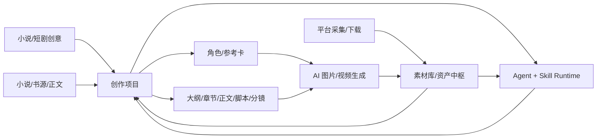
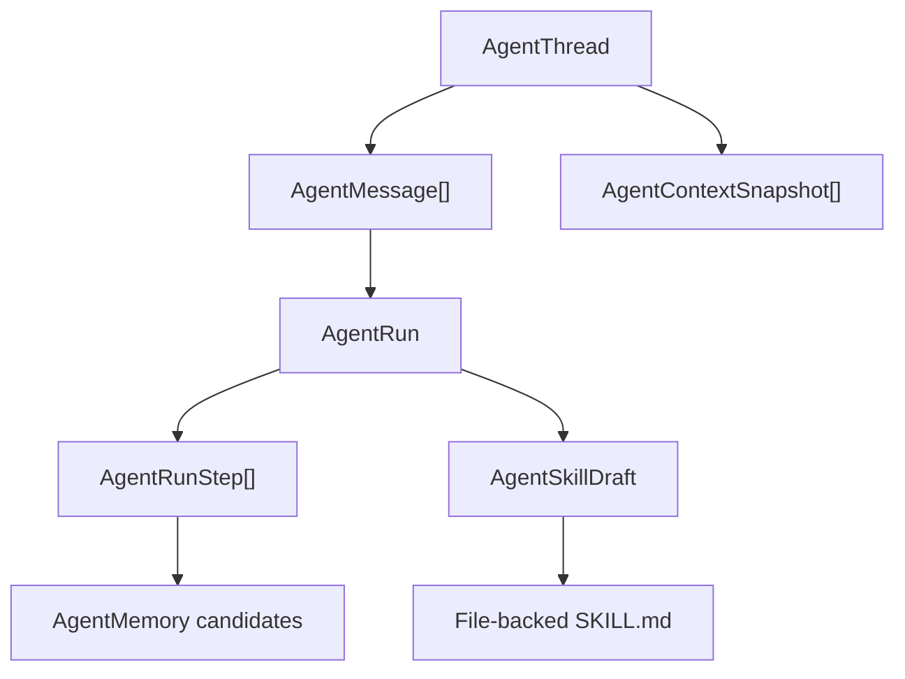

# YLCraft 总架构说明

本文是 YLCraft 的深度架构入口，目标是让人和 AI 都能快速理解当前系统，而不是依赖聊天历史。接口变化、模块边界变化、数据库主模型变化后，都要同步更新本文和 `docs/architecture/API_SURFACE.md`。`tools/generate_api_surface.py` 只负责路由事实，架构影响、模块边界和工作流语义必须由开发 AI 人工判断并写进本文或领域文档。

## 1. 产品主线

YLCraft 是一个围绕“素材库 + 创作项目 + AI 智能体”的内容生产工具。核心闭环不是单个页面功能，而是让外部素材、AI 生成结果、创作过程、角色设定、脚本分镜、图片视频任务都能沉淀为可复用资产，再由 Agent/Skill 继续调用。

主链路：

设计原则：

- 素材库和创作项目是中转层，其他功能围绕它们串起来。
- Agent 不只是聊天框，它要能读取上下文、调用工具、记录步骤、沉淀记忆和 Skill。
- Prompt、模型、供应商、参考图、生成日志都要可配置、可追溯。
- 平台采集和下载是素材入口，不应绕开资产入库和血缘记录。

## 2. 运行时总览

后端入口是 `backend/app/main.py`，应用启动时完成：

1. 加载 `backend/.env`。
2. 初始化数据库。
3. 执行书源规则迁移和平台模板种子数据。
4. 初始化任务队列，Redis 不可用时降级到内存模式。
5. 初始化 `AIService` 和连接器。
6. 注册 `/api/v1/...` 路由。
7. 挂载 `/uploads` 静态文件。

前端入口在 `frontend/src`，主要分层：

| 层 | 目录 | 职责 |
| --- | --- | --- |
| 页面 | `frontend/src/pages` | 每个业务页面，如 Agent、Story、Assets、Settings。 |
| 组件 | `frontend/src/components` | 复用 UI、布局、Agent Skill 管理等。 |
| API | `frontend/src/api` | 前端请求封装，主要集中在 `index.ts`，Agent 有独立 `agent.ts`。 |
| 类型 | `frontend/src/types` | 前端共享类型。 |
| 状态/上下文 | `frontend/src/context`、`hooks` | 主题、上下文、WebSocket 等。 |

## 3. 后端分层

| 层 | 目录 | 说明 |
| --- | --- | --- |
| API 层 | `backend/app/api/v1` | FastAPI 路由，请求/响应和 HTTP 错误处理。 |
| 服务层 | `backend/app/services` | 业务编排，Agent、创作项目、素材、AI、平台、下载等核心逻辑。 |
| 连接器层 | `backend/app/connectors` | 外部平台或 AI 能力连接器。 |
| 核心基础设施 | `backend/app/core` | 配置、任务队列、WebSocket、通用基础能力。 |
| 数据层 | `backend/app/db/models` | SQLModel 模型。迁移应走 Alembic。 |
| 内置 Skill | `backend/app/skills` | Agent 可加载的文件化 Skill 包。 |

API 层不要承载复杂业务。新增功能优先放到 `services/<domain>`，API 只做参数转换、权限/错误处理和调用服务。

## 4. 核心数据模型

### 4.1 Agent Runtime

文件：`backend/app/db/models/agent.py`

| 表/模型 | 作用 |
| --- | --- |
| `AgentThread` | 长期对话主线。刷新页面、多轮上下文应该围绕 thread 读取。 |
| `AgentMessage` | 对话消息事实来源，用户/助手/工具消息都应写入。 |
| `AgentContextSnapshot` | 某次运行使用的上下文快照，用于回放和定位“当时模型看到了什么”。 |
| `AgentRun` | 一次 Agent 执行。 |
| `AgentRunStep` | 执行步骤，包括计划、工具调用、确认、记忆提取、最终回答。 |
| `AgentMemory` | 长期/中期记忆，带 `thread_id`、`run_id`、`message_ids` provenance。 |
| `AgentMemorySnapshot` | Run 级冻结记忆上下文。 |
| `AgentSkill` | 数据库中的旧技能记录。 |
| `AgentSkillDraft` | 外部 Skill、Run 转 Skill、手工编辑后的待审批草稿。 |
| `AgentProfile` | 智能体配置，含模型、工具、默认上下文、最大步数。 |

当前架构方向：

关键要求：

- 新对话应创建新的 `AgentThread`，不是新建智能体 profile。
- 普通搜索/读取类工具不应重复授权；写入、删除、消耗型工具才需要确认。
- Trace 应作为对话流的一部分顺序展示，最终回答后可折叠。
- Skill 是过程能力，不存用户隐私或一次性对话事实。

### 4.2 创作项目

文件：`backend/app/db/models/creative_project.py`

| 表/模型 | 作用 |
| --- | --- |
| `CreativeProject` | 项目主表，承载小说、短剧、漫画等项目。 |
| `ProjectContent` | 项目阶段内容，大纲、章节细纲、正文、脚本、分镜、漫画页等。 |
| `ProjectAssetLink` | 项目内容与素材库资产的关系。 |
| `ProjectGenerationLog` | 每次生成的 prompt、请求、响应、归一化结果、错误。 |

当前方向：

- `/story` 页面正在从旧 Story Maker 过渡到 Creative Projects 工作台。
- 文本生产链路包括大纲、章节规划、正文、脚本、分镜、Writer Room；`/story` 已支持结构化大纲编辑、JSON 高级编辑、章节规划保存、章节锁定、保留锁定再生成，以及从项目事实自动构建的项目关系图谱视图。
- `/canvas` 是独立的创作画布工作台，用于自由编排文本、Prompt、LLM、生图、平台搜索和素材节点；它不是项目关系图谱，也不应成为项目事实的第二来源。画布文档持久化在 `canvas_documents.document_json`，并保留浏览器 localStorage 作为离线/迁移兜底。画布节点可以通过 `projectId`、`contentId`、`assetId` 等 metadata 引用项目或素材。
- 分镜和角色生图必须持久化结果，关联素材、任务和血缘。
- 角色、背景、道具都应作为可引用参考卡参与提示词和参考图选择。

### 4.3 资产中枢

文件：`backend/app/db/models/asset_hub.py`

| 表/模型 | 作用 |
| --- | --- |
| `AssetNode` | 资产根节点，代表图片、视频、音频、文本、角色、模型、合集等。 |
| `AssetVersion` | 资产版本，记录 prompt、模型、参数、血缘。 |
| `AssetRepresentation` | 实际文件表示，如原图、缩略图、视频、字幕等。 |
| `AssetEmbedding` | 向量索引。 |
| `AssetRelation` | 资产之间的 derived_from、uses、references 等关系。 |
| `Tag` / `AssetTagLink` | 树形标签和资产标签关系。 |
| `AIModel` | AI 模型资产。 |

注意：当前仓库里同时存在旧素材接口 `/api/v1/assets` 和新资产中枢 `/api/v1/asset-hub`。新闭环应优先考虑资产中枢模型，但兼容旧素材页和下载链路。

### 4.4 AI 配置

文件：`backend/app/db/models/ai_connector.py`

| 表/模型 | 作用 |
| --- | --- |
| `AIProviderMetadata` | 供应商规范，按能力类型保存默认模型、模板、响应配置、尺寸、参考图配置。 |
| `AIConnector` | 用户实际连接器，保存 base_url、api_key、默认模型、api_format、请求模板等。 |
| `AIUsageLog` | AI 调用统计。 |

设计方向：

- Agent 应作为通用配置助手，帮助用户把任意供应商规范转成 provider metadata 和 connector。
- 不要把能力写死到某个供应商，例如 aacc 只是一个实例，不是架构。
- 图片生成支持 OpenAI SDK、通用 HTTP、base64、轮询、ModelScope 类请求等差异。

### 4.5 生图提示词参考库

生图提示词参考库不是 `PlatformTemplate`。它面向“几百/几千条生图 Prompt 案例”的同步、浏览、搜索、筛选和插入，参考 `basketikun/infinite-canvas` 的提示词库能力。当前已提供 `ImagePromptSource` / `ImagePromptReference` 持久化、GitHub 源 seed、markdown/JSON 解析、去重同步、HTTP API、Agent 工具、独立浏览页、复用 Picker，并已接入 `/canvas` Prompt/LLM/生图节点和 `/image-gen` 提示词输入区。

设计边界：
- Prompt reference 是外部案例/灵感参考，不是创作项目阶段模板。
- Prompt reference 默认不进入 Asset Hub；只有用户显式保存为素材时才进入。
- 用 Prompt reference 生成出的图片结果应进入 Asset Hub，并记录 prompt reference 来源到生成元数据/血缘。
- `/canvas` 和 `/image-gen` 只是调用入口，可以选择、替换或追加参考 Prompt；选择信息写入节点 metadata 或图片生成请求，并进入生成图片的 Asset Hub lineage。
- 后端应优先做统一同步和缓存，避免每个前端页面各自直连 GitHub。
- 当前 API 前缀是 `/api/v1/image-prompts`；Agent 工具分类是 `image_prompt_reference`。

当前 OpenSpec：`openspec/changes/image-prompt-reference-library/`。

## 5. 主要模块边界

| 模块 | API 前缀 | 后端服务 | 前端页面 | 状态 |
| --- | --- | --- | --- | --- |
| Agent Center | `/api/v1/agent` | `services/agent` | `/agent`、settings skill 面板 | 主体完成，持续优化体验。 |
| Agent Skill Runtime | `/api/v1/agent/skills*` | `services/agent/skill_*` | `SkillManagementPanel` | OpenSpec 主计划完成。 |
| 创作项目 | `/api/v1/creative-projects` | `services/creative_project` | `/story` | 仍在闭环推进。 |
| 创作画布 | `/api/v1/canvas` | `frontend/src/components/canvas` | `/canvas` | 独立自由画布，已接一级菜单；支持后端持久化、素材/项目插入、节点运行和 Agent 操作。 |
| 旧 Story Maker | `/api/v1/story` | `services/story` | `/story` 兼容入口 | 逐步迁移。 |
| 角色 | `/api/v1/characters` | `services/character` | `/characters` | 参考图/视觉卡仍需完善。 |
| 素材库 | `/api/v1/assets` | `services/asset` | `/assets` | 可用，需与资产中枢统一。 |
| 资产中枢 | `/api/v1/asset-hub` | `services/asset_hub` | `/asset-hub` | 新模型方向。 |
| AI 连接器 | `/api/v1/ai/connectors` | `services/ai`、`services/ai_connector` | `/settings` | 已支持通用配置，仍需 UX 打磨。 |
| 生图提示词参考库 | `/api/v1/image-prompts` | `services/image_prompt_reference` | `/prompt-library`、画布 picker、图片生成 picker | 后端、Agent 工具、独立浏览页、Picker、画布/生图集成已完成；剩手动烟测。 |
| 图片生成 | `/api/v1/images` | `services/image`、AI backends | `/image-gen` | 多后端兼容中。 |
| 视频生成 | `/api/v1/videos` | `services/video_gen` | `/video-gen` | 基础能力。 |
| 下载/磁力 | `/api/v1/download`、`/api/v1/torrents` | `services/download`、`services/torrent` | `/download` | 本地化方向，不做自建云缓存。 |
| 平台采集 | `/api/v1/crawler`、`/api/v1/bilibili` | `services/crawler`、`services/platforms` | `/crawler` | B 站能力较丰富。 |
| 小说/书源 | `/api/v1/novels`、`/api/v1/book-sources` | `services/novel`、`services/reader` | `/novel-*` | 可作为创作素材源。 |
| 任务中心 | `/api/v1/tasks` | `core/task_queue` | `/tasks` | 观测诊断仍有收尾项。 |
| 字幕/BGM/剪辑 | `/subtitles`、`/bgm`、`/clip*` | 对应 services | 对应页面 | 辅助内容生产。 |
| Live2D/3D/模型 | `/live2d`、`/3d`、`/models` | 对应 services | 对应页面 | 规划/实验能力较多。 |

完整接口列表见 `docs/architecture/API_SURFACE.md`。

## 6. 接口总览与维护规则

当前接口事实来源：

- 路由注册：`backend/app/main.py`
- API 路由：`backend/app/api/v1/*.py`
- B 站专属路由：`backend/app/services/platforms/bilibili/routes.py`
- 接口清单：`docs/architecture/API_SURFACE.md`
- 机器可读清单：`docs/architecture/api_surface.json`

当前统计：

- Router mounts: 45
- Endpoints: 512
- Public schema endpoints: 511
- Hidden compatibility endpoints: 1

接口变更后，AI 必须做五件事：

1. 更新代码里的路由、schema、服务实现。
2. 更新测试或至少说明未覆盖风险。
3. 运行或等价更新 `python tools/generate_api_surface.py`，提交 `docs/architecture/API_SURFACE.md` 和 `docs/architecture/api_surface.json`。
4. 人工检查接口语义：生成清单只能说明“有什么路由”，不能说明“为什么这样设计”。
5. 如果接口影响模块职责、数据流、前端工作流或 Agent 可调用能力，同步更新本文对应章节、领域文档和 OpenSpec task。

Agent Tool / Skill 变更按内部 API 处理：工具名称、输入输出 schema、risk level、授权策略、匹配规则变化时，必须同步测试、`docs/agent/agent-skill-runtime.md` 和必要的总架构说明。

## 7. OpenSpec 当前状态

| Change | Done | Pending | 说明 |
| --- | ---: | ---: | --- |
| `archive/agent-skill-package-runtime` | 56 | 0 | Skill Runtime 主计划完成并归档。 |
| `archive/agent-center-multi-agent-runtime` | 114 | 0 | 多智能体/上下文运行时当前任务清单完成并归档。 |
| `archive/agent-center-thread-runtime-refactor` | 49 | 0 | thread runtime 重构完成并归档。 |
| `archive/agent-center-hermes-mvp` | 11 | 0 | Hermes 风格记忆/运行思路 MVP 完成并归档。 |
| `archive/creative-character-portrait-system` | 62 | 0 | 角色立绘主计划完成并归档，仍可体验优化。 |
| `archive/creative-novel-writer-room` | 52 | 0 | Writer Room 任务清单完成并归档。 |
| `archive/drop-legacy-assets-final` | 24 | 0 | 旧资产清理计划完成并归档。 |
| `creative-project-closed-loop` | 72 | 11 | 仍是后续业务主线。 |
| `creative-project-optimization-roadmap` | 32 | 11 | 仍有优化任务。 |
| `image-prompt-reference-library` | 27 | 1 | 后端模型、同步、API、Agent 工具、独立浏览页、Picker、画布和生图集成已完成；剩手动烟测。 |
| `task-observability-diagnostics` | 25 | 1 | 少量收尾。 |

## 8. 文档更新协议

每个 AI 开发完成后，不需要把所有历史 devlog 重新读一遍，也不需要新增一篇冗长流水账。按改动类型更新：

| 改动 | 必须更新 |
| --- | --- |
| 新增/删除/改语义 API | `docs/architecture/API_SURFACE.md`，必要时更新本文模块说明。 |
| 模块边界变化 | 本文第 5 节。 |
| 数据模型变化 | 本文第 4 节 + Alembic 迁移说明。 |
| Agent/Skill 行为变化 | `docs/agent/agent-skill-runtime.md` 或 Agent 相关架构段落。 |
| 创作项目流程变化 | `docs/guides/creative-project-loop.md` + 本文第 4.2/5 节。 |
| 阶段性长任务交接 | `docs/devlog/YYYY-MM-DD_topic.md`，但 devlog 只是历史，不是默认必读入口。 |

## 9. 已知治理问题

- 根 `README.md` 和部分旧中文文档在当前终端输出中存在编码显示异常，后续可单独做编码治理。
- 前端 `frontend/src/api/index.ts` 很大，长期应按领域拆分，但当前不要为了“好看”做无关大重构。
- 旧 `/api/v1/story` 与新 `/api/v1/creative-projects` 并存，后续应继续收敛。
- 旧素材 `/api/v1/assets` 与新资产中枢 `/api/v1/asset-hub` 并存，闭环功能应明确选择主事实来源。
- `docs/devlog/` 只保留必要交接记录，不应成为每次接手必读包。
