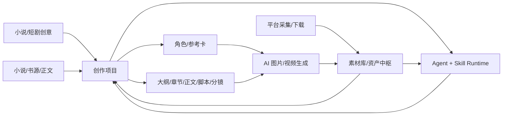
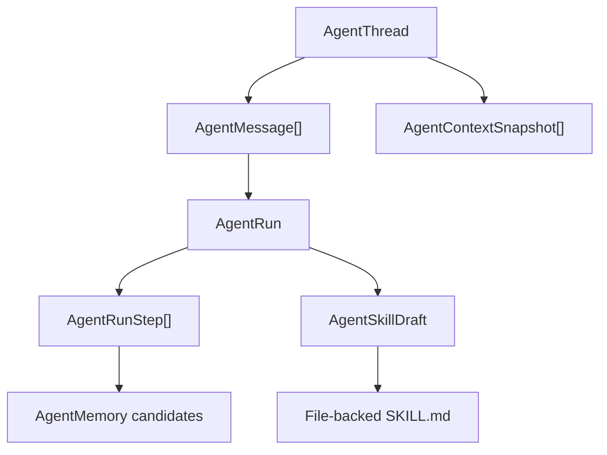

# YLCraft 总架构说明

> 2026-09-07：写作风格档案第一阶段已落地。`WritingStyleProfile` 与
> `ProjectWritingStyleLink` 负责草稿→审核→激活→项目绑定，稳定 checksum、
> 阶段范围和强度均可审计。已激活档案只作为 Context Pack T6 的表达机制注入，
> 不得覆盖 T0-T5 正典、动态状态、章节契约或正文；真人 UI 与 Agent API 共用
> 同一服务层。输入侧已补上：`extract_draft_from_source` 从来源快照取有界样本
> （≤12000 字 / 40 块）做**本地确定性测量聚合**（句长、段落、对话占比、标点密度、
> 字词多样性，按字数加权）再交给 LLM 提炼**抽象表达机制**——样本分析完即弃，
> 档案里只留 hash、测量指标与字符偏移，不落来源正文、不复制原句与专名；产出恒为
> `draft`，禁止自动激活。来源材料泄漏由 `inspect_style_material` 兜底：来源专名/禁用词、
> 与样本连续 12 字重合（复述原文）判为违规，新造示例与样本 8-gram 重合率偏高只告警；
> 闸门放在 review / activate——**违规档案可以留在草稿里查看与修正，但进不了生效链路**，
> 编辑后闸门自动重算。
> 互操作：档案可导出为 Markdown Skill 草稿（frontmatter 元信息 + 维度 + 示例 + 约束），
> 也可从 Markdown 导入——**导入不是免检通道**，同样产出 draft 并跑材料检查。
> 生成后审阅：`review_prose_deviation` 比对正文实测指标与档案基线（warn 0.35 / off 0.75），
> 约束与禁止项只作人工核对提醒；**只报告，绝不改写正文或档案**——风格是软约束，
> 偏离多少由人决定。
>
> 2026-09-11：生命周期补上**取消归档**。归档语义是"下线"而非删除，但此前没有回头路——
> `activate` 只接受 `reviewed`，归档档案在列表与详情里的激活按钮均被禁用，实际等于删除。
> 现在 `POST /api/v1/writing-styles/{id}/restore`（Agent 工具 `restore_writing_style_profile`）
> 把归档档案**恢复为草稿**，不直接跳到 reviewed/active：审核与激活的闸门必须保留，
> 取消归档不等于重新生效；归档不会解除已有绑定，但绑定会随状态一并失效。
>
> 2026-09-11：**强度落地为真实差异**。`subtle / balanced / strong` 此前只是写进标题的
> 一个词，三种取值在提示词里完全等价；现由 `INTENSITY_POLICY` 决定注入力度——表达规则
> 条数 8 / 16 / 24、新造示例 1 / 2 / 4，并在标题行标注两字标签（参考 / 贴合 / 严格）。
> 注入块由纯函数 `build_style_prompt_block` 生成（可单测）。**约束**：T6 层总预算仅 1200
> 字符且与项目 Skill 包共用，因此强度标签只占两个字、不额外占行——写长会把风格规则挤出
> 预算，表现为"绑定了风格却没注入规则"。

本文是 YLCraft 的深度架构入口，目标是让人和 AI 都能快速理解当前系统，而不是依赖聊天历史。接口变化、模块边界变化、数据库主模型变化后，都要同步更新本文和 `docs/architecture/API_SURFACE.md`。`tools/generate_api_surface.py` 只负责路由事实，架构影响、模块边界和工作流语义必须由开发 AI 人工判断并写进本文或领域文档。

## 1. 产品主线

YLCraft 是一个围绕“素材库 + 创作项目 + AI 智能体”的内容生产工具。核心闭环不是单个页面功能，而是让外部素材、AI 生成结果、创作过程、角色设定、脚本分镜、图片视频任务都能沉淀为可复用资产，再由 Agent/Skill 继续调用。

主链路：

角色库创建与项目同步前提供跨项目重复候选检查：比较规范化角色名、名称包含关系和项目级原文别名，并返回已有项目/世界使用信息。该检查只提供人工决策依据，不自动合并或阻止创建；真人界面在提交前展示候选，Agent 应先调用 `find_character_duplicate_candidates` 再请求明确的复用或新建决策。

角色管理支持两类互补流程：`extract`（从小说/正文提取角色，保留原文依据与字段来源）和 `character-first`（先独立创建角色、完善设定与参考图，再选择性回流 Story/生产线）。后者不要求先完成正文、大纲或圣经；角色页本身是可独立使用的角色设定集工作区。`/characters` 现在直接进入角色工作区：默认打开首个角色，左侧固定角色列表、搜索、来源/定位/收藏筛选，右侧为 `/characters/:characterId` 报告式详情（视觉中心、参考图/设定图、Bible、关系与 Prompt 资产包）；角色库为空时进入 `/characters/new` 创建弹窗，创建后进入真实详情。角色详情可直接新建/编辑角色、选择立绘版本设为身份基准图、将版本加入或移出参考图集合（移除只解除角色引用，不删除素材库原图），参考图选择器支持素材库搜索并区分素材库图片与历史立绘版本；版本卡可独立预览并展开查看生成 Prompt、负面 Prompt 和参数，主视图与参考图集合在视觉上明确分栏；生图请求固定采用当前身份基准图及已确认参考图集合，临时版本预览不会被隐式带入；Story 生产线中的角色立绘生成也会复用同一组角色参考图，并把结果回写项目大纲和 Asset Hub 血缘；生成故事大纲时会保留项目已绑定角色的确认字段，不会被新一轮 LLM 大纲覆盖；生图 Prompt 可在选定 LLM 下优化，优化结果仅回填待确认输入框，不会隐式创建资产；并从已关联的创作项目直接回到 Story 生产线。“以此角色新建项目”会预填创意，项目创建后立即把完整角色卡写入项目大纲并建立角色项目关联，后续大纲、角色演绎、分镜和生图无需再次手动同步。世界使用配置会保留项目内别名、阵营、状态、局部 Prompt 标签、OOC/出模约束和 Bible/视觉覆盖。关系图谱也已在详情页内以内联 SVG 展示，节点可直接切换角色；角色工作区支持「全屏工作区」切换（AppLayout 内隐藏 Header，不新增路由，Esc 退出，切路由自动恢复），并新增「世界视角」切换条：角色库是全局基准设定，切到某个项目/世界后展示「基准 + 该项目覆盖」的有效 Bible（identity/motivation/speech/behavior）、服装覆盖和视觉覆盖，并在覆盖字段上标注「本世界覆盖」。提取来源细分为 `uploaded_novel`（上传小说）、`imported_novel`（外来小说导入）和 `original_outline`（原创大纲）；前两者有原文依据，字段来源标 `original`，原创大纲由 LLM 生成，标 `ai_inferred`；用户在工作区手填的字段标 `user_edited` 且不会被同步流程覆盖。`extract_origin` 记录在 `character_story_links` 上（角色 × 项目维度），可按来源筛选角色。`characters/manage` 兼容路由已删除，不再保留重定向。

小说/来源正文的角色提取走两趟流程：第一趟按段落分块，只扫描原文角色名、别名、观察记录和逐字引文；服务层按名称/别名归并，并把包含名冲突作为人工合并候选；第二趟再把每个角色映射为 `identity`、`motivation`、`speech`、`behavior`、`ability`、`arc` 等 YLCraft 设定字段。`POST /api/v1/creative-projects/{project_id}/extract-characters` 默认只预览，真人用户或 Agent 审核后可把预览返回的 `characters` 原样带回 `apply=true`，服务端只重新校验证据是否存在于来源文本，不重复调用模型。写入同时更新项目大纲、全局角色库和 `CharacterStoryLink`，保存 `aliases_json`、`evidence_json`、`extraction_notes`；按全局角色名复用已有角色，项目关联按角色 ID 幂等。提取写入采用增量合并，未被本次来源识别的既有大纲角色不会被删除；空提取结果也不能覆盖项目角色。大纲生成成功后会自动执行一次角色同步，使原创项目也能立即在角色库看到角色。

小说导入的长期方向是“小说源资产 -> 世界项目”：TXT 上传、小说搜索和书架章节统一落为只读来源快照，章节/文本块保留顺序、偏移和证据锚点，向量索引只负责语义召回，角色名、别名、时间线和原文证据仍使用精确检索。所有项目先提供基础设定层，包括角色、关系、地点、剧情时间线、相关规则/物品、未决问题和动态状态；AI 在创建项目或识别来源时，只根据文本信号建议需要开启的扩展域，并说明理由和成本，用户或 Agent 可接受、修改或关闭，不强制贴 genre 标签。扩展域包括物种生态、历史大事件、地图地理、势力政治、经济金融、力量/科技、文化宗教语言、物品资源、家族谱系和制作圣经等。事实分为原文观察、提取草稿、已确认正典、派生内容/动态状态；只有歧义、冲突或推断内容进入 candidate，不把全部提取数据都称为候选。后续章节通过增量证据和版本追加扩展世界，不重建或复制整套设定。完本来源可创建改编、续写或同人派生项目；连载来源以增量快照和 checkpoint 更新，原作来源始终只读。当前规格与分阶段任务见 `openspec/changes/novel-source-world-project/`。

该主线已进入实现阶段，首个最小闭环是「来源快照 → 文本块 → 模块判断 → 提取 → 证据预览 → 确认写入」，落在 `backend/app/services/novel_source/` 与 `backend/app/api/v1/novel_sources.py`：TXT 上传和书架章节统一落为只读 `NovelSourceSnapshot`，章节与 `NovelTextChunk` 保存相对整篇正文的稳定字符偏移；来源文件根目录由设置项 `novel_source_path` 控制，未配置时使用 `storage/novel_sources`，真人设置页和 Agent/API 导入走同一目录契约。AI 只对十二个模块逐域给出 `detected / not_detected / uncertain / user_requested`，不使用整体题材开关。已实现提取通道的是十一个域：角色、地点、势力、历史事件四个基础域，以及世界规则、力量/科技体系、经济/金融、物种、物品/资源、术语表、剧情时间线七个扩展域；扩展域复用与基础域完全相同的证据校验、候选去重和写入通道。地图模块不做候选提取（地理实体的文字设定由地点模块承载），而是由独立的 `WorldMapDocument`（迁移 `035`）承载结构化空间关系——区域、据点、路线分别表达层级、位置与连通，走 `/api/v1/world-maps` 的 revision CAS 写入；`GET /world-maps/{id}/render` 把它确定性渲染为 SVG（本地渲染、含 XML 转义，不调用模型也不依赖外部生图供应商）；地图 AI 生图风格化对齐角色立绘接入范式：`POST /world-maps/{id}/generate-visual/prompt-preview` 先预览 prompt，`POST /world-maps/{id}/generate-visual` 可选 provider/model/size/negative/reference，复用既有生图链路（`AIService.generate_image` → `BackendRouter`）生成成图并调 `AssetHubFacade.create_generated_image` 入资产中枢，成图只以引用形式记在 `map_json.visuals`，仍是派生的视觉资产、`map_json` 空间关系才是正典。`/novel-world` 内置基于 Leaflet（CRS.Simple 平面坐标系）的世界地图工作台：拖拽节点改坐标、滚轮缩放/平移、按所属区域着色、上传手绘/AI 底图作为参考层。每条提取结果必须带能逐字回溯到正文的引文，校验不通过的引文会被丢弃，完全没有证据的条目不进入候选。候选先预览再由真人或 Agent 逐条 accept/ignore，确认后角色走既有角色库通道（`Character` + `CharacterStoryLink` + `CharacterRelationship`），其余域写入锁定的 `ProjectContent(content_type="world_asset")`。确认写入还会把复杂实体（势力/地点/物种/事件/力量体系/物品等）物化为类型化独立实体 `WorldEntity`（迁移 `037`，幂等 upsert，与事实卡并存——事实卡仍是锁定正典的权威载体），并从 payload 显式关系字段物化类型化关系 `WorldEntityRelation`（势力敌对/地盘、地点归属、事件发生地、物种栖息地等）；`GET /projects/{id}/world-entities` 与 `/world-entity-relations` 提供结构化查询，派生项目同步复制实体/关系并标记 `source_canon`。单个域失败只让 `WorldExtractionRun` 变成 `partial`，不影响其他域候选。

- 世界地图工作台：结构化地图的正典仍是 `WorldMapDocument.map_json`（区域/据点/路线/空间层），真人入口为独立路由 `/world-map`（顶栏「世界观 → 世界地图」二级菜单），`/novel-world` 只承担来源提取与候选审阅，不再内嵌地图。前端工作台按「左图层/数据面板 + 中画布 + 右选中详情」三栏组织，AI 视觉稿与批量编辑收进右侧抽屉：成图是派生资产，只可手动「设为底图」成为可开关参考层，不自动铺底、不叠标记、不写回正典；左栏面板与抽屉由 `components/world/` 下的 `LayerPanel / DataPanel / NodeDetailPanel / VisualDrawer / BatchDrawer / ExportModal / VersionModal` 组成，地图状态与写入逻辑仍集中在 `WorldMapEditor`（保存走 revision CAS，需显式保存才入库）。版本历史为 append-only：每次保存落 `world_map_revisions` 快照（迁移 `042`），`GET /world-maps/{id}/revisions`、`GET .../revisions/{revision}`、`POST .../rollback` 供真人页面使用，回滚以历史快照为内容产生**新** revision，历史链不被改写。生图提示词由结构化数据确定性生成并写明坐标约定（x 向右、y 向下、画面顶部为北、据点带 (x,y) 与方位带），可经 `POST /world-maps/{id}/generate-visual/prompt-optimize` 用 LLM 润色，只改写提示词、不落库、需确认后才生图。**项目视觉基准**：项目级的一张基准图，落地为 `project_asset_links` 中 `role="visual_baseline"` 的一条关联（不新增表、不复制文件，只引用素材库节点），由 `services/creative_project/visual_baseline.py` 维护，一个项目只保留一张（重设即替换），端点为 `GET/PUT/DELETE /api/v1/creative-projects/{project_id}/visual-baseline`。生图链路**自动注入**它作为参考图，因此页面与 Agent 无需各自传参，没设置也不阻塞生图。画风由「风格预设 + 视觉基准」决定，不再依赖自由文本框。

**据点生成与区域归属（2026-09-06 补充）**：`POST /projects/{project_id}/world-maps/from-places`
把确认写入的地点实体（`world_entities.entity_type=place`）转成地图据点，并**按地点实体的 `region`
属性自动建区域并归类**——该属性是世界提取时 AI 从原文提炼的「所属区域」（如"县城""村东头"），
此前被写死为 `region_id=None` 完全浪费。已在地图上但没归区的据点，重跑时按实体 `region` 补齐归属，
**不重建据点**（保留用户精修过的坐标）；重复判定放宽为"新据点 / 补了归属 / 建了区域任一即算变更"。
新建的初稿就是 v1 并落 `world_map_revisions` 快照（此前直接跳到 v2 且无快照，初稿无法回滚）。
注意 AI 提炼的区域粒度可能偏碎（"县城"与"县城边"相邻），区域名可改，也可用 `parent_id` 挂父子层级。
提取侧另有对应修复：`location` 域的 `region` 值找不到同名地点时，补建 `entity_type="region"` 实体
承载区域名并连 `part_of` 关系（区域不是 `place`，不会被 from-places 当成据点生成）。
真人入口 `/world-map` 顶部带**项目选择器**（该页只从 URL 读 `project_id`，从侧边栏直接进入时
所有需要项目的按钮都是禁用的）；左栏提供「生成全部形状」，只给没有形状的区域生成，不覆盖手绘。

**区域几何（正典语义，重要）**：区域是**有形状的地理范围**，据点是区域内的一个位置——
形状是区域的**独立几何**，**不再由成员据点围合推导**（旧实现把"福贵的房子"当成"村子的城墙角"，
且据点一动形状就变形、凸包画不出凹形）。区域新增 `shape`（`mode: auto|manual`、`seed`、
语义参数、顶点 ≤64）与 `parent_id`（不限层嵌套，靠 `parent_id` 链算层级深度，带环检测）。
形状由「成员据点 + 语义参数 + seed」经 `frontend/src/utils/regionShape.ts` **确定性展开**
（可控生成，同参数同 seed 必得同形状，可重放）；手绘编辑顶点后固化为 `manual`，
重新生成需确认覆盖。**几何由前端唯一实现**——AI/Agent 只产出语义参数（受控词表：
自然意象 8 × 聚落形态 6 × 人工构筑 3+），后端与 Agent 不实现几何，避免两份实现漂移。
渲染按层级深度自动算视觉权重（父区域淡虚线如疆域、子区域实线如聚落，选中提亮）。交互层（阶段 3）：左栏区域树按 parent_id 树序缩进（可折叠、行内选父区域），
成环/自指/超深由 `frontend/src/utils/regionHierarchy.ts` 的 `canReparent` 在写入口统一拦截；
顶点编辑支持拖动、双击边加点、右键删点（改动固化为 `manual`）；据点落在所属区域形状外时，
画布与详情面板给警告条——归属以引用为准，不自动改 `region_id`。
阶段 4（后端与 Agent）：写入库路径对 `map_json` 做宽松清理（`sanitize_map_json`：区域顶点收敛为 `[y,x]` 数字对并裁剪 0-100、截断 ≤64，`parent_id` 只收 None/字符串，未知字段原样保留）；`POST /world-maps/{map_id}/regions/{region_id}/shape/generate` 显式参数直接校验、未给时由 LLM 从区域与成员据点描述推断（受控词表约束、越界回退 + 记日志），**只返回语义参数与 seed、不含顶点**（预览不落库，写入仍走 revision CAS）；真人画布区域行有可展开的**形状参数编辑器**（受控词表 + 面积感 + 不规则度滑杆，改动即时重算轮廓写草稿，手绘区域先确认覆盖）与「AI」推断入口（区域需先保存入库，manual 区域先确认覆盖）；Agent 工具 `generate_region_shape`（write：写参数 + CAS，手绘区域需 `overwrite=true`）与 `list_region_shape_presets`（read）；服务端 SVG `/render` 画已入库的区域多边形（父淡子艳、无顶点的区域跳过——服务端不实现几何），点位 JSON 导出随区域原样携带 `shape`。
规格见 `openspec/changes/archive/region-geometry-rework/`（已完成归档），需求见
`.ai-sdd/requirements/region-geometry-rework/discover-2026-09-04.md`。

生图的参考图与 AI 图片链路共用 `services/asset_hub/reference_resolver.py`：调用方优先传**素材库节点 ID**（`reference_asset_ids`），服务端解析为该节点最新版本的本地图片路径，URL/base64 仅作兜底，两者合并去重；解析后的真实数量写入资产中枢血缘参数 `reference_images_count`。

小说文本块支持可选 embedding 索引：`POST /api/v1/novel-sources/{snapshot_id}/chunks/index` 使用现有 EmbeddingService 写入按模型标记的向量，并在 PostgreSQL + 默认 384 维模型下同时写入 `embedding_vec vector(384)` 列（迁移 `036`，仅 PG 执行）。`POST /chunks/search` 返回精确 + 向量混合召回结果，并携带章节与字符偏移；`with_neighbors` 可为每条命中附带前后相邻块作为上下文邻居。检索时，PostgreSQL + 384 维查询向量走 pgvector 数据库级近邻（`<=>` 排序取候选集后再混合打分），其它环境回退精确 + JSON 向量混合；向量不可用时自动退回精确检索。`/novel-world` 真人页面已暴露「建立索引」与「检索证据」入口（来源卡片右侧建索引，模块判断下方为证据检索卡片），`index_novel_source_chunks` 与 `search_novel_source_chunks` 两个 Agent 工具与真人共用同一服务层。

设计原则：

- 素材库和创作项目是中转层，其他功能围绕它们串起来。
- Agent 不只是聊天框，它要能读取上下文、调用工具、记录步骤、沉淀记忆和 Skill。
- Prompt、模型、供应商、参考图、生成日志都要可配置、可追溯。
- 平台采集和下载是素材入口，不应绕开资产入库和血缘记录。
- 面向普通用户隐藏 Tool schema、上下文装配和运行时术语，默认交互从业务目标和可见产物开始。
- 执行证据与最终结果在业务时间线中直观展示，完整技术轨迹按需展开。
- 确定性操作采用 script/service-first 路由，避免用 LLM 重复做检索、搬运、转换和校验，控制 Token 与成本。

内容生产方案是项目编排层的声明式配置，保存在 `CreativeProject.settings_json.production_profile`；它同时声明 `production_family`（`narrative` 或 `content_package`）、`package_type`、最小输入、规划单元和输出适配器。完整叙事方案继续描述推荐阶段、可选阶段、输出和约束，不取代独立的文本、图片、视频、3D、图片编辑或多平台生图工作台；内容包方案则只要求主题、素材或来源链接，进入轻量内容包工作台，不强制大纲、圣经、章节或正文。旧项目按 `project_type` 自动映射到默认方案，新项目可以在创建时选择短剧、故事漫画/童话绘本、科普、平台图文、小说或单镜头实验。导演的可编辑生产计划复用版本化 `ProjectContent(content_type=production_plan)`，通过 `GET/PUT /api/v1/creative-projects/{project_id}/production-plan` 读取和追加版本，并关联项目内容、Asset Hub 素材与创作画布；计划只保存面向用户的阶段、依赖、规划摘要、确认点和版本来源，不保存隐藏推理。Agent Context Pack 会带上当前方案和受限计划摘要，供导演先规划再请求用户确认；导演可把明确选择的计划节点编译为 `TeamComposer` 团队、汇合独立专家 Run，并以依赖分析支持局部重跑，也可通过受限的 `update_creative_production_plan` 工具修改节点的业务可见字段后追加新版本。图片和视频在请求前生成受限、可审计的 `planning_summary`，仅记录意图、提示词、风格、构图、比例、镜头/时长、来源资产、计划节点和预期产物，主动剔除隐藏推理；该摘要随请求进入异步任务、平台事件日志、结果与 Asset Hub 血缘。对话与历史 Run 轨迹会显示计划版本、节点、输入/输出资产、规划摘要、模型和确认点；所有实际生成、下载、发布与删除仍由现有确认机制执行。

外部 Agent 与浏览器/内部 Agent 使用同一能力层：先通过 `/api/v1/ai/capabilities` 发现平台已配置的可用模型，再通过素材上传、生成、任务、事件日志和 Asset Hub 接口完成闭环。外部 Agent 只提交业务输入、模型选择和上下文字段，不读取、不保存、不传入供应商 API Key、SecretId、SecretKey、Cookie 或 Token；凭证仅由平台设置页和服务端连接器管理。`project_id`、`content_id`、`production_profile`、`source_type`、`source_index`、`source_title` 是跨 API 的可选上下文；公网开放前必须增加正式鉴权、作用域、限流、费用和确认策略，开发环境 CORS 不构成安全边界。

AI 来源标记与文件元数据清理是 Asset Hub 上的独立派生操作，不等同于平台采集的“获取无水印资源”，也不等同于图片编辑器的视觉编辑。`POST /api/v1/assets/{asset_id}/provenance-clean` 默认只返回审计预览；确认后对文本隐形 Unicode（零宽/bidi/标签/非字符/空间同形字，参考 `guillaumemeyer/watermarks-remover` Layer A，同时保留 emoji 胶水与连接脚本内的合法 ZWJ/ZWNJ）、常见图片 EXIF/格式元数据（PNG/JPEG/WebP/BMP/TIFF/GIF 等）、视频/音频容器元数据（ffmpeg `-map_metadata -1`）、PDF 核心元数据（pypdf）、OOXML 核心属性（docx/xlsx/pptx 共用 `docProps/core.xml`）、OpenDocument（odt `meta.xml`）以及 EPUB（OPF 内 dc 元数据）生成派生新文件，原文件不覆盖，新资产通过 `derived_from` 血缘回指源资产并写入平台事件日志；请求可携带 `authorized_source` 记录授权来源，`AssetNode` 新增同名字段（迁移 `019`）。审计报告额外返回 `unicode_breakdown`（Layer A 按类型细分：bidi/zwj_family/tag/noncharacter/reserved_ignorable/private_use/space_homoglyph 等）。其余暂不支持的格式只报告审计结果，不宣称完成清理。前端提供两处入口：素材库资产详情「清理元数据」按钮，以及独立页 `/provenance-clean`（顶部导航「元数据清理」）。

合成水印（像素/信号层面，如 Google CtrlRegen / SynthID）属只读审计能力，不做“移除”：`POST /api/v1/assets/{asset_id}/deep-watermark-detect` 只上报检测结果、绝不修改文件。实现上内置一个确定性的 CtrlRegen 式鲁棒性统计检测器（纯 CPU、零 GPU/ML，对图像计算多尺度灰度/频域统计指纹得到 0~1 合成痕迹得分与置信度）；SynthID 检测需运行训练过的神经网络分类器（图片/音频/视频建议 GPU），因此做成可选适配器——默认跳过，仅当显式配置 `YLCRAFT_SYNTHID_DETECT_ENABLED=1` 与 `YLCRAFT_SYNTHID_DETECT_PROVIDER` 时才上报 enabled，避免把 GPU/ML 变成硬依赖。视频载体通过 ffmpeg 抽取若干关键帧做同样的统计检测并平均，返回 `frame_count` 与 `per_frame_scores`。检测结果同时写入平台事件日志（scene=`asset_provenance`，task_type=`deep_watermark_detect`）。文本统计型水印的“最大努力扰动改写”是写作室可选步骤 `prose_watermark_clean`，与本检测无关。

显性可见水印去除是 Asset Hub 上的独立派生操作，针对**画面上肉眼可见**的水印（角落 logo、文字、台标等），目的是在短剧等成片场景消除影响观感的水印：`POST /api/v1/assets/{asset_id}/watermark-remove` 接收 `method`（`delogo` 插值填充 / `blur` 区域模糊 / `crop` 裁剪边缘）与 `region`（预设角落 `top_left/top_right/bottom_left/bottom_right/top/bottom/center` + `inset` 边距，或 `x/y/w/h` 像素坐标），基于系统 ffmpeg（`delogo` / `crop` 滤镜）与 PIL（图片 `blur` 用 `GaussianBlur`）生成派生副本，原文件始终保留，产物带 `derived_from` 血缘并写入平台事件日志（task_type=`visual_watermark_removal`）。本能力与 provenance-clean（隐形/元数据清理）、deep-watermark-detect（只读合成水印检测）互补且互不混淆：它**只处理可见视觉水印**，绝不宣称能移除像素/波形隐写水印。

## 2. 运行时总览

角色先行创建项目时，`POST /api/v1/creative-projects` 可携带 `character_id`。服务层会在同一创建流程建立 `CharacterStoryLink`，并将完整角色卡写入初始大纲；后续大纲生成会保护已绑定角色字段，项目内角色生图继续复用身份基准图、参考图集合并回写 Asset Hub 与项目血缘。
角色卡还记录 `workflow_source`（`extract` / `character_first` / `asset_import` / `unknown`），用于区分小说提取、独立创建和素材导入流程；角色工作区可按该来源筛选，项目同步创建的角色默认标记为 `extract`。

后端入口是 `backend/app/main.py`，应用启动时完成：

1. 加载 `backend/.env`。
2. 初始化数据库。
3. 执行书源规则迁移；平台/创作/视频 Prompt 内置预设由 Alembic 数据迁移一次性入库，应用启动不再改写模板表。
4. 初始化任务队列，Redis 不可用时降级到内存模式。
5. 初始化 `AIService` 和连接器。
6. 注册 `/api/v1/...` 路由。
7. 挂载 `/uploads` 静态文件。

**AI 调用与事件日志收口（可观测性）**：所有 AI 调用必须走 `AIService` 的三个入口
（`chat` / `generate_image` / `generate_video`，`backend/app/services/ai/service.py`），
由入口统一落平台事件日志（`platform_event_logs`，经 `services/platform_log/service.py:record_event`）：
记录 scene（llm / image / video，可被调用方覆盖）、provider、model、耗时、成功或失败与错误；
`BackendRouter` 内部的多后端降级只算一次调用。业务身份（`project_id`、`ref_id`、自定义场景与标题）
由调用方用 `ai_call_context(...)` 注入；端点已自行写业务事件时用 `suppress_auto_event=True`
抑制，避免重复记账；写日志失败一律 best-effort，不打断 AI 调用本身。
此前事件日志只在各端点手写，未手写的路径（世界地图生图、批量生图、agent 工具、Live2D 等）
完全不可观测——新增 AI 路径时不要回到手写模式。

直连 provider、不经 `AIService` 的路径（如 `services/embedding`、breaker 的 STT）必须自行补记事件，
否则该路径不可观测。

**提示词优化（只润色文字，不生成产物）**：`services/ai/prompt_optimize.py:optimize_image_prompt`
把朴素描述改写成图像模型友好的提示词（构图/光影/材质/风格/画质），可带独立的修改描述，
只输出优化后正文、不生图不落库，经 `POST /api/v1/images/optimize-prompt` 暴露给生图页；
与地图生图提示词优化（`world_map_visual.optimize_map_visual_prompt`，需保留地名与坐标约束）同构但面向通用文生图。

**任务记录（任务中心）与事件日志是两套**，不能指望自动收口：任务需要业务粒度（一次"地图成图"
算一条，而不是每次模型调用一条），高频 chat 若自动建任务会把任务中心冲垮。长耗时的 AI 操作
用 `ai_task(...)` 上下文（`services/ai/tracking.py`）一次完成「建任务 → 记开始 → 完成或失败 →
进度与诊断」；记账失败一律 best-effort，不影响业务。任务要落 `project_task_records` 需同时满足：
task_type 命中 `PERSISTED_TASK_TYPES` 白名单、payload 带 `project_id`（`services/task_persistence.py`），
否则只存内存、进程重启即失——不落库时会打日志说明原因，新增任务类型记得登记白名单并同步前端
`TASK_TYPE_OPTIONS`。不挂创作项目的任务（如小说下载 `novel_download`，属于书架资产）走
`PERSISTED_STANDALONE_TASK_TYPES` 单独放行，否则因没有 `project_id` 永远落不了库、重启即"凭空消失"。
进程重启后首次恢复持久化任务时会对账：把残留的 `pending`/`running` 收尾为「服务重启，任务中断」，
避免任务中心里出现永远转圈、进度不动的僵尸任务。

**统一重试入口**：`POST /api/v1/tasks/{task_id}/retry` 让任务中心可直接重试失败/取消的任务——
视频与图转 3D 读各自账本的 `request_json` 重建参数后复用生成端点重提交（资产入库、事件与新任务
的行为与手动重新生成一致），绑骨任务与图片任务分别指引到工作台与事件日志 Tab（后者带完整可重放参数）。
Live2D 的抠图、风格转换与 AI 分层用 `ai_task("live2d_processing")` 记录任务，此前这些长耗时操作
只有 WebSocket 推送、刷新即失。

前端入口在 `frontend/src`，主要分层：

| 层 | 目录 | 职责 |
| --- | --- | --- |
| 页面 | `frontend/src/pages` | 每个业务页面，如 Agent、Story、Assets、Settings。 |
| 组件 | `frontend/src/components` | 复用 UI、布局、Agent Skill 管理等。 |
| API | `frontend/src/api` | 前端请求封装，主要集中在 `index.ts`，Agent 有独立 `agent.ts`。 |
| 类型 | `frontend/src/types` | 前端共享类型。 |
| 状态/上下文 | `frontend/src/context`、`hooks` | 主题、上下文、WebSocket 等。 |

## 3. 后端分层

| 层 | 目录 | 说明 |
| --- | --- | --- |
| API 层 | `backend/app/api/v1` | FastAPI 路由，请求/响应和 HTTP 错误处理。 |
| 服务层 | `backend/app/services` | 业务编排，Agent、创作项目、素材、AI、平台、下载等核心逻辑。 |
| 连接器层 | `backend/app/connectors` | 外部平台或 AI 能力连接器。 |
| 核心基础设施 | `backend/app/core` | 配置、任务队列、WebSocket、通用基础能力。 |
| 数据层 | `backend/app/db/models` | SQLModel 模型。迁移应走 Alembic。 |
| 内置 Skill | `backend/app/skills` | Agent 可加载的文件化 Skill 包。 |

API 层不要承载复杂业务。新增功能优先放到 `services/<domain>`，API 只做参数转换、权限/错误处理和调用服务。

## 4. 核心数据模型

### 4.1 Agent Runtime

文件：`backend/app/db/models/agent.py`

| 表/模型 | 作用 |
| --- | --- |
| `AgentThread` | 长期对话主线。刷新页面、多轮上下文应该围绕 thread 读取。 |
| `AgentMessage` | 对话消息事实来源，用户/助手/工具消息都应写入。 |
| `AgentContextSnapshot` | 某次运行使用的上下文快照，用于回放和定位“当时模型看到了什么”。 |
| `AgentRun` | 一次 Agent 执行。 |
| `AgentRunStep` | 执行步骤，包括计划、工具调用、确认、记忆提取、最终回答。 |
| `AgentMemory` | 长期/中期记忆，带 `thread_id`、`run_id`、`message_ids` provenance。 |
| `AgentMemorySnapshot` | Run 级冻结记忆上下文。 |
| `AgentSkill` | 数据库中的旧技能记录。 |
| `AgentSkillDraft` | 外部 Skill、Run 转 Skill、手工编辑后的待审批草稿。 |
| `AgentProfile` | 智能体配置，含模型、工具、默认上下文、迭代预算和显式 `can_delegate` Supervisor 能力。 |

前端工作台（`frontend/src/pages/agent/index.tsx`）为三区布局：顶部控制栏（智能体 + 模型 + 默认工作流 + 会话日志 + 关键动作，并承载待确认横幅）、左栏会话、中部消息列（含默认折叠的运行轨迹与底部遥测条）。模型与默认工作流改动直接写回 `AgentProfile`。

**遥测数据缺口（2026-09-12）**：`AgentRun` 目前无 `duration_ms`，也无 token 与 cost 字段；`AIUsageLog` 虽有 `total_tokens`/`cost`，但**未与 run 关联**。因此工作台底部遥测条中 Token 与成本显示 `--`（前端已声明可选字段，后端补齐即生效）。另：`/agent/threads` 列表只返回 `thread.status`（取值域实际仅 `active`/`archived`），故左栏会话状态点只有当前会话能显示 run 级状态。

当前架构方向：

当前 Agent Center 已实现统一 Supervisor/Worker 主链：`AgentProfile.can_delegate` 控制 `delegate_agent_tasks` 可见性；`SubagentOrchestrator` 校验深度、扇出、根预算、依赖和并发；每个 Worker 使用独立 Thread、独立 `AsyncSession` 和独立 `AgentService`；`AgentDelegation` 与 `AgentRun.root_run_id/parent_run_id` 形成执行树；子结果汇合为父 Run observation 后重新进入父 `RunLoop`。人工 `POST /agent/runs/{run_id}/delegate` 复用同一协调器，树和委派记录分别由 `GET /agent/runs/{run_id}/tree`、`GET /agent/runs/{run_id}/delegations` 暴露。

Agent Center 的人工委派入口支持 `resume_parent`：成功汇合后把子结果作为 observation 写回原父 Run，并继续同一个 `RunLoop`；子级等待确认后仍要求用户从轨迹显式继续，避免确认接口静默启动新一轮成本型执行。

**边界（2026-09-13 更新）**：原先的两条剩余边界**均已消除**——Writer Room 的 `team` 模式已接入（见下），旧 `MultiAgentCoordinator` 也已迁移为声明式团队模板门面。因此：

- 带**持久子 Run** 的场景推演与角色团队排练**可以**按多智能体描述，但必须同时暴露 responsible profiles 与执行树作为证据；
- Writer Room 的**其余工序**仍是单次模型调用与线性候选链，**必须**表述为分阶段工作流，不得标成真实角色子 Agent 团队；
- Writer Room `team` 模式的编排机制已通过 `scene-sim` 模板真实运行验证，但**该模式本身仍待一次真实项目运行**验证——这是当前唯一的收尾缺口。

声明式团队组合（`openspec/changes/agent-team-composition`）已落地运行时骨架：`services/agent/scope.py` 用 `contextvars` 显式隔离主机平面（进程级注册表单例）与代理平面（per-session 状态）；`services/agent/team_template.py` 提供团队模板 schema、加载器与校验器（含依赖环检测）；`services/agent/team_composer.py` 把模板解析为 `DelegatedTask` 列表并经 `SubagentOrchestrator` 执行；子代理新增 `spawn`/`fork`/`continuable` 三原语（`ForkExecutor` + `SubagentOrchestrator.send_message`），`AgentDelegation` 增加 `spawn_mode`/`team_template_id`/`role_id`/`continuation_of`（迁移 `012_add_team_composition_fields`）。工具目录改为按名称字典序输出以稳定 LLM 前缀缓存，`CostMeter` 观测缓存命中率，`ContextCompressor` 记录压缩溯源（source_span/summary_version/expansion_path）。内置 `writer-room-team`、`scene-sim` 两套模板；`MultiAgentCoordinator.run_team` 已作为声明式门面。旧 `MultiAgentCoordinator` 硬编码执行逻辑已去重，`/agent/multi-agent/scene-simulation` 现始终走 `TeamComposer("scene-sim")`，并已用真实 DeepSeek 端到端验收（5/5 子任务完成）。仍待 `AgentService` per-session 状态迁移与 writer-room team 真实项目验收。Writer Room `team` 模式已接入：`run_writer_room_step` 在 `rehearsal_mode="team"` 且 `step="character_rehearsal"` 时走 `_run_character_rehearsal_team`（解析角色 → 异步 `SubagentOrchestrator` 跑 `writer-room-team` → 汇合观测落为 `character_rehearsal` 候选）。

关键要求：

- 新对话应创建新的 `AgentThread`，不是新建智能体 profile。
- 普通搜索/读取类工具不应重复授权；写入、删除、消耗型工具才需要确认。
- AI 配置助手里的 provider metadata / connector 创建和更新属于低风险可逆配置写入，允许直接执行并在 Trace 中展示；删除、真实生成和高成本操作仍必须确认。
- Trace 应作为对话流的一部分顺序展示，最终回答后可折叠。
- Skill 是过程能力，不存用户隐私或一次性对话事实。
- Agent Center 的默认界面采用“最近对话 + 消息时间线 + 输入框”双栏工作台；Profile、工具、记忆、模型和完整运行树属于按需抽屉或折叠证据层。
- 线程恢复是核心路径；工具清单、记忆、连接器、linked logs 和执行树是辅助资源，辅助请求失败不得清空消息或阻止继续聊天。页面渲染异常由 Agent 专用 Error Boundary 提供原地恢复。

### 4.2 创作项目

文件：`backend/app/db/models/creative_project.py`

| 表/模型 | 作用 |
| --- | --- |
| `CreativeProject` | 项目主表，承载小说、短剧、漫画等项目。 |
| `ProjectContent` | 项目阶段内容，大纲、章节细纲、正文、脚本、分镜、漫画页等。 |
| `ProjectAssetLink` | 项目内容与素材库资产的关系。 |
| `ProjectGenerationLog` | 每次生成的 prompt、请求、响应、归一化结果、错误。 |
| `ProjectContinuityCandidate` | Writer Room / 审稿提取的连续性事实候选，用户确认/忽略/合并前不进入锁定事实。 |

叙事运行时的派生记录位于 `backend/app/db/models/creative_project.py`，均是项目级、带正文版本 provenance 的可重建状态：

| 表/模型 | 作用 |
| --- | --- |
| `ProjectNarrativeRun` | 手动、批处理或受控自动运行的持久游标、步骤、预算与错误状态。 |
| `ProjectNarrativeContextSnapshot` | 某次正文/Writer Room 调用前冻结的 T0-T6 上下文输入，保存层、来源、预算、排除项、Skill ID 和指纹，供日志回放与 Cockpit 审计。 |
| `ProjectNarrativeSnapshot` | 某个已提升 `novel_body` 版本的摘要、角色状态、时间线和未决问题快照。 |
| `ProjectStoryEvent` | 带章节和正文证据锚点的规范化故事事件，供上下文和叙事关系图谱查询。 |
| `ProjectForeshadowing` | 伏笔台账，AI 初次提取为 `pending_review`，不自动激活。 |
| `ProjectStyleMeasurement` | 从用户选定的正式正文测量出的文风指标，不把候选文本当基线。 |

这些表由 `backend/alembic/versions/006_add_project_narrative_runtime.py` 创建。它们不是新的事实来源：正式正文、锁定项目事实和用户决策仍是 canon；派生记录可以按来源版本重放并标记旧版本 `superseded`。

当前方向：

- `/story` 页面正在从旧 Story Maker 过渡到 Creative Projects 工作台。分镜/脚本/漫画内联生图同时支持同步和异步模型：异步返回的 `task_id` 由工作台轮询，完成后再写入预览、Asset Hub 和项目 `output -> derived_from` 关联，避免任务提交成功但项目看不到结果。
- 创作项目工作台对内容、项目素材、生成日志和关系图谱分别维护 loading/error 状态；初始同步期间显示工作台加载提示，已有数据不被清空。资源请求失败只标记对应资源并提供重试，只有请求完成且无数据时才显示空态。批量生产状态统一为 `running`、`success`、`partial`、`failed`，部分完成时保留已生成/跳过步骤并支持只重试失败步骤。
- Writer Room 的小说正文链路以候选版本为中心：场景节拍、角色演绎、正文初稿、人味润色、主编审稿和定向重写都不会自动覆盖 `novel_body`；人味润色默认以正文初稿为来源并保持 90%-110% 的源稿篇幅，候选记录来源版本，只有用户确认“提升为正文”才创建新的正式正文版本。新增的可选 `prose_watermark_clean`（去水印改写）步骤对最终正文做统计型文本水印（Layer B）的最大努力改写扰动——同义替换、句法重组、连接词变换、句边界调整——保持事实与 90%-110% 篇幅，作为独立候选不自动提升；该步骤只在显式勾选时运行，默认批量链（场景节拍→角色演绎→正文初稿→人味润色→主编审稿）不包含它，前端以「可选」标签标识。每个新候选还必须回填并持有对应 `ProjectGenerationLog.content_id`（或等价的稳定日志 ID），前端切换候选版本时只展示该候选的请求/响应日志；不能按同一 stage 回退匹配，否则会把另一版候选的日志错配到当前版本。
- 小说正文、正文润色和 Writer Room 统一使用服务端构建的创作上下文包：锁定的 `project_bible`/`world_asset` 是不可改写事实，近邻前文章节提供连续性承接；它只查询当前项目、设置长度上限，且把卡片数量、长度和指纹写入生成日志请求元数据。未锁定设定仍是待确认候选，不能作为模型硬性事实。
- Writer Room 的批量运行把用户勾选的步骤归一到固定依赖序列，去重后再执行；批次从中间步骤开始时，前端把当前选中的上游候选作为首步 `content_id` 传入，随后每个成功候选成为下一步来源。批量运行只新增候选，不提升或覆盖正式 `novel_body`。
- 批量链路任一步失败后，依赖它的后续已选步骤必须标记为 `skipped` 并记录 `blocked_by`，不得回退复用旧候选或在缺失上下文下继续生成；批量摘要同时显示成功、失败和跳过数。
- 文本生产链路包括大纲、章节规划、正文、脚本、分镜、Writer Room；`/story` 已支持结构化大纲编辑、JSON 高级编辑、章节规划保存、章节锁定、保留锁定再生成，以及从项目事实自动构建的项目关系图谱视图。项目可通过 `GET /api/v1/creative-projects/{project_id}/export` 导出为 ZIP：项目 JSON、全部内容版本 Markdown/JSON 与 Asset Hub 链接血缘清单一起输出，但不隐式复制二进制素材。
- `/story` 的常规内容读取以“内容类型 + 章节/集”为键只返回最新 `ProjectContent` 版本；总览只请求正式生产类型（细纲、正文、脚本、分镜、漫画、项目圣经、世界资产），不传输 Writer Room 的审稿/润色/重写候选。版本历史必须显式通过 `include_history=true` 请求，避免重生成记录被工作台误展示为重复章节，也避免总览被大量候选正文阻塞。Writer Room 单独请求该历史视图以维持候选版本选择和来源追溯，不能复用正文阅读区的当前版本列表。章节规划的“保留现有并补齐”直接调用后端 `append_existing=true`：后端保留已保存章节，只生成连续缺失尾段，不再先全量重生成再由浏览器合并锁定行。
- `GET /api/v1/creative-projects/{project_id}/writing-preflight` 是写作门禁的只读解释层：它按项目、章节和阶段返回 outline、chapter plan、chapter contract、chapter outline、source prose 等检查结果、阻塞原因、下一步动作和兼容的 Creative Skill 方法包。它不调用模型、不写 Context Snapshot；生成服务仍是最终校验者，Story、Agent 和批处理应逐步复用这份事实。
- 章节规划在任何落库入口校验 `chapter_number` 是唯一正整数；重复编号或无效编号会返回明确错误，不会静默覆盖、去重或让后续正文/分镜生成绑定到不确定章节。
- 小说叙事运行时在持久化模型落地前先提供项目级 `GET /api/v1/creative-projects/{project_id}/narrative/health` 预检：它只读报告章节规划声明数与有效行数不一致、重复最新正文、断章、Writer Room 缺失上游、失效素材链接、遗留编码和停滞异步任务。章节规划的有效 `chapter_count` 始终从唯一正整数的章节行派生；旧声明值若不一致保留为 `legacy_chapter_count`，不会再驱动批量生成。该诊断不是第二事实来源，也不会修改 `novel_body`、连续性候选或锁定设定。
- `ChapterAftermathPipeline` 是已提升正文或明确重建时的项目内派生管线：`POST /contents/{content_id}/aftermath` 按内容/版本指纹创建或复用叙事快照、事件、伏笔待审记录、文风测量与 run trace；`POST /narrative/rebuild` 只按章节顺序读取每章最新 `novel_body`。任何派生阶段失败只写 `partial` 诊断，不能回滚或改写正式正文；重试复用同一来源快照，正式正文新版本会将同章旧叙事状态标记 `superseded`。
- 跨模态输出的叙事血缘以 `ProjectContent.source_content_id` 与输出/日志中的 `narrative_provenance` 为准：生成脚本时，若该章存在最新正式 `novel_body`，脚本绑定该正文 ID、版本和最新成功叙事快照 ID/指纹；生成分镜时继承脚本冻结的同一 provenance，同时自身继续以 `source_content_id=script.id` 建立直接生产链。生成日志的请求元数据和 `content_id` 也绑定到对应输出，供回放时核对当时使用的正文版本。旧项目或先脚本后正文的流程明确标记 `source_kind=chapter_plan`，不伪造正文或叙事快照来源。
- `GET /narrative/runs` 是叙事运行的统一观测入口，返回单章 `aftermath` 与批次 `rebuild` 的模式、目标章节、状态、trace、诊断、重试/成本计数与时间戳，供 Story Cockpit 的 Run 面板使用。`rebuild` 会先创建 `mode=batch` 父 run，再按章节创建原有子 run，并将每章结果、子 run ID、失败信息与游标写回父 trace；`POST /narrative/runs/{run_id}/pause|resume|retry|cancel` 控制批次。`retry` 仅接受 `partial`/`failed`，从 trace 中最早失败章节恢复游标，保留此前成功章节，不把它们作为新的业务执行目标。失败 trace 必须记录异常类型与 `retryable` 标记；当前 aftermath 是确定性本地派生，预算仅作为运行意图记录并明确标记为零成本计量，不能伪装为真实模型费用。
- `POST /narrative/runs` 会先持久化 `pending` 批次，再以隔离数据库会话后台从 cursor 执行；`PUT /narrative/autopilot` 把项目策略保存在 `settings.narrative_autopilot`，并创建 `guarded_autopilot` run。该模式仅允许对已提升 `novel_body` 执行 aftermath，连续章节失败达到 `max_consecutive_failures` 会触发断路器并标记 `failed`。它不会提升候选正文、接受连续性事实、激活/解决伏笔、调用生图/视频或外部发布；这些始终需要显式人工操作。
- Context Pack V2 在每次正文、正文微调或 Writer Room 模型调用前由服务端构造：T0 锁定 `project_bible`/`world_asset`（超预算只报告，不静默截断），T1 已成功叙事快照，T2 已确认的 active/advanced/overdue 伏笔，T3 当前章节契约，T4 邻近正式前文，T5 可选项目正文语义召回，T6 项目题材/文风与兼容 Creative Skill。T5 只将当前项目中每章最新、已提升的 `novel_body` 交给可选适配器；结果必须返回这些输入的内容 ID 才会入包。共享 Asset Hub 向量索引、画布和 Agent 记忆均不能绕过此边界。Creative Skill 从文件化 `SKILL.md` 的 `creative` 元数据读取，项目可在 `settings.creative_skill_ids` 显式选择，或由声明 `auto_apply=true` 的包在项目类型、题材、生成阶段均兼容时加入；实际生效的 ID、来源和包指纹写入快照及生成日志，Skill 只能贡献有界指令，不能修改已提升正文、锁定事实或台账决策。真实调用会写入 `ProjectNarrativeContextSnapshot`，并将 `context_snapshot_id` 写进 `ProjectGenerationLog.request_json.creative_context`；批量 Writer Room 的全部步骤共享同一快照。`GET /api/v1/creative-projects/{project_id}/narrative/context-preview` 只读预览，不落库。待确认连续性候选、待审核伏笔、Agent memory、Canvas 状态和任意 Asset Hub 元数据明确排除，不能成为小说事实的旁路来源。
- 动态状态台账 `ProjectStateEntry`（迁移 `013`）以 append-only 记录随剧情变化的状态：`scope` 区分 `character:<id>` 与 `world`，`key`/`value` 为自由 JSON，`op` 支持 set/add/remove，按章 + 来源正文版本溯源并以 fingerprint 去重；`StateLedger` 折叠出当前态并支持回滚到任意章节。正文步骤通过 `state_changes` 字段在 JSON 中报告增量（无工具调用），`ChapterAftermathPipeline` 在已提升 `novel_body` 上落账（重批时按章替换）；Context Pack 将 world + 角色当前态作为「动态状态」层注入下一章，静态角色设定与锁定事实完全隔离。
- `NarrativeReviewService` 提供项目级伏笔台账和叙事图谱：`GET /foreshadowing` 会按当前章节确定性将错过 `expected_window.end` 的 active/advanced 项标记为 `overdue`；`POST /foreshadowing/{id}/accept|advance|resolve|ignore` 是唯一改变台账决策状态的入口。`GET /narrative-graph` 默认只返回锁定事实、成功叙事快照、已确认事件和 active/advanced/resolved/overdue 伏笔，并为每个节点/边保留来源正文或快照证据；`include_pending=true` 才展示待审事件/伏笔，且明确标记 `confirmed=false`。该图谱是小说叙事视图，不替代项目血缘图或独立 `/canvas`。
- `/story` 正在演进为 Story Cockpit，而不是添加第二个项目页：桌面端由可折叠项目库/章节轨、现有正文/Writer Room 主编辑区和独立右侧 `NarrativeInspector` 构成。章节轨复用章节规划、正式正文、Writer Room 候选/审稿、伏笔台账和叙事健康检查，提供每章计划/正文/候选/审阅/台账/健康标记与直接导航，不维护第二份章节状态；折叠项目库会一并隐藏章节轨。正文审阅把候选版本、来源日志、并列阅读和段落级只读 diff 放在同一证据位置，提升操作只在对比区出现。检查器分为 Context、Review、Facts、Foreshadowing、Run，复用现有数据和写作室/圣经入口，不复制审批动作。`叙事图谱` 是选中章节的可视节点/关系与来源证据视图；现有“关系图谱”仍是项目生产/血缘关系，独立 `/canvas` 仍是自由工作流画布，三者不混用。窄屏不会硬塞第三列，而是在主编辑区下方展开检查器。
- `/story` 的 Production Desk 是 Story Cockpit 的生产导航层：阶段轨不持久化独立状态，直接从 `CreativeProject.outline/chapter_plan`、当前 `ProjectContent`、Writer Room `prose_review` 和 `ProjectAssetLink` 计算蓝图、项目设定、章节、单话制作、审校和交付的完成度。它只导航到既有 tab，不能把候选正文算作正式正文，也不能触发提升、锁定、发布或成本操作。批量生产控制收进可展开区域，仍沿用既有依赖序列与 partial/retry 语义。窄屏时项目库和单话多列编辑器改为纵向堆叠，禁用无意义的列宽拖拽；单话页的参考卡只按既有 link role 过滤，不创建第二份素材事实。
- `/story` 的 UI 重构以同一个 Story Cockpit 为边界，不创建第二个项目页：`项目总览` 只承担项目级决策、阶段证据、全书资料入口和章节生产队列；`单章工作室` 才显示章节轨与细纲、正文、写作室三类章节 tab。模式按项目 ID 保存在浏览器本地，章节本身继续复用既有持久化选择。模型选择收为项目运行设置入口，`NarrativeInspector` 默认按需打开，因此不会长期挤压创作区。总览推荐仅根据既有 outline、chapter plan、内容、素材与连续性记录得出，不能隐式发起生成或改变业务状态。
- 番茄发布是 `/story` 的受控草稿出口：`FanqiePublishPanel` 与 Agent 的 `preview_fanqie_project_publish` 复用 `FanqiePublishService.preview_chapter()`，先以本地 `novel_body`、项目绑定和显式覆盖参数给出 `ready/missing/resolved_target`，并验证引用连接存在且属于 `fanqie`，不使用或返回 Cookie、不访问远端；只有预检通过并经用户确认的草稿保存请求才会调用平台客户端并写入 `ProjectPublishRecord`。远端章节由用户在番茄 Web 创建，真实写入始终限定独立 `[TEST]` 章节，不能自动建章或静默重试。
- 连续性事实闭环：Writer Room 审稿发现的实体/断言先以 `ProjectContinuityCandidate` 形式存在，带 `source_content_id` / `source_fingerprint` / `evidence_anchor` 和 `status=pending`；用户 accept/merge 后才写入锁定的 `project_bible`/`world_asset`，并记录来源 provenance；ignore/superseded 为终态，不写事实。重复提取同一来源的同一主张会被去重。`check-continuity` 只读比较候选/正文与锁定事实并返回结构化冲突；`rewrite-paragraph` 只生成新的 `prose_rewrite` 候选版本，绝不覆盖已批准的 `novel_body`。
- Writer Room read boundary: `ProjectContent` is the only candidate truth source. The normal `/contents` read returns the latest version per stage/chapter; `include_history=true` exposes version history only when explicitly requested. `/story` first loads the current candidate state for the project, then loads all Writer Room versions only for the selected chapter via `chapter_number`; it must not block the selected chapter on project-wide history. Candidate reads carry a UI-local request generation so late responses from a prior chapter, project or retry cannot overwrite the current chapter. A successful Writer Room batch returns persisted `results_contents` for immediate UI merge, while failed candidate reads retain visible data and expose a retryable Writer Room error instead of rendering a false “not generated” state.
- `/canvas` 是独立的创作画布工作台，用于自由编排文本、Prompt、LLM、生图、平台搜索和素材节点；它不是项目关系图谱，也不应成为项目事实的第二来源。画布文档持久化在 `canvas_documents.document_json`，并保留浏览器 localStorage 作为离线/迁移兜底；前端连续编辑会触发防抖自动保存，`PUT /api/v1/canvas/documents/{document_id}` 采用最后一次写入获胜的直接更新，避免重叠保存因 ORM stale-row 冲突让最新草稿只能停在本地。画布节点可以通过 `projectId`、`contentId`、`assetId` 等 metadata 引用项目或素材。当前交互按 `basketikun/infinite-canvas` 的核心模型对齐：`image` 是一等图片容器节点，`image_model` 承担生成配置节点角色；文本、Prompt、图片、素材节点可一键派生并连到生成配置节点，生成成功后自动追加图片结果节点并记录连线；异步生图会将任务 ID、provider、进度与输入快照保存在原生图节点，前端轮询 `/api/v1/images/tasks/{task_id}` 后以任务 ID 去重回填结果节点。工作流遇到异步生图会进入 waiting 状态而不是把空图片传给下游；任务完成后会把等待步骤标为成功，并在当前打开画布或用户重新打开该画布时只续跑 trace 中仍排队的下游步骤，不会重复提交已经成功的上游节点。画布页面采用沉浸式 chrome：浮动顶部状态、带创意生图/搜索参考生图/图片处理模板的新画布菜单、底部工具 Dock、选中节点 HUD，避免持久左右侧栏挤压画布。新模板必须在打开前按当前节点最小尺寸和端口契约归一化，避免旧示例尺寸导致内联编辑器溢出，并默认选中模板的终点节点。节点尺寸由模板最小可读尺寸和用户显式缩放共同决定；端口位置可从 DOM 做无状态量测以使连线落在真实圆点中心，但量测不得在 layout effect 中写回画布文档或触发父级状态更新，避免渲染循环。生成节点存在有效上游输入时，节点内主操作执行完整链路；紧凑次操作仅执行当前节点，方便跳过上游复跑。媒体选择与图片处理同样属于可运行步骤：媒体选择没有用户确认的结果时会阻止下游运行，确认后才输出图片、图片集、素材或文本的类型化值。视觉上保持低噪声工作台层级：节点与 HUD 使用紧凑工具面板，端口映射只在相关节点被选中或使用字段路径时显示在线上，避免全画布标签干扰。节点必须通过图标、职责词、克制的类型侧轨/顶轨及媒体标识来区分 source、reference、compute、retrieve、generate、transform、result 和 media 等角色，不能只依赖颜色标签。节点卡片和 HUD 必须可视化 `IN/OUT` 变量，实际输入来自上游连线，声明输入输出来自节点 ports。节点卡片本身是主编辑面：文本、Prompt、图片、LLM、平台搜索和生图节点的常用字段必须能直接在节点内编辑，运行状态、输出和错误也必须直接显示在节点卡片和选中 HUD 中，右侧抽屉只作为高级检查和兜底配置入口。`image_model` 节点必须提供内联 composer，可直接编辑 Prompt、打开 Prompt reference picker、选择生图连接器和尺寸并运行生成；模型选项必须唯一表示后端 `name` 和具体 `model`，节点卡片和抽屉都必须显示“后端/模型”而不是只显示后端名，选择后同步写入节点 metadata，运行时用后端 `name` 作为 provider、节点 `model` 作为实际请求模型，并且运行前按最新节点状态读取；抽屉只作为高级配置入口。生图节点接收上游文本时只拼接文本内容，不把 `[节点标题]` 这类 UI 标签注入图片 prompt，避免模型把标签当画面文字；其运行输出同时提供首图 `image` 和多图 `images` 端口值，后者会逐项传入能接收多图的参考图端口；节点内会保留可打开原图的紧凑结果缩略轨道，但自动创建的图片结果节点和其端口仍是画布中可复用输出的主事实来源。`image` 节点本身也可以直接打开 Prompt reference picker，卡片展示绑定的参考标题/模型组/图片数，派生生图配置和生成结果图片时必须保留 prompt reference provenance。画布从素材库插入资源时必须按媒体类型建模：图片素材转为一等 `image` 节点并可作为图生图/改图参考，视频、音频、文本、角色和通用素材保留为 `asset` 上下文节点；只有图片类节点可以进入 `reference_asset_ids` 和 `reference_image_collection`。画布还提供本地可执行 `image_transform` 节点：图片接入 `source` 端口后可缩放、旋转、翻转、灰度、亮度/对比度、居中比例裁切、文字水印及格式输出，结果继续作为图片变量连接到处理链或图生图参考。处理结果默认停留在浏览器工作台；用户显式选择“保存素材”后，`POST /api/v1/canvas/assets/image` 将 PNG/JPEG/WebP 结果写入 `storage/canvas/processed_images`，创建 Asset Hub Node/Version/Representation，记录画布与操作 provenance；来源含素材 ID 时额外创建 `DERIVED_FROM` 谱系，画布节点随后改用稳定的 Asset Hub 下载 URL，避免持久化大块 data URL。图片节点还可通过本地 bridge 打开既有完整图片编辑器；编辑器返回时追加新的图片节点、保留源节点并建立端口化顺序连线，成品仍须由用户明确选择保存素材后才进入 Asset Hub。图片卡片本身展示紧凑 provenance strip：统一识别上传、素材库、AI 生成、快速处理、完整编辑器五类来源，展示上游节点、模型或操作，并明确区分 draft 与已入 Asset Hub；快速处理输出与入库结果沿用相同的 source/sourceNodeId/sourceAssetId/operation/尺寸/格式字段。
- 画布端口是变量级契约：每个声明的输入/输出变量各自拥有一个可拖拽端口与变量行，变量行直接显示端口 label 和紧凑的 type/linked/dragging/acceptance 状态，且不得为了视觉压缩截断后续端口；`image_model` 明确拆分 `Prompt(text)` 和 `参考图`，连接线以实际端口圆点为锚点。多端口图片卡按变量顺序沿左右边缘分布锚点，不能重叠在中心。拖动文本时只将文本输入行作为兼容目标，拖动图片时只将图片输入行作为兼容目标，命中的行与端口高亮且预览线吸附到该端口。拖线提示只读显示源变量类型和当前目标状态（可连接、类型不匹配或继续拖到兼容输入端），不写回画布文档状态。`NodeVariableStrip` 是唯一的端口操作面；`NodeContractSummary` 仅显示声明/已连接/已就绪计数，不能伪装成第二组可交互端口。媒体选择不依赖额外侧栏：`media_picker` 接收上游图片、视频或图文候选，在节点内保存一个具体 selection，并将其按 `image`、`asset`、`text` 三条端口重新发出，供生图参考、素材上下文和 LLM 文案链路分别使用。平台搜索节点也采用该契约：采集 API 返回的异构结果在画布内归一为 `CanvasSearchResultEnvelope`，并通过 `results(json)`、`images(image[])`、`videos(asset[])`、`articles(asset[])` 分端口输出；连接先按 `fromPortId` 取类型值，再可选映射字段路径，避免搜索结果只能作为一团 JSON 传递。画布工作流逐步参考 Coze Studio、Dify、n8n 等开源工作流工具的“节点 + 变量 + 依赖执行”模型：选中节点 HUD 会展示从上游到目标节点的执行计划，运行链路时按依赖顺序先跑上游可运行节点，再跑目标节点；检测到循环、缺失节点或某步失败时停止，避免把画布连线只当静态关系图。节点的上游输入映射以节点 metadata 和连接字段共同表达：`disabledInputNodeIds` / `disabledInputConnectionIds` 控制哪些输入参与本次 prompt、LLM、搜索或生图参考收集，连接 metadata 的 `sourcePath` 选择上游输出的字段（例如 `results[0].title`），连接 `toPortId` 绑定目标节点声明的输入端口；运行时按目标端口分别消费 Prompt、搜索关键词和生图参考图；无端口连线会在前端加载时清理，后端保存接口和 Agent 写入工具都会拒绝它们。画布会把声明端口直接展示为可拖拽的输入/输出连接点：从输出端拖到兼容输入端时预览并高亮目标，落线后以 `fromPortId -> toPortId` 持久化，边线也锚定到实际端口而非节点中心。它们都不删除连接线，也不改变项目/素材事实来源。每次运行会写入 `inputSnapshot`，用于后续调试、回放和工作流 trace。 链路运行会额外把最近一次 `workflowTrace` 写入目标节点 metadata，按步骤保留排队、运行、成功或失败状态、输入摘要、输出摘要、错误和耗时，并在选中节点 HUD 直接展示。
- 画布媒体选择是搜索结果的落地边界：选中的 `CanvasMediaItem` 需保存原始 crawler result、平台、作者、原始结果 ID、详情 URL 和预览 URL。用户可选择“放入画布”，图片生成 `image` 节点、视频/图文生成 `asset` 节点，并从 `media_picker.image` 或 `media_picker.asset` 建立端口化来源连线；重复落地时由画布在 picker 输出侧分配无碰撞的垂直 lane，保证结果卡片及来源连线可读。也可通过既有 `/api/v1/crawler/import` 显式入素材库。采集服务按 `CrawlerResult.type`、图片列表和视频地址映射为 Asset Hub 的 `image`、`video`、`text` 或 `audio`，不再把图文和图片统一标成视频。
- 画布的可编辑节点保留类型级最小尺寸约束：生图、图片处理、图片和媒体选择节点不能被历史布局或拖拽压缩到控件溢出；图片节点的输入/输出端口以真实 DOM 锚点贴合左右边缘，保证连线和可见端口一致。
- 项目关系图谱发送到独立画布使用浏览器导入队列作为跨页面桥接，但队列只能在远程 `canvas_documents` 加载完成后消费；导入节点保留 `projectId`、源关系图谱节点 ID 和导入时间，避免远程响应覆盖刚导入但尚未持久化的画布节点，并使用与媒体落地相同的无碰撞位置分配器避开现有工作流节点。
- 画布节点卡片需区分“端口能力”和“运行事实”：`NodeVariableStrip` 负责显示可拖拽端口和当前兼容高亮，`NodeContractSummary` 负责把声明 `INPUT/OUTPUT`、当前 linked 输入数量、ready 输出数量分开展示，尤其用于生图、媒体选择、图片处理、素材和普通内容节点。
- 可编辑工作流节点采用统一扫读顺序：节点身份与端口在前，随后是来源/预览/选择内容、配置、执行和结果；生图、媒体选择、图片处理使用轻量分隔段落而非层层嵌套的小卡，以保证缩放后的画布仍然可读。
- `image_model.reference(image[])` 的语义是“多张图共同作为一次生成的参考集合”。需要逐张调用时必须使用独立的 `image_batch.items(image[])` 节点：它按输入顺序逐项调用并记录每项的来源、状态与结果，最终输出新的 `images(image[])`。当前批处理 runner 只完成同步模型响应；异步批量任务需要多任务持久化与恢复后才可启用，不能误报为已生成。
- `image_batch` 的逐项 Prompt 不依赖单一平台的私有字段：可选固定 Prompt、从规范化图片项的标题/描述/作者/URL/内置 Prompt/序号渲染的模板 Prompt，或与图片顺序对应的 `text[]`。每项最终使用的 Prompt 记录在批处理结果中，方便复核和重跑。
- 新建画布菜单提供角色定妆、场景海报、道具特写三种逐图生图样例；样例使用“关键词 -> 平台搜索 -> 多选媒体 -> image_batch”的可运行链路，并预填模板 Prompt，作为实际图片集与逐项 Prompt 映射的入口。
- 分镜和角色生图必须持久化结果，关联素材、任务和血缘。
- 角色、背景、道具都应作为可引用参考卡参与提示词和参考图选择。

### 4.2.1 小说源资产与世界提取

文件：`backend/app/db/models/novel_source.py`，迁移 `032_add_novel_source_world`，服务在 `backend/app/services/novel_source/`。

| 表/模型 | 作用 |
| --- | --- |
| `NovelSourceSnapshot` | 只读来源快照：TXT 导入或书架章节导入的统一产物，记录校验和、编码、完本/连载状态、revision、父快照与处理游标。 |
| `NovelSourceChapter` | 快照内章节，保存相对整篇正文的稳定字符区间，书架来源另存 `source_chapter_id`。 |
| `NovelTextChunk` | 提取与检索的最小文本单元，按章节顺序编号并保存偏移与内容哈希。 |
| `WorldExtractionRun` | 一次提取运行，按域记录检测结论、执行状态、条目数、checkpoint 游标与失败诊断。 |
| `WorldFactCandidate` | 待确认世界事实候选，带域、规范化名、去重指纹、结构化载荷、证据锚点与审阅状态。 |
| `WorldMapDocument` | 结构化世界地图（迁移 `035`）：区域/据点/路线的空间关系，`revision` 做并发保护。 |

边界与规则：

- 来源内容只读。连载来源用 `append_bookshelf_chapters` 追加新章节和新文本块，已导入章节的偏移与既有证据锚点保持不变。
- 证据必须指向具体文本块和字符偏移。模型返回的引文不能逐字在正文中找到时一律丢弃；完全没有有效证据的条目不落候选。
- 模块检测是提取规划，不是正典事实。AI 只给每域 `detected / not_detected / uncertain`，用户显式指定时标 `user_requested`；未实现提取通道的域可以被检测但不产生候选。
- 候选与确认分离。`decide_candidates` 支持 accept / ignore / merge 三种决策，只改候选状态，`apply_run` 才写项目：merge 把源候选的证据、别名与设定并入 `merge_into` 指向的目标候选，源候选进入 `merged` 终态。角色域复用既有角色提取写入通道（`Character` + `CharacterStoryLink`，别名与逐字证据回写到 link），其余域写入 `is_locked=True` 的 `ProjectContent(content_type="world_asset")`。
- 单域失败只让运行变 `partial`，其他域候选照常保留；运行记录 checkpoint，供后续增量提取续跑。
- 增量提取（`mode=delta`）从最近一次运行的 checkpoint 游标开始，只把新文本块交给模型；已存在的候选不会被重复生成，新证据和字段并回同一条候选并回写 `last_run_id`，被用户忽略的候选保持忽略。`list_candidates` 同时匹配 `run_id` 与 `last_run_id`，因此增量运行的审阅界面能看到「本次产生或更新」的全部条目。
- 跨域调和（`GET /world-extraction-runs/{run_id}/reconcile` 与 `reconcile_world_extraction_run` 工具）是审阅前的确定性检查：按规范化名与别名归并找出跨模块重名与别名交叉，按证据锚点找出被多条候选共用的同一段原文，把历史事件的中文相对时间（「三年前」「十载前」）解析成可排序偏移。它不调用模型、不自动合并或删除候选。语义矛盾检测（`POST /world-extraction-runs/{run_id}/contradictions` 与 `detect_world_extraction_contradictions` 工具）在此基础上逐组调用模型判断：同一实体且一致（consistent，可 merge）、同一实体但矛盾（conflicting，需 resolve）、还是同名不同实体（distinct，保留）。受影响事实传播（`POST /world-extraction-runs/{run_id}/affected-facts` 与 `propagate_affected_world_facts` 工具）把合并与冲突结论传播到**已写入**的 `world_asset`：只打 `review_required` 标记并附原因，不改写事实内容。
- 完本来源可创建派生项目（`POST /novel-sources/{snapshot_id}/derive` 与 `derive_project_from_novel_source` 工具，模式为改编/续写/同人）：只复制带该 `snapshot_id` 溯源的已确认世界事实与角色项目关联，并标记 `fact_layer=source_canon`（锁定只读）；原项目后来手工添加的事实、角色或其他来源内容不会被误带入。来源快照始终只读，新项目后续写入不带该标记，与原作正典分层。连载来源不支持派生，只走增量同步。Context Pack 的 T0 层会把 `source_canon` 卡单独标注为「原作正典·只读」并声明创作不得与之矛盾、可在其上延展，与本项目自己的设定分层注入。

### 4.2.2 AI 渐进式世界构建（无原文生成，与提取语义隔离）

与提取链路（§4.2.1）并列且语义隔离：提取「有原文 → 逐字证据校验 → 无证据丢弃」；生成「无原文 → **不产出证据、不伪造** → `origin=ai_draft`」并沿用同一「先候选后确认」纪律，AI 只踩平台梯子（`world_domain_definitions` 迁移 `038` + `WorldDomainService`）加内容，想加结构只能经 `suggested_fields` / `suggested_domains` 提议且默认不启用。运行复用 `WorldExtractionRun`（迁移 `039` 加 `kind=extract/generate`、迁移 `040` 放开 `snapshot_id` 可空，生成运行 `kind=generate`、无快照）。OpenSpec：`openspec/changes/ai-progressive-world-building/`。

| 表/模型 | 作用 |
| --- | --- |
| `WorldDomainDefinition`（迁移 `038`/`041`） | 模块扩展底座：内置域可追加 `extra_attributes` / 改 label；AI 建议的模块以 `source=ai_suggested` 且 `is_enabled=False` 落库，确认后才参与提取/生成；字段级忽略建议存 `ignored_suggestions_json`。 |
| `WorldBuildingTemplate`（迁移 `039`） | 世界构建模板：`layers_json` 层次策略（名称与层数由项目数据决定）+ `prompts_json` 每档提示词；`project_id` 为空即内置种子（只读），项目私有模板可建/改/删/设默认。 |

生成动作（`WorldGenerationService`，文件 `backend/app/services/novel_source/world_generation.py`，真人页面与 Agent 工具共用同一服务层）：

- `expand_entity`：给单实体按模块属性契约补**勾选**字段，不覆盖已填内容，产出 `ai_draft` 候选去 `/novel-world` 审阅确认；`draft_world`（大纲 → 全域骨架）不另做，由既有「大纲 → 逐域提取 → 审阅确认」链路承担（任务 5）。
- `expand_domain`：按模板层次策略批量细化整个模块，成本高故**异步**提交并接入既有任务中心（`ProjectTaskRecord`，不新建任务协议），完成后携 `run_id` 跳审阅。
- `prompt-preview`：所有生成动作执行前可预览最终提示词，不调用模型、不消耗配额（R4）。
- 模板 AI 起草：`POST /projects/{id}/world-templates/draft` 与工具 `manage_world_building_template` 的 `action=draft` 按项目已启用模块与补充要求起草 `{name,layers,prompts,note}`，**草案不落库**，确认后走 upsert 保存（与真人「AI 起草 → 确认保存」同一纪律）。
- 统一管理入口：`/story`「世界设定（按域）→ AI 细化本模块」弹窗内嵌编辑；`/platform-templates`「世界构建」Tab 集中查看/编辑（内置只读，编辑时自动复制为项目私有）。
- Agent 工具（category `novel_source`）：`expand_world_entity_attributes` / `expand_world_domain`（异步，轮询复用任务工具）/ `manage_world_building_template`（list/save/delete/draft）/ `list_world_building_suggestions` / `resolve_world_field_suggestion` / `resolve_world_domain_suggestion`，且「不得自行批准自己提出的建议」。
- 来源标注：候选与上下文打包区分 `original / ai_inferred / outline / ai_draft`——「AI 创作（无原文证据）」与「依据项目大纲」不得混同于真实作品原文（任务 9）。

### 4.3 资产中枢

文件：`backend/app/db/models/asset_hub.py`

| 表/模型 | 作用 |
| --- | --- |
| `AssetNode` | 资产根节点，代表图片、视频、音频、文本、角色、模型、合集等。 |
| `AssetVersion` | 资产版本，记录 prompt、模型、参数、血缘。 |
| `AssetRepresentation` | 实际文件表示，如原图、缩略图、视频、字幕等。 |
| `AssetEmbedding` | 向量索引。 |
| `AssetRelation` | 资产之间的 derived_from、uses、references 等关系。 |
| `Tag` / `AssetTagLink` | 树形标签和资产标签关系。 |
| `AIModel` | AI 模型资产。 |

注意：当前仓库里同时存在旧素材接口 `/api/v1/assets` 和新资产中枢 `/api/v1/asset-hub`。新闭环应优先考虑资产中枢模型，但兼容旧素材页和下载链路。

### 4.3.0 存储路径约定（跨机器可移植）

多台机器可以共享同一个远程数据库，但生成的文件留在各自本地。因此本地文件一律保存**相对项目根的路径**，读取时由 `backend/app/services/asset_file_resolver.py` 按当前部署的项目根还原：

| 字段 | 消费方 | 存储形态 |
| --- | --- | --- |
| `asset_representations.file_path` | 服务端内部 | `backend/app/storage/images/x.png` |
| `asset_nodes.thumbnail_url`、`characters.portrait_url` | 前端直接当图片地址 | `/api/v1/assets/download?path=backend%2Fapp%2Fstorage%2Fimages%2Fx.png` |

区别来自前端：素材库、播放器、3D 工作台、故事工作台会把 `thumbnail_url` / `portrait_url` 直接当 URL 渲染而不做二次包装，所以这类字段必须保持 `/api/...` 形态，只把 `path` 参数改写成相对路径。写入侧用 `to_storage_path` / `to_asset_download_url`，读取侧用 `resolve_storage_path`；绝对路径仍然兼容，便于历史数据逐步迁移。下载目录、临时目录等项目外的路径保持绝对路径，避免跨机器指向不存在的目录。

白名单只有一份实现：API 层 `_asset_file_allowed_roots` 转发到服务层 `allowed_asset_roots`，两处不再各维护一套规则。

### 4.3.1 Story Video Shot Production

`/story` is the authoritative shot-planning surface and `/video-gen` is also an independently usable configured-provider workspace. A storyboard panel owns a static `image_prompt` and a separate dynamic `video_prompt`, a normalized 3-6 second duration, normalized camera motion, explicit audio intent and optional `music_hint`. A panel can open video generation with this plan plus `project_id`, storyboard `content_id`, chapter number, panel number, source metadata and Asset Hub `reference_asset_ids`. The video API resolves those ids to local media and uses the first usable image as a first-frame fallback. Every accepted provider task is persisted in `video_generation_tasks` with its request/result context; asynchronous providers return the task id immediately, and a later `GET /api/v1/videos/tasks/{task_id}` poll finalizes the local file into Asset Hub exactly once before adding a `ProjectAssetLink(role=output, relation=derived_from)` when project provenance exists. Standalone output remains a canonical Asset Hub video asset with prompt, provider/model, duration, format, audio intent and source-reference lineage, without requiring a project. `/video-gen` restores this durable history through `GET /api/v1/videos/history`; `/story` reads project links back into the matching storyboard panel rather than keeping a second project video list or overwriting that panel's image preview. This is intentionally not an editor timeline; shot assembly remains follow-up work.

### 4.4 AI 配置

文件：`backend/app/db/models/ai_connector.py`

| 表/模型 | 作用 |
| --- | --- |
| `AIProviderMetadata` | 供应商规范，按能力类型保存默认模型、模板、响应配置、尺寸、参考图配置。 |
| `AIConnector` | 用户实际连接器，保存 base_url、api_key、默认模型、api_format、请求模板等。 |

### 4.4.1 Standalone Image-to-3D

`/model-3d` is a standalone configured-provider workspace, not a hard-coded provider screen. An `AIConnector(provider_type="3d")` declares the model list, generic HTTP request template, optional request/poll headers, API-key header/prefix convention, optional POST poll-body template, and response/poll JSONPath contract, plus an optional poll cadence via `response_config.poll_interval` (seconds; default 10). The model list is enforced on both the workspace page and generation API. `/backends` exposes each connector's `poll_interval`, and the workspace page polls each pending task at its provider's declared interval (the minimum across pending tasks) instead of a hard-coded timer. `model3d_generation_tasks` preserves each task across refreshes. On completion, the backend downloads the model locally and writes the Asset Hub three-layer record with type `3d_model`; source Asset Hub images are linked using `AssetRelation(derived_from)`. Because providers may return several formats, the connector can declare `result_files_path` + `prefer_model_type` (e.g. `GLB`) so the workspace picks a self-contained model over a packed archive, and the downloader unpacks ZIP archives when the result is one. An OBJ result keeps its obj + mtl + texture files together; `GET /api/v1/assets/{id}/files/{filename}` serves those siblings so the asset detail 3D viewer (OBJLoader + MTLLoader) can render them with color. The public `examples/ai-connectors/image-to-3d-generic.json` is a credential-free contract template; `tencent-hunyuan-3d-pro.json` is a credential-free Tencent Hunyuan 3D Pro preset authenticated with TC3-HMAC-SHA256 (`api_format=tencent_tc3`, key format `SecretId:SecretKey`), while the generic template uses plain custom HTTP headers. The settings connector form lists `tencent_tc3` as a first-class image-to-3D option and, for that format, collects the TC3 credentials as two separate fields — `SecretId` and `SecretKey` — then merges them into the single `api_connectors.api_key` column as `SecretId:SecretKey` on save; the TC3 backend splits them back apart at signing time. The legacy `/api/v1/3d/*` metadata/TripoSR routes remain compatible and are not the new workspace contract.

### 4.4.2 绑骨蒙皮（让模型动起来）

`/model-3d` 工作台第二步「让模型动起来」复用同一套配置驱动连接器体系，但以 `capability="rigging"` 区分生成与绑骨两类连接器：`GET /api/v1/model-3d/backends?capability=rigging` 只返回绑骨类连接器（generation 与 rigging 分离），并在返回体透传 `motion_types`（由连接器 `response_config.motion_types` 声明的预设动作列表 `[{value, label}]`，未声明则为空数组）。`POST /api/v1/model-3d/rig` 接受 `provider`、`source_asset_id`，可选 `motion_type`（预设动作数字编号，如腾讯混元为 1-48；缺省仅绑骨无动作）与 `file_type`，创建 `kind="rigging"` 的持久任务，复用 `GET /model-3d/tasks/{id}` 轮询与 `/history?kind=rigging` 历史。预设动作的编号语义由各供应商定义：提交只传数字 `value`，中文 `label` 仅用于前端展示，动作下拉选项随所选连接器动态渲染（无声明时回退 1-48 数字占位），避免前端写死某家供应商的专属语义。绑骨结果回流 Asset Hub 时，`_rigging_flags` 从模型元数据提取 `has_bones`/`has_animations` 写入 `node_metadata` 并打 `rigged`/`animated` 标签，同时用 `AssetRelation(source)` 关联源模型（`source_asset_id` 入 `lineage`）。源模型经 `/model3d-files` 暴露公开 URL 供绑骨供应商下载。前端素材库卡片按 `has_animations` > `has_bones` > 静态 三级展示徽标，并提供「静态/已绑骨/带动画」筛选（`rigged`/`animated` 走后端标签过滤，静态为前端本地排除）；`Model3DViewer` 用 `useAnimations` 实际播放/切换骨骼动画。

**骨骼/动画元数据的口径（2026-09-15 修正）**：`Model3DService.extract_metadata` 曾把 `len(skins)`（皮肤**套数**）当作骨骼数——`vanguard.glb` 有 2 套 skin、49 根骨骼，却报告「2 根骨骼」。徽标只做布尔判定所以一直没露馅，但落库的数字是错的，一旦界面显示「骨骼 N 根」就会得出完全相反的结论。现改为按骨架的 **joints 并集**计（`bones`），另存 `skins`（套数）、`animation_count` 与 `animation_details`（每段动画的名称/通道数/起止秒）；GLB 与 `.gltf` 两个分支共用 `_summarize_gltf` 同一套口径，此前 `.gltf` 分支根本不提骨骼，导致 GLTF 模型永远打不上「已绑骨」标签。判定仍保持 `has_bones = bool(bones)`、`has_animations = bool(animations)`，静态模型（图生 3D 产物，如实测的 50 万面 / 0 骨骼 / 0 动画高模）两者皆为假。

**Blender 无头服务（#15 已落地）**：`core/blender.py` 的 `BlenderService` 把 Blender 命令行包装成服务，与 `core/ffmpeg.py` 同一范式；脚本在 `services/model3d/blender_scripts/`（`convert.py` 格式转换 / 剥骨 / 减面 / 按映射改名，`preview.py` 渲染预览图，`skeleton_report.py` 骨骼分析，`retarget_bake.py` 动作重定向）。`Model3DService.generate_preview` 与 `convert_format` 这两个曾经的 TODO 占位改为调用它。Blender 由 `discover_blender()` 定位（环境变量 → 常见安装位置 → PATH），不可用时功能**显式降级**而不是假装成功。它同时承担绑骨的两项预处理：**减面**（把图生 3D 的 50 万面高模压进腾讯 60MB 上限）与**剥骨**（删骨架前先把当前姿势烘焙成 rest pose，否则网格会弹回绑定姿势、T-Pose 白摆）。两条失败语义刻意不同：预览失败返回 `None`（没有它模型照样能用，不该拖垮入库），转换失败**抛错**（否则会拿到"说转成了 FBX、实际还是 GLB"的文件）。

**通用动作库与骨架统一**（2026-09-16）：动画 clip 是"某根骨头在某时刻的旋转"，程序**按骨骼名**寻址，因此骨骼命名不同的模型之间动作**无法直接复用**（实测 Xbot 是 `mixamorig:*`、CesiumMan 是 `Skeleton_torso_joint_1`、BrainStem 是 `node3`，五套命名互不相通）。接入统一动作库的标准流程是**四步，扶正必须排第一**：`upright.py` 先扶正绑定姿势（**只要模型的 rest pose 不是站姿，后面三步做得再对也白搭**——实测 Khronos 的 BrainStem，它的 rest pose 是**横躺**的（Z 高度 2.00 < 水平跨度 2.83），靠自带动画 `Anim_0` 把自己"扶起来"（动画中 Z 2.78）。所以查看器里看着是站着的（默认播动画），一被套上别人的动作就当场躺平：骨骼按新动作摆位、网格却被拽回那个躺着的骨架。**正因为"它自己会站起来"，这个缺陷一直没被发现**）。扶正的判据是「rest 身高 < 动画中身高的 92%」——留余量是因为正常模型在动画里也会弯腰；正常站姿的模型不会被碰。做法是把"它自己站起来的那个姿势"固化成新 rest，数学是标准重新绑定（`v_new = Σ w_j · (M_pose_old_j · M_rest_old_j⁻¹) · v_old`）。**刻意不用 `bpy.ops.pose.armature_apply()`**：它在无头环境下 `{'FINISHED'}` 照常返回、模型却分毫未动（实测两次），是个会静默失败的坑；`upright.py` 改为先父后子地重写 `edit_bone.matrix` 再逐顶点重算。→ `skeleton_report.py` 导出骨骼树并**按人形骨架的固定结构推断** Mixamo 对应关系（根骨分叉出脊柱与双腿、脊柱顶端再分出脖子与双臂；名字可以是任何语言，但层级与高度不会骗人，左右按 x 符号判定且**必须与参照模型校验手性**）→ `convert.py --bone-map` 按映射改名（**两阶段改名**避免 `B.001` 静默冲突，**同步顶点组名**否则蒙皮权重整体失配且不报错）→ `retarget_bake.py` 把源模型的动作重定向到目标骨架，做法是**只搬运"动作增量"**，且增量必须在**骨骼自己的空间**里算：

    Δ_world      = S_rest · S_basis · S_rest⁻¹      # 源的"自身增量"转到世界空间
    basis_target = T_rest⁻¹ · Δ_world · T_rest      # 再转进目标自己的骨骼空间

`S_basis` 取源骨骼的 `matrix_basis`，即"**相对它自己 rest 动了多少**"，**不含父级影响**；前后两次 `rest` 夹持就是**轴系桥接**，让同一个动作在两套朝向完全不同的骨骼之间无损搬运；父级的连锁影响交给 Blender 的层级自动传导。实现上分两阶段：先把源骨架每帧的 `matrix_basis` **全部采集**下来，再逐帧写目标——不边读边写是因为写入要往目标 action 插关键帧，而 `frame_set()` 会把已插入的关键帧应用回目标，两个骨架互相污染。写入直接设 `rotation_quaternion`（不需要 POSE 模式下的 `pose_bone.matrix` 与逐骨骼 `update()`）。

**三个踩过的坑（按发现顺序）**：① 「直接复制局部旋转」不行——Action 存的是**骨骼局部坐标系**下的旋转，两套骨架名字对齐了、局部轴朝向未必对齐；② 「让目标骨骼的**绝对世界朝向**等于源的」（`COPY_ROTATION` + WORLD）更隐蔽地不行——它有个致命前提：两套骨架的骨骼朝向必须**语义一致**。实测 Khronos 的 BrainStem（机器人）：它的**腿骨是向上长的**（大腿 0.87 → 脚 1.61，越往末端越高；网格靠蒙皮权重照常显示正常，肉眼完全看不出骨骼是反的），而 Xbot 的腿骨朝下；硬对齐朝向 → 朝上的腿被**翻转 180°**，表现就是"腿对折、脚翻到上面"；③ 用**世界空间**增量（`S_rest⁻¹ · S_now`）也不行——它**已经把父级的旋转算进去了**，逐根骨骼应用时父级旋转被**重复叠加**，**越靠末端的骨骼转得越离谱**（手臂在最末端，所以表现为"手臂扭过去、身体歪"）。**结论：只搬运"骨骼相对它自己 rest 的增量"，并经由世界空间中转到目标骨骼空间——这个量与骨骼怎么摆放、父级怎么转都无关。**

**它与扶正的分工要分清**：扶正处理"**骨架本身就不是站姿**"（rest pose 级别、影响整个模型），重定向处理"**动作怎么搬过来**"（骨骼级别）。实测 BrainStem 的完整修复链是「`upright` → 改名 → 增量重定向」，两步缺一不可：只有扶正时腿会反向折叠，只有增量法时模型仍会躺平。另外两个必踩的坑：**烘焙产物要用「bake 前后 action 集合的差集」来认定**（Blender 4.4+ 的 slot 机制下一次 bake 可能新建不止一个 action，产物里因此混进过 `Action.001`…`Action.007` 这类没人认领的孤儿动画），以及**源模型带进来的原始 action 必须删掉**（否则与烘焙结果重名成 `walk.001`，而选中它们恰恰会重现"躺倒"的老毛病）。只保留**旋转**通道，位移/缩放会因两套骨架的骨长差异让角色飘走。约定：**动作库以 Mixamo 标准骨架为事实标准**；新增的自定义角色（含绑定产物）若要接通用动作库，先经前两步统一命名。注意 Blender 导出 GLTF 会带上 `bpy.data.actions` 里的**全部** action，重定向时必须对**所有新增 action** 做通道过滤，只处理被点名的那一个会让其余动作带着源模型的位移一起导出。

**绑骨端点的错误语义**：提交失败时返回 `Model3DTaskResponse(success=False, status="error", error=...)`，并带 `diagnostics`（区分 `submit`/`poll` 阶段，含 endpoint、请求体与响应摘要），**不会**抛 500。真实调用中曾暴露一个隐蔽缺陷：`except` 分支误用了 `Model3DRigRequest` 并不存在的 `prompt`/`model`/`source_image`/`options`（从 `/generate` 照抄而来），于是绑骨一出错，**错误处理自己先抛 AttributeError**，真实原因被吞、平台日志也记不上，只剩一个没有信息的 500。已抽出 `_rig_retry_payload`，并补上独立的 `logger`。绑骨源文件路径一律经 `resolve_storage_path` 按项目根解析（库里存的是相对路径）。**供应商侧的额度门要认得出来**：腾讯混元绑骨在账号无可用积分（资源包耗尽/未购且后付费未开通）时，`SubmitAutoRiggingJob` 返回业务码 `ResourceInsufficient`；此时 `diagnostics.operation` 为 `submit`、`http_status` 200，错误原文写在 `response_excerpt`/`error` 里。这不是链路缺陷——出现它说明密钥、TC3 签名、COS 签名 URL、源模型都已通过，**只差账号额度**；绑骨蒙皮 10 积分/次（后付费约 1.2 元/次，**失败不计费**）。注意 ai3d 的接口全是提交/查询任务类，**没有**查询开通状态或资源余量的接口，所以这条前置条件无法离线自查，只能用一次真提交来确认（`tools/verify_rigging_live.py --preflight-only` 只能查本地两项）。

**上传 3D 模型的两条必做事项**（2026-09-16 修正）：① **缩略图必须自己渲染**——素材库与 3D 工作台的卡片靠缩略图渲染，少了它就显示为「加载失败」，而图生 3D 那条路的 preview 来自远端，上传这条路没有，现由 `Model3DService.generate_preview`（Blender）补齐，Blender 不可用时留空而不让上传失败。② **标签的写入侧与读取侧必须是同一份数据**——写入落在 `AssetTagLink` 关联表，而卡片视图与标签筛选原先读 `AssetNode.tags_json`（创建时恒为空数组），导致按 `rigged`/`animated` 筛选查不到任何结果、卡片标签显示不全。现由 `AssetNodeService.get_tags_map` 批量取真实标签（避免 N+1），列表与详情两条路径都合并；新增生产者请沿用该口径，不要再往 `tags_json` 里写第二份。

**3D 查看器不得依赖远端资源**（2026-09-16 修正）：`Model3DViewer` 原用 drei 的 `<Environment preset="studio" />`，它会**在运行时去 CDN 下载 HDR 环境贴图**；该请求一旦失败（离线、CDN 不可达），错误会一路冒到 `Model3DErrorBoundary`，整个画布变成「3D 模型加载失败，文件可能不完整或格式不支持」——**把网络问题报成了模型损坏**，而且所有 3D 查看入口（素材库详情、全屏查看器、3D 工作台）一起白屏，与具体模型无关。现改为加载**本地** `public/hdr/studio_small_03_1k.hdr`（一次下载、离线可用），并新增 `EnvironmentBoundary`：环境贴图失败只降级为普通灯光，不影响模型渲染。约定：查看器里的贴图/环境等辅助资源一律走本地，只有模型文件本身来自资产接口。

### 4.4.3 3D 模型查看器与缩略图

`Model3DViewer` 已升级为完整查看器，并提供独立全屏页 `/model3d-viewer/:assetId`（顶层路由，不套 AppLayout 导航）。支持 GLB/GLTF 与 OBJ（OBJLoader + MTLLoader 按相对路径解析 mtl/贴图）。底部工具栏含自动旋转、渲染模式（纹理/白模/线框/反照率/法线）、地面网格、白色线框包围盒、灯光面板（射灯色值/强度、平面光强度、光照水平角/仰角）、视角对齐（前/后/左/右/顶/底 + 重新居中）、下载；左下角常驻拓扑角标（三角面/顶点数）。方向键平移视角（自实现 OrbitControls pan，规避 drei `keyEvents` 缺陷）；旋转原点固定在模型中心（模型底部贴地后中心 y = height/2）。

3D 素材缩略图：图生 3D 生成结果优先用供应商 `PreviewImageUrl`（下载到 `storage/model3d/previews/` 作为 `thumbnail_url`）；本地上传的 3D 模型由前端离屏 WebGL 渲染截图（`captureModelThumbnail`）后 `POST /assets/{id}/thumbnail` 回填。素材库新增 `POST /api/v1/assets/upload-model3d`（3D 模型/ZIP 解包入库）与通用 `POST /api/v1/assets/upload`（图片/视频/音频/文本按扩展名归类；视频用 ffmpeg 截第 0.5s 帧作缩略图）；`GET /api/v1/assets/{id}/files/{filename}` 服务 OBJ 多文件配套。图生 3D 的参考图查询 `asset_type=image` 同时覆盖 IMAGE 节点和带图片表示的 CHARACTER 节点，因此角色主立绘可以直接作为素材库参考图；角色节点仍保留角色详情与版本血缘，列表卡片按实际 MIME 类型归一为 image。跨类型查询（如 `asset_type=image` 同时命中 IMAGE 与 CHARACTER）不再采用「每类各取一页」的分页方式：先按当前页累计条数取候选，合并后统一按创建时间倒序再切片，避免单页条数翻倍、翻页重复或漏项；同时按卡片实际类型兜底过滤，非图片主表示的节点不会混进图片列表。

角色立绘生图的参考图处理：角色的 `identity_reference_url` / `reference_image_urls` 通常存的是平台内部地址（`/api/v1/assets/download?path=...`），生图后端通过 `app/services/asset_file_resolver.py` 直接读取本机文件，不再走 HTTP 回环下载——此前该下载会超时，异常被吞掉后参考图整批丢失，最终发出没有参考图的图生图请求并被网关以 `images[].image_url is required` 拒绝。图生图（`request_content_type=multipart`）按勾选顺序重复提交 `image` 文件字段，网关按图 1、图 2…… 解释；连接器 `support_multiple_reference_images` 决定提交全部勾选图还是仅第一张，归一化逻辑不再在 multipart 模式下强制关闭多图。参考图全部不可用时直接失败，不再退化成网关不接受的 JSON `image` 数组。角色详情页提供文生图/图生图模式切换，供应商下拉按 `capabilities`（`text_to_image` / `image_to_image`）过滤，参考图可逐张勾选，顺序即提交顺序。角色链路的落账分两层：立绘生成与 AI 补全除写 `project_generation_logs`（角色详情「生图日志」面板）外，还写 `platform_event_logs`（复用 `scene=image` / `scene=llm` 与既有 `task_type`，保证任务中心可见且失败可经 `/api/v1/logs/{id}/retry` 重发）；立绘切片是本地图像处理、不调用外部供应商，只写 `project_generation_logs`。

### 4.4.4 远程对象存储（COS）

密钥统一入库 `system_settings` 表，键约定 `<provider>_<field>`（当前 COS：`cos_bucket / cos_region / cos_secret_id / cos_secret_key`），设置页新增「密钥配置」Tab 管理；本地 `settings.json` 仅作兜底，已删除未接线的 s3/oss 占位配置。`services/cos_storage.py` 手写 COS `q-sign-algorithm=sha1` 签名（无 SDK）上传对象并返回公网 URL。视频连接器声明 `default_params.image_requires_public_url` 时（如 Agnes），图生视频把首帧图自动传 COS 后以公网 URL 提交；`/api/v1/videos/backends` 暴露该标记，前端据此提示。`start_image` 现支持三种输入：base64 data URI（浏览器上传/素材库 base64 模式）、本地路径（任务回放）、素材库「来源 URL」；后者为公网 http(s) 链接且供应商要求公网 URL 时直接透传，否则（含 `/api/...` 本地代理）由后端下载到 `storage/video_inputs` 临时文件后走同一管道（数据 URI 解析 / COS 上传）。

Configured video connectors use the same explicit-contract principle: `AIConnector(provider_type="video", api_format="custom")` is registered as `GenericVideoBackend`, so task submission headers, request body, task ID/status/result JSONPaths and polling endpoint remain provider configuration rather than a code-level special case. An optional `default_params.video_capabilities` contract declares supported modes, seed/audio controls, resolution, aspect ratio and duration limits. `/video-gen` receives those constraints from `/api/v1/videos/backends`, disables incompatible controls and resets invalid selections; the generation endpoint enforces declared limits for direct callers. The workspace's mode tabs (text-to-video / image-to-video) drive provider/model filtering — select a mode first, then only matching backends are listed — rather than the reverse. Each video task persists sanitized provider diagnostics in its result record for submission and polling: endpoint, method, timeout, response status/excerpt, and exception type/representation. Credentials and data URIs are redacted or omitted before persistence; the workspace exposes those diagnostics from the history item.

Live2D accepts uploads, character imagery and Asset Hub images as source material, then can create layer, rigging and motion-control configuration. Its current ZIP export is explicitly `ylcraft_live2d_config_package`: it is not an official Cubism `.moc3` artifact, nor proof of VTube Studio compatibility. Mesh and physics routes remain explicit `501` reservations until a real Cubism-capable implementation exists; the UI must not present them as completed pipeline stages.
| `AIUsageLog` | AI 调用统计。 |

设计方向：

- Agent 应作为通用配置助手，帮助用户把任意供应商规范转成 provider metadata 和 connector。
- 不要把能力写死到某个供应商，例如 aacc 只是一个实例，不是架构。
- 图片生成支持 OpenAI SDK、通用 HTTP、base64、轮询、ModelScope 类请求等差异。图片连接器能力由用户配置显式决定：优先读取 `default_params.image_capabilities`（可为 `["text_to_image"]`、`["image_to_image"]` 或二者都有），`api_endpoint` 和 `default_params.mode/image_mode/operation` 只作为旧数据兜底推断。
- `/api/v1/images/backends` 的能力要按连接器语义返回：文生图入口只展示 `text_to_image`，图生图/改图入口只展示 `image_to_image`。`support_reference_image` 只表示参考图传递能力，不等价于模型能力；如果开启参考图，应同步 `support_vision_input=true`。
- 参考图配置必须互斥：JSON 数组模式设置 `reference_image_array_field` 并清空 `reference_image_field`；multipart 本地上传模式通过 `default_params.request_content_type=multipart` 和 `multipart_image_field` 设置上传字段，并清空数组字段；旧单字段/占位符模式只设置 `reference_image_field`。
- 通用 HTTP 图片后端的请求模板可使用 `reference_image_base64`、`reference_image_url`、`reference_image_urls` 和 `images` 变量；当模板已经提供结构化参考图字段时，后端不得再用裸 base64 数组覆盖它。本地/代理参考图转 data URL 前会按默认长边 1536、JPEG 质量 88 压缩，避免大图 JSON 请求触发远端超时。

### 4.4.5 3D 导演预演台

3D 导演预演台是项目分镜的空间预演层，不是第二个 Story 页面、素材库或自由画布。`PrevisSceneDocument`（迁移 `016_add_previs_scene_documents`）可绑定一个项目分镜面板（`project_id` + `storyboard_content_id` + `panel_number`），也可作为独立场景创建（三者全空，先摆思路无需项目；迁移 `018_allow_standalone_previs_scenes` 放开三列可空），`scene_json` 保存节点/相机/关键帧/设置，`revision` 用于并发保护。`/api/v1/previs/scenes` 提供列表/创建/读取/保存/删除；保存必须携带 `expected_revision`，与当前 `revision` 不一致时返回 409 和当前版本，避免过期编辑器或 Agent 静默覆盖人工机位调整。Story 单话工作台的每个分镜卡片提供「3D 预演」入口，前端先按项目/分镜内容/panel 查询，空缺时创建场景，随后进入 `/previs?scene_id=...` 的场景工作台。工作台已支持静态导演台的基础节点管理：从 Asset Hub 插入 3D 模型（`asset_model`，仅存 `asset_id` 与可加载模型 URL，不复制二进制）、轻量人形占位（`human_proxy`）、基础几何体（`primitive`：立方体/球体/圆柱/平面）、全景背景（`panorama`，内表面球体），以及图层可见性、重命名、删除和锁定；节点 transform 存四元数旋转，`locked` 是业务数据。可复用的 3D 渲染原语（渲染模式、包围盒、模型元数据、部位树、材质辅助）已从 `Model3DViewer` 提取到 `frontend/src/components/three/scenePrimitives.tsx`，供通用查看器与预演台共用；该模块只放无业务状态的底层原语，不承载 Story 分镜、节点 transform、锁定、相机或关键帧。相机 CRUD（名称/位置/目标点/FOV/锁定）与导演/活动机位双视角已落地：活动机位按位置/目标点/FOV 渲染并隐藏轨道控制器，安全框与九宫格为只读叠加，不参与场景保存；相机仍存于 `scene_json.cameras`，切换由 `activeCameraId` 表达，随 revision CAS 一并保存；`/previs` 已加入顶级导航入口，无 `scene_id` 时显示独立场景列表工作台（按更新时间列出全部预演场景，可直接打开；从分镜卡片进入仍自动定位对应场景）。人形占位（`human_proxy`）**只提供通用胶囊人一种载体**（`frontend/src/components/three/humanProxy.tsx`，参照 storyai ProceduralMannequin 的 MIT 思路自写，按真人比例，6 种姿势预设存 `metadata.pose`）。原先可选的骨骼型载体已下线，理由不是偏好而是实测：内置 UE 白模（`/models/ue-mannequin.glb`，Sketchfab Standard）自带 **0 条动画**、又不在参数型动作的驱动范围内（动作通道是胶囊人的 16 个关节），选中它只能站着不动——"能选却动不了"比没有这个选项更像 bug；Vanguard（`/models/vanguard.glb`，MIT）属造型化示范模型，会把无关的形状与颜色暗示喂给下游生成模型，两者都已移出选项（白模文件与许可记录保留，待"参数型动作烘焙成 GLB"落地后接回，作为仓库里唯一的带蒙皮人形验证蒙皮变形）。历史场景里记录的 `metadata.proxyStyle`（`ue` / `vanguard`）一律忽略并按通用人形渲染；内置模型许可见 `frontend/public/models/LICENSE-*.txt`。头部带**方向线索**（加大加深的五官 + 眉毛 + 凸出的锥形鼻 + 只覆盖头顶与后脑勺的碗状头发与后脑凸起）、躯干正面带一个小深色标记：预演视口里角色往往只有几十像素高，按真实比例画的五官在那个尺度上等于不存在，而**读不出朝向的头颈动作等于没做**；这些是方向标记而不是角色特征（仍是同一中性灰，无身份或服饰暗示，见 `previs-agent-scene-composition` 的 design D13）。同一轮还修正了左侧面板的信息层级——图层列表原本排在「相机」区块之后，显示在「相机」标题下面、被误当成机位列表，现已移到「场景图层」标题与添加按钮之后，并在没有机位时给出可操作说明（运镜模板挂在机位编辑区里，没有机位时整块不渲染）。同批修掉一个整页高度缺陷：预演台根节点原用 `calc(100vh - 72px)`，而外层 `Content` 的实际可用高度是 `calc(100vh - 52px - 32px padding)`（全局 `box-sizing: border-box`），**比可用空间多算 12px**；同时左栏区块总高远超一屏却没有滚动，于是溢出到页面上——表现为"整页出现滚动条、想看全左栏得把滚轮移到画布外面滚"。现在根节点填满父容器（`height: 100%`）、**左栏自己滚**（`overflowY: auto`，子区块 `flexShrink: 0` 以免被压扁），视口容器补 `minHeight: 0` 以在剩余高度内正确收缩。第三层原因在**外层布局**：`AppLayout` 内层 `Layout` 原为 `minHeight: 100vh`，却位于 52px 顶栏之下，整页因此被撑成 `100vh + 52px`——**每个页面都多出 52px 的幽灵滚动**；因为顶栏是 `position: sticky`，页面一滚它钉住不动、上方的工具栏被滚出去，症状会被误读成"工具栏被导航栏遮住 / 画布太大"。改为 `flex: 1, minHeight: 0` 后总高恒等于 100vh，需要内部滚动的页面由 `Content` 的 `overflow: auto` 承担（全仓无 `window.scroll*` 依赖，因此这次改动是安全的）。**截图回流已落地**：`POST /api/v1/previs/scenes/{scene_id}/capture`（multipart），顺序固定为「场景 + 活动机位 → 浏览器截图 → Asset Hub 图片 → `ProjectAssetLink(role=storyboard_reference)` → 分镜面板 → 既有生图/生视频参考」。前端在预演台顶栏提供「截图回流」按钮，**仅在「活动机位」视图可用**（截的就是该机位画面），导演视角下禁用。两处刻意的设计选择：① **溯源由服务端从场景派生**（`scene_revision` 取行上的 revision、`source_asset_ids` 取场景节点的 `assetId`），不采信客户端，否则「这张图出自哪一版场景」不可信；② **失败语义分离，不制造半成品关联**——上传失败则既不产生资产也不产生关联；上传成功但关联失败时返回 `linked=false` + `link_error` + 可重试字段（`asset_id`/`content_id`/`role`/`relation`/`provenance`），调用方可用既有 `POST /creative-projects/{id}/assets` 以同一 metadata 重试。截图辅助线（安全框/九宫格）是 HTML 叠加层，天然不进 canvas，符合「辅助线只影响视图、不写入事实」。**镜头光学与灯光节点已补齐**（对照主流预演台的调研结论，见 `openspec/changes/3d-director-previs/tasks.md` #24 / #25）。**相机从「只有 FOV」升级为真实光学**：`scene_json.cameras[]` 增加 `focalLength` / `sensorFormat` / `aperture` / `focusDistance`，面板可切画幅（全画幅、Super 35、Alexa LF、APS-C、M4/3、Super 16、2x 变形宽银幕）并按焦距预设（14–135mm）取景。换算与景深收在纯函数模块 `frontend/src/pages/previs/optics.ts`（无 React/three 依赖，可单测）。三条约束：① **焦距与画幅是事实，`fov` 由它们推出**——三者永不一致就会得到「面板写 85mm、视口却是 24mm 口径」的参考图，而口径错等于参考没有意义；反向改 `fov` 时回算焦距，与真实取景器一致。② **既有场景的取景不被改动**：老场景只存了 `fov`，归一化时按默认画幅反推等效焦距，但不改 `fov` 本身（给定画幅下二者是双射，属同一取景的等价重述）。③ **景深只算不渲染**——输出近界/远界/超焦距读数（DP 需要的是这个数字），不做景深模糊，符合 design「不做专业渲染器」的非目标。导演视角额外显示活动机位的**视锥线框**，让焦距变化在机外可见。另**补齐了 `light` 节点**：`PrevisNodeKind` 与 design 早就声明了 `'light'`，但 `NodeMesh` 没有渲染分支、编辑器也没有创建入口，即**声明了却建不出来、静默忽略**；现支持点光/聚光/平行光（颜色、强度、衰减距离），并**开启真实阴影**（此前全仓 `castShadow` 为 0、Canvas 未开 `shadows`，画面发平）。**动态预演（24fps 时间轴）已落地**：关键帧按 design §4.1 实现为**逐通道**（`property` = `position`/`rotation`/`scale`/`camera_target`/`camera_fov`，另有留给动画 clip 的 `animation_clip`），而非整帧快照——只动位置时不该连带把缩放钉死；`interpolation` 逐条指定，旋转缺省为 `slerp`。求值收在纯函数模块 `frontend/src/pages/previs/timeline.ts`（无 React/three 依赖）。四条要点：① **插值方式取自前一个关键帧**（区间由它起始），边界不做循环（首帧前/末帧后保持端点，避免场景外出现意料之外的运动）；② **坏数据只丢当前通道**——退回前一个值，不抛错也不产出 NaN，一条异常关键帧不该让整条时间轴播不动；③ **打点按通道判断**：该通道已有关键帧则在当前帧打点/更新，否则改静态值——这样拖动/改数值一定有反馈，不会出现「改完被时间轴顶回去」；④ **面板显示求值后的值**，否则打了点后会出现「面板写 0、画面在 5」。性能上，位姿由 `SceneViewport` 的 `useFrame` 逐帧求值、`playheadRef` 是渲染的事实来源，React 侧只约 10Hz 同步读数——播放时若每帧 setState，两个编辑面板会跟着每秒重渲染二十多次。配套补齐了两处前置：**节点变换此前在 UI 里改不了**（无手柄、无输入框，所有节点永远停在默认位置），现支持图层选中 + 变换面板 + 3D `TransformControls` 手柄（旋转存四元数、编辑用角度）；**操作历史**按 design §5.3 的 `PrevisOperation` 词表记录并随 `scene_json` 持久化（上限 200 条），词表补了本地编辑实际会产生而 design 未列的 `remove_node`/`add_camera`/`remove_camera`/`set_duration`——**不为迁就词表而漏记删除**。**绑骨模型的动画已可作为场景播放选择**：复用 GLTF 自带的 `AnimationClip`，复用 `animation_clip` 关键帧通道（缺省插值 `step`，因为换动作是离散事件），未打点时回落到 `node.metadata.animationClip` 静态选择。**关键取舍是按帧同步而非自由播放**：现有 `Model3DViewer` 用 `action.play()` 自行推进（依赖墙上时钟），预演台改为每帧把播放头折算成秒喂给 `mixer.setTime()`——只有这样"同一帧"才永远是同一姿态，多角色动作才能对齐；端到端测试用「拖到中段再拖回第 0 帧，截图像素逐字节相同」固定了这一点（自由播放必然失败）。动画数据只**引用**不复制、不修改，UI 明确标注「只做选择与按帧播放，不编辑骨骼动画」，与 design「动作播放状态不能伪装成可编辑骨骼动画」一致。**预演场景已作为只读摘要进入 Agent 上下文**（design Phase 3 前半）：挂在 `build_creative_project_context_pack` 的 `previs` 键上，由 `AgentService._augment_context` 在每次带 `project_id` 的运行中自动注入，无需 Agent 主动调工具。摘要**面向覆盖度而非罗列节点**——只列「有哪些场景」回答不了「还有哪些镜头没预演」，而后者才是排产依据：给出精确的 `panels_without_scene` 与 `uncovered_panels` 清单、`storyboard_panels_total`/`panels_with_scene`，并带稳定 ID 与锁定状态（`locked_nodes`/`locked_cameras` **含 ID 与名称**——只给数量等于让 Agent 再问一次，而它没有"再问"的能力）。三个刻意的取舍：① 覆盖度按**整个项目**统计并显式声明 `scope`，否则「某一章的缺口」会被误读成全项目；② 明细有截断上限但**计数始终精确、截断显式标记**（`uncovered_panels_truncated`），否则 Agent 会把「只看到前 24 个」当成「总共只有 24 个」；③ **读取失败时报 `error` 并把计数置 `None`**（不是 0），避免把「没读出来」误读成「全都预演过了」。覆盖度缺口同时并入既有的 `known_gaps`，因为那是导演决定「下一步做什么」所依据的机制。**写入通道也已落地**（design Phase 3 后半）：拆成 `previs_preview_operations`（read：校验 + 差异预览，不改任何东西）与 `previs_apply_operations`（write：重新校验后 CAS 落库）。**拆成两个是刻意的**——合成一个就等于让 Agent 自己决定"要不要落库"，人工确认会被绕过。落库前**再校验一次**（预览通过不代表落库时仍然通过），`expected_revision` 与场景当前 revision 不符时**整批作废**而不是挑能用的执行——挑几条执行会拼出一个谁都没预料的中间态。四条硬规则：类型白名单、**锁定对象只能读不能写**、目标必须存在、`capture_reference` 明说拒绝（截图需浏览器渲染，工具做不到，静默接受比拒绝更糟）。改 `fov` 时**同步重算焦距**，否则前端 `normalizeCamera` 会按旧焦距把它改回去、这次改动等于白做。纯逻辑收在 `app/services/previs/operations.py`（不碰数据库，可完整单测）；授权只给了 `creative-director` 与 `storyboard-director`，审稿类 profile 拿不到写操作。**一处如实标注的未完成**：工具由 `ToolRegistry.execute_tool` 调用、**拿不到 run_id**，因此无法自行写 `AgentRunStep`；目前 trace 走 `AgentService._log_tool_call` 对工具调用的自动记录（含完整参数与返回值，但 result 截断 2000 字符）——所以工具返回值刻意精简，完整细节放在随场景持久化的操作历史里。

> 同时收拢了一处**重复定义**：可作为生成参考的素材 role 白名单原先在 5 处各写一份（`service.py` 的 `_project_reference_assets`、前端 `utils.ts` 的自动选择、`chapter-studio.tsx` 与 `storyboard-parts.tsx` 的手动选择器、Agent 工具说明）。新增 `storyboard_reference` 时漏改了其中几处，导致**截图关联成功却选不到**（分镜参考选择器与生成参考清单都会把它过滤掉）。现已收敛为每侧一份常量（后端 `REFERENCE_LINK_ROLES`、前端同名常量），并由前端单测固定。设计边界与分期见 `docs/architecture/3D_DIRECTOR_PREVIS_DESIGN.md`。

**批量导出（Phase 4 阶段 A/B 已落地）**：`POST /api/v1/previs/scenes/{scene_id}/export-frames` 接收浏览器**离线逐帧渲染**的 JPEG 序列，按上传顺序重命名为连续编号（`frames/frame_0001.jpg`…，ffmpeg 的 image2 demuxer 要求编号连续）并打包 ZIP 返回，内含 `manifest.json` 记录每张图的**真实帧号**与时间戳——`step > 1` 时文件名连续而帧号是 0/2/4…，两者必须分开表达，靠文件名猜帧号会得到错位的剪辑素材。`POST /scenes/{scene_id}/export-video` 复用同一套落盘，再由 `FFmpegService.images_to_video`（`core/ffmpeg.py` 的第 10 个方法，`-framerate` 直接取场景帧率、显式 `yuv420p` 与偶数尺寸兜底）在**任务中心**异步合成 MP4（`task_type=previs_export_video`），完成后视频进入 Asset Hub（`source=previs_frame_export`，metadata 带场景/revision/机位/帧范围），合成成功即清掉帧序列这一中间产物、失败则保留现场供排查。**为什么不用浏览器实时录制**：`MediaRecorder` 按墙上时钟打时间戳，实测有 GPU 时播放仍有 17% 的帧超出 24fps 预算（并行编码时 35%），录出来就是一条时长漂移的视频；离线逐帧导出每帧都来自指定帧号，帧率必然正确（端到端实测 24 帧 / `r_frame_rate=24/1`）。两条刻意分开的语义：单帧「截图回流」保持 PNG 无损并**入库 + 关联分镜**（它是生图结构参考），批量导出是**过程产物**、统一 JPEG 且不入库——否则一次导出就把素材库灌满。导出仅允许在「活动机位」视图触发（导演视角的视锥辅助线不该进画面），单次上限 600 帧（同时约束 multipart 体积），前端 `planExportFrames` 与后端 manifest 用同一套换算预演帧数与时长。

**动作资产与逐帧求值**（2026-09-19，`previs-agent-scene-composition` 第 1 组）：预演台此前只能选"模型自带的动画"，没有可复用的动作供给，因此新增 `previs_motion_assets`（迁移 `044_add_previs_motion_assets`，建表并灌入内置动作种子）与只读清单 `GET /api/v1/previs/motions`。三条刻意的边界：① **不进素材库**——动作是"驱动参数"而不是素材，脱离载体没有任何可看表现，素材库的缩略图、向量检索与血缘对它都是无效成本；场景只保存动作标识（引用），动作本体更新后所有引用自动生效。② **载体决定驱动谁**：`params`（人形参数载体的 **23 个通道**：四肢 16 + 躯干/头颈/重心 7，供程序化人形）、`transform`（位置/旋转/缩放曲线，**不需要骨骼**，因此任何对象都能用——这是非人形对象"没有自带动画时"的兜底）、`bone`（骨骼型，`file_path` 指向动作文件，`skeleton` 记录适用骨架规格）。③ **求值必须是逐帧纯函数**：导出参考视频走"逐帧渲染 → 服务端按固定帧率合成"，一旦求值依赖播放状态（播放头/墙上时钟/视口帧率），同一帧就会在不同时刻给出不同姿态，导出的视频会时长漂移、节奏不匀——这一点在导出可行性实测里已经踩过。因此 `sample_channels(payload, frame)` 只认帧号：可循环动作按 `frame_count` 取模，一次性动作超出末帧**保持末帧**（"坐下""指向"停在结束姿态才合理）。通道契约：人形参数 **23 通道**与前端 `HumanProxyPose` 一一对应——四肢 `leftShoulder.0/1/2`、`leftElbow`、`leftHip.0/1/2`、`leftKnee` 及右侧；中线 `torso.0/1/2`（前后倾 / 转身 / 侧倾）、`head.0/1/2`（低头抬眼 / 转头 / 侧头）、`bodyOffsetY`（整体重心升降，米）。**三元组下标一律等于轴序**（0 = 绕 X、1 = 绕 Y、2 = 绕 Z）；中线部位**不镜像**，且"正 pitch"是**前倾 / 低头**——与四肢的"正 pitch = 向身后摆"含义相反、旋向相同（部位朝向相反），因此照抄外部动作数值不必反号，但含义差异必须靠测试钉住。渲染层级相应改为「重心组 → 躯干组 → 头颈组 / 双臂」，腿与骨盆挂在重心组上（双臂必须挂在躯干下，否则前倾时"上身转了、双臂留在原地"）；`bodyOffsetY` 是位移，单独下沉必然让脚陷地，蹲姿必须与髋/膝屈曲配套（判据由"脚底贴地"不变量测试钉住）。通用变换 9 通道；缺失关键帧的通道**不进入结果**而不是填 0，否则一条只描述手臂的动作会把腿悄悄拉直。清单默认**不下发曲线**（仅 `include_payload=true` 时带），使响应体大小与动作条数线性相关，而不是与"条数 × 通道数 × 关键帧数"相关。许可策略：`origin` 必填、`license` 可空，为空时清单标记 `license_status=unverified`（未记录许可 ≠ 不能商用，但绝不显示成"已授权"）。内置动作按 24fps 动画通行口径定档（走 24 帧 = 1 秒两步、跑 16 帧、待机 72 帧），并给出 `recommended_speed_mps`（步幅 × 每循环步数 ÷ 周期）作为**消除滑步的依据**：走 1.3 m/s、跑 3.6 m/s，与真人常速吻合——参数型动作能算这个关系，骨骼动画做不到自适应。种子数据有两条自我约束并由测试断言，不靠人眼：肘只向前屈、膝只向后收（参数级就挡住反折），可循环动作首尾必须同值（否则回绕的那一帧会抽一下）。

**运镜模板**（2026-09-19，`previs-agent-scene-composition` 任务 6.6–6.9）：机位此前只能逐通道手打关键帧，因此新增 `frontend/src/pages/previs/cameraMoves.ts`——**26 类**运镜模板与纯函数 `buildCameraMove(模板, 起点机位, 帧区间) → position / camera_target / camera_fov 关键帧`；面板提供"选模板 → 套用"，以**第 0 帧求值后的机位**为起点、铺满 `0 → 末帧`（不按播放头起点，否则"停在中间按一下"会得到半截运镜），写入逐通道关键帧并记一条可撤销的 `add_keyframe` 操作。清单对齐 `kunpeng-director`（MIT）的 28 类与它的分类 / 强度档位口径（克制 0.6 / 标准 1 / 强烈 1.5），但**滚转类两条不纳入**：机位由 `position` + `camera_target` + `camera_fov` 驱动、永远看向目标点、没有滚转通道，加它要动通道契约与视口渲染——宁可少两条，也不要一条"选中了看不出效果"的模板。三条硬约束：① **确定性**——"手持"这类抖动来自**整数频率**的 `sin/cos` 而不是 `Math.random()`，否则同一段运镜重播两次画面不同，"重复导出同一帧区间逐帧一致"直接失效；② **同一起点**——首帧精确等于传入机位（`rotateY` / `rotateAxis` 在 0° 时原样返回，调用方据此快照，绕开 `from + (target − from)` 的浮点漂移）；③ **不越界**——`fov` 夹 8°–120°、机位高度夹 ≥0.05，且只输出**真正变化过**的通道（锁机位不写一堆同值关键帧）。另外记一个容易漏的符号：**画面右向轴是 `normalize([−f.z, 0, f.x])`**（写成 `[f.z, 0, −f.x]` 得到的是"左"，表现为横移左右与俯仰上下**同时**反向）；测试里的角度度量也有讲究——摇摄/弧线是绕竖直轴转，必须比较**水平投影**（平行于轴的分量不参与旋转，用三维夹角会偏小），而俯仰的旋转轴垂直于视线，三维夹角才等于转角。

**受限操作的参数校验**（2026-09-19，`previs-agent-scene-composition` 任务 3.1–3.5）：`services/previs/operations.py` 是**纯函数**（不碰数据库、可完整单测），本次补上三层防线。① **节点种类白名单 + metadata 校验**——原来的 `add_node` 整包接收 `payload.node`，一个幻觉出来的 `kind: "dragon"` 会被静默存进场景、前端 `normalizeSceneData` 再把它丢掉，结果是"落库成功但节点消失"，两边都以为是对面的问题；现在人形的 `height`/`pose`/`poseJoints`/`animationClip`、几何体的 `primitive`、灯光的 `light`、模型节点的 `assetId` 都逐类校验，拒绝原因里带上可用值。② **语义操作** `set_human_proxy`（身高/姿势）与 `assign_motion`（`motion:<标识>`，空串清除），都只作用于 `kind=human_proxy` 的节点、都复用既有的存在性与 `locked` 校验；两者分工刻意不重叠（`set_human_proxy` 收到 `motion` 会被拒并指向 `assign_motion`），且**设姿势会清掉 `poseJoints`**——与前端"选预设 = 放弃自定义"一致，否则自定义值按字段覆盖预设，表现成"设了姿势却没变化"。③ **动作清单以参数注入**：校验器不查库，"动作是否存在、载体是否匹配（人形占位只吃 `params`）"由调用方传 `motion_carriers`；**传 `None` 表示清单不可用，此时任何动作引用都被拒绝**而不是放过——与 `capture_reference` 同一条原则。范围规则有两份实现（后端 `HUMAN_PARAM_LIMITS` 与前端 `HUMAN_PROXY_LIMITS`，同 `CHANNEL_SIGN_RULES` 的约定），后端也要留一份的原因：越界值若只靠前端 `sanitizeHumanProxyPose` 兜会被**静默夹到边界**，那是"悄悄改掉别人的意图"；拒绝原因还要分得清 `leftKnee=-20`（违反生理约束）与 `leftKnee=999`（超出范围 0–140）。场景摘要（`context_pack._previs_scene_brief`）同步补上 `human_proxies[]`（姿势/动作/身高/是否自定义），否则 Agent 只能猜"这个人现在什么样"，会提出"把坐姿改成坐姿"这类无效改动。

**分镜格 → 预演初稿**（2026-09-19，`previs-agent-scene-composition` 任务 4.1–4.4）：`POST /api/v1/previs/scenes/{scene_id}/draft` 按场景绑定的分镜格生成初稿，**只读、不落库**——产出是一批受限操作，要不要落库由预演台的"幽灵预览 → 人工确认 → CAS 落库"链路决定，因此这个接口没有任何副作用（道具匹配也只查素材库、不产生资产）。翻译逻辑收在 `services/previs/draft.py` 的 `build_previs_draft`（纯函数，分镜格与"道具→素材"由接口层查好传入，可完整单测）：`characters`→人形数量与命名、`blocking`→相对站位、`shot_size`→机位距离与焦距档位、`camera_angle`→俯角（**高度由俯角与距离算出**，夹在 0.2–6m）、`composition`→**偏移注视点**而不是挪机位（机位代表"从哪拍"、构图代表"主体落在画面哪里"；偏移量按真实光学换算，所以"三分线"在任何焦距下都落在真正的三分线上）、`duration_seconds`→复用 `_normalize_storyboard_duration` 的 3–6 秒口径、`props`→素材库匹配后放置（**不写 scale**，模型以自带包围盒为准）、坐标形态的 `movement_path`→首末帧位移关键帧。三处刻意的"不做"：**文字形态的 `movement_path`、非静止的 `camera_motion`、`location` 只写 `warnings[]` + `defaults[]` 并指路到既有能力（26 类运镜模板）**——"生成一个渲染不出来的节点"比"不生成"更糟。档位匹配一律**最长命中优先**且备选词按短语声明（`|`）：`medium close-up` 同时含 `medium` 与 `close`，按声明顺序或按空格切词都会落到中景，而这类错在画面上只表现为"机位比想象远一点"。**默认值必须显式**：靠默认填的每个字段都进 `defaults[]`（身高几乎总会出现——分镜格没有身高字段，不为了清单好看而假装它是推出来的）。为支撑"先建人、再给这个人打关键帧"的批次形状，`apply_operations` 改为每轮先把本地集合写回场景、`validate_operations` 维护"进行中的场景副本"：此前"落库能成功、校验先拒绝"的不一致属于既有缺陷，一并修掉。新增两个操作词 `add_camera` / `set_duration`（前端操作词表里本来就有，属对齐而非新造）。`action`（动作描述）同样参与翻译：按关键词落到动作库动作（`assign_motion`）或自定义关节角度（如"端托盘" = 双臂前抬屈肘），识别不了则默认站立并显式记入 `defaults[]`——动作描述是分镜格里**唯一**说明"人在做什么"的字段，不翻译它，初稿就只是一排站桩。

**幽灵预览与人工确认**（2026-09-19，`previs-agent-scene-composition` 任务 6.1–6.5）：初稿**不直接落库**，而是进入"幽灵态"由人确认。入口有两处——分镜卡片的「生成初稿」（带 `?draft=1` 进入，预演台生成后自行删掉该参数：它是一次性指令而非场景状态）与预演台顶栏按钮（场景已绑定分镜时可用）。幽灵态下**视口渲染的是服务端返回的 `proposed_scene`**，客户端不实现"应用操作"的第二份逻辑——两份实现必然漂移，而"看到的草案"与"确认后落库的内容"不一致是这套交互最不能出的问题；顺带把这次应用变成一次自检（落不了库的操作会进响应的 `rejected` 并写进 `warnings`）。"来自草案"的节点用**半透明材质 + 青色线框盒**双重标注：半透明表达"还没定"，线框盒解决"灰色素模场景里半透明与不透明难以区分"，也就是"哪些是这次新加的"；材质处理走遍历而不是给五种节点各加分支（GLB 的材质不是我们创建的，只有遍历能碰到），每帧遍历但跳过已打标的网格（GLB 异步载入），退出时按保存的原值还原。**幽灵态是只读的**：图层行显示纯文本 + 「草案」标签、节点控件/变换面板/机位编辑/保存按钮全部收起——此时"编辑"改的是已保存场景而画面放的是草案，两边会立刻对不上。确认条给出"改了什么"（人形数/机位数/时长/操作条数）+ 可展开的默认值清单（字段、取值、原因）与未翻译提示；**能不能确认由两条纯逻辑决定**（`pages/previs/draftView.ts`，含单测）：本地有未保存改动则拦住（草案基于服务端已保存场景算，直接确认会把用户刚做的改动悄悄覆盖，这是最危险的一种），版本不一致也拦住；确认走既有保存通道并携带 `expected_revision`，409 时重新载入最新版本并丢弃幽灵态。

**Agent 侧的"先查后摆"**（2026-09-19，`previs-agent-scene-composition` 任务 5.1–5.4）：新增三个**只读**工具——`list_previs_motions`（动作清单：标识、中文名、分类、标签、载体、时长、帧数、循环、来源与许可，与预演台选择器同源）、`get_previs_composition_options`（能摆什么：节点种类、可摆姿势、身高范围、尺寸锚点、素材库里可加载的模型）、`generate_previs_draft`（按分镜格出初稿操作集）。三者都只在 `creative-director` 与 `storyboard-director` 的 `allowed_tools` 里，**写工具 `previs_apply_operations` 的授权边界不变**。两条硬约束：① **HTTP 接口与工具共用一条管线** `services/previs/draft_service.compose_previs_draft`（读场景与绑定分镜 → 匹配道具 → 翻译 → 校验 → 应用出 `proposed_scene`）——两处各写一遍，迟早出现"接口生成的草案"与"AI 拿到的草案"不一致，而差异只会在用户按了确认之后才暴露；`normalize_scene_dict` 的场景默认值口径也随之收敛到服务层，因为 `proposed_scene` 会被前端直接拿去落库。② **工具输出刻意精简**：`generate_previs_draft` 不返回整个 `proposed_scene`（那是给幽灵预览用的，工具结果有长度上限），只给操作集 + 默认值清单 + 未翻译提示 + 摘要。查不到时的行为统一为"返回空集并说明"而不是编造引用（编出来的动作标识或 `asset_id` 会在落库校验时被拒，但那已是白跑一趟）。

**批量初稿**（2026-09-19，tasks 6.12 / design D14）：分镜卡片可勾选多格，面板右上「批量初稿（N）」一次把这批格的场景**备齐**并按分镜号顺序排成队列（`queue=场景ID,...` 放在 URL 上，当前格由 `scene_id` 在队列里的位置定位，不额外传 `queue_index`），进入预演台后**逐格生成草案、逐格确认**；「确认并保存」与「放弃」都推进到下一格，末格收尾并摘掉队列。关键约束是 **"批量批的是导航，不是确认"**：入口一格草案都不生成，推进只由两个用户动作触发，且确认路径**先落库成功再推进**（`handleSave` 返回布尔）——否则"存不上却跳过去"会让那一格的确认白丢，而用户再也回不到那一格。队列逻辑抽成纯函数 `frontend/src/pages/previs/draftQueue.ts`（22 例单测：解析去重保序、URL 长度上限 50、末格文案必须点明"最后一格"）。这一轮还修掉一个**批量必然踩到、单场景下几乎看不见**的老缺陷：**切换场景时没有清理上一格的编辑态**——上一格的幽灵草案会留在新场景上，且"未保存标记"被继承后 `draftBlockedReason` 会以 dirty 为由拒绝新场景的初稿确认，批量会卡在第二格。

**关节语义已固定，并靠数值测试钉住**（`previs-agent-scene-composition` 任务 2.7 / design D9、D11）：人形占位的姿势是**关节角度**而不是任意欧拉角——每个字段的轴向与正方向固定，**左右由 `side` 自动镜像**，因此同一个数值在两侧表示同一个"相对动作"。四肢：`pitch`（绕 X）正值 = 肢体向**身后**摆，`spread`（绕 Z）正值 = 向**体侧张开**（远离身体中线），`twist`（绕 Y）两侧同向；**肘只能向前屈（负值 = 屈肘）、膝只能向后收（正值 = 屈膝）**——两者都是"生理方向的弯曲"却符号相反，这是刻意的，不是笔误。中线部位（`torso` / `head`）**不做侧镜像**（镜像对居中部位没有意义，只会把"向左看"变成"向右看"），且因部位朝上，同一个"绕 +X 正转"表现为**前倾 / 低头**（通道契约见上节）。这套约定**不靠肉眼验证**：`humanProxy.test.ts` 用反向解算（把关节链逐级算到世界坐标）对每个姿势断言"手不越中线、手不穿躯干、膝不相对大腿前折、脚底不陷地"。起因是早先的实现漏了按侧镜像、肘关节绕错了轴——六个姿势里有一半以上是坏的（T 字两臂对穿、挥手时手插进躯干、行走膝盖反折、两脚收到中线），而**这类缺陷在几十像素的视口里肉眼很难稳定判断**，只能靠数值判据兜住。

**一个只能靠"数据正确但画面不对"定位的渲染层缺陷**（实测反馈后修复）：活动机位的"逐帧跟随关键帧"曾长期失效——机位数据与关键帧**全都是对的**（实测该场景活动机位在正面 `[0,1.58,4]`、推进关键帧 `[0,1.58,4] → [0,1.58,2.6]` 也确实落在活动机位上），但画面与导出永远是 **Canvas 默认机位 `[4,3,6]` 的斜侧面、且完全不动**。根因是**被驱动的相机与被渲染的相机是两个对象**：驱动逻辑改的是 drei `makeDefault` 的实例，而实际渲染与截图用的是画布默认相机，`makeDefault` 的间接生效时序不可靠。修法是**不再依赖间接生效**——`SceneViewport` 直接持有 `<PerspectiveCamera>` 的 ref 并传给 `CameraRig`，后者每帧做一次幂等的"认领"（当前渲染相机不是活动机位就换过来），再把求值结果写到这台相机上。两条教训：① **"两个对象"这类渲染层缺陷在单测里完全不可见**（单测覆盖的是纯函数与数据），只能靠"数据核对正确 + 画面不对"的对号入座；② 因此导出弹窗补了**机位自检**——明确写出"按哪个机位导出、该机位有几个运镜关键帧"，一个都没有就黄色警示"导出会是固定机位画面"——把"导出为什么不动"从靠猜变成看得见（一个场景**允许多个机位**，而运镜模板只写进当时选中的那一个，这是最常见的误用）。

### 4.4.6 内容生产方案与导演 Agent 编排

入口规则：内容包方案（绘本/漫画、科普、平台图文、单镜头）统一从主题或素材进入轻量工作台，不强制正文、大纲或圣经；叙事方案（竖屏短剧、小说）保留“一句话创意 → 大纲 → 角色同步/详情 → 细纲 → 角色演绎 → 正文/脚本/分镜”的完整链路。

内容生产方案把竖屏短剧、故事漫画/童话绘本、科普、平台图文、小说和单镜头实验的阶段、输入、产物和确认点收敛为项目可编辑计划；方案记录在 `CreativeProject.settings_json`，计划记录为 `ProjectContent(content_type="production_plan")`，并以受限摘要进入 Agent Context Pack。它不要求所有项目先写正文，独立的生图、生视频、画布、素材库和平台适配能力仍可单独使用，所有产物再经 Asset Hub、任务中心和血缘回流项目。

内容包契约由三部分组成，职责互不重叠：

1. **类型 schema**（`services/creative_project/content_package_schema.py`）——把六种 `package_type` 的契约集中声明（条数边界、item 推荐字段、包级字段、默认媒体、`ui_enabled`）。`ui_enabled=False` 是"本期只做 API、不建 UI"的开关标记（`article_package` / `social_carousel` / `shot_list` / `single_media`）；`page_book` 与 `knowledge_cards` 已有工作台。校验刻意分两档：**结构性不可落库**的问题（未知类型、items 非数组、`status` 不在取值域、条数超上限）为硬错误；**内容质量类**问题（条数低于推荐下限、缺推荐字段、整包无媒体提示词）只收 `warnings` 随包落库——因为生成是 LLM 驱动的，把"缺字段"一律当硬错误会让一次模型抖动直接变成保存失败，且"先存标题、再补提示词"是内容包增量编辑的正常中间态。`generate_content_package` 按 schema 夹住生成数量，使 schema 成为唯一权威（否则 `single_media` 上限 1 条却按默认 12 条生成，用户会看到"生成成功但保存失败"）。

2. **平台适配器**（`services/creative_project/content_package_adapters.py`）——把同一份内容包翻译成各平台形状：`wechat_official_account`（HTML/标题/摘要/封面与配图引用/草稿 payload 形状）、`xiaohongshu_carousel`（3:4 卡片/页序/标签）、`short_video`（9:16 镜头表+口播字幕+视频参数）、`pdf_ebook`（分页结构+文件名）、`asset_bundle`（package.json / content.md / prompts.tsv）。适配器**按产出形态命名而非按平台命名**——短视频平台导出结构是同一套，差异属发布环节。三条边界：**不调外部平台**（不真的发布）、**不写回源包**、**不保存第二份事实源**（平台产物本身含正文文字是必然的，禁止的是把 `items` 再存一份当可编辑事实源）。每条输出带 `source_package_id` / `source_package_version` / `source_item_ids`，因此"源包改了、输出过期了"可判定。单个适配器抛错不影响其它（该条记 `status="failed"`，可独立重建）。产出哪些适配器**由内容生产方案声明的 `output_adapters` 决定**（绘本→PDF+素材包；科普/平台图文→公众号+小红书+素材包；单镜头→素材包），端点 `POST /creative-projects/{id}/content-package/outputs` 不传 `adapters` 时即按方案全出，`save=true` 追加为新包版本。

3. **条目级重试与 stale 语义**——`POST /creative-projects/{id}/content-package/items/{item_id}/retry` 只重跑一条内容单元，其余条目原样保留（不重规划整包，省 token 且不冲掉用户手改内容）。改动会让**引用了该条目的**输出变为 `stale`（按依赖判定，而非无条件作废整包）；过期信息只落在 outputs 自身的 `status` + `stale_reason`，不写进 `warnings`（后者语义是契约校验提示，会被 `save_content_package` 依 schema 重算覆盖）。任务载荷带 `package_id` / `package_version` / `item_id` / `item_retry` 供任务中心与事件日志回溯。

**一处如实标注的能力缺口**：`short_video` 与 `pdf_ebook` 当前只产**规划数据**（`planning_only`），产物带 warning 说明。短视频的实际生成由后续步骤消费 `shots[].action_prompt` 与 `first_frame_asset_ids`；PDF 的字节需要渲染器——本环境未安装任何 PDF 生成库（仅 `pypdf`，负责读写/合并而非从零排版），因此适配器只输出可分页结构。此外后端**不解析 `asset_ids` → URL**（由前端解析），公众号 HTML 在无 URL 时输出 `` 占位而非静默少图。

4. **导演计划按生产族使用各自的阶段词表**——两个族共用同一套 `ProjectContent`、计划结构（`ProductionPlanSchema`）与确认规则，**区别在编排单位**：内容包以「条目」（页/卡/镜头/文章包）为单位，叙事族以「章节与正文」为单位。因此 `profiles.py` 为内容包族声明独立词表 `PACKAGE_PLAN_STAGES`（`package_plan` / `item_text` / `item_prompt` / `media_batch` / `package_outputs`，每个都对应一个已落地能力，不是构想），叙事族保持既有 `outline/chapter_plan/chapter_outline/...` 不变。Agent Context Pack 的 `production_profile` 块同时暴露 `production_family` / `package_type` / `planning_unit` 与阶段名——**只给阶段而隐藏族别会让"为什么该按这些阶段走"无法自查**。此前内容包族的 profile 写的是叙事阶段（`storybook` 推荐 `outline→chapter_plan→chapter_outline→script→storyboard→comic_pages`），而 Context Pack 会把它原样交给导演，于是导演会为一个绘本包提议章节大纲。该词表是**路由输入（指导）**而非校验器：计划节点的 `stage` 仍是自由字符串，未知值不被拒绝，避免打断既有计划与用户自定阶段。

**前端复用**：内容包与「多平台生图」共用同一批展示组件，避免两套并行实现——`components/content-package/GeneratedMediaThumb.tsx`（媒体生成结果缩略图：有图给图片 + 悬浮「重新生成 / 删除」，无图给虚线占位 + 失败原因）与 `PackageOutputList.tsx`（适配器输出列表：状态三态、payload 摘要、导出 JSON、素材包逐文件下载、error/warnings）。两者原先分别是 `/multi-platform-gen` 页卡内联的 133 行结果块与内容包工作台内联的 59 行输出块；抽成组件后 `/multi-platform-gen` 仍作为**兼容入口**保留（`App.tsx` 路由不变），只是内部改为组合共享组件。`downloadTextFile` 同步从 `pages/story/utils.ts` 下沉到 `utils/download.ts`（并在原处 re-export），因为共享组件不应反向依赖页面模块。两处刻意的行为修正已如实记录：`GeneratedMediaThumb` 把 `/multi-platform-gen` 悬浮按钮里那个孤立的字面量 `C` 换成 `ReloadOutlined` 图标（原按钮 `title` 已是"重新生成"，内容显然是被吞掉的图标）；内容包条目此前**从不展示生成结果**（`image_url`/`asset_ids`/`status` 一直由生成链路写回表单），现已接上。

导演 Agent 复用既有 Agent Runtime、`TeamComposer` 和 `SubagentOrchestrator`，不建立平行 Agent 系统。创意 Skill 的 `creative.capability_roles` 是稳定、可审计的选角契约：`story-designer`、`script-writer`、`visual-director`、`character-director`、`storyboard-director`、`image-producer`、`video-producer`、`platform-adapter`、`editorial-reviewer`。团队编排按计划节点的 specialist role 选择这些声明，而非从 Skill 名称、展示名或页面文案推断。只有 `creative-director` 可调用运行时工具 `run_creative_production_plan` 与 `analyze_creative_production_plan_impact`，并且必须提供与当前 Context Pack 相同的项目 ID 及已保存计划。前者一次最多执行六个显式选择节点，默认补齐上游依赖；只有已确认上游产物可复用时才允许以 `include_dependencies=false` 局部重跑。后者按计划顺序返回直接变更及所有下游受影响节点和原因，导演据此修改并保存新的版本化计划。各专家保留独立 Run、输入、输出和状态，再由导演 Run 汇合为 observation；对话工具卡和历史 Run 步骤均把计划版本、输入内容/素材、规划摘要、供应商/模型、预期输出、实际产物和确认点作为业务信息展示，完整诊断 JSON 按需展开。生成、下载、发布、删除等消耗型或外部写入动作必须经过用户确认。

### 4.5 生图提示词参考库

生图提示词参考库不是 `PlatformTemplate`。它面向“几百/几千条生图 Prompt 案例”的同步、浏览、搜索、筛选和插入，参考 `basketikun/infinite-canvas` 的提示词库能力。当前已提供 `ImagePromptSource` / `ImagePromptReference` 持久化、GitHub 源 seed、markdown/JSON/IMI detail JSON 解析、去重同步、HTTP API、Agent 工具、独立浏览页、复用 Picker，并已接入 `/canvas` Prompt/LLM/生图节点和 `/image-gen` 提示词输入区。

设计边界：
- Prompt reference 是外部案例/灵感参考，不是创作项目阶段模板。
- Prompt reference 默认不进入 Asset Hub；只有用户显式保存为素材时才进入。
- 成功生图的实际 Prompt 仅在用户主动点击保存时进入「我的生图提示词」来源；同一正向/负向 Prompt 合并为一条可复用记录，供应商、模型、模式、尺寸、seed 和素材 ID 作为多个生成样例附在记录元数据中。模型是筛选/验证样例维度，不是拆分 Prompt 主记录的主键。
- 用 Prompt reference 生成出的图片结果应进入 Asset Hub，并记录 prompt reference 来源到生成元数据/血缘。
- `/canvas` 和 `/image-gen` 只是调用入口，可以选择、替换或追加参考 Prompt；选择信息写入节点 metadata 或图片生成请求，并进入生成图片的 Asset Hub lineage。画布节点会保存 `promptReferenceId`、`promptReferenceSourceId`、`promptReferenceSourceUrl`、`promptReferenceModelGroup` 和 `promptReferenceImages`，用于后续回放、多图提示词参考和参考图映射。画布节点卡片提供稳定的配置入口，Prompt/LLM/生图节点配置面板可直接打开 Prompt Reference Picker，插入后展示标题、图片数、模型组和清除动作。
- 后端应优先做统一同步和缓存，避免每个前端页面各自直连 GitHub 或外部提示词站点。IMI 大集合使用 `backend/scripts/sync_imi_prompt_library.py` 批量下载 JSON 和图片到 `backend/storage/image_prompt_references/`；既有 markdown/JSON 来源可使用 `backend/scripts/cache_prompt_reference_media.py` 把远程封面和预览图转换为同一套 `/api/v1/image-prompts/media/...` 本地缓存地址。解析器和缓存脚本都应保留远程 URL 作为兜底和 provenance。
- 提示词来源采用“本地优先”策略：浏览、搜索、标签筛选和普通刷新只读取数据库/本地 source cache，不隐式访问远程。只有用户在 `/prompt-library` 显式打开“远程更新”开关或运行同步脚本时，才拉取 GitHub/外部提示词源并更新本地 cache。
- IMI detail JSON 中的中英文提示词、来源作者、来源链接、详情页、图片列表、浏览/点赞/复制数、远程创建/更新时间等信息保存在 `ImagePromptReference.metadata_json`，API 同时把常用字段提升为 `english_prompt`、`chinese_prompt`、`source_name`、`detail_url`、`image_items`、`view_count`、`like_count`、`copy_count` 等响应字段，方便前端和 Agent 直接使用。
- 提示词参考库按 `model_group` 归一到 ChatGPT、NanoBanana2、NanoBananaPro 三类；GitHub/远程来源通过 source metadata 归类，作者类 `@handle` 标签保留但排序靠后，多图案例通过 `image_items` 暴露给详情视图和后续画布/生图入口。
- `/prompt-library` 的模型、来源、分类、标签是独立筛选维度，点击其中一个不应清空其他筛选或重算隐藏其他选项；后端 facets 走本地数据库优先，PostgreSQL 环境用 JSONB 聚合和短 TTL 缓存避免大集合冷查询全量拉回 Python。
- 当前 API 前缀是 `/api/v1/image-prompts`；Agent 工具分类是 `image_prompt_reference`。

当前 OpenSpec：`openspec/changes/image-prompt-reference-library/`。

### 4.6 平台事件日志

文件：`backend/app/db/models/platform_log.py`，迁移 `017_add_platform_event_logs`。

| 表/模型 | 作用 |
| --- | --- |
| `PlatformEventLog` | 跨场景结构化审计流：image/video/model3d/llm 每次生成调用按结果（success / failed / pending）各记一条，含脱敏后的 request/response 摘要（1000 字符截断）、耗时、provider/model、`retry_payload_json` 与 `retry_of`/`retried_by` 追溯链；失败事件可经 `POST /api/v1/logs/{id}/retry` 按原载荷重发。 |

与可恢复任务账本（`project_task_records` / `video_generation_tasks` / `model3d_generation_tasks`）不同，该表是只读审计流，不驱动任务恢复；图片生成此前「失败无痕」的缺口由此补上。运行日志走文件（`backend/storage/logs/app.log`，`RotatingFileHandler` 10MB×5 滚动），stdout 保留，经 `GET /api/v1/logs/runtime` 倒序 tail 读取（支持 level/关键词过滤与 before 游标）。任务中心以三 Tab（任务 / 事件日志 / 运行日志）统一查看，失败事件支持一键重发。

## 5. 主要模块边界

| 模块 | API 前缀 | 后端服务 | 前端页面 | 状态 |
| --- | --- | --- | --- | --- |
| Agent Center | `/api/v1/agent` | `services/agent` | `/agent`、settings skill 面板 | 主体完成，持续优化体验。 |
| Agent Skill Runtime | `/api/v1/agent/skills*` | `services/agent/skill_*` | `SkillManagementPanel` | OpenSpec 主计划完成。 |
| 创作项目 / Writer Room | `/api/v1/creative-projects` | `services/creative_project` | `/story` | 核心闭环、叙事运行时和 Story Cockpit 已可用；角色提取/同步/项目回流和角色设定上下文注入已完成；候选读取采用“项目最新 + 当前章历史”并有独立错误恢复，仍待外部视觉验收。 |
| 创作画布 | `/api/v1/canvas` | `frontend/src/components/canvas` | `/canvas` | 独立自由画布，已接一级菜单；支持后端持久化、沉浸式工具 Dock、节点卡片内联编辑、节点输出内联可见、选中节点检查器 HUD、输入/输出变量可视化、生图节点内联 composer、图片节点 Prompt reference 入口与 provenance 传递、素材/项目插入、节点运行、Agent 操作、文本/图片到生成配置节点的派生链路、媒体类型感知的素材节点，以及生成结果回写图片节点。 |
| 旧 Story Maker | `/api/v1/story` | `services/story` | `/story` 兼容入口 | 历史兼容入口，新增能力优先走 creative-projects。 |
| 角色 | `/api/v1/characters` | `services/character` | `/characters` | 已支持字段来源标记（original / ai_inferred / user_edited）、提取来源细分（上传/导入/原创大纲）、角色关系 CRUD/关系图谱、确定性 Prompt 资产包；新角色工作区提供主视图/参考图、立绘版本、编辑/新建弹窗、全屏切换、世界视角切换与生产线回流；小说提取采用两趟扫描/设定卡流程，支持预览确认、原文证据、别名归并候选、增量合并和 Agent 工具；角色库筛选总数与筛选条件一致；`/characters/manage` 已删除。 |
| 素材库 | `/api/v1/assets` | `services/asset` | `/assets` | Asset Hub 统一入口；支持按项目、资产角色和来源阶段追溯项目产物，详情展示归一化项目血缘；数据库中的本地文件字段统一使用项目根相对路径，读取和下载统一经路径解析器。 |
| 资产中枢 | `/api/v1/asset-hub` | `services/asset_hub` | `/asset-hub` | 当前资产事实来源；新建 `AssetRepresentation` 时统一规范化为项目根相对路径，缩略图/立绘使用平台下载 URL，不再写入旧绝对路径。 |
| AI 连接器 | `/api/v1/ai/connectors` | `services/ai`、`services/ai_connector` | `/settings` | 已支持通用配置，仍需 UX 打磨。 |
| 生图提示词参考库 | `/api/v1/image-prompts` | `services/image_prompt_reference` | `/prompt-library`、画布 picker、图片生成 picker | 后端、Agent 工具、独立浏览页、Picker、画布/生图集成已完成；已支持 IMI 三类大集合、双语 Prompt 字段、本地图片缓存、图片优先浏览页、多图详情切换、画布 metadata 持久化和实际生图入库血缘烟测。 |
| 图片生成 | `/api/v1/images` | `services/image`、AI backends | `/image-gen` | 多后端和显式文生图/图生图能力配置可用；真实 provider 结果回流 Asset Hub。 |
| 视频生成工作台 | `/api/v1/videos` | `services/ai/backends/video` + `platform_templates` | `/video-gen` | 独立文生/图生视频、模型选择、视频提示词模板和可恢复任务历史；图生视频可从 Asset Hub 选择图片作为首帧，异步结果由轮询写入 Asset Hub，项目来源额外回链分镜。 |
| 下载/磁力 | `/api/v1/download`、`/api/v1/torrents` | `services/download`、`services/torrent` | `/download` | 本地化方向，不做自建云缓存。 |
| 平台采集 | `/api/v1/crawler`、`/api/v1/bilibili` | `services/crawler`、`services/platforms` | `/crawler` | 统一检索小红书、抖音、快手、B站、微博、知乎及公众号；支持详情、显式入素材库和画布媒体选择。有效的平台连接可作为服务端登录态用于搜索/详情，不向浏览器返回 Cookie；B站另提供更丰富的登录态能力。**Cookie 格式规范化收在公共基类**：`PlatformConnection.cookie_content` 存的是 Netscape 文件格式（含 `# Netscape HTTP Cookie File` 注释头、字段制表符分隔），**不能直接放进 HTTP `Cookie` 头**（HTTP 头值禁止换行/制表符），因此由 `BasePlatformClient.header_cookie()` 统一用 `CookieManager.extract_raw()` 规范化，并在 `_init_http_client` 强制覆盖注入——单个平台客户端即便写回原文也会被纠正。历史上该处三种写法并存（番茄 `normalize_cookie(...)` 正确、B站与小红书直接赋原文均导致 API 模式全量请求失败），故不再留给各平台自行实现。 |
| 内容发布 | `/api/v1/platforms/{conn_id}/publish`、`/api/v1/creative-projects/{project_id}/publish-to-fanqie` | `services/platforms/fanqie` | `/publish`、项目 Story 页 | 当前通用发布页只公开已验证的番茄章节草稿保存：需指定后台已创建的书籍、卷和章节目标，并可先 dry-run 预检；视频、图文等其他平台发布尚未接通，不在 UI 中伪装为可用。 |
| 小说/书源 | `/api/v1/novels`、`/api/v1/book-sources` | `services/novel`、`services/reader` | `/novel-*` | 可作为创作素材源。全本下载已任务化（`novel_download`，落 `project_task_records` 并可在任务中心停止）：本地章节目录是事实来源，重下会**跳过已有章节**（断点续下，只抓缺失的）；已下载索引按**实际成功**的章节记账，熔断或失败不虚报，可用 `POST /novels/local-sync` 按磁盘文件重算索引（下载被中断、进程重启后无需重下）；抓取连续失败到阈值即熔断并上报首个真实错误（如反爬 403），不再让用户干等几百章；阅读器本地优先，本地没有该章才回退在线。 |
| 小说来源 → 世界提取 | `/api/v1/novel-sources`、`/api/v1/world-extraction-runs`、`/api/v1/world-maps`、`/api/v1/projects/{id}/world-entities`、`/api/v1/creative-projects/from-novel-source`、`/api/v1/creative-projects/{id}/world-extraction/start` | `services/novel_source` | `/novel-world`、`/story`（圣经/世界 → 生成世界设定候选）、`/novel-bookshelf`（每本小说提取世界） | 多来源入口共用同一套逐域提取/证据/候选/写入管线：TXT 上传、书架章节导入、创作项目大纲（`world-extraction/start` 序列化大纲为来源文本）、来源快照直接建项目（`from-novel-source`）；十一个域提取、证据预览与确认写入项目；可选向量索引与混合检索（PostgreSQL 下 pgvector 近邻）、跨域调和与语义矛盾检测、完本来源派生项目（改编/续写/同人，原作正典只读分层）、结构化世界地图编辑（区域/据点/路线 + SVG 预览）、类型化独立实体与关系（`world_entities`/`world_entity_relations`）已接入页面和 Agent 工具。 |
| 任务中心 | `/api/v1/tasks` | `core/task_queue` + 媒体任务账本 | `/tasks` | 聚合通用队列、下载、独立视频生成及图生 3D 持久化记录；可查看诊断字段与失败原因，并对未终态的独立媒体任务进行状态级取消。页面改为三 Tab：任务 / 事件日志 / 运行日志。 |
| 平台事件日志 | `/api/v1/logs` | `services/platform_log` | `/tasks`（事件日志 Tab） | `platform_event_logs` 审计流：image/video/model3d/llm 生成结果统一落账（含脱敏摘要与耗时）；`GET /logs` 筛选分页、`GET /logs/{id}` 详情、`POST /logs/{id}/retry` 失败重发（`retry_payload_json` 精确还原 + `retry_of`/`retried_by` 追溯链）；`GET /logs/runtime` 读取滚动文件日志。 |
| 字幕/BGM/剪辑 | `/subtitles`、`/bgm`、`/clip*` | 对应 services | 对应页面 | 辅助内容生产。 |
| 图转 3D 工作台 | `/api/v1/model-3d` | `services/model3d` | `/model-3d` | 配置驱动连接器、持久任务、轮询下载、Asset Hub 血缘、GLB 优先与 ZIP 解包、PreviewImageUrl 缩略图均已落地；新增绑骨蒙皮（`capability=rigging` + `POST /rig`，仅绑骨/预设动作，回流打 `rigged`/`animated` 标签）；真实供应商 GLB 验收待完成。 |
| 3D 模型查看器 | `/api/v1/assets/{id}/download`、`/files/{filename}` | `Model3DViewer` | `/assets` 详情、`/model3d-viewer/:assetId` | GLB/GLTF/OBJ 渲染、渲染模式、灯光、视角对齐、包围盒、拓扑角标、键盘平移、独立全屏页已完成。 |
| 远程对象存储 | -（服务内部调用） | `services/cos_storage` | 设置「密钥配置」Tab | 腾讯云 COS 手写签名上传；密钥入库 `system_settings`；供 Agnes 图生视频生成公网 URL。 |
| Live2D/旧 3D 工具 | `/live2d`、`/3d`、`/models` | 对应 services | 对应页面 | Live2D 支持上传、角色或 Asset Hub 图片创建草稿，处理配置、分层、绑骨、动作和 VTS 配置包导出；它不替代独立图转 3D 工作台，也不将当前配置包误称为官方 Cubism 编辑器产物。 |

完整接口列表见 `docs/architecture/API_SURFACE.md`。

## 6. 接口总览与维护规则

当前接口事实来源：

- 路由注册：`backend/app/main.py`
- API 路由：`backend/app/api/v1/*.py`
- B 站专属路由：`backend/app/services/platforms/bilibili/routes.py`
- 接口清单：`docs/architecture/API_SURFACE.md`
- 机器可读清单：`docs/architecture/api_surface.json`

当前统计（2026-09-14，由 `tools/generate_api_surface.py` 重新生成后核对）：

- Router mounts: 53
- Endpoints: 678
- Public schema endpoints: 677
- Hidden compatibility endpoints: 1

接口变更后，AI 必须做五件事：

1. 更新代码里的路由、schema、服务实现。
2. 更新测试或至少说明未覆盖风险。
3. 运行或等价更新 `python tools/generate_api_surface.py`，提交 `docs/architecture/API_SURFACE.md` 和 `docs/architecture/api_surface.json`。
4. 人工检查接口语义：生成清单只能说明“有什么路由”，不能说明“为什么这样设计”。
5. 如果接口影响模块职责、数据流、前端工作流或 Agent 可调用能力，同步更新本文对应章节、领域文档和 OpenSpec task。

Agent Tool / Skill 变更按内部 API 处理：工具名称、输入输出 schema、risk level、授权策略、匹配规则变化时，必须同步测试、`docs/agent/agent-skill-runtime.md` 和必要的总架构说明。每次新增平台功能或新增/修改 HTTP API 时，还必须检查并更新受影响的 API-facing Skill（至少是 `.agents/skills/ylcraft-creative-workflow/` 的 `SKILL.md`、流程参考或脚本）；外部 Agent 的 Skill 只能描述 API 调用与业务参数，不能要求或暴露平台供应商凭证。

## 7. OpenSpec 当前状态

状态更新时间：2026-09-14。本会话集中推进 Agent 运行时收口与内容包链路：`agent-supervisor-subagent-runtime`、`agent-center-*` 系列、`agent-team-composition`、`content-package-workspaces` 已归档（累计归档 35 个、主 specs 24 个）；当前活跃 4 个。表中仅列与本轮架构变更相关的行，完整列表见 `openspec/changes/`。

| Change | Done | Pending | 说明 |
| --- | ---: | ---: | --- |
| `archive/agent-skill-package-runtime` | 56 | 0 | Skill Runtime 主计划完成并归档。 |
| `archive/agent-center-multi-agent-runtime` | 114 | 0 | 上下文、工具循环、父子 Run 和专用场景协调 MVP 完成；不代表自主 Supervisor 已完成。 |
| `archive/agent-supervisor-subagent-runtime` | 30 | 0 | 已归档。Supervisor/Worker 主链、声明式团队组合与 Writer Room `team` 模式全部落地；收尾的 CutClaw/文案审计、测试补强与外部浏览器 smoke 已完成。仅存一处如实标注的运行验证缺口：Writer Room `team` 模式本身尚未在真实项目上跑过（已写入归档注记）。 |
| `archive/agent-team-composition` | 21 | 2 | 已归档（21/23），落地 capability `agent-team-composition`（8 条需求）。本轮补齐：`AgentScope.enter_scope()` 接缝与 `AgentService` 的 per-session 状态接线（1.2，把隔离从"约定"升级为"结构保证"）、压缩请求携带显式 `system_prompt_ref`/`tool_schema_ref`（4.3）、per-role 声明的授权溯源写入委派任务上下文并随子 Run `context_json` 一次落库（2.4 前半）。两项未勾且**前置不存在**：`4.2` plan/batch 模式（全库 0 命中，约束当前空洞成立）、`2.4` 后半能力变更走草稿审批（团队模板是仓库内 YAML，变更走 git 评审，`api/v1/agent.py` 无模板写入端点）。**归档前按事实收窄了 delta spec 三处过度声明**（原 `Capability Provenance And Approval` 的审批路由、`Mode switch preserves catalog`、persona/plan-mode 实例化），避免主 spec 长期宣称不存在的能力。 |
| `archive/content-package-workspaces` | 20 | 1 | 已归档（20/21），落地 capability `content-package-workspaces`（6 条需求 / 17 场景）。已落地：六种类型的契约 schema（四种 API-only）、五个平台适配器 + 输出端点（`outputs[]`，按方案声明的 `output_adapters` 出）、条目级重试与 stale 语义、可复用 `ContentPackagePlanner`（从 `outline_service.py` 提取，`generate_outline` 变 39 行兼容委托）、导演计划按族使用各自阶段词表、6 个内容包 Agent 工具、绘本页序可调、两个共享展示组件、批量生图端到端实测（免费后端 Agnes；事件日志 + Asset Hub + 逐条溯源 + 独立重生成）。**唯一未勾项 `#16`**：其"独立草稿绑定项目"无实现对象（`content_package_drafts` 全仓 0 命中），已写明前因后果后归档。**归档前按事实收窄了 delta spec 的 5 处过度声明 + 1 处范围夸大**（素材规划未消费、文章包/轮播包包级字段未生成、批量无逐条勾选、任务中心只对异步供应商成立、共享服务范围）。详见 §4.4.6。 |
| `agent-center-conversation-workbench-redesign` | 15 | 0 | 对话优先双栏、内联轨迹、局部失败隔离和 Error Boundary 已完成；健康后端下的真实多轮恢复作为外部验收记录保留。 |
| `archive/agent-center-thread-runtime-refactor` | 49 | 0 | thread runtime 重构完成并归档。 |
| `archive/agent-center-hermes-mvp` | 11 | 0 | Hermes 风格记忆/运行思路 MVP 完成并归档。 |
| `archive/creative-character-portrait-system` | 62 | 0 | 角色立绘主计划完成并归档，仍可体验优化。 |
| `archive/creative-novel-writer-room` | 52 | 0 | Writer Room 任务清单完成并归档。 |
| `archive/drop-legacy-assets-final` | 24 | 0 | 旧资产清理计划完成并归档。 |
| `creative-project-closed-loop` | 97 | 1 | 角色提取/同步/项目回流和真人/Agent 双入口已完成；仅保留真实可用生图后端的人工闭环验收，不能以模拟或旧任务替代。 |
| `archive/creative-project-optimization-roadmap` | 43 | 0 | 创作项目优化路线完成并归档。 |
| `archive/creative-project-continuity-facts` | 20 | 0 | 连续性候选、锁定事实、上下文摘要、冲突检查和段落候选重写完成并归档。 |
| `archive/creative-project-infinite-canvas` | 89 | 0 | 独立创作画布、端口契约、运行 trace、素材/提示词集成完成并归档。 |
| `creative-project-narrative-runtime` | 48 | 0 | Phase 0-7 完成：叙事后处理、Context Pack、伏笔台账、叙事图谱、Story Cockpit、Skill 路由、受控运行和跨模态血缘已落地。 |
| `creative-project-writing-guardrails` | 8 | 1 | preflight、方法包、Story 点击前检查和方法选择已完成；仅剩外部 Chrome/Patchright 验收。 |
| `fanqie-publisher` | 28 | 7 | Cookie、书籍、热榜、统计、项目绑定、本地发布预检、草稿发布和 Agent 工具完成；仅剩真实测试章、作家资料/章节/收益抓包与集成联调。 |
| `image-prompt-reference-library` | 50 | 1 | 本地优先同步、双语/多图、图片缓存、筛选、画布和生图集成完成；仅剩完整人工验收。 |
| `story-production-desk` | 9 | 0 | Story 生产台及桌面/移动布局验收完成。 |
| `story-video-shot-production` | 12 | 1 | 项目感知视频请求、持久任务恢复、Asset Hub 回流和分镜回写完成；仅剩真实视频供应商验收。 |
| `ai-video-workspace` | 7 | 2 | 独立视频工作台的持久任务、刷新恢复与 Asset Hub 闭环已完成；待补供应商能力约束和真实供应商验收。 |
| `task-observability-diagnostics` | 33 | 0 | 已完成：任务诊断基础与详情事件时间线、图片异步生图接入、视频/3D 自有任务账本接入 `/api/v1/tasks` 聚合，统一重试入口 `POST /api/v1/tasks/{task_id}/retry`（视频/图转 3D 按账本 `request_json` 原参数重提交），Live2D 抠图/风格转换/分层补任务记录（`live2d_processing` 可持久化）。 |
| `platform-event-logging` | 40 | 0 | 任务中心三 Tab（任务/事件日志/运行日志）、`platform_event_logs` 表与 `/api/v1/logs`（列表/详情/runtime/retry）、滚动文件日志、图片生成失败落账与跨 image/video/model3d/llm 通用重发已完成；调用类事件已统一收口到 `AIService` 三个入口，端点层与收口重复的 12 处手写 `record_event` 已删除（`ai_call_context` 承载 `project_id`/`ref_id`/`scene`/`task_type`/`retry_payload`，端点自写业务事件时可用 `suppress_auto_event` 抑制）。失败链路已完成端到端核对：事件日志可见 failed 事件与可重放参数、运行日志含 provider 原始输出（`[ERROR] [OpenAISDK-Image] ...`）、`POST /logs/{id}/retry` 可重发且 `retry_of`/`retried_by` 追溯链双向闭合。 |
| `database-migration-convergence` | 11 | 11 | 启动/Agent 请求路径的隐式 DDL 已切断，空库与旧远程形态演练通过；当前 Alembic 链继续到 `017_add_platform_event_logs`，为视频、图转 3D 持久任务和平台事件日志提供显式升级路径。 |
| `novel-source-world-project` | 49 | 1 | 最小闭环已落地并扩展：来源快照/章节/文本块/提取运行/世界候选/世界地图/类型化实体/类型化关系八张表（迁移 `032`/`037`）、多来源入口（TXT 上传、书架章节导入、创作项目大纲 `world-extraction/start`、来源快照直接建项目 `from-novel-source`）、逐域模块检测、十一个域提取与证据校验、候选预览与确认写入；可选向量索引与混合检索（含邻域扩展，PostgreSQL 下走 pgvector 数据库级近邻、其它回退 JSON 向量混合）、跨域调和与语义矛盾检测、受影响事实传播、候选 merge、完本来源派生项目（原作正典 `source_canon` 只读分层，Context Pack T0 已分层注入）、类型化独立实体与关系（`WorldEntity`/`WorldEntityRelation`，含派生复制）、Leaflet 世界地图工作台与 SVG 渲染、地图 AI 生图风格化（结构化地图 → prompt → 生图链路）、连载增量变更展示已完成并接入 `/novel-world`、`/story`、`/novel-bookshelf` 与 14 个 Agent 工具。待办：真实浏览器/Agent E2E 验收。 |

## 8. 文档更新协议

每个 AI 开发完成后，不需要把所有历史 devlog 重新读一遍，也不需要新增一篇冗长流水账。按改动类型更新：

| 改动 | 必须更新 |
| --- | --- |
| 新增/删除/改语义 API | `docs/architecture/API_SURFACE.md`，必要时更新本文模块说明。 |
| 模块边界变化 | 本文第 5 节。 |
| 数据模型变化 | 本文第 4 节 + Alembic 迁移说明。 |
| Agent/Skill 行为变化 | `docs/agent/agent-skill-runtime.md` 或 Agent 相关架构段落。 |
| 创作项目流程变化 | `docs/guides/creative-project-loop.md` + 本文第 4.2/5 节。 |
| 阶段性长任务交接 | `docs/devlog/YYYY-MM-DD_topic.md`，但 devlog 只是历史，不是默认必读入口。 |

## 9. 已知治理问题

- 根 `README.md` 和部分旧中文文档在当前终端输出中存在编码显示异常，后续可单独做编码治理。
- 前端 `frontend/src/api/index.ts` 很大，长期应按领域拆分，但当前不要为了“好看”做无关大重构。
- 旧 `/api/v1/story` 与新 `/api/v1/creative-projects` 并存，后续应继续收敛。
- 旧素材 `/api/v1/assets` 与新资产中枢 `/api/v1/asset-hub` 并存，闭环功能应明确选择主事实来源。
- `docs/devlog/` 只保留必要交接记录，不应成为每次接手必读包。
### Async project image task recovery

The `/story` workbench stores project/content stage, prompt, model, reference images and lineage in the image task payload. Project-scoped async image tasks are mirrored to `project_task_records`; the in-memory queue remains the execution cache. After a refresh, project switch, or API process restart it queries `/tasks` with `project_id`, `task_type=image_generation`, `active_only=true` and `include_detail=true`, rebuilds the latest pending task context, and resumes `/images/tasks/{task_id}` polling without submitting a duplicate generation request. A remote `done` response is not sufficient to mark a project image task done: each local output must be written to Asset Hub and linked to the project as `generated` / `derived_from`; incomplete finalization is terminal `failed` with an auditable task event. Task payloads remain omitted from the default lightweight task list, including when a project filter is used without `include_detail=true`.

### 内容包条目字段

内容包 item 统一保存标题、展示文本、图片/视频提示词、状态、资产引用和来源引用；`knowledge_cards` 额外使用 `fact`、`source`、`source_url` 保存可核验事实与来源占位，绘本/漫画等类型不显示这些字段。

`index` 是**页序**，不是任意元数据：编辑器提供「上移 / 下移一页」，保存时由表单数组顺序重算 `index`（`handleSaveContentPackage`），适配器据此排布（`asset_bundle` 的 `prompts.tsv` 按 order、`pdf_ebook` 按页序分页）。因此调整顺序即调整出图与导出顺序。已保存的条目带着自己的 `id` 移动，所以**换序不会让引用它的平台输出失效**（`source_item_ids` 仍指向同一批条目）。当前**没有可视化排版编辑器**（每页选模板、调整图文位置）；`layout` 仍是内容包 profile 的可选阶段，尚未实现。
