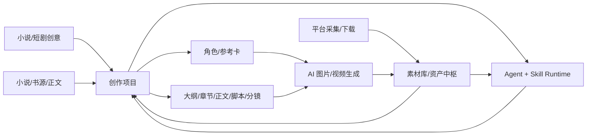
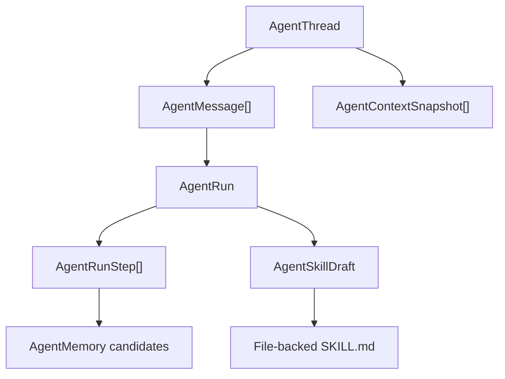

# YLCraft 总架构说明

本文是 YLCraft 的深度架构入口，目标是让人和 AI 都能快速理解当前系统，而不是依赖聊天历史。接口变化、模块边界变化、数据库主模型变化后，都要同步更新本文和 `docs/architecture/API_SURFACE.md`。`tools/generate_api_surface.py` 只负责路由事实，架构影响、模块边界和工作流语义必须由开发 AI 人工判断并写进本文或领域文档。

## 1. 产品主线

YLCraft 是一个围绕“素材库 + 创作项目 + AI 智能体”的内容生产工具。核心闭环不是单个页面功能，而是让外部素材、AI 生成结果、创作过程、角色设定、脚本分镜、图片视频任务都能沉淀为可复用资产，再由 Agent/Skill 继续调用。

主链路：

设计原则：

- 素材库和创作项目是中转层，其他功能围绕它们串起来。
- Agent 不只是聊天框，它要能读取上下文、调用工具、记录步骤、沉淀记忆和 Skill。
- Prompt、模型、供应商、参考图、生成日志都要可配置、可追溯。
- 平台采集和下载是素材入口，不应绕开资产入库和血缘记录。

## 2. 运行时总览

后端入口是 `backend/app/main.py`，应用启动时完成：

1. 加载 `backend/.env`。
2. 初始化数据库。
3. 执行书源规则迁移和平台模板种子数据。
4. 初始化任务队列，Redis 不可用时降级到内存模式。
5. 初始化 `AIService` 和连接器。
6. 注册 `/api/v1/...` 路由。
7. 挂载 `/uploads` 静态文件。

前端入口在 `frontend/src`，主要分层：

| 层 | 目录 | 职责 |
| --- | --- | --- |
| 页面 | `frontend/src/pages` | 每个业务页面，如 Agent、Story、Assets、Settings。 |
| 组件 | `frontend/src/components` | 复用 UI、布局、Agent Skill 管理等。 |
| API | `frontend/src/api` | 前端请求封装，主要集中在 `index.ts`，Agent 有独立 `agent.ts`。 |
| 类型 | `frontend/src/types` | 前端共享类型。 |
| 状态/上下文 | `frontend/src/context`、`hooks` | 主题、上下文、WebSocket 等。 |

## 3. 后端分层

| 层 | 目录 | 说明 |
| --- | --- | --- |
| API 层 | `backend/app/api/v1` | FastAPI 路由，请求/响应和 HTTP 错误处理。 |
| 服务层 | `backend/app/services` | 业务编排，Agent、创作项目、素材、AI、平台、下载等核心逻辑。 |
| 连接器层 | `backend/app/connectors` | 外部平台或 AI 能力连接器。 |
| 核心基础设施 | `backend/app/core` | 配置、任务队列、WebSocket、通用基础能力。 |
| 数据层 | `backend/app/db/models` | SQLModel 模型。迁移应走 Alembic。 |
| 内置 Skill | `backend/app/skills` | Agent 可加载的文件化 Skill 包。 |

API 层不要承载复杂业务。新增功能优先放到 `services/<domain>`，API 只做参数转换、权限/错误处理和调用服务。

## 4. 核心数据模型

### 4.1 Agent Runtime

文件：`backend/app/db/models/agent.py`

| 表/模型 | 作用 |
| --- | --- |
| `AgentThread` | 长期对话主线。刷新页面、多轮上下文应该围绕 thread 读取。 |
| `AgentMessage` | 对话消息事实来源，用户/助手/工具消息都应写入。 |
| `AgentContextSnapshot` | 某次运行使用的上下文快照，用于回放和定位“当时模型看到了什么”。 |
| `AgentRun` | 一次 Agent 执行。 |
| `AgentRunStep` | 执行步骤，包括计划、工具调用、确认、记忆提取、最终回答。 |
| `AgentMemory` | 长期/中期记忆，带 `thread_id`、`run_id`、`message_ids` provenance。 |
| `AgentMemorySnapshot` | Run 级冻结记忆上下文。 |
| `AgentSkill` | 数据库中的旧技能记录。 |
| `AgentSkillDraft` | 外部 Skill、Run 转 Skill、手工编辑后的待审批草稿。 |
| `AgentProfile` | 智能体配置，含模型、工具、默认上下文、最大步数。 |

当前架构方向：

关键要求：

- 新对话应创建新的 `AgentThread`，不是新建智能体 profile。
- 普通搜索/读取类工具不应重复授权；写入、删除、消耗型工具才需要确认。
- AI 配置助手里的 provider metadata / connector 创建和更新属于低风险可逆配置写入，允许直接执行并在 Trace 中展示；删除、真实生成和高成本操作仍必须确认。
- Trace 应作为对话流的一部分顺序展示，最终回答后可折叠。
- Skill 是过程能力，不存用户隐私或一次性对话事实。

### 4.2 创作项目

文件：`backend/app/db/models/creative_project.py`

| 表/模型 | 作用 |
| --- | --- |
| `CreativeProject` | 项目主表，承载小说、短剧、漫画等项目。 |
| `ProjectContent` | 项目阶段内容，大纲、章节细纲、正文、脚本、分镜、漫画页等。 |
| `ProjectAssetLink` | 项目内容与素材库资产的关系。 |
| `ProjectGenerationLog` | 每次生成的 prompt、请求、响应、归一化结果、错误。 |

当前方向：

- `/story` 页面正在从旧 Story Maker 过渡到 Creative Projects 工作台。
- 文本生产链路包括大纲、章节规划、正文、脚本、分镜、Writer Room；`/story` 已支持结构化大纲编辑、JSON 高级编辑、章节规划保存、章节锁定、保留锁定再生成，以及从项目事实自动构建的项目关系图谱视图。
- `/canvas` 是独立的创作画布工作台，用于自由编排文本、Prompt、LLM、生图、平台搜索和素材节点；它不是项目关系图谱，也不应成为项目事实的第二来源。画布文档持久化在 `canvas_documents.document_json`，并保留浏览器 localStorage 作为离线/迁移兜底；前端连续编辑会触发防抖自动保存，`PUT /api/v1/canvas/documents/{document_id}` 采用最后一次写入获胜的直接更新，避免重叠保存因 ORM stale-row 冲突让最新草稿只能停在本地。画布节点可以通过 `projectId`、`contentId`、`assetId` 等 metadata 引用项目或素材。当前交互按 `basketikun/infinite-canvas` 的核心模型对齐：`image` 是一等图片容器节点，`image_model` 承担生成配置节点角色；文本、Prompt、图片、素材节点可一键派生并连到生成配置节点，生成成功后自动追加图片结果节点并记录连线；异步生图会将任务 ID、provider、进度与输入快照保存在原生图节点，前端轮询 `/api/v1/images/tasks/{task_id}` 后以任务 ID 去重回填结果节点。工作流遇到异步生图会进入 waiting 状态而不是把空图片传给下游；任务完成后会把等待步骤标为成功，并在当前打开画布或用户重新打开该画布时只续跑 trace 中仍排队的下游步骤，不会重复提交已经成功的上游节点。画布页面采用沉浸式 chrome：浮动顶部状态、带创意生图/搜索参考生图/图片处理模板的新画布菜单、底部工具 Dock、选中节点 HUD，避免持久左右侧栏挤压画布。新模板必须在打开前按当前节点最小尺寸和端口契约归一化，避免旧示例尺寸导致内联编辑器溢出，并默认选中模板的终点节点。节点尺寸由模板最小可读尺寸和用户显式缩放共同决定；端口位置可从 DOM 做无状态量测以使连线落在真实圆点中心，但量测不得在 layout effect 中写回画布文档或触发父级状态更新，避免渲染循环。生成节点存在有效上游输入时，节点内主操作执行完整链路；紧凑次操作仅执行当前节点，方便跳过上游复跑。媒体选择与图片处理同样属于可运行步骤：媒体选择没有用户确认的结果时会阻止下游运行，确认后才输出图片、图片集、素材或文本的类型化值。视觉上保持低噪声工作台层级：节点与 HUD 使用紧凑工具面板，端口映射只在相关节点被选中或使用字段路径时显示在线上，避免全画布标签干扰。节点必须通过图标、职责词、克制的类型侧轨/顶轨及媒体标识来区分 source、reference、compute、retrieve、generate、transform、result 和 media 等角色，不能只依赖颜色标签。节点卡片和 HUD 必须可视化 `IN/OUT` 变量，实际输入来自上游连线，声明输入输出来自节点 ports。节点卡片本身是主编辑面：文本、Prompt、图片、LLM、平台搜索和生图节点的常用字段必须能直接在节点内编辑，运行状态、输出和错误也必须直接显示在节点卡片和选中 HUD 中，右侧抽屉只作为高级检查和兜底配置入口。`image_model` 节点必须提供内联 composer，可直接编辑 Prompt、打开 Prompt reference picker、选择生图连接器和尺寸并运行生成；模型选项必须唯一表示后端 `name` 和具体 `model`，节点卡片和抽屉都必须显示“后端/模型”而不是只显示后端名，选择后同步写入节点 metadata，运行时用后端 `name` 作为 provider、节点 `model` 作为实际请求模型，并且运行前按最新节点状态读取；抽屉只作为高级配置入口。生图节点接收上游文本时只拼接文本内容，不把 `[节点标题]` 这类 UI 标签注入图片 prompt，避免模型把标签当画面文字；其运行输出同时提供首图 `image` 和多图 `images` 端口值，后者会逐项传入能接收多图的参考图端口；节点内会保留可打开原图的紧凑结果缩略轨道，但自动创建的图片结果节点和其端口仍是画布中可复用输出的主事实来源。`image` 节点本身也可以直接打开 Prompt reference picker，卡片展示绑定的参考标题/模型组/图片数，派生生图配置和生成结果图片时必须保留 prompt reference provenance。画布从素材库插入资源时必须按媒体类型建模：图片素材转为一等 `image` 节点并可作为图生图/改图参考，视频、音频、文本、角色和通用素材保留为 `asset` 上下文节点；只有图片类节点可以进入 `reference_asset_ids` 和 `reference_image_collection`。画布还提供本地可执行 `image_transform` 节点：图片接入 `source` 端口后可缩放、旋转、翻转、灰度、亮度/对比度、居中比例裁切、文字水印及格式输出，结果继续作为图片变量连接到处理链或图生图参考。处理结果默认停留在浏览器工作台；用户显式选择“保存素材”后，`POST /api/v1/canvas/assets/image` 将 PNG/JPEG/WebP 结果写入 `storage/canvas/processed_images`，创建 Asset Hub Node/Version/Representation，记录画布与操作 provenance；来源含素材 ID 时额外创建 `DERIVED_FROM` 谱系，画布节点随后改用稳定的 Asset Hub 下载 URL，避免持久化大块 data URL。图片节点还可通过本地 bridge 打开既有完整图片编辑器；编辑器返回时追加新的图片节点、保留源节点并建立端口化顺序连线，成品仍须由用户明确选择保存素材后才进入 Asset Hub。图片卡片本身展示紧凑 provenance strip：统一识别上传、素材库、AI 生成、快速处理、完整编辑器五类来源，展示上游节点、模型或操作，并明确区分 draft 与已入 Asset Hub；快速处理输出与入库结果沿用相同的 source/sourceNodeId/sourceAssetId/operation/尺寸/格式字段。
- 画布端口是变量级契约：每个声明的输入/输出变量各自拥有一个可拖拽端口与变量行，变量行直接显示端口 label 和紧凑的 type/linked/dragging/acceptance 状态，且不得为了视觉压缩截断后续端口；`image_model` 明确拆分 `Prompt(text)` 和 `参考图`，连接线以实际端口圆点为锚点。多端口图片卡按变量顺序沿左右边缘分布锚点，不能重叠在中心。拖动文本时只将文本输入行作为兼容目标，拖动图片时只将图片输入行作为兼容目标，命中的行与端口高亮且预览线吸附到该端口。拖线提示只读显示源变量类型和当前目标状态（可连接、类型不匹配或继续拖到兼容输入端），不写回画布文档状态。`NodeVariableStrip` 是唯一的端口操作面；`NodeContractSummary` 仅显示声明/已连接/已就绪计数，不能伪装成第二组可交互端口。媒体选择不依赖额外侧栏：`media_picker` 接收上游图片、视频或图文候选，在节点内保存一个具体 selection，并将其按 `image`、`asset`、`text` 三条端口重新发出，供生图参考、素材上下文和 LLM 文案链路分别使用。平台搜索节点也采用该契约：采集 API 返回的异构结果在画布内归一为 `CanvasSearchResultEnvelope`，并通过 `results(json)`、`images(image[])`、`videos(asset[])`、`articles(asset[])` 分端口输出；连接先按 `fromPortId` 取类型值，再可选映射字段路径，避免搜索结果只能作为一团 JSON 传递。画布工作流逐步参考 Coze Studio、Dify、n8n 等开源工作流工具的“节点 + 变量 + 依赖执行”模型：选中节点 HUD 会展示从上游到目标节点的执行计划，运行链路时按依赖顺序先跑上游可运行节点，再跑目标节点；检测到循环、缺失节点或某步失败时停止，避免把画布连线只当静态关系图。节点的上游输入映射以节点 metadata 和连接字段共同表达：`disabledInputNodeIds` / `disabledInputConnectionIds` 控制哪些输入参与本次 prompt、LLM、搜索或生图参考收集，连接 metadata 的 `sourcePath` 选择上游输出的字段（例如 `results[0].title`），连接 `toPortId` 绑定目标节点声明的输入端口；运行时按目标端口分别消费 Prompt、搜索关键词和生图参考图；无端口连线会在前端加载时清理，后端保存接口和 Agent 写入工具都会拒绝它们。画布会把声明端口直接展示为可拖拽的输入/输出连接点：从输出端拖到兼容输入端时预览并高亮目标，落线后以 `fromPortId -> toPortId` 持久化，边线也锚定到实际端口而非节点中心。它们都不删除连接线，也不改变项目/素材事实来源。每次运行会写入 `inputSnapshot`，用于后续调试、回放和工作流 trace。 链路运行会额外把最近一次 `workflowTrace` 写入目标节点 metadata，按步骤保留排队、运行、成功或失败状态、输入摘要、输出摘要、错误和耗时，并在选中节点 HUD 直接展示。
- 画布媒体选择是搜索结果的落地边界：选中的 `CanvasMediaItem` 需保存原始 crawler result、平台、作者、原始结果 ID、详情 URL 和预览 URL。用户可选择“放入画布”，图片生成 `image` 节点、视频/图文生成 `asset` 节点，并从 `media_picker.image` 或 `media_picker.asset` 建立端口化来源连线；重复落地时由画布在 picker 输出侧分配无碰撞的垂直 lane，保证结果卡片及来源连线可读。也可通过既有 `/api/v1/crawler/import` 显式入素材库。采集服务按 `CrawlerResult.type`、图片列表和视频地址映射为 Asset Hub 的 `image`、`video`、`text` 或 `audio`，不再把图文和图片统一标成视频。
- 画布的可编辑节点保留类型级最小尺寸约束：生图、图片处理、图片和媒体选择节点不能被历史布局或拖拽压缩到控件溢出；图片节点的输入/输出端口以真实 DOM 锚点贴合左右边缘，保证连线和可见端口一致。
- 项目关系图谱发送到独立画布使用浏览器导入队列作为跨页面桥接，但队列只能在远程 `canvas_documents` 加载完成后消费；导入节点保留 `projectId`、源关系图谱节点 ID 和导入时间，避免远程响应覆盖刚导入但尚未持久化的画布节点，并使用与媒体落地相同的无碰撞位置分配器避开现有工作流节点。
- 画布节点卡片需区分“端口能力”和“运行事实”：`NodeVariableStrip` 负责显示可拖拽端口和当前兼容高亮，`NodeContractSummary` 负责把声明 `INPUT/OUTPUT`、当前 linked 输入数量、ready 输出数量分开展示，尤其用于生图、媒体选择、图片处理、素材和普通内容节点。
- 可编辑工作流节点采用统一扫读顺序：节点身份与端口在前，随后是来源/预览/选择内容、配置、执行和结果；生图、媒体选择、图片处理使用轻量分隔段落而非层层嵌套的小卡，以保证缩放后的画布仍然可读。
- `image_model.reference(image[])` 的语义是“多张图共同作为一次生成的参考集合”。需要逐张调用时必须使用独立的 `image_batch.items(image[])` 节点：它按输入顺序逐项调用并记录每项的来源、状态与结果，最终输出新的 `images(image[])`。当前批处理 runner 只完成同步模型响应；异步批量任务需要多任务持久化与恢复后才可启用，不能误报为已生成。
- `image_batch` 的逐项 Prompt 不依赖单一平台的私有字段：可选固定 Prompt、从规范化图片项的标题/描述/作者/URL/内置 Prompt/序号渲染的模板 Prompt，或与图片顺序对应的 `text[]`。每项最终使用的 Prompt 记录在批处理结果中，方便复核和重跑。
- 新建画布菜单提供角色定妆、场景海报、道具特写三种逐图生图样例；样例使用“关键词 -> 平台搜索 -> 多选媒体 -> image_batch”的可运行链路，并预填模板 Prompt，作为实际图片集与逐项 Prompt 映射的入口。
- 分镜和角色生图必须持久化结果，关联素材、任务和血缘。
- 角色、背景、道具都应作为可引用参考卡参与提示词和参考图选择。

### 4.3 资产中枢

文件：`backend/app/db/models/asset_hub.py`

| 表/模型 | 作用 |
| --- | --- |
| `AssetNode` | 资产根节点，代表图片、视频、音频、文本、角色、模型、合集等。 |
| `AssetVersion` | 资产版本，记录 prompt、模型、参数、血缘。 |
| `AssetRepresentation` | 实际文件表示，如原图、缩略图、视频、字幕等。 |
| `AssetEmbedding` | 向量索引。 |
| `AssetRelation` | 资产之间的 derived_from、uses、references 等关系。 |
| `Tag` / `AssetTagLink` | 树形标签和资产标签关系。 |
| `AIModel` | AI 模型资产。 |

注意：当前仓库里同时存在旧素材接口 `/api/v1/assets` 和新资产中枢 `/api/v1/asset-hub`。新闭环应优先考虑资产中枢模型，但兼容旧素材页和下载链路。

### 4.4 AI 配置

文件：`backend/app/db/models/ai_connector.py`

| 表/模型 | 作用 |
| --- | --- |
| `AIProviderMetadata` | 供应商规范，按能力类型保存默认模型、模板、响应配置、尺寸、参考图配置。 |
| `AIConnector` | 用户实际连接器，保存 base_url、api_key、默认模型、api_format、请求模板等。 |
| `AIUsageLog` | AI 调用统计。 |

设计方向：

- Agent 应作为通用配置助手，帮助用户把任意供应商规范转成 provider metadata 和 connector。
- 不要把能力写死到某个供应商，例如 aacc 只是一个实例，不是架构。
- 图片生成支持 OpenAI SDK、通用 HTTP、base64、轮询、ModelScope 类请求等差异。图片连接器能力由用户配置显式决定：优先读取 `default_params.image_capabilities`（可为 `["text_to_image"]`、`["image_to_image"]` 或二者都有），`api_endpoint` 和 `default_params.mode/image_mode/operation` 只作为旧数据兜底推断。
- `/api/v1/images/backends` 的能力要按连接器语义返回：文生图入口只展示 `text_to_image`，图生图/改图入口只展示 `image_to_image`。`support_reference_image` 只表示参考图传递能力，不等价于模型能力；如果开启参考图，应同步 `support_vision_input=true`。
- 参考图配置必须互斥：JSON 数组模式设置 `reference_image_array_field` 并清空 `reference_image_field`；multipart 本地上传模式通过 `default_params.request_content_type=multipart` 和 `multipart_image_field` 设置上传字段，并清空数组字段；旧单字段/占位符模式只设置 `reference_image_field`。
- 通用 HTTP 图片后端的请求模板可使用 `reference_image_base64`、`reference_image_url`、`reference_image_urls` 和 `images` 变量；当模板已经提供结构化参考图字段时，后端不得再用裸 base64 数组覆盖它。本地/代理参考图转 data URL 前会按默认长边 1536、JPEG 质量 88 压缩，避免大图 JSON 请求触发远端超时。

### 4.5 生图提示词参考库

生图提示词参考库不是 `PlatformTemplate`。它面向“几百/几千条生图 Prompt 案例”的同步、浏览、搜索、筛选和插入，参考 `basketikun/infinite-canvas` 的提示词库能力。当前已提供 `ImagePromptSource` / `ImagePromptReference` 持久化、GitHub 源 seed、markdown/JSON/IMI detail JSON 解析、去重同步、HTTP API、Agent 工具、独立浏览页、复用 Picker，并已接入 `/canvas` Prompt/LLM/生图节点和 `/image-gen` 提示词输入区。

设计边界：
- Prompt reference 是外部案例/灵感参考，不是创作项目阶段模板。
- Prompt reference 默认不进入 Asset Hub；只有用户显式保存为素材时才进入。
- 用 Prompt reference 生成出的图片结果应进入 Asset Hub，并记录 prompt reference 来源到生成元数据/血缘。
- `/canvas` 和 `/image-gen` 只是调用入口，可以选择、替换或追加参考 Prompt；选择信息写入节点 metadata 或图片生成请求，并进入生成图片的 Asset Hub lineage。画布节点会保存 `promptReferenceId`、`promptReferenceSourceId`、`promptReferenceSourceUrl`、`promptReferenceModelGroup` 和 `promptReferenceImages`，用于后续回放、多图提示词参考和参考图映射。画布节点卡片提供稳定的配置入口，Prompt/LLM/生图节点配置面板可直接打开 Prompt Reference Picker，插入后展示标题、图片数、模型组和清除动作。
- 后端应优先做统一同步和缓存，避免每个前端页面各自直连 GitHub 或外部提示词站点。IMI 大集合使用 `backend/scripts/sync_imi_prompt_library.py` 批量下载 JSON 和图片到 `backend/storage/image_prompt_references/`；既有 markdown/JSON 来源可使用 `backend/scripts/cache_prompt_reference_media.py` 把远程封面和预览图转换为同一套 `/api/v1/image-prompts/media/...` 本地缓存地址。解析器和缓存脚本都应保留远程 URL 作为兜底和 provenance。
- 提示词来源采用“本地优先”策略：浏览、搜索、标签筛选和普通刷新只读取数据库/本地 source cache，不隐式访问远程。只有用户在 `/prompt-library` 显式打开“远程更新”开关或运行同步脚本时，才拉取 GitHub/外部提示词源并更新本地 cache。
- IMI detail JSON 中的中英文提示词、来源作者、来源链接、详情页、图片列表、浏览/点赞/复制数、远程创建/更新时间等信息保存在 `ImagePromptReference.metadata_json`，API 同时把常用字段提升为 `english_prompt`、`chinese_prompt`、`source_name`、`detail_url`、`image_items`、`view_count`、`like_count`、`copy_count` 等响应字段，方便前端和 Agent 直接使用。
- 提示词参考库按 `model_group` 归一到 ChatGPT、NanoBanana2、NanoBananaPro 三类；GitHub/远程来源通过 source metadata 归类，作者类 `@handle` 标签保留但排序靠后，多图案例通过 `image_items` 暴露给详情视图和后续画布/生图入口。
- `/prompt-library` 的模型、来源、分类、标签是独立筛选维度，点击其中一个不应清空其他筛选或重算隐藏其他选项；后端 facets 走本地数据库优先，PostgreSQL 环境用 JSONB 聚合和短 TTL 缓存避免大集合冷查询全量拉回 Python。
- 当前 API 前缀是 `/api/v1/image-prompts`；Agent 工具分类是 `image_prompt_reference`。

当前 OpenSpec：`openspec/changes/image-prompt-reference-library/`。

## 5. 主要模块边界

| 模块 | API 前缀 | 后端服务 | 前端页面 | 状态 |
| --- | --- | --- | --- | --- |
| Agent Center | `/api/v1/agent` | `services/agent` | `/agent`、settings skill 面板 | 主体完成，持续优化体验。 |
| Agent Skill Runtime | `/api/v1/agent/skills*` | `services/agent/skill_*` | `SkillManagementPanel` | OpenSpec 主计划完成。 |
| 创作项目 | `/api/v1/creative-projects` | `services/creative_project` | `/story` | 仍在闭环推进。 |
| 创作画布 | `/api/v1/canvas` | `frontend/src/components/canvas` | `/canvas` | 独立自由画布，已接一级菜单；支持后端持久化、沉浸式工具 Dock、节点卡片内联编辑、节点输出内联可见、选中节点检查器 HUD、输入/输出变量可视化、生图节点内联 composer、图片节点 Prompt reference 入口与 provenance 传递、素材/项目插入、节点运行、Agent 操作、文本/图片到生成配置节点的派生链路、媒体类型感知的素材节点，以及生成结果回写图片节点。 |
| 旧 Story Maker | `/api/v1/story` | `services/story` | `/story` 兼容入口 | 逐步迁移。 |
| 角色 | `/api/v1/characters` | `services/character` | `/characters` | 参考图/视觉卡仍需完善。 |
| 素材库 | `/api/v1/assets` | `services/asset` | `/assets` | 可用，需与资产中枢统一。 |
| 资产中枢 | `/api/v1/asset-hub` | `services/asset_hub` | `/asset-hub` | 新模型方向。 |
| AI 连接器 | `/api/v1/ai/connectors` | `services/ai`、`services/ai_connector` | `/settings` | 已支持通用配置，仍需 UX 打磨。 |
| 生图提示词参考库 | `/api/v1/image-prompts` | `services/image_prompt_reference` | `/prompt-library`、画布 picker、图片生成 picker | 后端、Agent 工具、独立浏览页、Picker、画布/生图集成已完成；已支持 IMI 三类大集合、双语 Prompt 字段、本地图片缓存、图片优先浏览页、多图详情切换、画布 metadata 持久化和实际生图入库血缘烟测。 |
| 图片生成 | `/api/v1/images` | `services/image`、AI backends | `/image-gen` | 多后端兼容中。 |
| 视频生成 | `/api/v1/videos` | `services/video_gen` | `/video-gen` | 基础能力。 |
| 下载/磁力 | `/api/v1/download`、`/api/v1/torrents` | `services/download`、`services/torrent` | `/download` | 本地化方向，不做自建云缓存。 |
| 平台采集 | `/api/v1/crawler`、`/api/v1/bilibili` | `services/crawler`、`services/platforms` | `/crawler` | B 站能力较丰富。 |
| 小说/书源 | `/api/v1/novels`、`/api/v1/book-sources` | `services/novel`、`services/reader` | `/novel-*` | 可作为创作素材源。 |
| 任务中心 | `/api/v1/tasks` | `core/task_queue` | `/tasks` | 观测诊断仍有收尾项。 |
| 字幕/BGM/剪辑 | `/subtitles`、`/bgm`、`/clip*` | 对应 services | 对应页面 | 辅助内容生产。 |
| Live2D/3D/模型 | `/live2d`、`/3d`、`/models` | 对应 services | 对应页面 | 规划/实验能力较多。 |

完整接口列表见 `docs/architecture/API_SURFACE.md`。

## 6. 接口总览与维护规则

当前接口事实来源：

- 路由注册：`backend/app/main.py`
- API 路由：`backend/app/api/v1/*.py`
- B 站专属路由：`backend/app/services/platforms/bilibili/routes.py`
- 接口清单：`docs/architecture/API_SURFACE.md`
- 机器可读清单：`docs/architecture/api_surface.json`

当前统计：

- Router mounts: 45
- Endpoints: 512
- Public schema endpoints: 511
- Hidden compatibility endpoints: 1

接口变更后，AI 必须做五件事：

1. 更新代码里的路由、schema、服务实现。
2. 更新测试或至少说明未覆盖风险。
3. 运行或等价更新 `python tools/generate_api_surface.py`，提交 `docs/architecture/API_SURFACE.md` 和 `docs/architecture/api_surface.json`。
4. 人工检查接口语义：生成清单只能说明“有什么路由”，不能说明“为什么这样设计”。
5. 如果接口影响模块职责、数据流、前端工作流或 Agent 可调用能力，同步更新本文对应章节、领域文档和 OpenSpec task。

Agent Tool / Skill 变更按内部 API 处理：工具名称、输入输出 schema、risk level、授权策略、匹配规则变化时，必须同步测试、`docs/agent/agent-skill-runtime.md` 和必要的总架构说明。

## 7. OpenSpec 当前状态

| Change | Done | Pending | 说明 |
| --- | ---: | ---: | --- |
| `archive/agent-skill-package-runtime` | 56 | 0 | Skill Runtime 主计划完成并归档。 |
| `archive/agent-center-multi-agent-runtime` | 114 | 0 | 多智能体/上下文运行时当前任务清单完成并归档。 |
| `archive/agent-center-thread-runtime-refactor` | 49 | 0 | thread runtime 重构完成并归档。 |
| `archive/agent-center-hermes-mvp` | 11 | 0 | Hermes 风格记忆/运行思路 MVP 完成并归档。 |
| `archive/creative-character-portrait-system` | 62 | 0 | 角色立绘主计划完成并归档，仍可体验优化。 |
| `archive/creative-novel-writer-room` | 52 | 0 | Writer Room 任务清单完成并归档。 |
| `archive/drop-legacy-assets-final` | 24 | 0 | 旧资产清理计划完成并归档。 |
| `creative-project-closed-loop` | 72 | 11 | 仍是后续业务主线。 |
| `creative-project-optimization-roadmap` | 32 | 11 | 仍有优化任务。 |
| `image-prompt-reference-library` | 29 | 1 | 后端模型、同步、API、Agent 工具、独立浏览页、Picker、画布和生图集成已完成；外部 Chrome/Patchright 已验证生图页入库血缘和画布 picker 插入，剩总体验收项 28。 |
| `task-observability-diagnostics` | 25 | 1 | 少量收尾。 |

## 8. 文档更新协议

每个 AI 开发完成后，不需要把所有历史 devlog 重新读一遍，也不需要新增一篇冗长流水账。按改动类型更新：

| 改动 | 必须更新 |
| --- | --- |
| 新增/删除/改语义 API | `docs/architecture/API_SURFACE.md`，必要时更新本文模块说明。 |
| 模块边界变化 | 本文第 5 节。 |
| 数据模型变化 | 本文第 4 节 + Alembic 迁移说明。 |
| Agent/Skill 行为变化 | `docs/agent/agent-skill-runtime.md` 或 Agent 相关架构段落。 |
| 创作项目流程变化 | `docs/guides/creative-project-loop.md` + 本文第 4.2/5 节。 |
| 阶段性长任务交接 | `docs/devlog/YYYY-MM-DD_topic.md`，但 devlog 只是历史，不是默认必读入口。 |

## 9. 已知治理问题

- 根 `README.md` 和部分旧中文文档在当前终端输出中存在编码显示异常，后续可单独做编码治理。
- 前端 `frontend/src/api/index.ts` 很大，长期应按领域拆分，但当前不要为了“好看”做无关大重构。
- 旧 `/api/v1/story` 与新 `/api/v1/creative-projects` 并存，后续应继续收敛。
- 旧素材 `/api/v1/assets` 与新资产中枢 `/api/v1/asset-hub` 并存，闭环功能应明确选择主事实来源。
- `docs/devlog/` 只保留必要交接记录，不应成为每次接手必读包。
