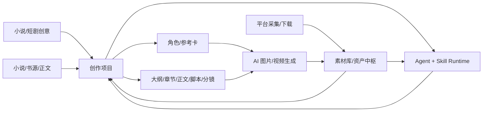
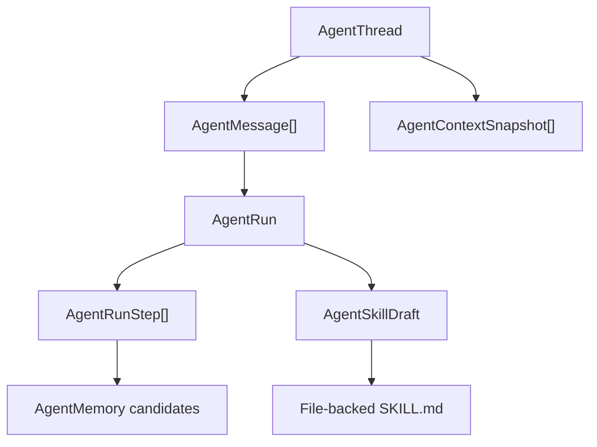

# YLCraft 总架构说明

本文是 YLCraft 的深度架构入口，目标是让人和 AI 都能快速理解当前系统，而不是依赖聊天历史。接口变化、模块边界变化、数据库主模型变化后，都要同步更新本文和 `docs/architecture/API_SURFACE.md`。`tools/generate_api_surface.py` 只负责路由事实，架构影响、模块边界和工作流语义必须由开发 AI 人工判断并写进本文或领域文档。

## 1. 产品主线

YLCraft 是一个围绕“素材库 + 创作项目 + AI 智能体”的内容生产工具。核心闭环不是单个页面功能，而是让外部素材、AI 生成结果、创作过程、角色设定、脚本分镜、图片视频任务都能沉淀为可复用资产，再由 Agent/Skill 继续调用。

主链路：

角色管理支持两类互补流程：`extract`（从小说/正文提取角色，保留原文依据与字段来源）和 `character-first`（先独立创建角色、完善设定与参考图，再选择性回流 Story/生产线）。后者不要求先完成正文、大纲或圣经；角色页本身是可独立使用的角色设定集工作区。`/characters` 现在直接进入角色工作区：默认打开首个角色，左侧固定角色列表、搜索、来源/定位/收藏筛选，右侧为 `/characters/:characterId` 报告式详情（视觉中心、参考图/设定图、Bible、关系与 Prompt 资产包）；角色库为空时进入 `/characters/new` 创建弹窗，创建后进入真实详情。角色详情可直接新建/编辑角色、选择立绘版本设为身份基准图、将版本加入或移出参考图集合（移除只解除角色引用，不删除素材库原图），参考图选择器支持素材库搜索并区分素材库图片与历史立绘版本；版本卡可独立预览并展开查看生成 Prompt、负面 Prompt 和参数，主视图与参考图集合在视觉上明确分栏；生图请求固定采用当前身份基准图及已确认参考图集合，临时版本预览不会被隐式带入；Story 生产线中的角色立绘生成也会复用同一组角色参考图，并把结果回写项目大纲和 Asset Hub 血缘；生成故事大纲时会保留项目已绑定角色的确认字段，不会被新一轮 LLM 大纲覆盖；生图 Prompt 可在选定 LLM 下优化，优化结果仅回填待确认输入框，不会隐式创建资产；并从已关联的创作项目直接回到 Story 生产线。“以此角色新建项目”会预填创意，项目创建后立即把完整角色卡写入项目大纲并建立角色项目关联，后续大纲、角色演绎、分镜和生图无需再次手动同步。世界使用配置会保留项目内别名、阵营、状态、局部 Prompt 标签、OOC/出模约束和 Bible/视觉覆盖。关系图谱也已在详情页内以内联 SVG 展示，节点可直接切换角色；角色工作区支持「全屏工作区」切换（AppLayout 内隐藏 Header，不新增路由，Esc 退出，切路由自动恢复），并新增「世界视角」切换条：角色库是全局基准设定，切到某个项目/世界后展示「基准 + 该项目覆盖」的有效 Bible（identity/motivation/speech/behavior）、服装覆盖和视觉覆盖，并在覆盖字段上标注「本世界覆盖」。提取来源细分为 `uploaded_novel`（上传小说）、`imported_novel`（外来小说导入）和 `original_outline`（原创大纲）；前两者有原文依据，字段来源标 `original`，原创大纲由 LLM 生成，标 `ai_inferred`；用户在工作区手填的字段标 `user_edited` 且不会被同步流程覆盖。`extract_origin` 记录在 `character_story_links` 上（角色 × 项目维度），可按来源筛选角色。`characters/manage` 兼容路由已删除，不再保留重定向。

小说/来源正文的角色提取走两趟流程：第一趟按段落分块，只扫描原文角色名、别名、观察记录和逐字引文；服务层按名称/别名归并，并把包含名冲突作为人工合并候选；第二趟再把每个角色映射为 `identity`、`motivation`、`speech`、`behavior`、`ability`、`arc` 等 YLCraft 设定字段。`POST /api/v1/creative-projects/{project_id}/extract-characters` 默认只预览，真人用户或 Agent 审核后可把预览返回的 `characters` 原样带回 `apply=true`，服务端只重新校验证据是否存在于来源文本，不重复调用模型。写入同时更新项目大纲、全局角色库和 `CharacterStoryLink`，保存 `aliases_json`、`evidence_json`、`extraction_notes`；按全局角色名复用已有角色，项目关联按角色 ID 幂等。大纲生成成功后会自动执行一次角色同步，使原创项目也能立即在角色库看到角色。
小说/来源正文的角色提取走两趟流程：第一趟按段落分块，只扫描原文角色名、别名、观察记录和逐字引文；服务层按名称/别名归并，并把包含名冲突作为人工合并候选；第二趟再把每个角色映射为 `identity`、`motivation`、`speech`、`behavior`、`ability`、`arc` 等 YLCraft 设定字段。`POST /api/v1/creative-projects/{project_id}/extract-characters` 默认只预览，真人用户或 Agent 审核后可把预览返回的 `characters` 原样带回 `apply=true`，服务端只重新校验证据是否存在于来源文本，不重复调用模型。写入同时更新项目大纲、全局角色库和 `CharacterStoryLink`，保存 `aliases_json`、`evidence_json`、`extraction_notes`；按全局角色名复用已有角色，项目关联按角色 ID 幂等。提取写入采用增量合并，未被本次来源识别的既有大纲角色不会被删除；空提取结果也不能覆盖项目角色。大纲生成成功后会自动执行一次角色同步，使原创项目也能立即在角色库看到角色。

设计原则：

- 素材库和创作项目是中转层，其他功能围绕它们串起来。
- Agent 不只是聊天框，它要能读取上下文、调用工具、记录步骤、沉淀记忆和 Skill。
- Prompt、模型、供应商、参考图、生成日志都要可配置、可追溯。
- 平台采集和下载是素材入口，不应绕开资产入库和血缘记录。
- 面向普通用户隐藏 Tool schema、上下文装配和运行时术语，默认交互从业务目标和可见产物开始。
- 执行证据与最终结果在业务时间线中直观展示，完整技术轨迹按需展开。
- 确定性操作采用 script/service-first 路由，避免用 LLM 重复做检索、搬运、转换和校验，控制 Token 与成本。

内容生产方案是项目编排层的声明式配置，保存在 `CreativeProject.settings_json.production_profile`；它同时声明 `production_family`（`narrative` 或 `content_package`）、`package_type`、最小输入、规划单元和输出适配器。完整叙事方案继续描述推荐阶段、可选阶段、输出和约束，不取代独立的文本、图片、视频、3D、图片编辑或多平台生图工作台；内容包方案则只要求主题、素材或来源链接，进入轻量内容包工作台，不强制大纲、圣经、章节或正文。旧项目按 `project_type` 自动映射到默认方案，新项目可以在创建时选择短剧、故事漫画/童话绘本、科普、平台图文、小说或单镜头实验。导演的可编辑生产计划复用版本化 `ProjectContent(content_type=production_plan)`，通过 `GET/PUT /api/v1/creative-projects/{project_id}/production-plan` 读取和追加版本，并关联项目内容、Asset Hub 素材与创作画布；计划只保存面向用户的阶段、依赖、规划摘要、确认点和版本来源，不保存隐藏推理。Agent Context Pack 会带上当前方案和受限计划摘要，供导演先规划再请求用户确认；导演可把明确选择的计划节点编译为 `TeamComposer` 团队、汇合独立专家 Run，并以依赖分析支持局部重跑，也可通过受限的 `update_creative_production_plan` 工具修改节点的业务可见字段后追加新版本。图片和视频在请求前生成受限、可审计的 `planning_summary`，仅记录意图、提示词、风格、构图、比例、镜头/时长、来源资产、计划节点和预期产物，主动剔除隐藏推理；该摘要随请求进入异步任务、平台事件日志、结果与 Asset Hub 血缘。对话与历史 Run 轨迹会显示计划版本、节点、输入/输出资产、规划摘要、模型和确认点；所有实际生成、下载、发布与删除仍由现有确认机制执行。

外部 Agent 与浏览器/内部 Agent 使用同一能力层：先通过 `/api/v1/ai/capabilities` 发现平台已配置的可用模型，再通过素材上传、生成、任务、事件日志和 Asset Hub 接口完成闭环。外部 Agent 只提交业务输入、模型选择和上下文字段，不读取、不保存、不传入供应商 API Key、SecretId、SecretKey、Cookie 或 Token；凭证仅由平台设置页和服务端连接器管理。`project_id`、`content_id`、`production_profile`、`source_type`、`source_index`、`source_title` 是跨 API 的可选上下文；公网开放前必须增加正式鉴权、作用域、限流、费用和确认策略，开发环境 CORS 不构成安全边界。

AI 来源标记与文件元数据清理是 Asset Hub 上的独立派生操作，不等同于平台采集的“获取无水印资源”，也不等同于图片编辑器的视觉编辑。`POST /api/v1/assets/{asset_id}/provenance-clean` 默认只返回审计预览；确认后对文本隐形 Unicode（零宽/bidi/标签/非字符/空间同形字，参考 `guillaumemeyer/watermarks-remover` Layer A，同时保留 emoji 胶水与连接脚本内的合法 ZWJ/ZWNJ）、常见图片 EXIF/格式元数据（PNG/JPEG/WebP/BMP/TIFF/GIF 等）、视频/音频容器元数据（ffmpeg `-map_metadata -1`）、PDF 核心元数据（pypdf）、OOXML 核心属性（docx/xlsx/pptx 共用 `docProps/core.xml`）、OpenDocument（odt `meta.xml`）以及 EPUB（OPF 内 dc 元数据）生成派生新文件，原文件不覆盖，新资产通过 `derived_from` 血缘回指源资产并写入平台事件日志；请求可携带 `authorized_source` 记录授权来源，`AssetNode` 新增同名字段（迁移 `019`）。审计报告额外返回 `unicode_breakdown`（Layer A 按类型细分：bidi/zwj_family/tag/noncharacter/reserved_ignorable/private_use/space_homoglyph 等）。其余暂不支持的格式只报告审计结果，不宣称完成清理。前端提供两处入口：素材库资产详情「清理元数据」按钮，以及独立页 `/provenance-clean`（顶部导航「元数据清理」）。

合成水印（像素/信号层面，如 Google CtrlRegen / SynthID）属只读审计能力，不做“移除”：`POST /api/v1/assets/{asset_id}/deep-watermark-detect` 只上报检测结果、绝不修改文件。实现上内置一个确定性的 CtrlRegen 式鲁棒性统计检测器（纯 CPU、零 GPU/ML，对图像计算多尺度灰度/频域统计指纹得到 0~1 合成痕迹得分与置信度）；SynthID 检测需运行训练过的神经网络分类器（图片/音频/视频建议 GPU），因此做成可选适配器——默认跳过，仅当显式配置 `YLCRAFT_SYNTHID_DETECT_ENABLED=1` 与 `YLCRAFT_SYNTHID_DETECT_PROVIDER` 时才上报 enabled，避免把 GPU/ML 变成硬依赖。视频载体通过 ffmpeg 抽取若干关键帧做同样的统计检测并平均，返回 `frame_count` 与 `per_frame_scores`。检测结果同时写入平台事件日志（scene=`asset_provenance`，task_type=`deep_watermark_detect`）。文本统计型水印的“最大努力扰动改写”是写作室可选步骤 `prose_watermark_clean`，与本检测无关。

显性可见水印去除是 Asset Hub 上的独立派生操作，针对**画面上肉眼可见**的水印（角落 logo、文字、台标等），目的是在短剧等成片场景消除影响观感的水印：`POST /api/v1/assets/{asset_id}/watermark-remove` 接收 `method`（`delogo` 插值填充 / `blur` 区域模糊 / `crop` 裁剪边缘）与 `region`（预设角落 `top_left/top_right/bottom_left/bottom_right/top/bottom/center` + `inset` 边距，或 `x/y/w/h` 像素坐标），基于系统 ffmpeg（`delogo` / `crop` 滤镜）与 PIL（图片 `blur` 用 `GaussianBlur`）生成派生副本，原文件始终保留，产物带 `derived_from` 血缘并写入平台事件日志（task_type=`visual_watermark_removal`）。本能力与 provenance-clean（隐形/元数据清理）、deep-watermark-detect（只读合成水印检测）互补且互不混淆：它**只处理可见视觉水印**，绝不宣称能移除像素/波形隐写水印。

## 2. 运行时总览

角色先行创建项目时，`POST /api/v1/creative-projects` 可携带 `character_id`。服务层会在同一创建流程建立 `CharacterStoryLink`，并将完整角色卡写入初始大纲；后续大纲生成会保护已绑定角色字段，项目内角色生图继续复用身份基准图、参考图集合并回写 Asset Hub 与项目血缘。
角色卡还记录 `workflow_source`（`extract` / `character_first` / `asset_import` / `unknown`），用于区分小说提取、独立创建和素材导入流程；角色工作区可按该来源筛选，项目同步创建的角色默认标记为 `extract`。

后端入口是 `backend/app/main.py`，应用启动时完成：

1. 加载 `backend/.env`。
2. 初始化数据库。
3. 执行书源规则迁移；平台/创作/视频 Prompt 内置预设由 Alembic 数据迁移一次性入库，应用启动不再改写模板表。
4. 初始化任务队列，Redis 不可用时降级到内存模式。
5. 初始化 `AIService` 和连接器。
6. 注册 `/api/v1/...` 路由。
7. 挂载 `/uploads` 静态文件。

前端入口在 `frontend/src`，主要分层：

| 层 | 目录 | 职责 |
| --- | --- | --- |
| 页面 | `frontend/src/pages` | 每个业务页面，如 Agent、Story、Assets、Settings。 |
| 组件 | `frontend/src/components` | 复用 UI、布局、Agent Skill 管理等。 |
| API | `frontend/src/api` | 前端请求封装，主要集中在 `index.ts`，Agent 有独立 `agent.ts`。 |
| 类型 | `frontend/src/types` | 前端共享类型。 |
| 状态/上下文 | `frontend/src/context`、`hooks` | 主题、上下文、WebSocket 等。 |

## 3. 后端分层

| 层 | 目录 | 说明 |
| --- | --- | --- |
| API 层 | `backend/app/api/v1` | FastAPI 路由，请求/响应和 HTTP 错误处理。 |
| 服务层 | `backend/app/services` | 业务编排，Agent、创作项目、素材、AI、平台、下载等核心逻辑。 |
| 连接器层 | `backend/app/connectors` | 外部平台或 AI 能力连接器。 |
| 核心基础设施 | `backend/app/core` | 配置、任务队列、WebSocket、通用基础能力。 |
| 数据层 | `backend/app/db/models` | SQLModel 模型。迁移应走 Alembic。 |
| 内置 Skill | `backend/app/skills` | Agent 可加载的文件化 Skill 包。 |

API 层不要承载复杂业务。新增功能优先放到 `services/<domain>`，API 只做参数转换、权限/错误处理和调用服务。

## 4. 核心数据模型

### 4.1 Agent Runtime

文件：`backend/app/db/models/agent.py`

| 表/模型 | 作用 |
| --- | --- |
| `AgentThread` | 长期对话主线。刷新页面、多轮上下文应该围绕 thread 读取。 |
| `AgentMessage` | 对话消息事实来源，用户/助手/工具消息都应写入。 |
| `AgentContextSnapshot` | 某次运行使用的上下文快照，用于回放和定位“当时模型看到了什么”。 |
| `AgentRun` | 一次 Agent 执行。 |
| `AgentRunStep` | 执行步骤，包括计划、工具调用、确认、记忆提取、最终回答。 |
| `AgentMemory` | 长期/中期记忆，带 `thread_id`、`run_id`、`message_ids` provenance。 |
| `AgentMemorySnapshot` | Run 级冻结记忆上下文。 |
| `AgentSkill` | 数据库中的旧技能记录。 |
| `AgentSkillDraft` | 外部 Skill、Run 转 Skill、手工编辑后的待审批草稿。 |
| `AgentProfile` | 智能体配置，含模型、工具、默认上下文、迭代预算和显式 `can_delegate` Supervisor 能力。 |

当前架构方向：

当前 Agent Center 已实现统一 Supervisor/Worker 主链：`AgentProfile.can_delegate` 控制 `delegate_agent_tasks` 可见性；`SubagentOrchestrator` 校验深度、扇出、根预算、依赖和并发；每个 Worker 使用独立 Thread、独立 `AsyncSession` 和独立 `AgentService`；`AgentDelegation` 与 `AgentRun.root_run_id/parent_run_id` 形成执行树；子结果汇合为父 Run observation 后重新进入父 `RunLoop`。人工 `POST /agent/runs/{run_id}/delegate` 复用同一协调器，树和委派记录分别由 `GET /agent/runs/{run_id}/tree`、`GET /agent/runs/{run_id}/delegations` 暴露。

Agent Center 的人工委派入口支持 `resume_parent`：成功汇合后把子结果作为 observation 写回原父 Run，并继续同一个 `RunLoop`；子级等待确认后仍要求用户从轨迹显式继续，避免确认接口静默启动新一轮成本型执行。剩余边界是 Writer Room `team` 模式和把旧 `MultiAgentCoordinator` 迁移为声明式团队模板。Writer Room 的当前角色演绎仍是单次模型调用和线性候选链，不得标成真实角色子 Agent 团队。

声明式团队组合（`openspec/changes/agent-team-composition`）已落地运行时骨架：`services/agent/scope.py` 用 `contextvars` 显式隔离主机平面（进程级注册表单例）与代理平面（per-session 状态）；`services/agent/team_template.py` 提供团队模板 schema、加载器与校验器（含依赖环检测）；`services/agent/team_composer.py` 把模板解析为 `DelegatedTask` 列表并经 `SubagentOrchestrator` 执行；子代理新增 `spawn`/`fork`/`continuable` 三原语（`ForkExecutor` + `SubagentOrchestrator.send_message`），`AgentDelegation` 增加 `spawn_mode`/`team_template_id`/`role_id`/`continuation_of`（迁移 `012_add_team_composition_fields`）。工具目录改为按名称字典序输出以稳定 LLM 前缀缓存，`CostMeter` 观测缓存命中率，`ContextCompressor` 记录压缩溯源（source_span/summary_version/expansion_path）。内置 `writer-room-team`、`scene-sim` 两套模板；`MultiAgentCoordinator.run_team` 已作为声明式门面。旧 `MultiAgentCoordinator` 硬编码执行逻辑已去重，`/agent/multi-agent/scene-simulation` 现始终走 `TeamComposer("scene-sim")`，并已用真实 DeepSeek 端到端验收（5/5 子任务完成）。仍待 `AgentService` per-session 状态迁移与 writer-room team 真实项目验收。Writer Room `team` 模式已接入：`run_writer_room_step` 在 `rehearsal_mode="team"` 且 `step="character_rehearsal"` 时走 `_run_character_rehearsal_team`（解析角色 → 异步 `SubagentOrchestrator` 跑 `writer-room-team` → 汇合观测落为 `character_rehearsal` 候选）。

关键要求：

- 新对话应创建新的 `AgentThread`，不是新建智能体 profile。
- 普通搜索/读取类工具不应重复授权；写入、删除、消耗型工具才需要确认。
- AI 配置助手里的 provider metadata / connector 创建和更新属于低风险可逆配置写入，允许直接执行并在 Trace 中展示；删除、真实生成和高成本操作仍必须确认。
- Trace 应作为对话流的一部分顺序展示，最终回答后可折叠。
- Skill 是过程能力，不存用户隐私或一次性对话事实。
- Agent Center 的默认界面采用“最近对话 + 消息时间线 + 输入框”双栏工作台；Profile、工具、记忆、模型和完整运行树属于按需抽屉或折叠证据层。
- 线程恢复是核心路径；工具清单、记忆、连接器、linked logs 和执行树是辅助资源，辅助请求失败不得清空消息或阻止继续聊天。页面渲染异常由 Agent 专用 Error Boundary 提供原地恢复。

### 4.2 创作项目

文件：`backend/app/db/models/creative_project.py`

| 表/模型 | 作用 |
| --- | --- |
| `CreativeProject` | 项目主表，承载小说、短剧、漫画等项目。 |
| `ProjectContent` | 项目阶段内容，大纲、章节细纲、正文、脚本、分镜、漫画页等。 |
| `ProjectAssetLink` | 项目内容与素材库资产的关系。 |
| `ProjectGenerationLog` | 每次生成的 prompt、请求、响应、归一化结果、错误。 |
| `ProjectContinuityCandidate` | Writer Room / 审稿提取的连续性事实候选，用户确认/忽略/合并前不进入锁定事实。 |

叙事运行时的派生记录位于 `backend/app/db/models/creative_project.py`，均是项目级、带正文版本 provenance 的可重建状态：

| 表/模型 | 作用 |
| --- | --- |
| `ProjectNarrativeRun` | 手动、批处理或受控自动运行的持久游标、步骤、预算与错误状态。 |
| `ProjectNarrativeContextSnapshot` | 某次正文/Writer Room 调用前冻结的 T0-T6 上下文输入，保存层、来源、预算、排除项、Skill ID 和指纹，供日志回放与 Cockpit 审计。 |
| `ProjectNarrativeSnapshot` | 某个已提升 `novel_body` 版本的摘要、角色状态、时间线和未决问题快照。 |
| `ProjectStoryEvent` | 带章节和正文证据锚点的规范化故事事件，供上下文和叙事关系图谱查询。 |
| `ProjectForeshadowing` | 伏笔台账，AI 初次提取为 `pending_review`，不自动激活。 |
| `ProjectStyleMeasurement` | 从用户选定的正式正文测量出的文风指标，不把候选文本当基线。 |

这些表由 `backend/alembic/versions/006_add_project_narrative_runtime.py` 创建。它们不是新的事实来源：正式正文、锁定项目事实和用户决策仍是 canon；派生记录可以按来源版本重放并标记旧版本 `superseded`。

当前方向：

- `/story` 页面正在从旧 Story Maker 过渡到 Creative Projects 工作台。分镜/脚本/漫画内联生图同时支持同步和异步模型：异步返回的 `task_id` 由工作台轮询，完成后再写入预览、Asset Hub 和项目 `output -> derived_from` 关联，避免任务提交成功但项目看不到结果。
- 创作项目工作台对内容、项目素材、生成日志和关系图谱分别维护 loading/error 状态；初始同步期间显示工作台加载提示，已有数据不被清空。资源请求失败只标记对应资源并提供重试，只有请求完成且无数据时才显示空态。批量生产状态统一为 `running`、`success`、`partial`、`failed`，部分完成时保留已生成/跳过步骤并支持只重试失败步骤。
- Writer Room 的小说正文链路以候选版本为中心：场景节拍、角色演绎、正文初稿、人味润色、主编审稿和定向重写都不会自动覆盖 `novel_body`；人味润色默认以正文初稿为来源并保持 90%-110% 的源稿篇幅，候选记录来源版本，只有用户确认“提升为正文”才创建新的正式正文版本。新增的可选 `prose_watermark_clean`（去水印改写）步骤对最终正文做统计型文本水印（Layer B）的最大努力改写扰动——同义替换、句法重组、连接词变换、句边界调整——保持事实与 90%-110% 篇幅，作为独立候选不自动提升；该步骤只在显式勾选时运行，默认批量链（场景节拍→角色演绎→正文初稿→人味润色→主编审稿）不包含它，前端以「可选」标签标识。每个新候选还必须回填并持有对应 `ProjectGenerationLog.content_id`（或等价的稳定日志 ID），前端切换候选版本时只展示该候选的请求/响应日志；不能按同一 stage 回退匹配，否则会把另一版候选的日志错配到当前版本。
- 小说正文、正文润色和 Writer Room 统一使用服务端构建的创作上下文包：锁定的 `project_bible`/`world_asset` 是不可改写事实，近邻前文章节提供连续性承接；它只查询当前项目、设置长度上限，且把卡片数量、长度和指纹写入生成日志请求元数据。未锁定设定仍是待确认候选，不能作为模型硬性事实。
- Writer Room 的批量运行把用户勾选的步骤归一到固定依赖序列，去重后再执行；批次从中间步骤开始时，前端把当前选中的上游候选作为首步 `content_id` 传入，随后每个成功候选成为下一步来源。批量运行只新增候选，不提升或覆盖正式 `novel_body`。
- 批量链路任一步失败后，依赖它的后续已选步骤必须标记为 `skipped` 并记录 `blocked_by`，不得回退复用旧候选或在缺失上下文下继续生成；批量摘要同时显示成功、失败和跳过数。
- 文本生产链路包括大纲、章节规划、正文、脚本、分镜、Writer Room；`/story` 已支持结构化大纲编辑、JSON 高级编辑、章节规划保存、章节锁定、保留锁定再生成，以及从项目事实自动构建的项目关系图谱视图。项目可通过 `GET /api/v1/creative-projects/{project_id}/export` 导出为 ZIP：项目 JSON、全部内容版本 Markdown/JSON 与 Asset Hub 链接血缘清单一起输出，但不隐式复制二进制素材。
- `/story` 的常规内容读取以“内容类型 + 章节/集”为键只返回最新 `ProjectContent` 版本；总览只请求正式生产类型（细纲、正文、脚本、分镜、漫画、项目圣经、世界资产），不传输 Writer Room 的审稿/润色/重写候选。版本历史必须显式通过 `include_history=true` 请求，避免重生成记录被工作台误展示为重复章节，也避免总览被大量候选正文阻塞。Writer Room 单独请求该历史视图以维持候选版本选择和来源追溯，不能复用正文阅读区的当前版本列表。章节规划的“保留现有并补齐”直接调用后端 `append_existing=true`：后端保留已保存章节，只生成连续缺失尾段，不再先全量重生成再由浏览器合并锁定行。
- `GET /api/v1/creative-projects/{project_id}/writing-preflight` 是写作门禁的只读解释层：它按项目、章节和阶段返回 outline、chapter plan、chapter contract、chapter outline、source prose 等检查结果、阻塞原因、下一步动作和兼容的 Creative Skill 方法包。它不调用模型、不写 Context Snapshot；生成服务仍是最终校验者，Story、Agent 和批处理应逐步复用这份事实。
- 章节规划在任何落库入口校验 `chapter_number` 是唯一正整数；重复编号或无效编号会返回明确错误，不会静默覆盖、去重或让后续正文/分镜生成绑定到不确定章节。
- 小说叙事运行时在持久化模型落地前先提供项目级 `GET /api/v1/creative-projects/{project_id}/narrative/health` 预检：它只读报告章节规划声明数与有效行数不一致、重复最新正文、断章、Writer Room 缺失上游、失效素材链接、遗留编码和停滞异步任务。章节规划的有效 `chapter_count` 始终从唯一正整数的章节行派生；旧声明值若不一致保留为 `legacy_chapter_count`，不会再驱动批量生成。该诊断不是第二事实来源，也不会修改 `novel_body`、连续性候选或锁定设定。
- `ChapterAftermathPipeline` 是已提升正文或明确重建时的项目内派生管线：`POST /contents/{content_id}/aftermath` 按内容/版本指纹创建或复用叙事快照、事件、伏笔待审记录、文风测量与 run trace；`POST /narrative/rebuild` 只按章节顺序读取每章最新 `novel_body`。任何派生阶段失败只写 `partial` 诊断，不能回滚或改写正式正文；重试复用同一来源快照，正式正文新版本会将同章旧叙事状态标记 `superseded`。
- 跨模态输出的叙事血缘以 `ProjectContent.source_content_id` 与输出/日志中的 `narrative_provenance` 为准：生成脚本时，若该章存在最新正式 `novel_body`，脚本绑定该正文 ID、版本和最新成功叙事快照 ID/指纹；生成分镜时继承脚本冻结的同一 provenance，同时自身继续以 `source_content_id=script.id` 建立直接生产链。生成日志的请求元数据和 `content_id` 也绑定到对应输出，供回放时核对当时使用的正文版本。旧项目或先脚本后正文的流程明确标记 `source_kind=chapter_plan`，不伪造正文或叙事快照来源。
- `GET /narrative/runs` 是叙事运行的统一观测入口，返回单章 `aftermath` 与批次 `rebuild` 的模式、目标章节、状态、trace、诊断、重试/成本计数与时间戳，供 Story Cockpit 的 Run 面板使用。`rebuild` 会先创建 `mode=batch` 父 run，再按章节创建原有子 run，并将每章结果、子 run ID、失败信息与游标写回父 trace；`POST /narrative/runs/{run_id}/pause|resume|retry|cancel` 控制批次。`retry` 仅接受 `partial`/`failed`，从 trace 中最早失败章节恢复游标，保留此前成功章节，不把它们作为新的业务执行目标。失败 trace 必须记录异常类型与 `retryable` 标记；当前 aftermath 是确定性本地派生，预算仅作为运行意图记录并明确标记为零成本计量，不能伪装为真实模型费用。
- `POST /narrative/runs` 会先持久化 `pending` 批次，再以隔离数据库会话后台从 cursor 执行；`PUT /narrative/autopilot` 把项目策略保存在 `settings.narrative_autopilot`，并创建 `guarded_autopilot` run。该模式仅允许对已提升 `novel_body` 执行 aftermath，连续章节失败达到 `max_consecutive_failures` 会触发断路器并标记 `failed`。它不会提升候选正文、接受连续性事实、激活/解决伏笔、调用生图/视频或外部发布；这些始终需要显式人工操作。
- Context Pack V2 在每次正文、正文微调或 Writer Room 模型调用前由服务端构造：T0 锁定 `project_bible`/`world_asset`（超预算只报告，不静默截断），T1 已成功叙事快照，T2 已确认的 active/advanced/overdue 伏笔，T3 当前章节契约，T4 邻近正式前文，T5 可选项目正文语义召回，T6 项目题材/文风与兼容 Creative Skill。T5 只将当前项目中每章最新、已提升的 `novel_body` 交给可选适配器；结果必须返回这些输入的内容 ID 才会入包。共享 Asset Hub 向量索引、画布和 Agent 记忆均不能绕过此边界。Creative Skill 从文件化 `SKILL.md` 的 `creative` 元数据读取，项目可在 `settings.creative_skill_ids` 显式选择，或由声明 `auto_apply=true` 的包在项目类型、题材、生成阶段均兼容时加入；实际生效的 ID、来源和包指纹写入快照及生成日志，Skill 只能贡献有界指令，不能修改已提升正文、锁定事实或台账决策。真实调用会写入 `ProjectNarrativeContextSnapshot`，并将 `context_snapshot_id` 写进 `ProjectGenerationLog.request_json.creative_context`；批量 Writer Room 的全部步骤共享同一快照。`GET /api/v1/creative-projects/{project_id}/narrative/context-preview` 只读预览，不落库。待确认连续性候选、待审核伏笔、Agent memory、Canvas 状态和任意 Asset Hub 元数据明确排除，不能成为小说事实的旁路来源。
- 动态状态台账 `ProjectStateEntry`（迁移 `013`）以 append-only 记录随剧情变化的状态：`scope` 区分 `character:<id>` 与 `world`，`key`/`value` 为自由 JSON，`op` 支持 set/add/remove，按章 + 来源正文版本溯源并以 fingerprint 去重；`StateLedger` 折叠出当前态并支持回滚到任意章节。正文步骤通过 `state_changes` 字段在 JSON 中报告增量（无工具调用），`ChapterAftermathPipeline` 在已提升 `novel_body` 上落账（重批时按章替换）；Context Pack 将 world + 角色当前态作为「动态状态」层注入下一章，静态角色设定与锁定事实完全隔离。
- `NarrativeReviewService` 提供项目级伏笔台账和叙事图谱：`GET /foreshadowing` 会按当前章节确定性将错过 `expected_window.end` 的 active/advanced 项标记为 `overdue`；`POST /foreshadowing/{id}/accept|advance|resolve|ignore` 是唯一改变台账决策状态的入口。`GET /narrative-graph` 默认只返回锁定事实、成功叙事快照、已确认事件和 active/advanced/resolved/overdue 伏笔，并为每个节点/边保留来源正文或快照证据；`include_pending=true` 才展示待审事件/伏笔，且明确标记 `confirmed=false`。该图谱是小说叙事视图，不替代项目血缘图或独立 `/canvas`。
- `/story` 正在演进为 Story Cockpit，而不是添加第二个项目页：桌面端由可折叠项目库/章节轨、现有正文/Writer Room 主编辑区和独立右侧 `NarrativeInspector` 构成。章节轨复用章节规划、正式正文、Writer Room 候选/审稿、伏笔台账和叙事健康检查，提供每章计划/正文/候选/审阅/台账/健康标记与直接导航，不维护第二份章节状态；折叠项目库会一并隐藏章节轨。正文审阅把候选版本、来源日志、并列阅读和段落级只读 diff 放在同一证据位置，提升操作只在对比区出现。检查器分为 Context、Review、Facts、Foreshadowing、Run，复用现有数据和写作室/圣经入口，不复制审批动作。`叙事图谱` 是选中章节的可视节点/关系与来源证据视图；现有“关系图谱”仍是项目生产/血缘关系，独立 `/canvas` 仍是自由工作流画布，三者不混用。窄屏不会硬塞第三列，而是在主编辑区下方展开检查器。
- `/story` 的 Production Desk 是 Story Cockpit 的生产导航层：阶段轨不持久化独立状态，直接从 `CreativeProject.outline/chapter_plan`、当前 `ProjectContent`、Writer Room `prose_review` 和 `ProjectAssetLink` 计算蓝图、项目设定、章节、单话制作、审校和交付的完成度。它只导航到既有 tab，不能把候选正文算作正式正文，也不能触发提升、锁定、发布或成本操作。批量生产控制收进可展开区域，仍沿用既有依赖序列与 partial/retry 语义。窄屏时项目库和单话多列编辑器改为纵向堆叠，禁用无意义的列宽拖拽；单话页的参考卡只按既有 link role 过滤，不创建第二份素材事实。
- `/story` 的 UI 重构以同一个 Story Cockpit 为边界，不创建第二个项目页：`项目总览` 只承担项目级决策、阶段证据、全书资料入口和章节生产队列；`单章工作室` 才显示章节轨与细纲、正文、写作室三类章节 tab。模式按项目 ID 保存在浏览器本地，章节本身继续复用既有持久化选择。模型选择收为项目运行设置入口，`NarrativeInspector` 默认按需打开，因此不会长期挤压创作区。总览推荐仅根据既有 outline、chapter plan、内容、素材与连续性记录得出，不能隐式发起生成或改变业务状态。
- 番茄发布是 `/story` 的受控草稿出口：`FanqiePublishPanel` 与 Agent 的 `preview_fanqie_project_publish` 复用 `FanqiePublishService.preview_chapter()`，先以本地 `novel_body`、项目绑定和显式覆盖参数给出 `ready/missing/resolved_target`，并验证引用连接存在且属于 `fanqie`，不使用或返回 Cookie、不访问远端；只有预检通过并经用户确认的草稿保存请求才会调用平台客户端并写入 `ProjectPublishRecord`。远端章节由用户在番茄 Web 创建，真实写入始终限定独立 `[TEST]` 章节，不能自动建章或静默重试。
- 连续性事实闭环：Writer Room 审稿发现的实体/断言先以 `ProjectContinuityCandidate` 形式存在，带 `source_content_id` / `source_fingerprint` / `evidence_anchor` 和 `status=pending`；用户 accept/merge 后才写入锁定的 `project_bible`/`world_asset`，并记录来源 provenance；ignore/superseded 为终态，不写事实。重复提取同一来源的同一主张会被去重。`check-continuity` 只读比较候选/正文与锁定事实并返回结构化冲突；`rewrite-paragraph` 只生成新的 `prose_rewrite` 候选版本，绝不覆盖已批准的 `novel_body`。
- Writer Room read boundary: `ProjectContent` is the only candidate truth source. The normal `/contents` read returns the latest version per stage/chapter; `include_history=true` exposes version history only when explicitly requested. `/story` first loads the current candidate state for the project, then loads all Writer Room versions only for the selected chapter via `chapter_number`; it must not block the selected chapter on project-wide history. Candidate reads carry a UI-local request generation so late responses from a prior chapter, project or retry cannot overwrite the current chapter. A successful Writer Room batch returns persisted `results_contents` for immediate UI merge, while failed candidate reads retain visible data and expose a retryable Writer Room error instead of rendering a false “not generated” state.
- `/canvas` 是独立的创作画布工作台，用于自由编排文本、Prompt、LLM、生图、平台搜索和素材节点；它不是项目关系图谱，也不应成为项目事实的第二来源。画布文档持久化在 `canvas_documents.document_json`，并保留浏览器 localStorage 作为离线/迁移兜底；前端连续编辑会触发防抖自动保存，`PUT /api/v1/canvas/documents/{document_id}` 采用最后一次写入获胜的直接更新，避免重叠保存因 ORM stale-row 冲突让最新草稿只能停在本地。画布节点可以通过 `projectId`、`contentId`、`assetId` 等 metadata 引用项目或素材。当前交互按 `basketikun/infinite-canvas` 的核心模型对齐：`image` 是一等图片容器节点，`image_model` 承担生成配置节点角色；文本、Prompt、图片、素材节点可一键派生并连到生成配置节点，生成成功后自动追加图片结果节点并记录连线；异步生图会将任务 ID、provider、进度与输入快照保存在原生图节点，前端轮询 `/api/v1/images/tasks/{task_id}` 后以任务 ID 去重回填结果节点。工作流遇到异步生图会进入 waiting 状态而不是把空图片传给下游；任务完成后会把等待步骤标为成功，并在当前打开画布或用户重新打开该画布时只续跑 trace 中仍排队的下游步骤，不会重复提交已经成功的上游节点。画布页面采用沉浸式 chrome：浮动顶部状态、带创意生图/搜索参考生图/图片处理模板的新画布菜单、底部工具 Dock、选中节点 HUD，避免持久左右侧栏挤压画布。新模板必须在打开前按当前节点最小尺寸和端口契约归一化，避免旧示例尺寸导致内联编辑器溢出，并默认选中模板的终点节点。节点尺寸由模板最小可读尺寸和用户显式缩放共同决定；端口位置可从 DOM 做无状态量测以使连线落在真实圆点中心，但量测不得在 layout effect 中写回画布文档或触发父级状态更新，避免渲染循环。生成节点存在有效上游输入时，节点内主操作执行完整链路；紧凑次操作仅执行当前节点，方便跳过上游复跑。媒体选择与图片处理同样属于可运行步骤：媒体选择没有用户确认的结果时会阻止下游运行，确认后才输出图片、图片集、素材或文本的类型化值。视觉上保持低噪声工作台层级：节点与 HUD 使用紧凑工具面板，端口映射只在相关节点被选中或使用字段路径时显示在线上，避免全画布标签干扰。节点必须通过图标、职责词、克制的类型侧轨/顶轨及媒体标识来区分 source、reference、compute、retrieve、generate、transform、result 和 media 等角色，不能只依赖颜色标签。节点卡片和 HUD 必须可视化 `IN/OUT` 变量，实际输入来自上游连线，声明输入输出来自节点 ports。节点卡片本身是主编辑面：文本、Prompt、图片、LLM、平台搜索和生图节点的常用字段必须能直接在节点内编辑，运行状态、输出和错误也必须直接显示在节点卡片和选中 HUD 中，右侧抽屉只作为高级检查和兜底配置入口。`image_model` 节点必须提供内联 composer，可直接编辑 Prompt、打开 Prompt reference picker、选择生图连接器和尺寸并运行生成；模型选项必须唯一表示后端 `name` 和具体 `model`，节点卡片和抽屉都必须显示“后端/模型”而不是只显示后端名，选择后同步写入节点 metadata，运行时用后端 `name` 作为 provider、节点 `model` 作为实际请求模型，并且运行前按最新节点状态读取；抽屉只作为高级配置入口。生图节点接收上游文本时只拼接文本内容，不把 `[节点标题]` 这类 UI 标签注入图片 prompt，避免模型把标签当画面文字；其运行输出同时提供首图 `image` 和多图 `images` 端口值，后者会逐项传入能接收多图的参考图端口；节点内会保留可打开原图的紧凑结果缩略轨道，但自动创建的图片结果节点和其端口仍是画布中可复用输出的主事实来源。`image` 节点本身也可以直接打开 Prompt reference picker，卡片展示绑定的参考标题/模型组/图片数，派生生图配置和生成结果图片时必须保留 prompt reference provenance。画布从素材库插入资源时必须按媒体类型建模：图片素材转为一等 `image` 节点并可作为图生图/改图参考，视频、音频、文本、角色和通用素材保留为 `asset` 上下文节点；只有图片类节点可以进入 `reference_asset_ids` 和 `reference_image_collection`。画布还提供本地可执行 `image_transform` 节点：图片接入 `source` 端口后可缩放、旋转、翻转、灰度、亮度/对比度、居中比例裁切、文字水印及格式输出，结果继续作为图片变量连接到处理链或图生图参考。处理结果默认停留在浏览器工作台；用户显式选择“保存素材”后，`POST /api/v1/canvas/assets/image` 将 PNG/JPEG/WebP 结果写入 `storage/canvas/processed_images`，创建 Asset Hub Node/Version/Representation，记录画布与操作 provenance；来源含素材 ID 时额外创建 `DERIVED_FROM` 谱系，画布节点随后改用稳定的 Asset Hub 下载 URL，避免持久化大块 data URL。图片节点还可通过本地 bridge 打开既有完整图片编辑器；编辑器返回时追加新的图片节点、保留源节点并建立端口化顺序连线，成品仍须由用户明确选择保存素材后才进入 Asset Hub。图片卡片本身展示紧凑 provenance strip：统一识别上传、素材库、AI 生成、快速处理、完整编辑器五类来源，展示上游节点、模型或操作，并明确区分 draft 与已入 Asset Hub；快速处理输出与入库结果沿用相同的 source/sourceNodeId/sourceAssetId/operation/尺寸/格式字段。
- 画布端口是变量级契约：每个声明的输入/输出变量各自拥有一个可拖拽端口与变量行，变量行直接显示端口 label 和紧凑的 type/linked/dragging/acceptance 状态，且不得为了视觉压缩截断后续端口；`image_model` 明确拆分 `Prompt(text)` 和 `参考图`，连接线以实际端口圆点为锚点。多端口图片卡按变量顺序沿左右边缘分布锚点，不能重叠在中心。拖动文本时只将文本输入行作为兼容目标，拖动图片时只将图片输入行作为兼容目标，命中的行与端口高亮且预览线吸附到该端口。拖线提示只读显示源变量类型和当前目标状态（可连接、类型不匹配或继续拖到兼容输入端），不写回画布文档状态。`NodeVariableStrip` 是唯一的端口操作面；`NodeContractSummary` 仅显示声明/已连接/已就绪计数，不能伪装成第二组可交互端口。媒体选择不依赖额外侧栏：`media_picker` 接收上游图片、视频或图文候选，在节点内保存一个具体 selection，并将其按 `image`、`asset`、`text` 三条端口重新发出，供生图参考、素材上下文和 LLM 文案链路分别使用。平台搜索节点也采用该契约：采集 API 返回的异构结果在画布内归一为 `CanvasSearchResultEnvelope`，并通过 `results(json)`、`images(image[])`、`videos(asset[])`、`articles(asset[])` 分端口输出；连接先按 `fromPortId` 取类型值，再可选映射字段路径，避免搜索结果只能作为一团 JSON 传递。画布工作流逐步参考 Coze Studio、Dify、n8n 等开源工作流工具的“节点 + 变量 + 依赖执行”模型：选中节点 HUD 会展示从上游到目标节点的执行计划，运行链路时按依赖顺序先跑上游可运行节点，再跑目标节点；检测到循环、缺失节点或某步失败时停止，避免把画布连线只当静态关系图。节点的上游输入映射以节点 metadata 和连接字段共同表达：`disabledInputNodeIds` / `disabledInputConnectionIds` 控制哪些输入参与本次 prompt、LLM、搜索或生图参考收集，连接 metadata 的 `sourcePath` 选择上游输出的字段（例如 `results[0].title`），连接 `toPortId` 绑定目标节点声明的输入端口；运行时按目标端口分别消费 Prompt、搜索关键词和生图参考图；无端口连线会在前端加载时清理，后端保存接口和 Agent 写入工具都会拒绝它们。画布会把声明端口直接展示为可拖拽的输入/输出连接点：从输出端拖到兼容输入端时预览并高亮目标，落线后以 `fromPortId -> toPortId` 持久化，边线也锚定到实际端口而非节点中心。它们都不删除连接线，也不改变项目/素材事实来源。每次运行会写入 `inputSnapshot`，用于后续调试、回放和工作流 trace。 链路运行会额外把最近一次 `workflowTrace` 写入目标节点 metadata，按步骤保留排队、运行、成功或失败状态、输入摘要、输出摘要、错误和耗时，并在选中节点 HUD 直接展示。
- 画布媒体选择是搜索结果的落地边界：选中的 `CanvasMediaItem` 需保存原始 crawler result、平台、作者、原始结果 ID、详情 URL 和预览 URL。用户可选择“放入画布”，图片生成 `image` 节点、视频/图文生成 `asset` 节点，并从 `media_picker.image` 或 `media_picker.asset` 建立端口化来源连线；重复落地时由画布在 picker 输出侧分配无碰撞的垂直 lane，保证结果卡片及来源连线可读。也可通过既有 `/api/v1/crawler/import` 显式入素材库。采集服务按 `CrawlerResult.type`、图片列表和视频地址映射为 Asset Hub 的 `image`、`video`、`text` 或 `audio`，不再把图文和图片统一标成视频。
- 画布的可编辑节点保留类型级最小尺寸约束：生图、图片处理、图片和媒体选择节点不能被历史布局或拖拽压缩到控件溢出；图片节点的输入/输出端口以真实 DOM 锚点贴合左右边缘，保证连线和可见端口一致。
- 项目关系图谱发送到独立画布使用浏览器导入队列作为跨页面桥接，但队列只能在远程 `canvas_documents` 加载完成后消费；导入节点保留 `projectId`、源关系图谱节点 ID 和导入时间，避免远程响应覆盖刚导入但尚未持久化的画布节点，并使用与媒体落地相同的无碰撞位置分配器避开现有工作流节点。
- 画布节点卡片需区分“端口能力”和“运行事实”：`NodeVariableStrip` 负责显示可拖拽端口和当前兼容高亮，`NodeContractSummary` 负责把声明 `INPUT/OUTPUT`、当前 linked 输入数量、ready 输出数量分开展示，尤其用于生图、媒体选择、图片处理、素材和普通内容节点。
- 可编辑工作流节点采用统一扫读顺序：节点身份与端口在前，随后是来源/预览/选择内容、配置、执行和结果；生图、媒体选择、图片处理使用轻量分隔段落而非层层嵌套的小卡，以保证缩放后的画布仍然可读。
- `image_model.reference(image[])` 的语义是“多张图共同作为一次生成的参考集合”。需要逐张调用时必须使用独立的 `image_batch.items(image[])` 节点：它按输入顺序逐项调用并记录每项的来源、状态与结果，最终输出新的 `images(image[])`。当前批处理 runner 只完成同步模型响应；异步批量任务需要多任务持久化与恢复后才可启用，不能误报为已生成。
- `image_batch` 的逐项 Prompt 不依赖单一平台的私有字段：可选固定 Prompt、从规范化图片项的标题/描述/作者/URL/内置 Prompt/序号渲染的模板 Prompt，或与图片顺序对应的 `text[]`。每项最终使用的 Prompt 记录在批处理结果中，方便复核和重跑。
- 新建画布菜单提供角色定妆、场景海报、道具特写三种逐图生图样例；样例使用“关键词 -> 平台搜索 -> 多选媒体 -> image_batch”的可运行链路，并预填模板 Prompt，作为实际图片集与逐项 Prompt 映射的入口。
- 分镜和角色生图必须持久化结果，关联素材、任务和血缘。
- 角色、背景、道具都应作为可引用参考卡参与提示词和参考图选择。

### 4.3 资产中枢

文件：`backend/app/db/models/asset_hub.py`

| 表/模型 | 作用 |
| --- | --- |
| `AssetNode` | 资产根节点，代表图片、视频、音频、文本、角色、模型、合集等。 |
| `AssetVersion` | 资产版本，记录 prompt、模型、参数、血缘。 |
| `AssetRepresentation` | 实际文件表示，如原图、缩略图、视频、字幕等。 |
| `AssetEmbedding` | 向量索引。 |
| `AssetRelation` | 资产之间的 derived_from、uses、references 等关系。 |
| `Tag` / `AssetTagLink` | 树形标签和资产标签关系。 |
| `AIModel` | AI 模型资产。 |

注意：当前仓库里同时存在旧素材接口 `/api/v1/assets` 和新资产中枢 `/api/v1/asset-hub`。新闭环应优先考虑资产中枢模型，但兼容旧素材页和下载链路。

### 4.3.1 Story Video Shot Production

`/story` is the authoritative shot-planning surface and `/video-gen` is also an independently usable configured-provider workspace. A storyboard panel owns a static `image_prompt` and a separate dynamic `video_prompt`, a normalized 3-6 second duration, normalized camera motion, explicit audio intent and optional `music_hint`. A panel can open video generation with this plan plus `project_id`, storyboard `content_id`, chapter number, panel number, source metadata and Asset Hub `reference_asset_ids`. The video API resolves those ids to local media and uses the first usable image as a first-frame fallback. Every accepted provider task is persisted in `video_generation_tasks` with its request/result context; asynchronous providers return the task id immediately, and a later `GET /api/v1/videos/tasks/{task_id}` poll finalizes the local file into Asset Hub exactly once before adding a `ProjectAssetLink(role=output, relation=derived_from)` when project provenance exists. Standalone output remains a canonical Asset Hub video asset with prompt, provider/model, duration, format, audio intent and source-reference lineage, without requiring a project. `/video-gen` restores this durable history through `GET /api/v1/videos/history`; `/story` reads project links back into the matching storyboard panel rather than keeping a second project video list or overwriting that panel's image preview. This is intentionally not an editor timeline; shot assembly remains follow-up work.

### 4.4 AI 配置

文件：`backend/app/db/models/ai_connector.py`

| 表/模型 | 作用 |
| --- | --- |
| `AIProviderMetadata` | 供应商规范，按能力类型保存默认模型、模板、响应配置、尺寸、参考图配置。 |
| `AIConnector` | 用户实际连接器，保存 base_url、api_key、默认模型、api_format、请求模板等。 |

### 4.4.1 Standalone Image-to-3D

`/model-3d` is a standalone configured-provider workspace, not a hard-coded provider screen. An `AIConnector(provider_type="3d")` declares the model list, generic HTTP request template, optional request/poll headers, API-key header/prefix convention, optional POST poll-body template, and response/poll JSONPath contract, plus an optional poll cadence via `response_config.poll_interval` (seconds; default 10). The model list is enforced on both the workspace page and generation API. `/backends` exposes each connector's `poll_interval`, and the workspace page polls each pending task at its provider's declared interval (the minimum across pending tasks) instead of a hard-coded timer. `model3d_generation_tasks` preserves each task across refreshes. On completion, the backend downloads the model locally and writes the Asset Hub three-layer record with type `3d_model`; source Asset Hub images are linked using `AssetRelation(derived_from)`. Because providers may return several formats, the connector can declare `result_files_path` + `prefer_model_type` (e.g. `GLB`) so the workspace picks a self-contained model over a packed archive, and the downloader unpacks ZIP archives when the result is one. An OBJ result keeps its obj + mtl + texture files together; `GET /api/v1/assets/{id}/files/{filename}` serves those siblings so the asset detail 3D viewer (OBJLoader + MTLLoader) can render them with color. The public `examples/ai-connectors/image-to-3d-generic.json` is a credential-free contract template; `tencent-hunyuan-3d-pro.json` is a credential-free Tencent Hunyuan 3D Pro preset authenticated with TC3-HMAC-SHA256 (`api_format=tencent_tc3`, key format `SecretId:SecretKey`), while the generic template uses plain custom HTTP headers. The settings connector form lists `tencent_tc3` as a first-class image-to-3D option and, for that format, collects the TC3 credentials as two separate fields — `SecretId` and `SecretKey` — then merges them into the single `api_connectors.api_key` column as `SecretId:SecretKey` on save; the TC3 backend splits them back apart at signing time. The legacy `/api/v1/3d/*` metadata/TripoSR routes remain compatible and are not the new workspace contract.

### 4.4.2 绑骨蒙皮（让模型动起来）

`/model-3d` 工作台第二步「让模型动起来」复用同一套配置驱动连接器体系，但以 `capability="rigging"` 区分生成与绑骨两类连接器：`GET /api/v1/model-3d/backends?capability=rigging` 只返回绑骨类连接器（generation 与 rigging 分离），并在返回体透传 `motion_types`（由连接器 `response_config.motion_types` 声明的预设动作列表 `[{value, label}]`，未声明则为空数组）。`POST /api/v1/model-3d/rig` 接受 `provider`、`source_asset_id`，可选 `motion_type`（预设动作数字编号，如腾讯混元为 1-48；缺省仅绑骨无动作）与 `file_type`，创建 `kind="rigging"` 的持久任务，复用 `GET /model-3d/tasks/{id}` 轮询与 `/history?kind=rigging` 历史。预设动作的编号语义由各供应商定义：提交只传数字 `value`，中文 `label` 仅用于前端展示，动作下拉选项随所选连接器动态渲染（无声明时回退 1-48 数字占位），避免前端写死某家供应商的专属语义。绑骨结果回流 Asset Hub 时，`_rigging_flags` 从模型元数据提取 `has_bones`/`has_animations` 写入 `node_metadata` 并打 `rigged`/`animated` 标签，同时用 `AssetRelation(source)` 关联源模型（`source_asset_id` 入 `lineage`）。源模型经 `/model3d-files` 暴露公开 URL 供绑骨供应商下载。前端素材库卡片按 `has_animations` > `has_bones` > 静态 三级展示徽标，并提供「静态/已绑骨/带动画」筛选（`rigged`/`animated` 走后端标签过滤，静态为前端本地排除）；`Model3DViewer` 用 `useAnimations` 实际播放/切换骨骼动画。

### 4.4.3 3D 模型查看器与缩略图

`Model3DViewer` 已升级为完整查看器，并提供独立全屏页 `/model3d-viewer/:assetId`（顶层路由，不套 AppLayout 导航）。支持 GLB/GLTF 与 OBJ（OBJLoader + MTLLoader 按相对路径解析 mtl/贴图）。底部工具栏含自动旋转、渲染模式（纹理/白模/线框/反照率/法线）、地面网格、白色线框包围盒、灯光面板（射灯色值/强度、平面光强度、光照水平角/仰角）、视角对齐（前/后/左/右/顶/底 + 重新居中）、下载；左下角常驻拓扑角标（三角面/顶点数）。方向键平移视角（自实现 OrbitControls pan，规避 drei `keyEvents` 缺陷）；旋转原点固定在模型中心（模型底部贴地后中心 y = height/2）。

3D 素材缩略图：图生 3D 生成结果优先用供应商 `PreviewImageUrl`（下载到 `storage/model3d/previews/` 作为 `thumbnail_url`）；本地上传的 3D 模型由前端离屏 WebGL 渲染截图（`captureModelThumbnail`）后 `POST /assets/{id}/thumbnail` 回填。素材库新增 `POST /api/v1/assets/upload-model3d`（3D 模型/ZIP 解包入库）与通用 `POST /api/v1/assets/upload`（图片/视频/音频/文本按扩展名归类；视频用 ffmpeg 截第 0.5s 帧作缩略图）；`GET /api/v1/assets/{id}/files/{filename}` 服务 OBJ 多文件配套。图生 3D 的参考图查询 `asset_type=image` 同时覆盖 IMAGE 节点和带图片表示的 CHARACTER 节点，因此角色主立绘可以直接作为素材库参考图；角色节点仍保留角色详情与版本血缘，列表卡片按实际 MIME 类型归一为 image。跨类型查询（如 `asset_type=image` 同时命中 IMAGE 与 CHARACTER）不再采用「每类各取一页」的分页方式：先按当前页累计条数取候选，合并后统一按创建时间倒序再切片，避免单页条数翻倍、翻页重复或漏项；同时按卡片实际类型兜底过滤，非图片主表示的节点不会混进图片列表。

角色立绘生图的参考图处理：角色的 `identity_reference_url` / `reference_image_urls` 通常存的是平台内部地址（`/api/v1/assets/download?path=...`），生图后端通过 `app/services/asset_file_resolver.py` 直接读取本机文件，不再走 HTTP 回环下载——此前该下载会超时，异常被吞掉后参考图整批丢失，最终发出没有参考图的图生图请求并被网关以 `images[].image_url is required` 拒绝。图生图（`request_content_type=multipart`）按勾选顺序重复提交 `image` 文件字段，网关按图 1、图 2…… 解释；连接器 `support_multiple_reference_images` 决定提交全部勾选图还是仅第一张，归一化逻辑不再在 multipart 模式下强制关闭多图。参考图全部不可用时直接失败，不再退化成网关不接受的 JSON `image` 数组。角色详情页提供文生图/图生图模式切换，供应商下拉按 `capabilities`（`text_to_image` / `image_to_image`）过滤，参考图可逐张勾选，顺序即提交顺序。角色链路的落账分两层：立绘生成与 AI 补全除写 `project_generation_logs`（角色详情「生图日志」面板）外，还写 `platform_event_logs`（复用 `scene=image` / `scene=llm` 与既有 `task_type`，保证任务中心可见且失败可经 `/api/v1/logs/{id}/retry` 重发）；立绘切片是本地图像处理、不调用外部供应商，只写 `project_generation_logs`。

### 4.4.4 远程对象存储（COS）

密钥统一入库 `system_settings` 表，键约定 `<provider>_<field>`（当前 COS：`cos_bucket / cos_region / cos_secret_id / cos_secret_key`），设置页新增「密钥配置」Tab 管理；本地 `settings.json` 仅作兜底，已删除未接线的 s3/oss 占位配置。`services/cos_storage.py` 手写 COS `q-sign-algorithm=sha1` 签名（无 SDK）上传对象并返回公网 URL。视频连接器声明 `default_params.image_requires_public_url` 时（如 Agnes），图生视频把首帧图自动传 COS 后以公网 URL 提交；`/api/v1/videos/backends` 暴露该标记，前端据此提示。`start_image` 现支持三种输入：base64 data URI（浏览器上传/素材库 base64 模式）、本地路径（任务回放）、素材库「来源 URL」；后者为公网 http(s) 链接且供应商要求公网 URL 时直接透传，否则（含 `/api/...` 本地代理）由后端下载到 `storage/video_inputs` 临时文件后走同一管道（数据 URI 解析 / COS 上传）。

Configured video connectors use the same explicit-contract principle: `AIConnector(provider_type="video", api_format="custom")` is registered as `GenericVideoBackend`, so task submission headers, request body, task ID/status/result JSONPaths and polling endpoint remain provider configuration rather than a code-level special case. An optional `default_params.video_capabilities` contract declares supported modes, seed/audio controls, resolution, aspect ratio and duration limits. `/video-gen` receives those constraints from `/api/v1/videos/backends`, disables incompatible controls and resets invalid selections; the generation endpoint enforces declared limits for direct callers. The workspace's mode tabs (text-to-video / image-to-video) drive provider/model filtering — select a mode first, then only matching backends are listed — rather than the reverse. Each video task persists sanitized provider diagnostics in its result record for submission and polling: endpoint, method, timeout, response status/excerpt, and exception type/representation. Credentials and data URIs are redacted or omitted before persistence; the workspace exposes those diagnostics from the history item.

Live2D accepts uploads, character imagery and Asset Hub images as source material, then can create layer, rigging and motion-control configuration. Its current ZIP export is explicitly `ylcraft_live2d_config_package`: it is not an official Cubism `.moc3` artifact, nor proof of VTube Studio compatibility. Mesh and physics routes remain explicit `501` reservations until a real Cubism-capable implementation exists; the UI must not present them as completed pipeline stages.
| `AIUsageLog` | AI 调用统计。 |

设计方向：

- Agent 应作为通用配置助手，帮助用户把任意供应商规范转成 provider metadata 和 connector。
- 不要把能力写死到某个供应商，例如 aacc 只是一个实例，不是架构。
- 图片生成支持 OpenAI SDK、通用 HTTP、base64、轮询、ModelScope 类请求等差异。图片连接器能力由用户配置显式决定：优先读取 `default_params.image_capabilities`（可为 `["text_to_image"]`、`["image_to_image"]` 或二者都有），`api_endpoint` 和 `default_params.mode/image_mode/operation` 只作为旧数据兜底推断。
- `/api/v1/images/backends` 的能力要按连接器语义返回：文生图入口只展示 `text_to_image`，图生图/改图入口只展示 `image_to_image`。`support_reference_image` 只表示参考图传递能力，不等价于模型能力；如果开启参考图，应同步 `support_vision_input=true`。
- 参考图配置必须互斥：JSON 数组模式设置 `reference_image_array_field` 并清空 `reference_image_field`；multipart 本地上传模式通过 `default_params.request_content_type=multipart` 和 `multipart_image_field` 设置上传字段，并清空数组字段；旧单字段/占位符模式只设置 `reference_image_field`。
- 通用 HTTP 图片后端的请求模板可使用 `reference_image_base64`、`reference_image_url`、`reference_image_urls` 和 `images` 变量；当模板已经提供结构化参考图字段时，后端不得再用裸 base64 数组覆盖它。本地/代理参考图转 data URL 前会按默认长边 1536、JPEG 质量 88 压缩，避免大图 JSON 请求触发远端超时。

### 4.4.5 3D 导演预演台

3D 导演预演台是项目分镜的空间预演层，不是第二个 Story 页面、素材库或自由画布。`PrevisSceneDocument`（迁移 `016_add_previs_scene_documents`）可绑定一个项目分镜面板（`project_id` + `storyboard_content_id` + `panel_number`），也可作为独立场景创建（三者全空，先摆思路无需项目；迁移 `018_allow_standalone_previs_scenes` 放开三列可空），`scene_json` 保存节点/相机/关键帧/设置，`revision` 用于并发保护。`/api/v1/previs/scenes` 提供列表/创建/读取/保存/删除；保存必须携带 `expected_revision`，与当前 `revision` 不一致时返回 409 和当前版本，避免过期编辑器或 Agent 静默覆盖人工机位调整。Story 单话工作台的每个分镜卡片提供「3D 预演」入口，前端先按项目/分镜内容/panel 查询，空缺时创建场景，随后进入 `/previs?scene_id=...` 的场景工作台。工作台已支持静态导演台的基础节点管理：从 Asset Hub 插入 3D 模型（`asset_model`，仅存 `asset_id` 与可加载模型 URL，不复制二进制）、轻量人形占位（`human_proxy`）、基础几何体（`primitive`：立方体/球体/圆柱/平面）、全景背景（`panorama`，内表面球体），以及图层可见性、重命名、删除和锁定；节点 transform 存四元数旋转，`locked` 是业务数据。可复用的 3D 渲染原语（渲染模式、包围盒、模型元数据、部位树、材质辅助）已从 `Model3DViewer` 提取到 `frontend/src/components/three/scenePrimitives.tsx`，供通用查看器与预演台共用；该模块只放无业务状态的底层原语，不承载 Story 分镜、节点 transform、锁定、相机或关键帧。相机 CRUD（名称/位置/目标点/FOV/锁定）与导演/活动机位双视角已落地：活动机位按位置/目标点/FOV 渲染并隐藏轨道控制器，安全框与九宫格为只读叠加，不参与场景保存；相机仍存于 `scene_json.cameras`，切换由 `activeCameraId` 表达，随 revision CAS 一并保存；`/previs` 已加入顶级导航入口，无 `scene_id` 时显示独立场景列表工作台（按更新时间列出全部预演场景，可直接打开；从分镜卡片进入仍自动定位对应场景）。人形占位（`human_proxy`）支持三种样式：程序化胶囊人（`frontend/src/components/three/humanProxy.tsx`，参照 storyai ProceduralMannequin 的 MIT 思路自写，6 种姿势预设存 `metadata.pose`）、内置 UE 白模（`/models/ue-mannequin.glb`，Sketchfab Standard）与 Vanguard（`/models/vanguard.glb`，MIT），样式存 `metadata.proxyStyle`；内置模型许可见 `frontend/public/models/LICENSE-*.txt`。人形占位（`human_proxy`）为程序化胶囊人（`frontend/src/components/three/humanProxy.tsx`，参照 storyai ProceduralMannequin 的 MIT 思路自写），支持 6 种姿势预设存于 `metadata.pose`，无外部模型依赖。截图回流仍按设计走 Asset Hub 图片 + `ProjectAssetLink` + 分镜面板参考字段，尚未实现。设计边界与分期见 `docs/architecture/3D_DIRECTOR_PREVIS_DESIGN.md`。

### 4.4.6 内容生产方案与导演 Agent 编排

入口规则：内容包方案（绘本/漫画、科普、平台图文、单镜头）统一从主题或素材进入轻量工作台，不强制正文、大纲或圣经；叙事方案（竖屏短剧、小说）保留“一句话创意 → 大纲 → 角色同步/详情 → 细纲 → 角色演绎 → 正文/脚本/分镜”的完整链路。

内容生产方案把竖屏短剧、故事漫画/童话绘本、科普、平台图文、小说和单镜头实验的阶段、输入、产物和确认点收敛为项目可编辑计划；方案记录在 `CreativeProject.settings_json`，计划记录为 `ProjectContent(content_type="production_plan")`，并以受限摘要进入 Agent Context Pack。它不要求所有项目先写正文，独立的生图、生视频、画布、素材库和平台适配能力仍可单独使用，所有产物再经 Asset Hub、任务中心和血缘回流项目。

导演 Agent 复用既有 Agent Runtime、`TeamComposer` 和 `SubagentOrchestrator`，不建立平行 Agent 系统。创意 Skill 的 `creative.capability_roles` 是稳定、可审计的选角契约：`story-designer`、`script-writer`、`visual-director`、`character-director`、`storyboard-director`、`image-producer`、`video-producer`、`platform-adapter`、`editorial-reviewer`。团队编排按计划节点的 specialist role 选择这些声明，而非从 Skill 名称、展示名或页面文案推断。只有 `creative-director` 可调用运行时工具 `run_creative_production_plan` 与 `analyze_creative_production_plan_impact`，并且必须提供与当前 Context Pack 相同的项目 ID 及已保存计划。前者一次最多执行六个显式选择节点，默认补齐上游依赖；只有已确认上游产物可复用时才允许以 `include_dependencies=false` 局部重跑。后者按计划顺序返回直接变更及所有下游受影响节点和原因，导演据此修改并保存新的版本化计划。各专家保留独立 Run、输入、输出和状态，再由导演 Run 汇合为 observation；对话工具卡和历史 Run 步骤均把计划版本、输入内容/素材、规划摘要、供应商/模型、预期输出、实际产物和确认点作为业务信息展示，完整诊断 JSON 按需展开。生成、下载、发布、删除等消耗型或外部写入动作必须经过用户确认。

### 4.5 生图提示词参考库

生图提示词参考库不是 `PlatformTemplate`。它面向“几百/几千条生图 Prompt 案例”的同步、浏览、搜索、筛选和插入，参考 `basketikun/infinite-canvas` 的提示词库能力。当前已提供 `ImagePromptSource` / `ImagePromptReference` 持久化、GitHub 源 seed、markdown/JSON/IMI detail JSON 解析、去重同步、HTTP API、Agent 工具、独立浏览页、复用 Picker，并已接入 `/canvas` Prompt/LLM/生图节点和 `/image-gen` 提示词输入区。

设计边界：
- Prompt reference 是外部案例/灵感参考，不是创作项目阶段模板。
- Prompt reference 默认不进入 Asset Hub；只有用户显式保存为素材时才进入。
- 成功生图的实际 Prompt 仅在用户主动点击保存时进入「我的生图提示词」来源；同一正向/负向 Prompt 合并为一条可复用记录，供应商、模型、模式、尺寸、seed 和素材 ID 作为多个生成样例附在记录元数据中。模型是筛选/验证样例维度，不是拆分 Prompt 主记录的主键。
- 用 Prompt reference 生成出的图片结果应进入 Asset Hub，并记录 prompt reference 来源到生成元数据/血缘。
- `/canvas` 和 `/image-gen` 只是调用入口，可以选择、替换或追加参考 Prompt；选择信息写入节点 metadata 或图片生成请求，并进入生成图片的 Asset Hub lineage。画布节点会保存 `promptReferenceId`、`promptReferenceSourceId`、`promptReferenceSourceUrl`、`promptReferenceModelGroup` 和 `promptReferenceImages`，用于后续回放、多图提示词参考和参考图映射。画布节点卡片提供稳定的配置入口，Prompt/LLM/生图节点配置面板可直接打开 Prompt Reference Picker，插入后展示标题、图片数、模型组和清除动作。
- 后端应优先做统一同步和缓存，避免每个前端页面各自直连 GitHub 或外部提示词站点。IMI 大集合使用 `backend/scripts/sync_imi_prompt_library.py` 批量下载 JSON 和图片到 `backend/storage/image_prompt_references/`；既有 markdown/JSON 来源可使用 `backend/scripts/cache_prompt_reference_media.py` 把远程封面和预览图转换为同一套 `/api/v1/image-prompts/media/...` 本地缓存地址。解析器和缓存脚本都应保留远程 URL 作为兜底和 provenance。
- 提示词来源采用“本地优先”策略：浏览、搜索、标签筛选和普通刷新只读取数据库/本地 source cache，不隐式访问远程。只有用户在 `/prompt-library` 显式打开“远程更新”开关或运行同步脚本时，才拉取 GitHub/外部提示词源并更新本地 cache。
- IMI detail JSON 中的中英文提示词、来源作者、来源链接、详情页、图片列表、浏览/点赞/复制数、远程创建/更新时间等信息保存在 `ImagePromptReference.metadata_json`，API 同时把常用字段提升为 `english_prompt`、`chinese_prompt`、`source_name`、`detail_url`、`image_items`、`view_count`、`like_count`、`copy_count` 等响应字段，方便前端和 Agent 直接使用。
- 提示词参考库按 `model_group` 归一到 ChatGPT、NanoBanana2、NanoBananaPro 三类；GitHub/远程来源通过 source metadata 归类，作者类 `@handle` 标签保留但排序靠后，多图案例通过 `image_items` 暴露给详情视图和后续画布/生图入口。
- `/prompt-library` 的模型、来源、分类、标签是独立筛选维度，点击其中一个不应清空其他筛选或重算隐藏其他选项；后端 facets 走本地数据库优先，PostgreSQL 环境用 JSONB 聚合和短 TTL 缓存避免大集合冷查询全量拉回 Python。
- 当前 API 前缀是 `/api/v1/image-prompts`；Agent 工具分类是 `image_prompt_reference`。

当前 OpenSpec：`openspec/changes/image-prompt-reference-library/`。

### 4.6 平台事件日志

文件：`backend/app/db/models/platform_log.py`，迁移 `017_add_platform_event_logs`。

| 表/模型 | 作用 |
| --- | --- |
| `PlatformEventLog` | 跨场景结构化审计流：image/video/model3d/llm 每次生成调用按结果（success / failed / pending）各记一条，含脱敏后的 request/response 摘要（1000 字符截断）、耗时、provider/model、`retry_payload_json` 与 `retry_of`/`retried_by` 追溯链；失败事件可经 `POST /api/v1/logs/{id}/retry` 按原载荷重发。 |

与可恢复任务账本（`project_task_records` / `video_generation_tasks` / `model3d_generation_tasks`）不同，该表是只读审计流，不驱动任务恢复；图片生成此前「失败无痕」的缺口由此补上。运行日志走文件（`backend/storage/logs/app.log`，`RotatingFileHandler` 10MB×5 滚动），stdout 保留，经 `GET /api/v1/logs/runtime` 倒序 tail 读取（支持 level/关键词过滤与 before 游标）。任务中心以三 Tab（任务 / 事件日志 / 运行日志）统一查看，失败事件支持一键重发。

## 5. 主要模块边界

| 模块 | API 前缀 | 后端服务 | 前端页面 | 状态 |
| --- | --- | --- | --- | --- |
| Agent Center | `/api/v1/agent` | `services/agent` | `/agent`、settings skill 面板 | 主体完成，持续优化体验。 |
| Agent Skill Runtime | `/api/v1/agent/skills*` | `services/agent/skill_*` | `SkillManagementPanel` | OpenSpec 主计划完成。 |
| 创作项目 / Writer Room | `/api/v1/creative-projects` | `services/creative_project` | `/story` | 核心闭环、叙事运行时和 Story Cockpit 已可用；角色提取/同步/项目回流和角色设定上下文注入已完成；候选读取采用“项目最新 + 当前章历史”并有独立错误恢复，仍待外部视觉验收。 |
| 创作画布 | `/api/v1/canvas` | `frontend/src/components/canvas` | `/canvas` | 独立自由画布，已接一级菜单；支持后端持久化、沉浸式工具 Dock、节点卡片内联编辑、节点输出内联可见、选中节点检查器 HUD、输入/输出变量可视化、生图节点内联 composer、图片节点 Prompt reference 入口与 provenance 传递、素材/项目插入、节点运行、Agent 操作、文本/图片到生成配置节点的派生链路、媒体类型感知的素材节点，以及生成结果回写图片节点。 |
| 旧 Story Maker | `/api/v1/story` | `services/story` | `/story` 兼容入口 | 历史兼容入口，新增能力优先走 creative-projects。 |
| 角色 | `/api/v1/characters` | `services/character` | `/characters` | 已支持字段来源标记（original / ai_inferred / user_edited）、提取来源细分（上传/导入/原创大纲）、角色关系 CRUD/关系图谱、确定性 Prompt 资产包；新角色工作区提供主视图/参考图、立绘版本、编辑/新建弹窗、全屏切换、世界视角切换与生产线回流；小说提取采用两趟扫描/设定卡流程，支持预览确认、原文证据、别名归并候选、增量合并和 Agent 工具；角色库筛选总数与筛选条件一致；`/characters/manage` 已删除。 |
| 素材库 | `/api/v1/assets` | `services/asset` | `/assets` | Asset Hub 统一入口；支持按项目、资产角色和来源阶段追溯项目产物，详情展示归一化项目血缘。 |
| 资产中枢 | `/api/v1/asset-hub` | `services/asset_hub` | `/asset-hub` | 当前资产事实来源；旧 assets 接口保留兼容。 |
| AI 连接器 | `/api/v1/ai/connectors` | `services/ai`、`services/ai_connector` | `/settings` | 已支持通用配置，仍需 UX 打磨。 |
| 生图提示词参考库 | `/api/v1/image-prompts` | `services/image_prompt_reference` | `/prompt-library`、画布 picker、图片生成 picker | 后端、Agent 工具、独立浏览页、Picker、画布/生图集成已完成；已支持 IMI 三类大集合、双语 Prompt 字段、本地图片缓存、图片优先浏览页、多图详情切换、画布 metadata 持久化和实际生图入库血缘烟测。 |
| 图片生成 | `/api/v1/images` | `services/image`、AI backends | `/image-gen` | 多后端和显式文生图/图生图能力配置可用；真实 provider 结果回流 Asset Hub。 |
| 视频生成工作台 | `/api/v1/videos` | `services/ai/backends/video` + `platform_templates` | `/video-gen` | 独立文生/图生视频、模型选择、视频提示词模板和可恢复任务历史；图生视频可从 Asset Hub 选择图片作为首帧，异步结果由轮询写入 Asset Hub，项目来源额外回链分镜。 |
| 下载/磁力 | `/api/v1/download`、`/api/v1/torrents` | `services/download`、`services/torrent` | `/download` | 本地化方向，不做自建云缓存。 |
| 平台采集 | `/api/v1/crawler`、`/api/v1/bilibili` | `services/crawler`、`services/platforms` | `/crawler` | 统一检索小红书、抖音、快手、B站、微博、知乎及公众号；支持详情、显式入素材库和画布媒体选择。有效的平台连接可作为服务端登录态用于搜索/详情，不向浏览器返回 Cookie；B站另提供更丰富的登录态能力。 |
| 内容发布 | `/api/v1/platforms/{conn_id}/publish`、`/api/v1/creative-projects/{project_id}/publish-to-fanqie` | `services/platforms/fanqie` | `/publish`、项目 Story 页 | 当前通用发布页只公开已验证的番茄章节草稿保存：需指定后台已创建的书籍、卷和章节目标，并可先 dry-run 预检；视频、图文等其他平台发布尚未接通，不在 UI 中伪装为可用。 |
| 小说/书源 | `/api/v1/novels`、`/api/v1/book-sources` | `services/novel`、`services/reader` | `/novel-*` | 可作为创作素材源。 |
| 任务中心 | `/api/v1/tasks` | `core/task_queue` + 媒体任务账本 | `/tasks` | 聚合通用队列、下载、独立视频生成及图生 3D 持久化记录；可查看诊断字段与失败原因，并对未终态的独立媒体任务进行状态级取消。页面改为三 Tab：任务 / 事件日志 / 运行日志。 |
| 平台事件日志 | `/api/v1/logs` | `services/platform_log` | `/tasks`（事件日志 Tab） | `platform_event_logs` 审计流：image/video/model3d/llm 生成结果统一落账（含脱敏摘要与耗时）；`GET /logs` 筛选分页、`GET /logs/{id}` 详情、`POST /logs/{id}/retry` 失败重发（`retry_payload_json` 精确还原 + `retry_of`/`retried_by` 追溯链）；`GET /logs/runtime` 读取滚动文件日志。 |
| 字幕/BGM/剪辑 | `/subtitles`、`/bgm`、`/clip*` | 对应 services | 对应页面 | 辅助内容生产。 |
| 图转 3D 工作台 | `/api/v1/model-3d` | `services/model3d` | `/model-3d` | 配置驱动连接器、持久任务、轮询下载、Asset Hub 血缘、GLB 优先与 ZIP 解包、PreviewImageUrl 缩略图均已落地；新增绑骨蒙皮（`capability=rigging` + `POST /rig`，仅绑骨/预设动作，回流打 `rigged`/`animated` 标签）；真实供应商 GLB 验收待完成。 |
| 3D 模型查看器 | `/api/v1/assets/{id}/download`、`/files/{filename}` | `Model3DViewer` | `/assets` 详情、`/model3d-viewer/:assetId` | GLB/GLTF/OBJ 渲染、渲染模式、灯光、视角对齐、包围盒、拓扑角标、键盘平移、独立全屏页已完成。 |
| 远程对象存储 | -（服务内部调用） | `services/cos_storage` | 设置「密钥配置」Tab | 腾讯云 COS 手写签名上传；密钥入库 `system_settings`；供 Agnes 图生视频生成公网 URL。 |
| Live2D/旧 3D 工具 | `/live2d`、`/3d`、`/models` | 对应 services | 对应页面 | Live2D 支持上传、角色或 Asset Hub 图片创建草稿，处理配置、分层、绑骨、动作和 VTS 配置包导出；它不替代独立图转 3D 工作台，也不将当前配置包误称为官方 Cubism 编辑器产物。 |

完整接口列表见 `docs/architecture/API_SURFACE.md`。

## 6. 接口总览与维护规则

当前接口事实来源：

- 路由注册：`backend/app/main.py`
- API 路由：`backend/app/api/v1/*.py`
- B 站专属路由：`backend/app/services/platforms/bilibili/routes.py`
- 接口清单：`docs/architecture/API_SURFACE.md`
- 机器可读清单：`docs/architecture/api_surface.json`

当前统计：

- Router mounts: 50
- Endpoints: 573
- Public schema endpoints: 572
- Hidden compatibility endpoints: 1

接口变更后，AI 必须做五件事：

1. 更新代码里的路由、schema、服务实现。
2. 更新测试或至少说明未覆盖风险。
3. 运行或等价更新 `python tools/generate_api_surface.py`，提交 `docs/architecture/API_SURFACE.md` 和 `docs/architecture/api_surface.json`。
4. 人工检查接口语义：生成清单只能说明“有什么路由”，不能说明“为什么这样设计”。
5. 如果接口影响模块职责、数据流、前端工作流或 Agent 可调用能力，同步更新本文对应章节、领域文档和 OpenSpec task。

Agent Tool / Skill 变更按内部 API 处理：工具名称、输入输出 schema、risk level、授权策略、匹配规则变化时，必须同步测试、`docs/agent/agent-skill-runtime.md` 和必要的总架构说明。每次新增平台功能或新增/修改 HTTP API 时，还必须检查并更新受影响的 API-facing Skill（至少是 `.agents/skills/ylcraft-creative-workflow/` 的 `SKILL.md`、流程参考或脚本）；外部 Agent 的 Skill 只能描述 API 调用与业务参数，不能要求或暴露平台供应商凭证。

## 7. OpenSpec 当前状态

状态更新时间：2026-08-31。角色专项改造已完成代码、数据库迁移、focused 回归和真人/Agent 临时项目 E2E；当前未完成项仍是独立的真实供应商生图验收，不阻塞角色提取、角色库或项目正文链路。

| Change | Done | Pending | 说明 |
| --- | ---: | ---: | --- |
| `archive/agent-skill-package-runtime` | 56 | 0 | Skill Runtime 主计划完成并归档。 |
| `archive/agent-center-multi-agent-runtime` | 114 | 0 | 上下文、工具循环、父子 Run 和专用场景协调 MVP 完成；不代表自主 Supervisor 已完成。 |
| `agent-supervisor-subagent-runtime` | 19 | 30 | Phase 0-3 完成；待 Writer Room team、旧协调器迁移和收尾审计。 |
| `agent-center-conversation-workbench-redesign` | 15 | 0 | 对话优先双栏、内联轨迹、局部失败隔离和 Error Boundary 已完成；健康后端下的真实多轮恢复作为外部验收记录保留。 |
| `archive/agent-center-thread-runtime-refactor` | 49 | 0 | thread runtime 重构完成并归档。 |
| `archive/agent-center-hermes-mvp` | 11 | 0 | Hermes 风格记忆/运行思路 MVP 完成并归档。 |
| `archive/creative-character-portrait-system` | 62 | 0 | 角色立绘主计划完成并归档，仍可体验优化。 |
| `archive/creative-novel-writer-room` | 52 | 0 | Writer Room 任务清单完成并归档。 |
| `archive/drop-legacy-assets-final` | 24 | 0 | 旧资产清理计划完成并归档。 |
| `creative-project-closed-loop` | 97 | 1 | 角色提取/同步/项目回流和真人/Agent 双入口已完成；仅保留真实可用生图后端的人工闭环验收，不能以模拟或旧任务替代。 |
| `archive/creative-project-optimization-roadmap` | 43 | 0 | 创作项目优化路线完成并归档。 |
| `archive/creative-project-continuity-facts` | 20 | 0 | 连续性候选、锁定事实、上下文摘要、冲突检查和段落候选重写完成并归档。 |
| `archive/creative-project-infinite-canvas` | 89 | 0 | 独立创作画布、端口契约、运行 trace、素材/提示词集成完成并归档。 |
| `creative-project-narrative-runtime` | 48 | 0 | Phase 0-7 完成：叙事后处理、Context Pack、伏笔台账、叙事图谱、Story Cockpit、Skill 路由、受控运行和跨模态血缘已落地。 |
| `creative-project-writing-guardrails` | 8 | 1 | preflight、方法包、Story 点击前检查和方法选择已完成；仅剩外部 Chrome/Patchright 验收。 |
| `fanqie-publisher` | 28 | 7 | Cookie、书籍、热榜、统计、项目绑定、本地发布预检、草稿发布和 Agent 工具完成；仅剩真实测试章、作家资料/章节/收益抓包与集成联调。 |
| `image-prompt-reference-library` | 50 | 1 | 本地优先同步、双语/多图、图片缓存、筛选、画布和生图集成完成；仅剩完整人工验收。 |
| `story-production-desk` | 9 | 0 | Story 生产台及桌面/移动布局验收完成。 |
| `story-video-shot-production` | 11 | 1 | 项目感知视频请求、持久任务恢复、Asset Hub 回流和分镜回写完成；仅剩真实视频供应商验收。 |
| `ai-video-workspace` | 5 | 4 | 独立视频工作台的持久任务、刷新恢复与 Asset Hub 闭环已完成；待补供应商能力约束和真实供应商验收。 |
| `task-observability-diagnostics` | 26 | 0 | 已完成：真实异步生图的远端任务 ID、轮询、下载、入库与事件时间线已验证。 |
| `platform-event-logging` | 28 | 3 | 任务中心三 Tab（任务/事件日志/运行日志）、`platform_event_logs` 表与 `/api/v1/logs`（列表/详情/runtime/retry）、滚动文件日志、图片生成失败落账与跨 image/video/model3d/llm 通用重发已完成；待后端单测、重发追溯链自动化测试与前端手动验收。 |
| `database-migration-convergence` | 11 | 11 | 启动/Agent 请求路径的隐式 DDL 已切断，空库与旧远程形态演练通过；当前 Alembic 链继续到 `017_add_platform_event_logs`，为视频、图转 3D 持久任务和平台事件日志提供显式升级路径。 |

## 8. 文档更新协议

每个 AI 开发完成后，不需要把所有历史 devlog 重新读一遍，也不需要新增一篇冗长流水账。按改动类型更新：

| 改动 | 必须更新 |
| --- | --- |
| 新增/删除/改语义 API | `docs/architecture/API_SURFACE.md`，必要时更新本文模块说明。 |
| 模块边界变化 | 本文第 5 节。 |
| 数据模型变化 | 本文第 4 节 + Alembic 迁移说明。 |
| Agent/Skill 行为变化 | `docs/agent/agent-skill-runtime.md` 或 Agent 相关架构段落。 |
| 创作项目流程变化 | `docs/guides/creative-project-loop.md` + 本文第 4.2/5 节。 |
| 阶段性长任务交接 | `docs/devlog/YYYY-MM-DD_topic.md`，但 devlog 只是历史，不是默认必读入口。 |

## 9. 已知治理问题

- 根 `README.md` 和部分旧中文文档在当前终端输出中存在编码显示异常，后续可单独做编码治理。
- 前端 `frontend/src/api/index.ts` 很大，长期应按领域拆分，但当前不要为了“好看”做无关大重构。
- 旧 `/api/v1/story` 与新 `/api/v1/creative-projects` 并存，后续应继续收敛。
- 旧素材 `/api/v1/assets` 与新资产中枢 `/api/v1/asset-hub` 并存，闭环功能应明确选择主事实来源。
- `docs/devlog/` 只保留必要交接记录，不应成为每次接手必读包。
### Async project image task recovery

The `/story` workbench stores project/content stage, prompt, model, reference images and lineage in the image task payload. Project-scoped async image tasks are mirrored to `project_task_records`; the in-memory queue remains the execution cache. After a refresh, project switch, or API process restart it queries `/tasks` with `project_id`, `task_type=image_generation`, `active_only=true` and `include_detail=true`, rebuilds the latest pending task context, and resumes `/images/tasks/{task_id}` polling without submitting a duplicate generation request. A remote `done` response is not sufficient to mark a project image task done: each local output must be written to Asset Hub and linked to the project as `generated` / `derived_from`; incomplete finalization is terminal `failed` with an auditable task event. Task payloads remain omitted from the default lightweight task list, including when a project filter is used without `include_detail=true`.

### 内容包条目字段

内容包 item 统一保存标题、展示文本、图片/视频提示词、状态、资产引用和来源引用；`knowledge_cards` 额外使用 `fact`、`source`、`source_url` 保存可核验事实与来源占位，绘本/漫画等类型不显示这些字段。
