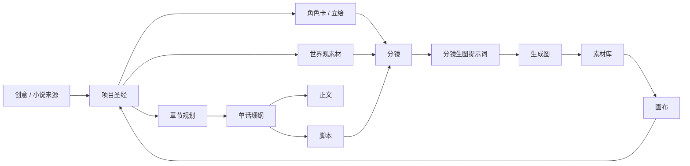
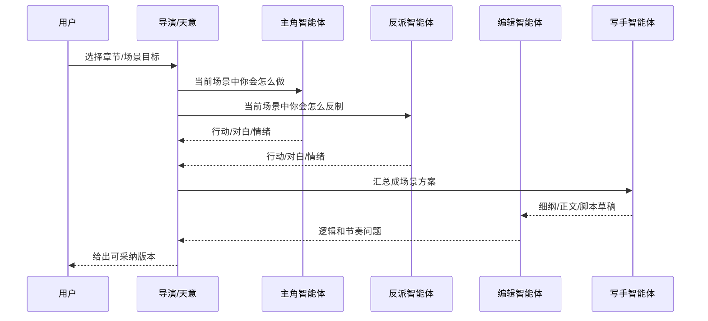

# 创作项目功能优化方案

更新时间：2026-07-01

## 1. 背景判断

YLCraft 现在已经有创作项目主链路：

`项目创意/小说来源 -> 故事大纲 -> 章节规划 -> 单话细纲 -> 正文 -> 脚本 -> 分镜 -> 漫画页/图片生成 -> 素材库回流`

代码上已经具备这些基础能力：

- `creative_projects` 后端接口和 `CreativeProjectService` 编排。
- 严格 JSON 生成与校验，阶段包括 `outline`、`chapter_plan`、`chapter_outline`、`novel_body`、`script`、`storyboard`、`comic_pages`。
- Prompt 模板可以按阶段配置，前端能选择模板。
- 项目素材关联 `ProjectAssetLink`，角色/背景/画风/输出图可绑定到项目。
- 分镜图和漫画页图可以在工作台内直接生图，并回写素材库。
- 生成日志可以查看 prompt、请求、原始响应、规范化 JSON、校验错误。

但当前仍是“能跑的骨架”，距离稳定创作闭环还有差距：

- 大纲不够像“制作圣经”，世界观、角色、地点、视觉规则还不够资产化。
- 角色立绘 prompt 还没有形成多视图、表情、道具、服装、禁忌项的标准卡。
- 分镜 prompt 虽然已增强，但还缺少可复用的镜头语言、blocking、场景空间和机位结构。
- 参考卡已经开始接入，但还需要成为生成链路的核心上下文，而不是附属标签。
- 工作台更像阶段编辑器，还没有“批量生产、失败续跑、人工审核、版本锁定”的流水线体验。
- 智能体现在主要是工具调用思路，还没有变成“角色智能体 + 导演智能体 + 世界规则”的创作模拟系统。

## 2. 外部参考启发

调研方向包括开源 AI 漫画/分镜项目、无限画布、角色一致性生成和多智能体叙事。

参考来源：

- StoryDiffusion：一致性自注意力用于长程图像/视频生成，官方介绍强调可生成多风格漫画，并维持角色风格和服装一致性。项目页：https://storydiffusion.github.io/ ，GitHub：https://github.com/HVision-NKU/StoryDiffusion
- Story2Board：从自然语言生成多 panel storyboard，公开说明强调角色身份一致、布局多样、背景演化和叙事节奏。项目页：https://daviddinkevich.github.io/Story2Board/ ，GitHub：https://github.com/daviddinkevich/Story2Board
- Jaaz：开源多模态创意画布，强调本地可用和隐私优先。GitHub：https://github.com/11cafe/jaaz
- Multi-Agent Based Character Simulation for Story Writing：提出从叙事计划出发，通过角色智能体扮演，再改写成故事文本。论文页：https://www.cs.toronto.edu/~kenshi/publications/2025-05-04-paper-3.html
- StoryWriter：面向长篇故事的多智能体框架，目标是提高长故事逻辑一致性和情节吸引力。GitHub：https://github.com/THU-KEG/StoryWriter

### 2.1 连续漫画与角色一致性

StoryDiffusion 这类项目的核心价值是“连续图像中的角色一致性”。它不是只给每张图一个 prompt，而是通过一致性注意力、角色描述和跨图上下文，让多张图中的人物保持稳定。

对 YLCraft 的启发：

- 图片生成不能只保存最终 prompt，还要保存“角色卡、风格卡、参考图、负面提示、世界规则”。
- 分镜图生成应按“同一话/同一场景/同一角色”批量提交或有序生成，减少每张图互相漂移。
- 输出图片需要记录来源：章节、场景、分镜 panel、角色卡、背景卡、风格卡、模型和完整 prompt。

### 2.2 Story-to-Storyboard 工作流

Story2Board 这类研究/项目关注从故事文本自动拆成多场景 storyboard，通常会强调：

- 场景目标。
- 角色状态。
- 动作节拍。
- 情绪变化。
- 镜头和构图。
- 场景连续性。

对 YLCraft 的启发：

- 单话细纲不应只是摘要，应该包含“场景目的、冲突、关键台词、情绪转折、地点、视觉焦点、镜头设计”。
- 脚本和分镜要分层：脚本服务叙事与对白，分镜服务画面生产。
- 每个分镜 panel 都要能独立生图，但又能从同一场景和角色状态继承上下文。

### 2.3 无限画布和资产中枢

Jaaz、infinite-canvas 这类项目说明：创作不是线性表单，而更像一个画布。

对 YLCraft 的启发：

- 素材库和画布应该是中转核心。
- 大纲、人物、世界观、场景、镜头、图片、视频、音频、导出结果都应该是节点。
- 节点之间要有关系：引用、派生、版本、同一角色、同一场景、同一世界观。
- 工作台适合快速生产，画布适合组织和复盘。

### 2.4 多智能体叙事

多智能体故事生成的思路通常是：

- 每个角色有自己的目标、记忆、偏好、知识盲区。
- 环境/世界规则约束角色行动。
- 导演/叙事者负责节奏、冲突、主题和可读性。
- 批评者/编辑负责查漏洞、降智点、节奏问题和商业钩子。

对 YLCraft 的启发：

- “不同主角设计不同智能体 + 导演（天意）智能体”是值得做的。
- 它不应该第一步就替代现有流程，而应该先作为“剧情推演/冲突生成/角色反应检查”的增强模块。
- 世界观应成为可引用素材，角色智能体和导演智能体都读取同一套世界规则。

## 3. 核心产品定位

创作项目模块应该从“AI 生成几个文本”升级成：

> 一个以素材库和画布为中枢的小说/短剧/漫画创作流水线。它能管理世界观、角色、场景、脚本、分镜、参考图和生成图，并支持 AI 批量生成、人工审核、失败续跑和版本追踪。

推荐核心闭环：



## 4. 数据与资产模型优化

### 4.1 项目圣经 Project Bible

大纲应升级为“项目圣经”，不是单个 outline JSON。

建议字段：

- 基础信息：标题、类型、受众、卖点、基调、禁忌。
- 故事主线：主冲突、阶段目标、高潮、结局方向。
- 世界观：规则、势力、地图、科技/超能力/金融/法律/阶级、人种/种族、历史大事件。
- 角色：主角、反派、配角、关系网、人物弧光。
- 视觉：漫画风格、镜头语言、色彩、服装规则、场景美术。
- 连续性：伏笔、未解决问题、已发生事件、不可更改设定。

这些字段可以先继续存 `outline_json`，但长期应拆成项目资产节点：

- `world_bible`
- `character_card`
- `location_card`
- `faction_card`
- `rule_card`
- `style_card`

### 4.2 世界观作为素材

世界观不应该只是一段文本。它应成为一组可关联素材。

建议世界观素材类型：

- 地图：区域、路线、距离、危险等级。
- 超能力/科技规则：能力边界、代价、克制关系、视觉表现。
- 人种/种族/阶层：外观、文化、语言、服饰、社会位置。
- 金融/资源：货币、公司、债务、黑市、资源稀缺性。
- 政治/势力：组织、阵营、领导者、冲突关系。
- 历史大事件：时间线、幸存者、遗留影响。
- 场景规则：某地能发生什么、不能发生什么。

生成时的使用方式：

- 单话细纲读取世界规则，避免设定漂移。
- 角色智能体读取世界规则，决定“这个角色知道什么、能做什么、会害怕什么”。
- 分镜读取地图/地点/技术视觉规则，生成更具体的场景和画面。

### 4.3 角色卡标准

角色卡应拆成文本卡和视觉卡。

文本卡字段：

- 姓名、别名、年龄段、身份、阵营。
- 欲望、恐惧、秘密、底线。
- 说话风格、常用语、行动倾向。
- 当前关系、当前目标、当前知识状态。
- 成长弧光和关键转折。

视觉卡字段：

- 正脸描述、体型、发型、五官、肤色。
- 常服、战斗服、睡衣/便服、特殊场景服装。
- 标志物：眼镜、戒指、武器、咖啡杯、纹身等。
- 色彩标签和轮廓标签。
- 表情集：开心、愤怒、悲伤、惊讶、压抑、失控。
- 姿态集：站立、坐姿、奔跑、战斗、受伤、回头。
- 多视图：正面、侧面、背面、俯视。
- 负面约束：不能变发色、不能换服装、不能出现多余配饰等。

角色立绘 prompt 模板建议：

```json
{
  "character_name": "",
  "role_position": "",
  "age_range": "",
  "body_shape": "",
  "face": "",
  "hair": "",
  "skin": "",
  "costume": "",
  "signature_items": [],
  "visual_tags": [],
  "expression_sheet": ["neutral", "happy", "angry", "sad"],
  "pose_sheet": ["front", "side", "back", "sitting"],
  "style": "",
  "negative_prompt": ""
}
```

### 4.4 场景卡和镜头卡

用户截图里的 3D blocking/顶视图很有价值。YLCraft 可以不做真正 3D 引擎，先用结构化文本模拟。

场景卡字段：

- 地点、时间、天气、光线、氛围。
- 空间坐标系：X/Y 方向、关键物体位置、门窗/出口/障碍物。
- 角色初始位置、终点位置、移动路线。
- 道具、危险物、可交互物。
- 场景作用：冲突升级、情绪落点、信息揭示、动作戏。

镜头卡字段：

- 机位：CAM_A / CAM_B / CAM_C。
- 景别：远景、中景、近景、特写、俯拍、仰拍。
- 镜头运动：推、拉、摇、移、跟拍、手持。
- 焦点：谁的眼睛、谁的手、哪个道具。
- 180 度轴线、视线方向、遮挡关系。
- 画面任务：交代空间、展示情绪、制造悬念、突出动作。

分镜 prompt 不应只写“男主看着女主”，而应由这些字段合成。

## 5. 生成链路优化

### 5.1 大纲生成

现状：能生成 title、genre、logline、worldview、characters、visual_style 等。

优化：

- 增加“项目圣经视图”，把世界观、角色、视觉风格拆成可编辑块。
- 生成后自动创建草稿素材节点：角色卡、世界观卡、地点卡、风格卡。
- 增加“设定锁定”能力，锁定后后续阶段不能擅自改。

### 5.2 单话细纲

细纲应成为后续正文、脚本、分镜的核心输入。

建议每章结构：

```json
{
  "chapter_number": 1,
  "title": "",
  "summary": "",
  "chapter_goal": "",
  "reader_hook": "",
  "character_state_delta": [],
  "world_state_delta": [],
  "key_dialogues": [],
  "foreshadowing": [],
  "ending_hook": "",
  "scenes": [
    {
      "scene_number": 1,
      "title": "",
      "location": "",
      "time": "",
      "characters": [],
      "purpose": "",
      "conflict": "",
      "objective": "",
      "beats": [],
      "key_dialogue": "",
      "emotion": "",
      "emotional_turn": "",
      "visual_focus": "",
      "blocking_brief": "",
      "image_prompt_seed": ""
    }
  ]
}
```

### 5.3 正文生成

优化方向：

- 正文生成读取细纲、角色卡、世界规则和前文摘要。
- 生成后自动抽取：
  - 本章摘要。
  - 人物状态变化。
  - 新增设定。
  - 伏笔和回收。
  - 可视化场景列表。
- 抽取结果回写项目圣经/连续性日志。

### 5.4 脚本生成

脚本不是漫画图。脚本应该服务“对白、动作、节奏、表演”。

建议脚本结构：

- hook。
- scenes。
- 每个 scene 包含 action、dialogue、emotion、camera_hint、scene_purpose。
- ending_hook。

优化：

- 增加“从正文拆脚本”模式，而不是只能从细纲生成。
- 增加“脚本审核”：是否降智、对白是否像人话、节奏是否拖。

### 5.5 分镜生成

分镜是漫画生图的主来源。

建议分镜 panel 结构：

```json
{
  "panel_number": 1,
  "source_scene_number": 1,
  "panel_goal": "",
  "shot_size": "",
  "camera_angle": "",
  "camera_motion": "",
  "composition": "",
  "blocking": {
    "space_axis": "",
    "characters_position": [],
    "props_position": [],
    "movement_path": []
  },
  "characters": [],
  "character_states": [],
  "action": "",
  "emotion": "",
  "dialogue_bubbles": [],
  "sound_effect": "",
  "image_prompt": "",
  "negative_prompt": "",
  "reference_asset_ids": []
}
```

优化重点：

- 每个 panel 自动匹配角色卡、背景卡、风格卡。
- image_prompt 展示完整版本，允许复制到其他 AI。
- 支持“批量生成本话分镜图”。
- 支持“只重写提示词，不重拆剧情”。
- 支持“重生成某个 panel”。
- 支持失败续跑和跳过已有图。

### 5.6 漫画页

漫画页应该用于阅读/预览，不应和分镜编辑混在一起。

建议：

- 分镜页用于生产。
- 漫画 tab 用于阅读最终图文。
- 漫画页可由多个 panel 合成，也可以一页一图。
- 未来可加入自动排版：竖漫、四格、页漫。

## 6. 智能体设想

### 6.1 角色智能体

为主角/反派/重要配角创建智能体是可行的。

每个角色智能体包含：

- 角色卡。
- 记忆：过去发生过什么。
- 目标：当前想要什么。
- 认知：知道什么、不知道什么、误会什么。
- 情绪：当前情绪和压力。
- 行动策略：遇到冲突时倾向怎么做。
- 语言风格：怎么说话。

用途：

- 推演角色在某场戏里的自然反应。
- 检查剧情是否降智。
- 生成更像角色本人的对白。
- 让角色之间自动碰撞出冲突。

### 6.2 导演/天意智能体

导演智能体不扮演角色，而负责故事效果。

职责：

- 保持主题和主线。
- 控制节奏。
- 制造冲突和反转。
- 防止角色行为跑偏。
- 给每场戏安排信息量和情绪落点。
- 决定“天意事件”：误会、巧合、外部压力、大事件推动。

“天意智能体”可以做成导演的一个模式：

- 输入当前世界状态和角色状态。
- 输出一个合理但有戏剧性的外部事件。
- 必须遵守世界观规则。
- 必须服务主线，不能纯随机。

### 6.3 编辑/审稿智能体

编辑智能体负责挑错：

- 是否降智。
- 是否逻辑漏洞。
- 是否人物崩坏。
- 是否设定冲突。
- 是否节奏太平。
- 是否画面不可生成。
- 是否缺少商业钩子。

### 6.4 多智能体生成流程

推荐先做“半自动推演”，不要一开始全自动写整本。



## 7. 页面与交互优化

### 7.1 项目首页

建议显示项目生产状态：

- 大纲是否完成。
- 角色卡是否完成。
- 角色立绘是否完成。
- 世界观是否完成。
- 章节完成进度。
- 分镜图完成数量。
- 失败任务数量。

### 7.2 单话工作台

建议三栏继续保留，但增强：

- 左：细纲和场景。
- 中：正文/脚本。
- 右：分镜/参考卡/生图结果。
- 每个编辑框上方都显示“这个框是什么，用来干什么”。
- 每个阶段都能选择 prompt 模板。
- 每个阶段都能查看完整 prompt 和原始响应。

### 7.3 参考卡面板

已开始实现素材搜索和关联，后续继续：

- 支持一键从项目角色同步角色卡。
- 支持从素材库多选。
- 支持角色/背景/风格/世界观分组。
- 支持“本章使用哪些参考卡”。
- 支持“只对某个 panel 使用某张参考图”。

### 7.4 批量生产面板

新增“生产队列”：

- 选择章节范围。
- 选择要生成的阶段：细纲、正文、脚本、分镜、分镜图、漫画页。
- 是否跳过已有内容。
- 是否覆盖。
- 失败后可续跑。
- 显示每步日志、耗时、模型、错误。

## 8. Prompt 优化重点

### 8.1 角色立绘 prompt

生成目标不是“一张好看图”，而是“后续一致性参考图”。

模板要求：

- 明确角色定位。
- 明确外观固定点。
- 明确服装固定点。
- 明确表情/姿态/多视图。
- 明确画风。
- 明确禁止变化项。
- 输出完整可复制 prompt。

示例结构：

```text
单人角色设定图，完整角色参考卡，用于后续漫画分镜保持一致性。
角色：{name}，{age_range}，{role_position}。
外貌：{face}，{hair}，{body_shape}，{skin}。
服装：{costume}。
标志物：{signature_items}。
表情：neutral / happy / angry / sad。
姿态：front view / side view / back view / sitting pose / action pose。
风格：{visual_style}。
要求：白底角色设定板，清晰线稿，颜色统一，多视图一致。
避免：发色变化、服装变化、多余饰品、脸部崩坏、手指错误、文字乱码。
```

### 8.2 分镜生图 prompt

分镜 prompt 应由这些块合成：

- 项目统一风格。
- 角色卡摘要。
- 背景卡摘要。
- 世界规则或场景卡。
- panel action。
- 情绪。
- 镜头语言。
- 构图。
- 对白气泡。
- 负面提示。
- reference asset ids。

### 8.3 中文微调

参考站里“中文微调”的本质是：让 AI 输出更适合中文短剧/网文节奏。

建议 prompt 增加：

- 不要翻译腔。
- 对白短、狠、可演。
- 每场戏有明确情绪转折。
- 关键台词要有记忆点。
- 不要用抽象形容词替代动作。
- 视觉提示词要具体到构图和动作。

## 9. 分阶段落地计划

### Phase 1：强化现有闭环

- 完善参考卡：多选、分组、显示缩略图、按 panel 绑定。
- 分镜图批量生成：跳过已有、失败续跑、进度条。
- 完整 prompt 展示和复制。
- 角色立绘 prompt 优化，生成后自动入素材库并关联角色。
- 分镜 prompt 增强：角色卡、背景卡、风格卡自动注入。

### Phase 2：项目圣经和世界观素材

- 大纲拆成项目圣经视图。
- 世界观、地点、势力、规则变成素材节点。
- 角色卡支持版本和立绘谱系。
- 单话细纲读取世界观和角色状态。
- 正文生成后自动抽取连续性日志。

### Phase 3：生产队列

- 批量生成章节内容。
- 阶段任务队列和日志。
- 跳过/覆盖/续跑。
- 每步可人工审核。
- 支持章节范围。

### Phase 4：多智能体推演

- 角色智能体从角色卡生成。
- 导演/天意智能体从项目圣经生成。
- 编辑智能体审稿。
- 先支持单场景推演，再支持整章推演。
- 推演结果进入细纲或脚本候选版本。

### Phase 5：画布中枢

- 项目画布展示所有节点。
- 节点之间显示引用和派生关系。
- 支持从画布触发生成。
- 支持把世界观/角色/场景/分镜/生成图组织成制作板。

## 10. 优先级建议

最推荐下一步做这 5 件事：

1. 完善角色卡/参考卡，先让角色立绘真正参与分镜生图。
2. 优化分镜 prompt schema，把截图里的 blocking、机位、场景作用吸收进结构。
3. 做“完整 prompt 展示 + 复制 + 单 panel 重写 prompt”。
4. 做批量分镜生图进度和失败续跑。
5. 做世界观素材的最小版本：地点卡、规则卡、风格卡。

不建议马上做：

- 一上来做完整自主演化小说。
- 一上来做真正 3D blocking 编辑器。
- 一上来做复杂云端协作。

更稳的路径是：先把“AI 生成可控”做好，再让智能体参与“提出候选剧情和角色反应”。

## 11. OpenSpec 拆分建议

可以拆成以下变更：

- `creative-reference-card-workflow`
  - 参考卡多选、分组、按 panel 绑定、完整 prompt 注入。
- `creative-character-portrait-system`
  - 角色卡、立绘 prompt、多视图/表情、素材库回写、角色谱系。
- `creative-storyboard-prompt-v2`
  - 分镜 schema、blocking、机位、场景卡、prompt 展示和重写。
- `creative-batch-production-queue`
  - 批量生成、进度、失败续跑、跳过已有。
- `creative-world-bible-assets`
  - 世界观素材、地点卡、规则卡、势力卡、连续性日志。
- `creative-agent-simulation`
  - 角色智能体、导演/天意智能体、编辑智能体、场景推演。

## 12. 结论

YLCraft 当前方向是对的：素材库和画布应成为中转核心，小说/短剧/漫画/图片生成都围绕它们闭环。

下一阶段不要只增加“更多生成按钮”，而要把生成上下文资产化：

- 角色作为资产。
- 世界观作为资产。
- 场景作为资产。
- 镜头作为资产。
- prompt 和生成图作为可追溯资产。

当这些资产稳定后，“主角智能体 + 导演智能体 + 世界观规则”的自动演化才会有地基。否则智能体只会随机聊天，无法产出可控、可续写、可漫画化的作品。
