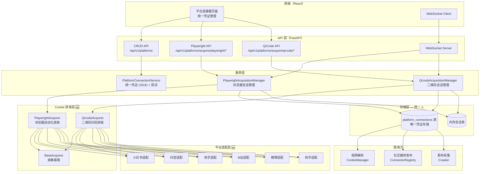
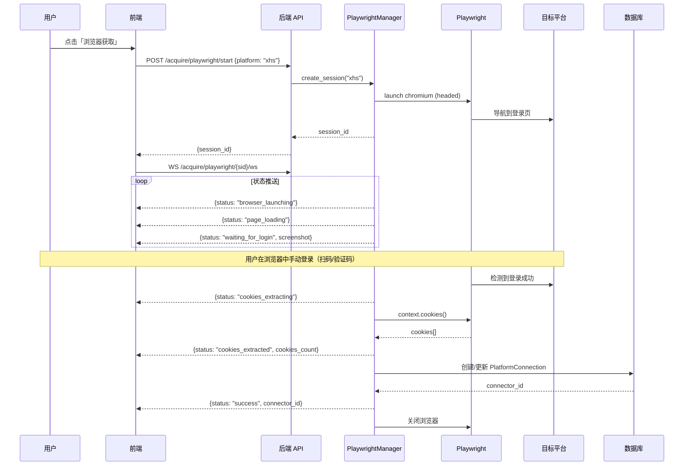
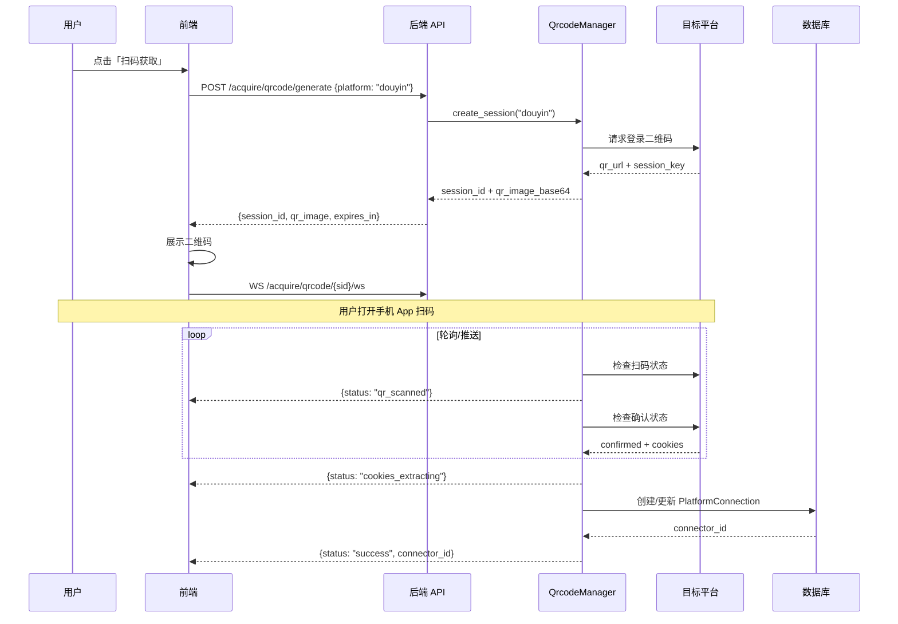

# Cookie 自动获取 — 设计与进度

> **版本**：v2.0（统一凭证架构）
> **状态**：前端已实现，后端部分实现
> **最后更新**：2026-05-14
> **关联模块**：`PlatformConnection` / `connectors` / `CookieManager`
> **架构**：`PlatformConnection` 为唯一凭证存储，已删除 `PlatformCookie` + `SocialMediaConnector`
> **参考项目**：XHS_ALL_IN_ONE（账号矩阵 UI + Drawer 抽屉 + Segmented 方式切换）

---

## 一、背景与目标

### 1.1 架构

YLCraft 统一凭证架构：所有平台的凭证存储在 `PlatformConnection` 一张表中。

| # | 模型 | 表名 | 用途 | 存储格式 | 状态 |
|---|------|------|------|---------|------|
| 1 | ~~`PlatformCookie`~~ | `platform_cookies` | 视频解析（yt-dlp 等） | Netscape 格式原始字符串 | ✅ **已废弃并删除**，合并到 `PlatformConnection.cookie_content` |
| 2 | `PlatformConnection` | `platform_connections` | 通用平台连接器（**统一凭证存储**） | JSON credentials + cookie_content | 🟢 唯一凭证表 |
| 3 | ~~`SocialMediaConnector`~~ | `social_media_connectors` | 社交媒体发布 | JSON credentials | ✅ **已废弃并删除**，合并到 `PlatformConnection.account_*` 字段 |

**核心问题（已解决 ✅）**：
- ~~同一平台的 Cookie 在 3 张表里重复存储，更新一处不同步~~ → **统一为 `PlatformConnection` 一张表**
- ~~视频解析用 `PlatformCookie`（Netscape），发布用 `SocialMediaConnector`（JSON），格式不统一~~ → **统一存储 + `cookie_content` 字段兼容 Netscape**
-~~用户需要在多处配置同一个 Cookie，体验差~~ → **一处配置，多处使用**
-~~Cookie 过期后需要每个地方都更新~~ → **统一更新，全局生效**

**不纳入统一的配置**（保持不变）：
- **模型配置**（AI Provider 设置）→ 属于 API Key，不是 Cookie
- **书源配置**（`BookSource.cookie`）→ 每个书源有自己的 Cookie，属于阅读模块内部规则

### 1.2 目标

1. **统一凭证存储**：合并为 `PlatformConnection` 一张表，所有模块从此读取
2. **新增自动获取方式**：在手动粘贴基础上，新增 Playwright + 二维码扫码

| 方式 | 原理 | 用户体验 |
|------|------|---------|
| **手动粘贴** | 直接输入 Cookie/API Key | 现有方式，保持兼容 |
| **Playwright 浏览器自动化** | 启动真实 Chromium，用户手动登录后自动提取 Cookie | 打开浏览器 → 登录 → 自动获取，全程可视化 |
| **二维码扫码** | 调用平台登录二维码 API，用户手机扫码确认 | 展示二维码 → 手机扫码 → 自动获取 Cookie |

### 1.3 参考项目

| 项目 | GitHub | 参考内容 |
|------|--------|---------|
| **social-auto-upload** | `dreammiao/social-auto-upload` | Playwright 自动化登录 + Cookie 提取 + 多平台发布 |
| **XHS_ALL_IN_ONE** | `cv-cat/XHS_ALL_IN_ONE` | 账号矩阵管理 + Drawer 抽屉 + Segmented 方式切换 + 二维码登录 + Cookie 管理 + 健康巡检 |
| **MediaCrawler** | `NanmiCoder/MediaCrawler` | Playwright 登录 + Stealth 注入 + Cookie 持久化（已集成） |

---

## 二、整体架构

### 2.1 架构总图



### 2.2 统一凭证架构

**核心原则：一份 Cookie，多处使用**

```
┌─────────────────────────────────────────────────────┐
│              PlatformConnection（统一凭证）            │
│                                                      │
│  platform: douyin                                    │
│  auth_type: cookie                                   │
│  acquisition_method: playwright  ← 🆕 获取方式        │
│  credentials: { raw, cookies_array, source, ... }   │
│  cookie_content: "Netscape格式..."  ← 🆕 视频解析用    │
│  domains: ".douyin.com,..."         ← 🆕 从PlatformCookie合并 │
│  test_url: "https://..."            ← 🆕 测试链接     │
│  account_name: "用户昵称"           ← 🆕 从SocialMediaConnector合并 │
│  account_avatar: "https://..."      ← 🆕 从SocialMediaConnector合并 │
└─────────────────────────────────────────────────────┘
       │              │              │
       ▼              ▼              ▼
  视频解析         社交媒体发布      素材采集
  CookieManager    ConnectorRegistry  Crawler
  (读cookie_content  (读credentials     (读credentials
   Netscape格式)     JSON格式)          JSON格式)
```

### 2.3 模块位置

```
backend/app/
├── api/v1/
│   ├── platforms.py                # 现有平台连接器 API（增强）
│   └── cookie_acquisition.py      # 🆕 Cookie 获取 API（Playwright + QrCode）
│
├── services/
│   ├── platform_connection/       # 现有服务（增强）
│   └── cookie_acquisition/        # 🆕 Cookie 获取服务
│       ├── __init__.py
│       ├── base.py                 # 抽象基类 AcquisitionResult / BaseAcquirer
│       ├── playwright_manager.py   # Playwright 会话管理器
│       ├── qrcode_manager.py      # QrCode 会话管理器
│       └── platforms/             # 各平台特定适配
│           ├── __init__.py
│           ├── xiaohongshu.py     # 小红书
│           ├── douyin.py          # 抖音
│           ├── kuaishou.py        # 快手
│           ├── bilibili.py        # B站
│           ├── weibo.py           # 微博
│           └── zhihu.py           # 知乎
│
├── connectors/                    # 现有连接器（不变，读 PlatformConnection）
│   ├── social/
│   │   ├── xhs/
│   │   ├── douyin/
│   │   ├── bilibili/
│   │   ├── weibo/
│   │   ├── kuaishou/
│   │   └── ...
│   └── registry.py
│
│   ⚠️ 以下模型/服务已废弃并删除，功能合并到 PlatformConnection：
│   ✅ db/models/platform_cookie.py        → 已删除，迁移到 PlatformConnection.cookie_content / domains
│   ✅ db/models/social_media_connector.py  → 已删除，迁移到 PlatformConnection 的 account_* 字段
│   ✅ api/v1/cookies.py                   → 已删除，合并到 /api/v1/platforms
│   ✅ api/v1/social_media.py              → 已删除，合并到 /api/v1/platforms
│   ✅ services/social_media_connector/    → 已删除，合并到 PlatformConnectionService
│
│   ✅ 新增文件（Cookie 自动获取）：
│   ✅ api/v1/cookie_acquisition.py         → Cookie 获取 API（Playwright + QrCode + WebSocket）
│   ✅ services/cookie_acquisition/         → Cookie 获取服务层
│
│   ✅ 以下保持不变：
│   ✓ db/models/book_source.py            → 书源 Cookie 属于书源规则，不合并
│   ✓ AI Provider 设置                     → API Key，不属于 Cookie 范畴

frontend/src/
├── pages/
│   └── platforms/                  # 增强：统一凭证管理页面（参考 XHS_ALL_IN_ONE 重构）
│       └── index.tsx               # 主页面（1559 行，包含所有面板组件）
│                                    # 内联组件：StatusTag / ConnectionCard / PlatformGroupCard
│                                    # CookieImportPanel / QrLoginPanel / BrowserLoginPanel
│                                    # ApiKeyPanel / AddAccountDrawer
│
├── components/
│   └── social/
│       └── CookieStatusBadge.tsx  # 🆕 Cookie 状态徽章
│
└── api/
    └── index.ts                   # 新增 API 函数
```

---

## 三、数据模型

### 3.1 统一凭证模型 — PlatformConnection 增强

**废弃 `PlatformCookie` 和 `SocialMediaConnector`，统一为 `PlatformConnection` ✅（代码已删除，模型增强待完成）**。

在 `PlatformConnection` 表新增以下字段：

```python
# backend/app/db/models/platform_connection.py — 增强

class AcquisitionMethod(str, enum.Enum):
    """凭证获取方式"""
    MANUAL = "manual"           # 手动粘贴
    PLAYWRIGHT = "playwright"  # Playwright 浏览器自动化
    QRCODE = "qrcode"          # 二维码扫码

class PlatformConnectionBase(SQLModel):
    # ===== 原有字段 =====
    platform: PlatformType
    name: str
    auth_type: AuthType
    status: ConnectionStatus
    credentials: str                    # JSON 凭证数据
    description: Optional[str]
    last_used: Optional[datetime]
    last_tested: Optional[datetime]
    error_message: Optional[str]

    # ===== 🆕 新增：凭证获取方式 =====
    acquisition_method: AcquisitionMethod = Field(
        AcquisitionMethod.MANUAL,
        description="凭证获取方式：manual/playwright/qrcode"
    )

    # ===== 🆕 新增：账号信息（从 SocialMediaConnector 合并） =====
    account_id: Optional[str] = Field(None, description="平台账号 ID")
    account_name: Optional[str] = Field(None, description="账号名称/昵称")
    account_avatar: Optional[str] = Field(None, description="账号头像 URL")
    account_url: Optional[str] = Field(None, description="账号主页 URL")

    # ===== 🆕 新增：Cookie 兼容（从 PlatformCookie 合并） =====
    cookie_content: Optional[str] = Field(
        None, sa_type=Text,
        description="Netscape 格式 Cookie（视频解析用）"
    )
    domains: Optional[str] = Field(
        None, max_length=1000,
        description="关联域名列表（逗号分隔，如：.douyin.com,.iesdouyin.com）"
    )
    test_url: Optional[str] = Field(
        None, max_length=500,
        description="测试链接（用于 Cookie 有效性测试）"
    )

    # ===== 🆕 新增：统计信息（从 SocialMediaConnector 合并） =====
    success_count: int = Field(0, description="成功次数")
    fail_count: int = Field(0, description="失败次数")
```

### 3.2 数据迁移策略

| 源模型 | 迁移字段 | 目标字段 |
|--------|---------|---------|
| `PlatformCookie.cookie_content` | → | `PlatformConnection.cookie_content` |
| `PlatformCookie.domains` | → | `PlatformConnection.domains` |
| `PlatformCookie.test_url` | → | `PlatformConnection.test_url` |
| `PlatformCookie.display_name` | → | `PlatformConnection.name`（如无同名连接） |
| `SocialMediaConnector.credentials` | → | `PlatformConnection.credentials` |
| `SocialMediaConnector.account_id` | → | `PlatformConnection.account_id` |
| `SocialMediaConnector.account_name` | → | `PlatformConnection.account_name` |
| `SocialMediaConnector.account_avatar` | → | `PlatformConnection.account_avatar` |
| `SocialMediaConnector.account_url` | → | `PlatformConnection.account_url` |
| `SocialMediaConnector.success_count` | → | `PlatformConnection.success_count` |
| `SocialMediaConnector.fail_count` | → | `PlatformConnection.fail_count` |

**迁移脚本**：创建 `backend/app/migrations/migrate_to_unified_connection.py`

```python
"""统一凭证迁移：PlatformCookie + SocialMediaConnector → PlatformConnection"""

def migrate():
    # 1. 迁移 PlatformCookie → PlatformConnection
    #    如果同 platform 已有 PlatformConnection，合并 cookie_content
    #    如果没有，创建新的 PlatformConnection
    # 2. 迁移 SocialMediaConnector → PlatformConnection
    #    如果同 platform 已有 PlatformConnection，合并 account_* 字段
    #    如果没有，创建新的 PlatformConnection
    # 3. 更新 CookieManager，从 PlatformConnection 读
    # 4. 更新 ConnectorRegistry，从 PlatformConnection 读
    pass
```

### 3.3 credentials JSON 结构（按获取方式区分）

#### 手动粘贴（manual）

```json
{
    "raw": "a1=xxx; a2=yyy; a3=zzz",
    "source": "manual"
}
```

#### Playwright 获取（playwright）

```json
{
    "raw": "a1=xxx; a2=yyy; a3=zzz",
    "cookies_array": [
        {
            "name": "a1",
            "value": "xxx",
            "domain": ".xiaohongshu.com",
            "path": "/",
            "expires": 1735689600,
            "httpOnly": true,
            "secure": true,
            "sameSite": "Lax"
        }
    ],
    "source": "playwright",
    "browser_version": "Chromium/120.0.0",
    "extracted_at": "2026-05-14T10:30:00Z",
    "user_agent": "Mozilla/5.0 ..."
}
```

#### 二维码扫码（qrcode）

```json
{
    "raw": "a1=xxx; a2=yyy; a3=zzz",
    "cookies_array": [...],
    "source": "qrcode",
    "qr_session_id": "uuid-xxx-xxx",
    "extracted_at": "2026-05-14T10:35:00Z"
}
```

### 3.4 内存会话模型

Cookie 获取过程是异步的，需要一个内存会话表来追踪状态：

```python
from dataclasses import dataclass, field
from datetime import datetime
from enum import Enum
from typing import Optional


class AcquisitionStatus(str, Enum):
    """获取会话状态"""
    INITIALIZING = "initializing"       # 初始化中
    BROWSER_LAUNCHING = "browser_launching"  # Playwright: 浏览器启动中
    PAGE_LOADING = "page_loading"       # Playwright: 页面加载中
    WAITING_FOR_LOGIN = "waiting_for_login"  # 等待用户登录
    QR_GENERATED = "qr_generated"       # QrCode: 二维码已生成
    QR_SCANNED = "qr_scanned"           # QrCode: 已扫码，等待确认
    COOKIES_EXTRACTING = "cookies_extracting"  # 正在提取 Cookie
    COOKIES_EXTRACTED = "cookies_extracted"    # Cookie 已提取
    SAVING = "saving"                   # 正在保存
    SUCCESS = "success"                 # 成功
    FAILED = "failed"                   # 失败
    CANCELLED = "cancelled"             # 已取消
    EXPIRED = "expired"                 # 二维码过期


@dataclass
class AcquisitionSession:
    """Cookie 获取会话"""
    session_id: str
    platform: str                       # xhs / douyin / bilibili / ...
    method: str                         # playwright / qrcode
    status: AcquisitionStatus = AcquisitionStatus.INITIALIZING
    created_at: datetime = field(default_factory=datetime.now)
    updated_at: datetime = field(default_factory=datetime.now)

    # 结果
    cookies_raw: Optional[str] = None
    cookies_array: Optional[list[dict]] = None
    connector_id: Optional[str] = None  # 关联的 PlatformConnection ID

    # Playwright 特有
    browser_context: Optional[object] = None  # BrowserContext 引用
    page_url: Optional[str] = None

    # QrCode 特有
    qr_image_base64: Optional[str] = None
    qr_session_key: Optional[str] = None      # 平台侧会话 ID

    # 错误
    error_message: Optional[str] = None

    @property
    def is_terminal(self) -> bool:
        """是否已到达终态"""
        return self.status in (
            AcquisitionStatus.SUCCESS,
            AcquisitionStatus.FAILED,
            AcquisitionStatus.CANCELLED,
            AcquisitionStatus.EXPIRED,
        )
```

---

## 四、API 设计

> **统一后，所有凭证相关 API 都在 `/api/v1/platforms` 下**
> - 原 `/api/v1/cookies/*` → 合并到 `/api/v1/platforms/*`
> - 原 `/api/v1/social/connectors/*` → 合并到 `/api/v1/platforms/*`
> - 新增的 Cookie 获取 API → `/api/v1/platforms/acquire/*`

### 4.1 现有 API 增强

| 方法 | 路径 | 说明 | 变更 |
|------|------|------|------|
| `GET` | `/api/v1/platforms` | 列出所有平台连接 | 增强：返回 acquisition_method / account_* / domains |
| `POST` | `/api/v1/platforms` | 创建连接 | 增强：支持 cookie_content / domains / test_url |
| `PUT` | `/api/v1/platforms/{id}` | 更新连接 | 增强：支持 acquisition_method / cookie_content |
| `DELETE` | `/api/v1/platforms/{id}` | 删除连接 | 不变 |
| `POST` | `/api/v1/platforms/{id}/test` | 测试连接 | 增强：使用 cookie_content 或 credentials |
| `GET` | `/api/v1/platforms/{id}/cookie-content` | 获取 Netscape 格式 Cookie | 🆕 从 cookie_content 字段读取 |
| `POST` | `/api/v1/platforms/{id}/cookie-content` | 保存 Netscape 格式 Cookie | 🆕 写入 cookie_content 字段（原 /cookies/{platform}） |

### 4.2 Playwright 获取

| 方法 | 路径 | 说明 |
|------|------|------|
| `POST` | `/api/v1/platforms/acquire/playwright/start` | 启动浏览器会话 |
| `WS` | `/api/v1/platforms/acquire/playwright/{session_id}/ws` | WebSocket 状态推送 |
| `POST` | `/api/v1/platforms/acquire/playwright/{session_id}/cancel` | 取消会话 |
| `GET` | `/api/v1/platforms/acquire/playwright/sessions` | 列出活跃会话 |

#### Start Request

```json
{
    "platform": "xhs",
    "headless": false,
    "connector_name": "我的小红书账号",
    "stealth": true
}
```

#### Start Response

```json
{
    "success": true,
    "session_id": "uuid-xxx-xxx",
    "message": "浏览器启动中，请等待页面加载后登录"
}
```

#### WebSocket 消息格式

```json
{
    "type": "status_update",
    "session_id": "uuid-xxx-xxx",
    "status": "waiting_for_login",
    "message": "请在浏览器中完成登录",
    "data": {
        "page_url": "https://www.xiaohongshu.com/explore",
        "screenshot_base64": "..."
    }
}
```

### 4.3 二维码扫码

| 方法 | 路径 | 说明 |
|------|------|------|
| `POST` | `/api/v1/platforms/acquire/qrcode/generate` | 生成登录二维码 |
| `WS` | `/api/v1/platforms/acquire/qrcode/{session_id}/ws` | WebSocket 等待扫码结果 |
| `GET` | `/api/v1/platforms/acquire/qrcode/{session_id}/status` | 轮询扫码状态（备选） |
| `POST` | `/api/v1/platforms/acquire/qrcode/{session_id}/refresh` | 刷新过期二维码 |

#### Generate Request

```json
{
    "platform": "douyin",
    "connector_name": "我的抖音账号"
}
```

#### Generate Response

```json
{
    "success": true,
    "session_id": "uuid-yyy-yyy",
    "qr_image_base64": "data:image/png;base64,...",
    "expires_in": 120,
    "message": "请使用抖音 App 扫描二维码"
}
```

### 4.4 与现有 API 的关系

- 新增的 `/acquire/*` 端点负责**获取凭证**
- 获取成功后自动创建/更新 `PlatformConnection` 记录
- 现有的 `/api/v1/platforms` CRUD API 保持不变（增强字段）
- 现有的 `/api/v1/platforms/{id}/test` 保持不变（增强测试逻辑）
- **已废弃并删除** `/api/v1/cookies/*` → 功能合并到 `/api/v1/platforms/*`
- **已废弃并删除** `/api/v1/social/connectors/*` → 功能合并到 `/api/v1/platforms/*`

---

## 五、核心流程

### 5.1 Playwright 获取流程



### 5.2 二维码扫码流程



---

## 六、平台适配策略

### 6.1 各平台登录检测规则

| 平台 | 登录页 URL | 登录成功标志 | Cookie 关键字段 |
|------|-----------|-------------|----------------|
| 小红书 | `https://www.xiaohongshu.com` | URL 变为 `/explore` 或出现用户头像 | `web_session`, `a1` |
| 抖音 | `https://www.douyin.com` | 出现 `.home-nav` 或 URL 含 `/recommend` | `sessionid`, `passport_csrf_token` |
| 快手 | `https://www.kuaishou.com` | 出现用户头像元素 | `kuaishou.server.web_st`, `userId` |
| B站 | `https://www.bilibili.com` | 出现 `.header-avatar-wrap` | `SESSDATA`, `bili_jct`, `DedeUserID` |
| 微博 | `https://weibo.com` | 出现用户头像或 URL 变为首页 | `SUB`, `ALF` |
| 知乎 | `https://www.zhihu.com` | 出现 `.AppHeader-userAvatar` | `z_c0`, `_xsrf` |

### 6.2 各平台二维码支持

| 平台 | 二维码支持 | 二维码 API | 说明 |
|------|----------|-----------|------|
| 小红书 | ✅ | 专用登录 API | 参考 XHS_ALL_IN_ONE |
| 抖音 | ✅ | 抖音开放平台 | 需要申请 App Key |
| 快手 | ⚠️ | 快手开放平台 | 需要申请 App Key |
| B站 | ✅ | B站登录 API | 公开接口 |
| 微博 | ✅ | 微博开放平台 | 需要申请 App Key |
| 知乎 | ❌ | — | 仅支持 Playwright |

### 6.3 Stealth 反检测策略

Playwright 启动时注入以下脚本，避免被平台检测为自动化工具：

```python
STEALTH_SCRIPTS = [
    # 1. 修改 navigator.webdriver
    "Object.defineProperty(navigator, 'webdriver', {get: () => undefined});",
    # 2. 修改 navigator.plugins
    "Object.defineProperty(navigator, 'plugins', {get: () => [1, 2, 3, 4, 5]});",
    # 3. 修改 navigator.languages
    "Object.defineProperty(navigator, 'languages', {get: () => ['zh-CN', 'zh', 'en']});",
    # 4. 修改 chrome 对象
    "window.chrome = { runtime: {} };",
    # 5. 修改 permissions
    "const originalQuery = window.navigator.permissions.query; "
    "window.navigator.permissions.query = (parameters) => "
    "parameters.name === 'notifications' "
    "? Promise.resolve({ state: Notification.permission }) "
    ": originalQuery(parameters);",
]
```

---

## 七、关键实现细节

### 7.1 PlaywrightAcquisitionManager

```python
class PlaywrightAcquisitionManager:
    """Playwright Cookie 获取管理器"""

    def __init__(self):
        self._sessions: dict[str, AcquisitionSession] = {}
        self._playwright: Optional[Playwright] = None
        self._browser: Optional[Browser] = None

    async def ensure_browser(self, headless: bool = False):
        """确保浏览器实例存在（懒加载）"""
        if not self._browser:
            self._playwright = await async_playwright().start()
            self._browser = await self._playwright.chromium.launch(
                headless=headless,
                args=[
                    "--disable-blink-features=AutomationControlled",
                    "--no-sandbox",
                ],
            )

    async def start_session(
        self,
        platform: str,
        headless: bool = False,
        stealth: bool = True,
        connector_name: str = "",
    ) -> str:
        """
        启动一个浏览器获取会话

        Returns:
            session_id
        """
        session_id = str(uuid.uuid4())
        session = AcquisitionSession(
            session_id=session_id,
            platform=platform,
            method="playwright",
        )
        self._sessions[session_id] = session

        try:
            await self.ensure_browser(headless)
            context = await self._browser.new_context(
                viewport={"width": 1280, "height": 800},
                user_agent=get_user_agent(platform),
            )

            # 注入 Stealth 脚本
            if stealth:
                await context.add_init_script(STEALTH_JS)

            page = await context.new_page()

            # 导航到登录页
            login_url = get_login_url(platform)
            await page.goto(login_url, wait_until="networkidle")

            # 更新状态
            session.status = AcquisitionStatus.WAITING_FOR_LOGIN
            session.browser_context = context
            session.page_url = page.url

            # 启动后台检测任务
            asyncio.create_task(
                self._detect_login(session_id, page, platform)
            )

        except Exception as e:
            session.status = AcquisitionStatus.FAILED
            session.error_message = str(e)

        return session_id

    async def _detect_login(
        self, session_id: str, page: Page, platform: str
    ):
        """后台检测用户是否完成登录"""
        session = self._sessions[session_id]
        detector = get_platform_detector(platform)

        try:
            # 轮询检测登录状态（最多等待 5 分钟）
            for _ in range(300):  # 5 min / 1s
                if session.is_terminal:
                    return

                is_logged_in = await detector.detect(page)
                if is_logged_in:
                    # 提取 Cookie
                    session.status = AcquisitionStatus.COOKIES_EXTRACTING
                    cookies = await page.context.cookies()

                    # 组装 credentials
                    raw = "; ".join(
                        f"{c['name']}={c['value']}" for c in cookies
                    )
                    session.cookies_raw = raw
                    session.cookies_array = cookies
                    session.status = AcquisitionStatus.COOKIES_EXTRACTED

                    # 创建/更新 PlatformConnection
                    await self._save_to_db(session_id)

                    # 关闭浏览器
                    await page.context.close()
                    return

                await asyncio.sleep(1)

            # 超时
            session.status = AcquisitionStatus.FAILED
            session.error_message = "登录等待超时（5 分钟）"
            await page.context.close()

        except Exception as e:
            session.status = AcquisitionStatus.FAILED
            session.error_message = str(e)
            try:
                await page.context.close()
            except:
                pass
```

### 7.2 QrcodeAcquisitionManager

```python
class QrcodeAcquisitionManager:
    """二维码扫码 Cookie 获取管理器"""

    def __init__(self):
        self._sessions: dict[str, AcquisitionSession] = {}

    async def generate_qrcode(
        self,
        platform: str,
        connector_name: str = "",
    ) -> str:
        """
        生成登录二维码

        Returns:
            session_id
        """
        session_id = str(uuid.uuid4())
        session = AcquisitionSession(
            session_id=session_id,
            platform=platform,
            method="qrcode",
        )
        self._sessions[session_id] = session

        try:
            # 调用平台适配器获取二维码
            adapter = get_qrcode_adapter(platform)
            qr_result = await adapter.generate_qrcode()

            session.qr_image_base64 = qr_result["qr_image_base64"]
            session.qr_session_key = qr_result["session_key"]
            session.status = AcquisitionStatus.QR_GENERATED

            # 启动后台轮询任务
            asyncio.create_task(
                self._poll_qrcode_status(session_id, adapter)
            )

        except Exception as e:
            session.status = AcquisitionStatus.FAILED
            session.error_message = str(e)

        return session_id

    async def _poll_qrcode_status(
        self, session_id: str, adapter: QrcodeAdapter
    ):
        """后台轮询扫码状态"""
        session = self._sessions[session_id]

        try:
            for _ in range(120):  # 最多等待 2 分钟
                if session.is_terminal:
                    return

                result = await adapter.check_status(
                    session.qr_session_key
                )

                status = result.get("status")

                if status == "scanned":
                    session.status = AcquisitionStatus.QR_SCANNED

                elif status == "confirmed":
                    # 获取 Cookie
                    session.status = AcquisitionStatus.COOKIES_EXTRACTING
                    cookies = result.get("cookies", [])

                    raw = "; ".join(
                        f"{c['name']}={c['value']}" for c in cookies
                    )
                    session.cookies_raw = raw
                    session.cookies_array = cookies
                    session.status = AcquisitionStatus.COOKIES_EXTRACTED

                    # 创建/更新 PlatformConnection
                    await self._save_to_db(session_id)
                    return

                elif status == "expired":
                    session.status = AcquisitionStatus.EXPIRED
                    return

                await asyncio.sleep(2)

            session.status = AcquisitionStatus.EXPIRED

        except Exception as e:
            session.status = AcquisitionStatus.FAILED
            session.error_message = str(e)
```

### 7.3 WebSocket 状态推送

```python
# backend/app/api/v1/cookie_acquisition.py

from fastapi import WebSocket, WebSocketDisconnect


@router.websocket("/acquire/playwright/{session_id}/ws")
async def playwright_ws(websocket: WebSocket, session_id: str):
    """Playwright 获取状态 WebSocket"""
    await websocket.accept()

    manager = get_playwright_manager()
    session = manager.get_session(session_id)
    if not session:
        await websocket.send_json({
            "type": "error",
            "message": "会话不存在"
        })
        await websocket.close()
        return

    try:
        last_status = None
        while not session.is_terminal:
            if session.status != last_status:
                await websocket.send_json({
                    "type": "status_update",
                    "session_id": session_id,
                    "status": session.status.value,
                    "message": get_status_message(session.status),
                    "data": {
                        "page_url": session.page_url,
                        "cookies_count": len(session.cookies_array or []),
                    }
                })
                last_status = session.status

            await asyncio.sleep(0.5)

        # 发送终态
        await websocket.send_json({
            "type": "completed",
            "session_id": session_id,
            "status": session.status.value,
            "connector_id": session.connector_id,
            "message": get_status_message(session.status),
        })

    except WebSocketDisconnect:
        pass
```

### 7.4 前端交互

```tsx
// frontend/src/pages/social-accounts/PlaywrightPanel.tsx

const PlaywrightPanel: React.FC<{ platform: string }> = ({ platform }) => {
    const [sessionId, setSessionId] = useState<string | null>(null);
    const [status, setStatus] = useState<string>("idle");
    const [logs, setLogs] = useState<string[]>([]);

    const startAcquisition = async () => {
        const res = await api.post('/social/acquire/playwright/start', {
            platform,
            headless: false,
            stealth: true,
        });
        setSessionId(res.data.session_id);
        setStatus("initializing");

        // 连接 WebSocket
        const ws = new WebSocket(
            `ws://localhost:8000/api/v1/social/acquire/playwright/${res.data.session_id}/ws`
        );

        ws.onmessage = (event) => {
            const data = JSON.parse(event.data);
            setStatus(data.status);
            setLogs(prev => [...prev, data.message]);

            if (data.type === "completed") {
                ws.close();
                message.success(data.status === "success"
                    ? "Cookie 获取成功！"
                    : "获取失败：" + data.message
                );
            }
        };
    };

    const cancelAcquisition = async () => {
        if (sessionId) {
            await api.post(`/social/acquire/playwright/${sessionId}/cancel`);
        }
    };

    return (
        <div>
            <Button onClick={startAcquisition} loading={status === "initializing"}>
                打开浏览器获取 Cookie
            </Button>
            {sessionId && (
                <>
                    <StatusBadge status={status} />
                    <Button onClick={cancelAcquisition} danger>取消</Button>
                    <LogViewer logs={logs} />
                </>
            )}
        </div>
    );
};
```

---

## 八、平台适配器设计

### 8.1 抽象基类

```python
# backend/app/services/cookie_acquisition/base.py

from abc import ABC, abstractmethod
from typing import Optional


class PlatformDetector(ABC):
    """登录检测器（Playwright 用）"""

    @abstractmethod
    async def detect(self, page) -> bool:
        """检测用户是否已登录"""
        pass


class QrcodeAdapter(ABC):
    """二维码适配器（QrCode 用）"""

    @abstractmethod
    async def generate_qrcode(self) -> dict:
        """
        生成登录二维码

        Returns:
            {
                "qr_image_base64": "data:image/png;base64,...",
                "session_key": "xxx",
                "expires_in": 120,
            }
        """
        pass

    @abstractmethod
    async def check_status(self, session_key: str) -> dict:
        """
        检查扫码状态

        Returns:
            {
                "status": "waiting|scanned|confirmed|expired",
                "cookies": [...],  # 仅 confirmed 时有值
            }
        """
        pass
```

### 8.2 小红书适配器示例

```python
# backend/app/services/cookie_acquisition/platforms/xiaohongshu.py

class XhsDetector(PlatformDetector):
    """小红书登录检测"""

    async def detect(self, page) -> bool:
        # 方式1：URL 检测
        if "/explore" in page.url or "/user/profile" in page.url:
            return True
        # 方式2：元素检测
        try:
            avatar = await page.query_selector(".user-info .avatar")
            return avatar is not None
        except:
            return False


class XhsQrcodeAdapter(QrcodeAdapter):
    """小红书二维码登录适配器"""

    async def generate_qrcode(self) -> dict:
        # 参考 XHS_ALL_IN_ONE 实现
        async with httpx.AsyncClient() as client:
            resp = await client.get(
                "https://fe-video-qc.xhscdn.com/fe-platform/ed8b4cb5/xhs-qrcode.js"
            )
            # 解析二维码 URL，生成 base64 图片
            ...

    async def check_status(self, session_key: str) -> dict:
        # 轮询扫码状态
        ...
```

---

## 九、配置与依赖

### 9.1 新增依赖

| 依赖 | 用途 | 是否必装 |
|------|------|---------|
| `playwright` | 浏览器自动化 | 可选（pip install playwright && playwright install chromium） |
| `qrcode` | 二维码生成 | 可选 |
| `Pillow` | 二维码图片处理 | 可选（与 qrcode 配合） |

### 9.2 配置项

```python
# backend/app/config.py 新增

# Cookie 获取配置
COOKIE_ACQUISITION_ENABLED: bool = True
PLAYWRIGHT_ENABLED: bool = True        # Playwright 功能开关
QRCODE_ENABLED: bool = True            # QrCode 功能开关
PLAYWRIGHT_HEADLESS: bool = False      # 默认有头模式
PLAYWRIGHT_STEALTH: bool = True        # 默认开启反检测
PLAYWRIGHT_TIMEOUT: int = 300          # 登录等待超时（秒）
QRCODE_TIMEOUT: int = 120              # 二维码过期时间（秒）
QRCODE_POLL_INTERVAL: int = 2          # 二维码轮询间隔（秒）
```

### 9.3 依赖安装策略

Playwright 作为**可选依赖**，安装后才能使用浏览器获取功能：

```bash
# 基础安装（不含 Playwright）
pip install -e .

# 含 Playwright 安装
pip install -e ".[playwright]"
playwright install chromium

# 含 QrCode 安装
pip install -e ".[qrcode]"
```

如果用户未安装 Playwright，前端展示提示：

```
⚠️ 浏览器获取功能需要安装 Playwright
pip install playwright && playwright install chromium
```

---

## 十、安全考虑

### 10.1 Cookie 存储

- 当前 Cookie 明文存储在 `credentials` 字段（JSON 字符串）
- **二期**将增加 AES-256-GCM 加密存储
- 加密密钥存储在环境变量 `YLCRAFT_ENCRYPTION_KEY`

### 10.2 浏览器会话安全

- 每个 Playwright 会话使用独立的 BrowserContext（Cookie 隔离）
- 会话结束后立即关闭 Context，清除浏览器数据
- 不录制用户密码，仅提取 Cookie

### 10.3 WebSocket 安全

- WebSocket 连接需要验证 session_id 有效性
- 同一 session_id 只允许一个 WebSocket 连接
- 会话结束（终态）后自动关闭 WebSocket

---

## 十一、风险与应对

| 风险 | 影响 | 应对策略 |
|------|------|---------|
| 平台更新登录流程 | Playwright 检测失效 | 平台适配器独立维护，快速迭代更新 |
| 平台检测自动化工具 | 账号被封禁 | Stealth 注入 + 有头模式 + 随机延迟 |
| Playwright 安装体积大 | 部署困难 | 可选依赖，Docker 镜像分层 |
| 二维码 API 需要申请 App Key | 部分平台无法使用 | 优先 Playwright，QrCode 作为补充 |
| Cookie 过期 | 发布失败 | 定期健康检查 + 过期提醒 + 一键刷新 |
| 并发浏览器会话过多 | 服务器资源耗尽 | 限制最大并发数（默认 3）+ 会话超时 |

---

## 十二、实施路线图

### 第一期 MVP（核心功能）

```
[██████████████████████████████░░░░░░░░░░░]  ~55%
```

| 任务 | 优先级 | 预估工时 | 状态 |
|------|--------|---------|------|
| 废弃旧模型：删除 PlatformCookie + SocialMediaConnector | P0 | 0.5h | ✅ **已完成** |
| 清理旧 API：删除 cookies.py + social_media.py | P0 | 0.5h | ✅ **已完成** |
| 清理旧服务：删除 social_media_connector 服务 | P0 | 0.5h | ✅ **已完成** |
| 新建 Cookie 获取 API 骨架（cookie_acquisition.py） | P0 | 1h | ✅ **已完成** |
| 新建 cookie_acquisition 服务骨架 + 平台适配器注册 | P0 | 1h | ✅ **已完成** |
| 注册新路由到 main.py | P0 | 0.25h | ✅ **已完成** |
| 数据模型：新增 `acquisition_method` 字段 | P0 | 0.5h | ✅ **已完成** |
| 抽象基类：`BaseAcquirer` / `PlatformDetector` / `QrcodeAdapter` | P0 | 1h | ✅ **已完成** |
| PlaywrightAcquisitionManager 核心逻辑 | P0 | 3h | ✅ **已完成** |
| QrcodeAcquisitionManager 核心逻辑 | P0 | 2h | ✅ **已完成** |
| 平台适配器：小红书 / 抖音 / B站 / 快手 / 微博 / 知乎 | P0 | 3h | ✅ **已完成**（骨架） |
| API 端点：Playwright start / ws / cancel | P0 | 2h | ✅ **已完成** |
| API 端点：QrCode generate / status / refresh / ws | P0 | 2h | ✅ **已完成** |
| WebSocket 状态推送 | P0 | 1.5h | ✅ **已完成** |
| 数据库迁移脚本 | P1 | 1h | ✅ **已完成** |
| Cookie 文件同步（Playwright/QrCode 保存后自动同步） | P1 | 0.5h | ✅ **已完成** |
| Bug 修复：PlatformConnection 查询使用枚举而非字符串 | P0 | 0.5h | ✅ **已完成** |
| 域名映射统一（base.py 单一来源） | P1 | 0.5h | ✅ **已完成** |
| 前端：账号管理页面（手动 + Playwright Tab） | P0 | 3h | ⏳ 待开始 |
| 前端：Playwright 交互面板 + WebSocket 状态 | P0 | 2h | ⏳ 待开始 |
| 集成测试 | P1 | 2h | ⏳ 待开始 |
| **合计** | | **~18h** | |

### 第二期（增强功能）

| 任务 | 优先级 | 预估工时 | 状态 |
|------|--------|---------|------|
| QrcodeAcquisitionManager 核心逻辑 | P1 | 3h | ⏳ 待开始 |
| 平台二维码适配器 | P1 | 4h | ⏳ 待开始 |
| API 端点：QrCode generate / ws / status / refresh | P1 | 2h | ⏳ 待开始 |
| 前端：QrCode 扫码面板 | P1 | 2h | ⏳ 待开始 |
| Cookie 健康检查（定时验证） | P2 | 2h | ⏳ 待开始 |
| Cookie 自动刷新 | P2 | 3h | ⏳ 待开始 |
| 凭证加密存储（AES-256-GCM） | P2 | 2h | ⏳ 待开始 |
| 前端：Cookie 过期提醒 | P2 | 1h | ⏳ 待开始 |
| **合计** | | **~19h** | |

---

## 十三、进度追踪

### 后端文件清单

| 文件 | 说明 | 状态 |
|------|------|------|
| `app/db/models/platform_connection.py` | 增强字段：acquisition_method / cookie_content / account_* / domains | ✅ **已完成** |
| `app/db/models/platform_cookie.py` | 废弃，数据迁移到 PlatformConnection | ✅ **已删除** |
| `app/db/models/social_media_connector.py` | 废弃，数据迁移到 PlatformConnection | ✅ **已删除** |
| `app/models/__init__.py` | 清理旧模型引用（platform_cookie / social_media_connector） | ✅ **已完成** |
| `app/migrations/migrate_to_unified_connection.py` | 数据迁移脚本 | ✅ **已创建** |
| `app/services/platform_connection/service.py` | 增强：支持 cookie_content / domains / account_* + Cookie 文件同步 | ✅ **已完成** |
| `app/services/cookie_acquisition/__init__.py` | 模块导出 | ✅ **已创建** |
| `app/services/cookie_acquisition/base.py` | 抽象基类 + 数据模型 + 平台配置 | ✅ **已创建** |
| `app/services/cookie_acquisition/playwright_manager.py` | Playwright 会话管理器（含 DB 保存 + Cookie 文件同步） | ✅ **已创建** |
| `app/services/cookie_acquisition/qrcode_manager.py` | QrCode 会话管理器（含 DB 保存 + Cookie 文件同步） | ✅ **已创建** |
| `app/services/cookie_acquisition/platforms/__init__.py` | 平台适配器注册（统一域名映射） | ✅ **已创建** |
| `app/services/cookie_acquisition/platforms/xiaohongshu.py` | 小红书适配 | ✅ **已创建** |
| `app/services/cookie_acquisition/platforms/douyin.py` | 抖音适配 | ✅ **已创建** |
| `app/services/cookie_acquisition/platforms/kuaishou.py` | 快手适配 | ✅ **已创建** |
| `app/services/cookie_acquisition/platforms/bilibili.py` | B站适配 | ✅ **已创建** |
| `app/services/cookie_acquisition/platforms/weibo.py` | 微博适配 | ✅ **已创建** |
| `app/services/cookie_acquisition/platforms/zhihu.py` | 知乎适配 | ✅ **已创建** |
| `app/api/v1/cookie_acquisition.py` | Cookie 获取 API + WebSocket | ✅ **已创建** |
| `app/api/v1/platforms.py` | 增强：新增 cookie-content 端点，清理旧注释 | ✅ **已完成** |
| `app/api/v1/cookies.py` | 废弃，合并到 platforms.py | ✅ **已删除** |
| `app/api/v1/social_media.py` | 废弃，合并到 platforms.py | ✅ **已删除** |
| `app/connectors/examples.py` | 清理旧模型引用（SocialMediaConnector 等） | ✅ **已完成** |
| `app/services/video/parser.py` | CookieManager 适配：从 PlatformConnection 读 | ✅ **已完成** |
| `app/main.py` | 注册 cookie_acquisition 路由 | ✅ **已完成** |

### 前端文件清单

| 文件 | 说明 | 状态 |
|------|------|------|
| `src/pages/platforms/index.tsx` | 账号矩阵页面重构（参考 XHS_ALL_IN_ONE），Drawer + Segmented + 健康检查 | ✅ **已完成**（1559 行） |
| `src/pages/platforms/ManualCookieForm.tsx` | ~~手动填写表单组件~~ → 合并到 `CookieImportPanel` | ✅ **已合并** |
| `src/pages/platforms/PlaywrightPanel.tsx` | ~~Playwright 获取面板~~ → 合并到 `BrowserLoginPanel` | ✅ **已合并** |
| `src/pages/platforms/QrcodePanel.tsx` | ~~二维码扫码面板~~ → 合并到 `QrLoginPanel` | ✅ **已合并** |
| `src/components/social/CookieStatusBadge.tsx` | ~~Cookie 状态徽章~~ → 合并到 `StatusTag` | ✅ **已合并** |
| `src/pages/settings/index.tsx` | 移除 Cookie Tab（合并到平台连接器页面） | ⏳ 待修改 |
| `src/api/index.ts` | 新增 API 函数（playwrightStart/qrcodeGenerate 等） | ✅ **已完成** |
| `src/App.tsx` | 路由调整 | ✅ **已完成** |

> **注意**：原计划拆分为 4 个独立文件（ManualCookieForm / PlaywrightPanel / QrcodePanel / CookieStatusBadge），
> 参考 XHS_ALL_IN_ONE 后改为全部内联在 `index.tsx` 中作为独立函数组件，减少文件碎片化。
> 包含 8 个组件：`StatusTag` / `ConnectionCard` / `PlatformGroupCard` / `CookieImportPanel` / `QrLoginPanel` / `BrowserLoginPanel` / `ApiKeyPanel` / `AddAccountDrawer`

---

## 十四、决策记录

### 决策 1：三种获取方式全部实现

**问题**：Cookie 凭证支持哪些获取方式？
**选择**：手动粘贴 + Playwright 浏览器自动化 + 二维码扫码，三种全部实现
**原因**：覆盖不同技术水平用户需求；Playwright 可视化最好；二维码最便捷
**日期**：2026-05-14

### 决策 2：Playwright 默认有头模式

**问题**：Playwright 浏览器默认有头还是无头？
**选择**：默认有头模式（`headless=False`），提供切换选项
**原因**：用户需要看到浏览器操作过程，有头模式更直观，且不容易被平台检测
**日期**：2026-05-14

### 决策 3：Playwright 作为可选依赖

**问题**：Playwright 是否作为必装依赖？
**选择**：可选依赖，通过 `pip install -e ".[playwright]"` 安装
**原因**：Playwright + Chromium 安装体积大（~400MB），不是所有用户都需要；且服务器部署可能无 GUI
**日期**：2026-05-14

### 决策 4：所有支持平台全覆盖

**问题**：第一期先支持哪几个平台？
**选择**：所有已注册的平台都支持（小红书/抖音/快手/B站/微博/知乎）
**原因**：平台适配器代码量不大，且统一接口设计后新增平台成本很低
**日期**：2026-05-14

### 决策 5：统一为 PlatformConnection 模型

**问题**：Cookie 获取结果存储在哪里？现有 3 套凭证存储怎么处理？
**选择**：统一为 `PlatformConnection` 表，废弃 `PlatformCookie` 和 `SocialMediaConnector`，通过新增字段支持所有功能
**原因**：
- 一份 Cookie 多处使用，避免重复存储和同步问题
- `PlatformConnection` 已有完整的 CRUD + 测试 API，增强即可
- `PlatformCookie` 的 Netscape 格式通过 `cookie_content` 字段兼容
- `SocialMediaConnector` 的账号信息通过 `account_*` 字段兼容
**日期**：2026-05-14

### 决策 6：参考 XHS_ALL_IN_ONE 重构前端页面（2026-05-14 新增）

**问题**：平台管理页面如何设计多账号管理体验？
**选择**：参考 XHS_ALL_IN_ONE 项目的设计
- 页面标题改为「账号矩阵」
- 从 3 个独立 Modal 改为 1 个 Drawer 抽屉 + Segmented 分段控件
- 每个连接卡片增加独立「健康检查」按钮
- Cookie/扫码/浏览器三种方式用分段控件切换
- 不再拆分为独立文件（ManualCookieForm/PlaywrightPanel/QrcodePanel），改为内联组件
**原因**：
- XHS_ALL_IN_ONE 的 Drawer + Segmented 比多 Modal 更沉浸、更直观
- 账号矩阵概念更契合多账号管理场景
- 独立健康检查按钮参考了 Cookie 过期巡检的成熟实践
- 内联组件减少文件碎片化，保持代码紧凑
**日期**：2026-05-14

---

## 十五、与其他模块的集成

### 15.1 与视频解析模块的关系（原 PlatformCookie 使用方）

```
视频解析（CookieManager） → 需要 Netscape 格式 Cookie
                        → 改为从 PlatformConnection.cookie_content 读取
                        → 如 cookie_content 为空，从 credentials JSON 自动转换
```

**CookieManager 适配**：

```python
class CookieManager:
    def get_cookie(self, platform: str) -> str:
        """获取 Netscape 格式 Cookie"""
        conn = self._get_active_connection(platform)
        if not conn:
            return ""
        # 优先读 cookie_content（Netscape 格式），否则从 credentials 转换
        if conn.cookie_content:
            return conn.cookie_content
        return self._credentials_to_netscape(conn.get_credentials())

    def get_cookie_domains(self, platform: str) -> list[str]:
        """获取平台关联域名"""
        conn = self._get_active_connection(platform)
        if conn and conn.domains:
            return [d.strip() for d in conn.domains.split(",")]
        return []
```

### 15.2 与素材采集模块的关系

```
素材采集（Crawler） → 需要 Cookie 才能搜索
                    → 调用 PlatformConnectionService.get_active(platform)
                    → 返回活跃连接的 credentials
```

### 15.3 与内容发布模块的关系

```
内容发布（Publisher） → 需要 Cookie 才能发布
                     → 调用 PlatformConnectionService 获取活跃连接
                     → 使用 credentials 创建平台连接器
```

### 15.4 与现有连接器的关系

```
Cookie 获取 → 生成 credentials JSON
           → 存入 PlatformConnection.credentials
           → 同时生成 Netscape 格式存入 cookie_content
           → 发布时由 ConnectorRegistry 创建对应的平台连接器
           → credentials 传入连接器构造函数
```

### 15.5 不纳入统一的模块

| 模块 | 原因 | Cookie 存储位置 |
|------|------|---------------|
| 书源配置（BookSource） | 每个书源有自己的 Cookie，属于阅读模块内部规则 | `BookSource.cookie` 字段 |
| AI Provider 设置 | 属于 API Key，不是 Cookie | 设置页 AI Provider Tab |
| 小说解析（SourceParser） | 使用书源的 Cookie | 从 `BookSource.cookie` 读取 |

---

## 附录：状态消息映射

```python
STATUS_MESSAGES = {
    AcquisitionStatus.INITIALIZING: "正在初始化...",
    AcquisitionStatus.BROWSER_LAUNCHING: "浏览器启动中...",
    AcquisitionStatus.PAGE_LOADING: "页面加载中...",
    AcquisitionStatus.WAITING_FOR_LOGIN: "请在浏览器中完成登录",
    AcquisitionStatus.QR_GENERATED: "二维码已生成，请扫描",
    AcquisitionStatus.QR_SCANNED: "已扫描，请在手机上确认",
    AcquisitionStatus.COOKIES_EXTRACTING: "正在提取 Cookie...",
    AcquisitionStatus.COOKIES_EXTRACTED: "Cookie 提取成功",
    AcquisitionStatus.SAVING: "正在保存...",
    AcquisitionStatus.SUCCESS: "Cookie 获取成功！",
    AcquisitionStatus.FAILED: "获取失败",
    AcquisitionStatus.CANCELLED: "已取消",
    AcquisitionStatus.EXPIRED: "二维码已过期，请刷新重试",
}
```
