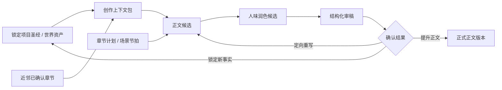

# AI 小说创作开源参考

> 状态：2026-08-04 重整。本文只记录可用于产品决策的架构结论，不记录未经现场核验的星标、热榜日期或“最火”断言。外部仓库接入或复制代码前，必须重新核验仓库、维护状态与许可证。

## 结论

没有一个可直接嵌入 YLCraft、同时成熟覆盖中文网文、长篇连续性、版本审稿和可配置模型的“万能小说 Skill”。成熟开源项目提供的是三类可组合能力：工作流运行时、受控上下文、编辑质量闭环。

YLCraft 已有小说项目、章节版本、Writer Room、审稿、项目设定和 Agent Runtime。因此不应引入另一套小说 IDE、RAG 数据库或多 Agent 框架；应把已有项目事实稳定注入每轮写作，并将审稿结果变为可确认、可回滚的项目事实。

## 2026-08-04 实时核验结果

以下数据来自 GitHub API，检索时间为 2026-08-04；“已阅读”表示已克隆到仓库外临时目录并检查过 README、许可证与核心目录，临时副本不进入 YLCraft 仓库。

| 项目 | Star | 许可证 | 核验 | 结论 |
| --- | ---: | --- | --- | --- |
| [YILING0013/AI_NovelGenerator](https://github.com/YILING0013/AI_NovelGenerator) | 5,793 | AGPL-3.0 | 仓库/API 已核验 | 中文长篇、上下文和伏笔思路可参考；不可复制代码进非 AGPL 项目。 |
| [ExplosiveCoderflome/AI-Novel-Writing-Assistant](https://github.com/ExplosiveCoderflome/AI-Novel-Writing-Assistant) | 2,239 | 未声明 | 仓库/API 已核验 | 有 Agent、世界观、RAG 的完整产品主张；无许可证，不复制代码。 |
| [syrizelink/OpenFic](https://github.com/syrizelink/OpenFic) | 582 | Apache-2.0 | 已阅读 | 最值得研究 Agent Runtime、章节上下文、检查点和工具重放。 |
| [alfredxw/denova](https://github.com/alfredxw/denova) | 558 | Apache-2.0 | 已阅读 | 可研究 Skills、子 Agent 工作流和项目版本管理的边界。 |
| [yuanbw2025/storyforge](https://github.com/yuanbw2025/storyforge) | 455 | MIT | 已阅读 | 可研究小说工作台的数据组织与编辑交互。 |
| [Nigh/show-me-the-story](https://github.com/Nigh/show-me-the-story) | 424 | MIT | 已阅读 | 当前最值得直接映射小说流程的参考实现。 |
| [heider-x/vela](https://github.com/heider-x/vela) | 499 | GPL-3.0 | 仓库/API 已核验 | 本地优先、RAG、BYOK 思路可参考；不可复制代码。 |

“小说写作 AI”搜索结果中没有高可信、宽松许可证、且以 Codex/Claude `SKILL.md` 形式发布的主流 Skill。流行的是完整应用和 Agent Runtime，因此 YLCraft 应将其中稳定流程拆为自己的 Writer Room Skill，而不是安装来源不明的小说 Skill 包。

## 已阅读实现的具体启发

### show-me-the-story（MIT）

它的关键不是模型或提示词，而是把章节变成状态机：`pending -> writing -> review -> accepted`。生成前检查章节大纲与前文是否冲突；生成后更新伏笔和叙事记忆；修订后重新提取受影响章节的记忆。它还支持：

- 伏笔拥有状态、预计回收章节、超期告警和路线图，而非只是一段大纲文本。
- 记忆是带来源的结构化记录：`category`、`chapter`、`position`、`content`，并受 token 上限控制。
- 用户引用某段正文时优先做段落级修订，定位或结构不一致才退化为整章重写。
- 已有确认章节时拒绝全量重生大纲，避免破坏已完成内容。

YLCraft 应直接采用前三条：给现有 `project_bible`/`world_asset` 增加来源和状态约束，审稿结果形成待确认的连续性卡片，并补段落级改写。不要采用它的文件存储模型，YLCraft 已有 PostgreSQL 版本模型。

### OpenFic（Apache-2.0）

OpenFic 将 Agent 运行时独立为 `agent_runtime`：会话运行器、图编排、检查点、任务投影、事件翻译、工具审批预览和 replay buffer 均不混在章节业务里；小说领域通过章节上下文、世界信息、角色和检索工具接入运行时。

YLCraft 已有 Agent Thread/Run/Step 和 Creative Project。应借鉴的边界是：Writer Room 每一步都写入现有运行记录，输入候选、上下文快照、输出候选和确认动作可回放；不应再引入第二套 Agent 会话、检查点表或向量索引。

## 可参考项目与边界

| 项目 | 可借鉴点 | YLCraft 采用方式 | 许可证/边界 |
| --- | --- | --- | --- |
| [Dify](https://github.com/langgenius/dify) | 工作流变量、节点输入输出、运行日志、发布前测试 | 参考工作流契约和可观测性；不引入其运行时 | 复制前核验当前许可证与依赖边界 |
| [Coze Studio](https://github.com/coze-dev/coze-studio) | Agent/Workflow 的工具编排、运行轨迹、输入输出映射 | 统一 Agent、Canvas、Writer Room 的步骤记录格式 | 复制前核验当前许可证与模块边界 |
| [LangGraph](https://github.com/langchain-ai/langgraph) | 有状态图、检查点、可恢复执行、人工中断 | Writer Room 继续采用显式候选版本和步骤依赖，不引入运行时 | MIT；仅在确有图状态编排需求时评估依赖 |
| [Flowise](https://github.com/FlowiseAI/Flowise) | 画布节点配置、变量传递、运行结果检查 | 复用 Canvas 的端口/变量/结果预览设计原则 | 复制前核验当前许可证与前端代码边界 |
| [n8n](https://github.com/n8n-io/n8n) | 执行数据、失败重试、节点级错误可见性 | 借鉴失败隔离、运行回放和人工重跑交互 | 不是宽松开源许可证；不复制代码 |
| [NovelAI](https://novelai.net/) / [Sudowrite](https://www.sudowrite.com/) / [NovelCrafter](https://novelcrafter.com/) | Lorebook/Story Bible、按实体检索、章节续写、编辑反馈 | 仅借鉴产品模型：锁定事实、邻近章节、显式编辑意见 | 商业产品，不能复制实现或内容 |

## 小说工作流的正确模型

原则：

1. `ProjectContent` 候选版本是写作内容的事实来源，任何生成都不得静默覆盖正式 `novel_body`。
2. 锁定的 `project_bible` 和 `world_asset` 才是不可改写事实；未锁定卡片只是候选建议。
3. 上下文由服务端根据当前项目构建，包含锁定事实和有限的近邻章节，不依赖浏览器状态或聊天历史。
4. 审稿输出应包括可确认的连续性候选。用户锁定后，它才进入下一章上下文包。
5. 每个步骤必须记录来源候选、请求元数据、输出和失败原因，支持从任一步重跑，不复用失效上游结果。

## 当前 YLCraft 对照

| 能力 | 当前状态 | 下一步 |
| --- | --- | --- |
| 项目设定 + 邻章上下文注入 | 已实现 | 在 Writer Room UI 显示本轮实际使用的上下文摘要和锁定事实 |
| 候选版本与提升正文 | 已实现 | 对正文列表清楚区分正式版、候选版、来源和时间 |
| 场景节拍 -> 审稿 -> 定向重写 | 已实现 | 将审稿中的连续性事实一键转为待确认卡片 |
| 章节连续性检查 | 已具备基础 | 增加跨章节角色、时间线、地点、物件的结构化冲突清单 |
| 长篇记忆 | 已有项目事实和近邻正文，不需要另建 RAG | 只在项目规模确实超过上下文上限时，再评估检索索引 |
| 多 Agent | 已有 Agent Runtime | 不为“多 Agent”而多 Agent；先将编辑、连续性、资料检索定义为可复用 Skill |

## 下一项实现优先级

1. Writer Room 审稿产出 `continuity_candidates`，前端支持逐条锁定为 `project_bible` / `world_asset`。
2. 为每次正文、润色、重写显示“本轮上下文”：已锁定事实数量、引用章节和摘要指纹，并可查看不含敏感长文本的明细。
3. 为连续性审稿定义统一结构：`entity_type`、`entity_name`、`claim`、`evidence_content_id`、`severity`、`suggested_action`。
4. 再做跨章冲突检查与定向重写；不要在此之前加入向量库或全自动循环 Agent。

## 外部代码采用规则

1. 先用官方仓库确认代码、最近维护和许可证，再下载到仓库外临时目录阅读。
2. Apache-2.0/MIT/BSD 才可评估复制；AGPL/GPL、Sustainable Use License 和商业产品只借鉴理念、交互和公开接口。
3. 复制前记录来源链接、commit、许可证文件和改造范围到 `docs/reference/REF_PROJECTS.md`；复制后保留必要署名和许可证文本。
4. 不把外部工作流框架作为小说事实来源；YLCraft 的 `CreativeProject`、`ProjectContent`、项目设定与生成日志始终是唯一来源。
