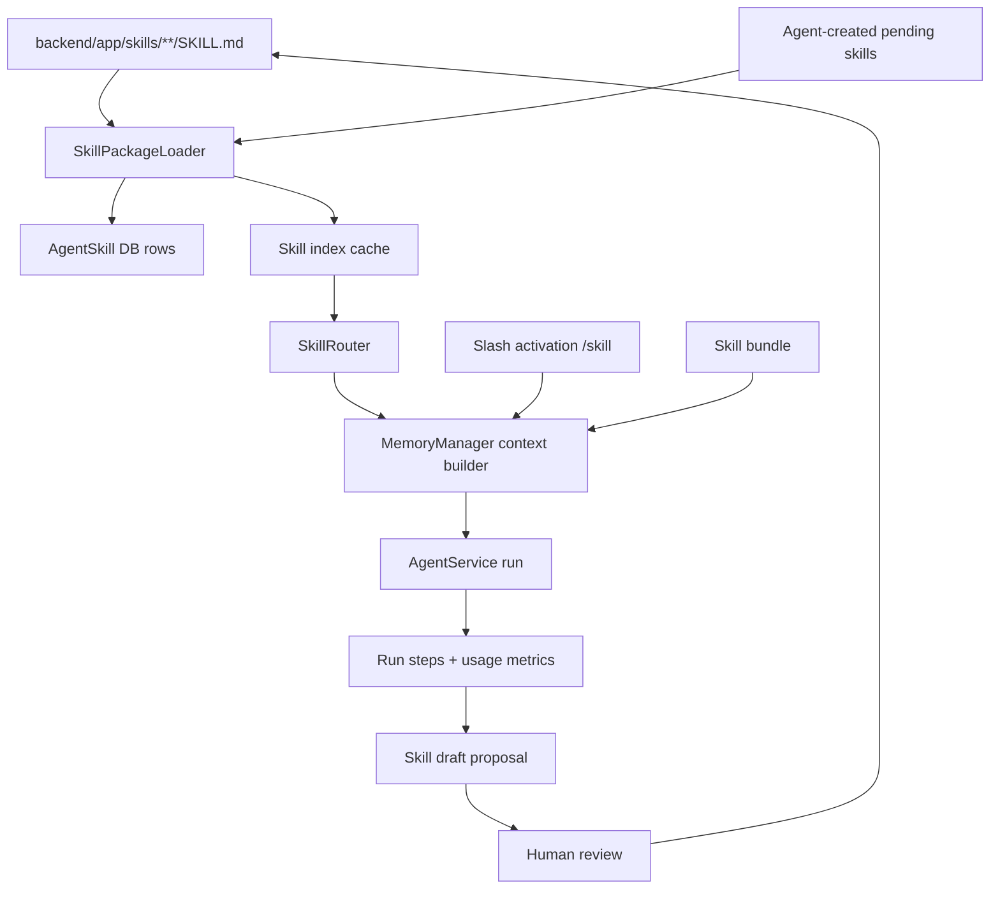

# Design: Agent Skill Package Runtime

## Current YLCraft State

The current implementation already has the right primitives:

- `AgentSkill` stores name, description, type, content, version and counters.
- `MemoryManager.build_memory_context()` injects selected skills into the model context.
- `SkillRouter.route()` recommends skills from message/context/tool signals.
- `AgentProfile.default_skill_ids_json` binds skills to specialized profiles.

The gap is that these primitives are not yet a real package/runtime system. Built-ins and routing are embedded in Python constants, which makes them hard to inspect, version, share, activate explicitly, or improve from agent experience.

## Target Architecture



## Skill Package Format

Each skill package is a directory with a required `SKILL.md`.

```text
backend/app/skills/
  creative/
    character-visual-card/
      SKILL.md
      references/
      templates/
```

`SKILL.md` uses YAML frontmatter plus Markdown body:

```markdown
---
name: character_visual_card
title: 角色视觉卡
description: 把角色设定补成可复用的视觉卡，服务立绘、漫画分镜和参考图一致性。
version: 1.0.0
skill_type: workflow
category: creative
tags: [character, portrait, asset-hub]
triggers:
  keywords: [角色, 人物, 立绘, 外貌, 视觉卡, 人设]
  context_keys: [character_id]
  tools:
    - inspect_character
    - update_character_visual_profile
    - preview_character_portrait_prompt
requires_tools:
  - inspect_character
risk: read
---

# 角色视觉卡

## When To Use

...

## Procedure

...

## Verification

...
```

## Data Model Strategy

First implementation can avoid a hard migration by storing package metadata inside `AgentSkill.content` or an optional JSON block during sync. For a cleaner second step, add fields:

- `source`: `builtin_file | user_file | db | imported | pending`
- `source_path`: relative path to `SKILL.md`
- `slug`: slash command identifier
- `enabled`: boolean
- `metadata_json`: frontmatter, triggers, tags, requirements, risk, checksum
- `last_synced_at`: timestamp

This can be a follow-up migration once the loader and route behavior are tested.

## Loader

`SkillPackageLoader` responsibilities:

- scan configured roots: built-in `backend/app/skills`, optional user skill root, optional external roots;
- parse frontmatter safely;
- validate required fields: name, description, skill_type;
- calculate checksum of `SKILL.md` and selected references;
- sync built-ins into `AgentSkill` without resetting `usage_count` or `success_count`;
- preserve user-disabled state and user overrides;
- return a lightweight skill index for prompt and UI.

## Progressive Loading

The prompt should not include every full skill by default.

- Level 0: skill index: `name`, `description`, `category`, `tags`, `enabled`, `risk`.
- Level 1: selected skill full `SKILL.md` body.
- Level 2: selected reference/template file from the skill directory.

`MemoryManager.build_memory_context()` should include full content only for:

- profile default skills;
- explicit slash-activated skills;
- skills routed above threshold;
- bundles expanded from slash activation or UI selection.

## Routing

Replace hardcoded domain tuples with metadata:

- keyword match from `triggers.keywords`;
- context key match from `triggers.context_keys`;
- tool availability match from `triggers.tools`;
- profile default boost;
- slash activation hard boost;
- recent successful skill usage optional boost.

Keep the existing hardcoded rules as fallback until all built-ins are migrated.

## Slash Activation

Support leading commands:

- `/character_visual_card 帮我补这个角色的人设`
- `/portrait_prompt /asset_search 给角色找参考并生成立绘提示词`

Parsing rules:

- only parse leading slash tokens;
- stop when token is not a known skill or bundle;
- cap activated skills, e.g. 5;
- disabled skills are rejected with a clear message;
- existing app commands should keep priority if a command namespace already exists.

## Skill Bundles

Bundles are YAML files that group recurring skill combinations:

```yaml
name: character-portrait-workflow
description: 角色设定、视觉卡、立绘提示词和参考图闭环
skills:
  - character_visual_card
  - portrait_prompt
  - reference_match
instruction: |
  优先读取角色现有设定和素材库参考，不要重设已确认外貌。
```

Bundles solve YLCraft recurring workflows better than asking users to remember multiple skills.

## Agent-Managed Skill Drafts

After a successful complex run, create a candidate skill draft when:

- tool calls exceed a threshold, e.g. 5;
- the run had recoverable failures and found a working path;
- the user corrected the workflow;
- the same tool chain succeeds repeatedly.

Drafts are not auto-enabled. They enter a pending review flow:

- create draft;
- show generated `SKILL.md` and unified diff if patching existing skill;
- approve/reject in UI;
- approved draft writes to user skill root and syncs DB;
- rejected draft remains in run history for audit.

## Security

- Skills are instructions by default, not executable plugins.
- Scripts under skill packages are inert unless a future tool explicitly whitelists them.
- Skill writes require human approval initially.
- External directories are read-only unless explicitly configured writable.
- Skill metadata must not contain secrets; required secret/config prompts belong in a later settings layer.

## Implementation Order

1. Loader + file-backed built-in sync.
2. Migrate current built-in templates to `SKILL.md`.
3. Metadata-driven router with hardcoded fallback.
4. Slash activation and bundles.
5. Skill management API/UI.
6. Pending skill draft flow.

## Borrowing Policy

The referenced projects are MIT licensed, so small parsing/routing/approval patterns can be ported if they fit. YLCraft should not copy large subsystems because:

- our runtime already has project-specific tools and persistent run steps;
- our UI and API are FastAPI/React/AntD oriented;
- our domain skills must deeply understand characters, creative projects, asset hub, image/video tasks and local readers.

The valuable part to copy is the shape of the abstractions, not the whole harness.
