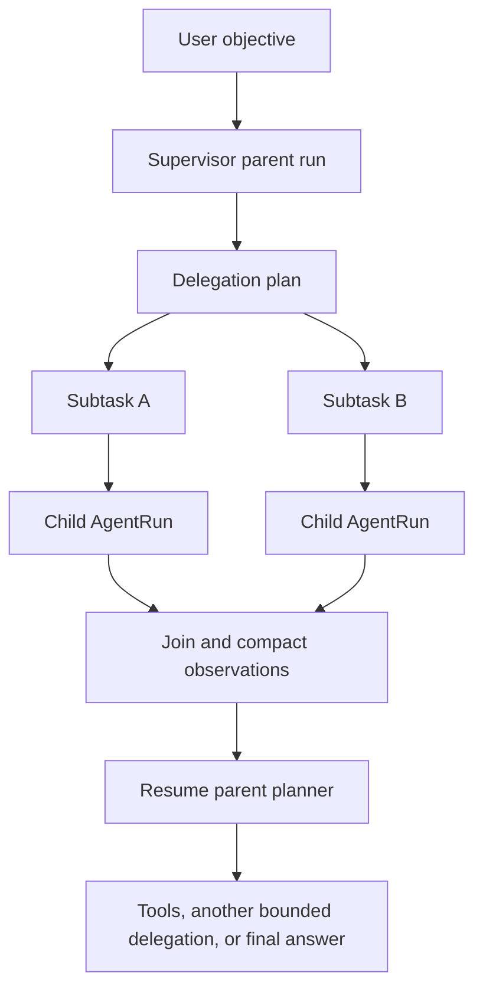

# Design: Agent Supervisor And Subagent Runtime
## 1. Design Principles

1. **Workflow is not Agent Team.** Fixed, auditable service stages remain workflows. Subagents are reserved for decomposition, independent research, role perspective, critique and synthesis.
2. **One orchestration primitive.** Manual delegation, autonomous delegation and scene teams use the same persistence, executor, limits and trace model.
3. **Independent child transactions.** Concurrent children never share an `AsyncSession` or mutable `AgentService` instance.
4. **Bounded autonomy.** Depth, fan-out, concurrency, iteration, timeout and root budget are enforced by code rather than prompts.
5. **Parent must observe.** Joined child results return to the parent planner as an observation; recording a child run alone is not completion.
6. **Candidates remain candidates.** Team output cannot promote prose, accept continuity facts, mutate locked canon or publish externally.

## 2. Runtime Model



### 2.1 New Runtime Components

| Component | Responsibility |
| --- | --- |
| `SubagentOrchestrator` | Validate plans, persist subtasks, schedule dependency batches, join results and resume parent |
| `SubagentExecutor` | Create an independent DB session and `AgentService` per child |
| `DelegationPolicy` | Enforce supervisor permission, depth, fan-out, concurrency, timeout and budget |
| `DelegationContextBuilder` | Copy a bounded parent snapshot and add role/task-specific context without copying the whole chat thread |
| `SubagentResultAdapter` | Normalize answer, artifacts, linked objects, status, errors and compact observation text |

The existing `RunLoop`, `Planner`, `ToolExecutor`, `ThreadManager` and Skill router remain the child execution engine.

## 3. Persistence

Add `AgentDelegation` as the durable scheduling record rather than encoding the task graph only inside `AgentRunStep.output_json`.

Suggested fields:

| Field | Purpose |
| --- | --- |
| `id` | Delegation/subtask ID |
| `root_run_id` | Root orchestration run |
| `parent_run_id` | Supervisor run that created the task |
| `child_run_id` | Child run after execution starts |
| `parent_step_id` | Parent `delegate_subtask` step |
| `target_profile_id` | Assigned specialist profile |
| `objective` | Bounded child objective |
| `context_json` | Explicit child context slice |
| `depends_on_json` | Delegation IDs that must finish first |
| `execution_mode` | `sequential` or `parallel` |
| `status` | `pending`, `running`, `waiting_confirmation`, `completed`, `failed`, `cancelled`, `skipped` |
| `result_json` | Normalized result and linked objects |
| `error` | Structured failure message |
| timestamps | Queue, start and finish times |

Extend `AgentRun` with `root_run_id`, `run_kind` (`primary`, `delegated`, `team_stage`) and `delegation_depth`. Keep `parent_run_id` for direct traversal. Add an Alembic migration and indexes for root, parent, child and status queries.

## 4. Delegation Contract

The internal tool is named `delegate_agent_tasks` and is exposed only when the active profile has supervisor capability.

Input shape:

```json
{
  "tasks": [
    {
      "task_id": "character-a",
      "profile_id": "role-actor",
      "objective": "以角色甲的已知信息推演本场反应",
      "context": {"character_id": "..."},
      "depends_on": []
    }
  ],
  "join_strategy": "all",
  "reason": "需要独立角色视角"
}
```

Output shape:

```json
{
  "status": "completed",
  "delegations": [],
  "joined_observation": "...",
  "linked_runs": [],
  "linked_objects": []
}
```

Supported join strategies in the first implementation are `all` and `best_effort`. Dependency batches are topologically validated; cycles are rejected before any child starts.

## 5. Safety And Budgets

Defaults:

- Maximum delegation depth: 2.
- Maximum children per delegation call: 6.
- Maximum concurrent children: 3.
- Child timeout: configurable, with a conservative default.
- Root budget: maximum children, total Agent iterations and optional estimated model cost.
- Child profile tool allowlist remains authoritative.
- A child cannot call `delegate_agent_tasks` unless its profile explicitly has supervisor capability and depth remains.

Write, delete and costly tools keep existing confirmation behavior. If a child reaches confirmation, its delegation becomes `waiting_confirmation`; the parent run pauses with a linked pending action instead of pretending the team completed.

## 6. Context And Memory

- Child agents use internal threads that are linked to the parent but excluded from the user's normal thread message list.
- The child receives the frozen parent context snapshot, explicit subtask context, selected project/chapter context and its profile/skills.
- The child does not receive unrelated sibling messages.
- Joined observations contain bounded summaries plus stable links to full child runs and artifacts.
- Child memory candidates retain root/parent/child provenance. They are not silently promoted to user memory.

## 7. Parent Continuation

After the join, the orchestrator appends a structured observation to the parent run and re-enters the parent `RunLoop`. The parent can:

1. synthesize a final answer;
2. call normal project tools;
3. request one more bounded delegation;
4. stop and explain a partial failure.

Manual UI delegation uses the same path. The UI may choose `resume_parent=true`; this becomes the default once compatibility tests pass.

## 8. Creative Project Integration

### 8.1 Writer Room

Writer Room remains a deterministic candidate pipeline. Add `rehearsal_mode`:

- `fast`: current one-call `character_rehearsal` behavior.
- `team`: director briefing, one parallel `role-actor` child per selected character, editor join, then persist the result as the standard `character_rehearsal` content type.

The persisted candidate records `root_run_id`, child run IDs, selected characters, execution mode and context snapshot ID. `prose_draft` consumes the same normalized rehearsal schema in either mode.

### 8.2 Scene Simulation

Replace the private execution logic in `MultiAgentCoordinator` with a declarative team template over `SubagentOrchestrator`. Keep the existing HTTP endpoint as a compatibility facade until Story uses the generic API, then remove duplicate execution code.

### 8.3 Deterministic Pipelines

The following stay as normal workflows/tools:

- project creation and metadata writes;
- outline/chapter/script/storyboard production order;
- asset import and lineage writes;
- image/video task submission and polling;
- prose promotion, continuity acceptance and publishing.

Agents may decide to call these tools, but each service stage is not itself mislabeled as a subagent.

## 9. UI

### Agent Center

- Render child runs inline under the parent delegation step.
- Show profile, objective, status, elapsed time and artifact count in the collapsed row.
- Expand to show child trace and joined summary.
- Show parallel siblings on the same visual level.
- Keep raw payloads in an inspector, not the main conversation.
- Replace the always-visible manual delegation form with an action in the run toolbar; autonomous delegation appears naturally in the trace.

### Story

- Rename the current Writer Room badge to `分阶段写作流水线` while running in fast mode.
- Add a compact `快速演绎 / 角色团队推演` segmented control at the character-rehearsal step.
- Team mode shows selected characters, running children and editor join state.
- Completed team details collapse into one rehearsal result; the prose candidate remains the primary content.

## 10. Migration And Compatibility

1. Add persistence and generic executor without changing current endpoints.
2. Route manual delegation through the new orchestrator.
3. Add autonomous delegation tool for supervisor profiles.
4. Migrate scene simulation to the generic team template.
5. Add Writer Room team mode.
6. Correct labels and remove obsolete coordinator execution code after compatibility coverage passes.

Existing `parent_run_id`, run timelines and candidate content remain readable. Existing fast Writer Room requests default to `rehearsal_mode=fast`.

## 11. Validation Strategy

- Unit tests for policy limits, DAG validation, context slicing and result normalization.
- Async tests proving concurrent children use distinct sessions.
- Runtime tests for parent resume after successful, partial and failed joins.
- Confirmation tests for child write/costly tools.
- API tests for run tree and Writer Room team mode.
- UI typecheck/build plus external-browser smoke; never use the in-app browser for this repository.
