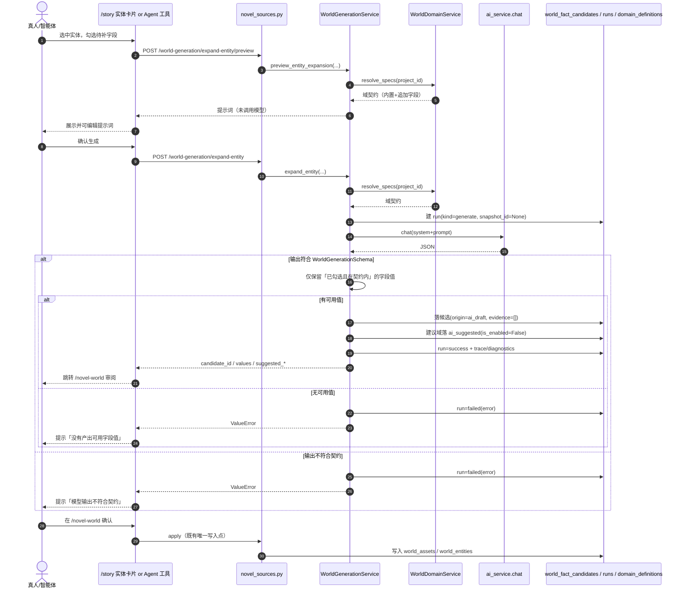

# 系统设计 — AI 渐进世界构建（AI Progressive World Building）

> design-mode：`direct`（项目无 `project-profile.yaml`，按 `ai-design-change` 规则由缺失值降级为 direct，已在输出中说明）。
> 代码现实来源：本次变更全部通过**源码直读**验证（GitNexus / API Registry MCP 在本环境不可用），下文引用的类、方法、端点、迁移均可在本仓库直接定位。

## Context

### 背景

创作项目的世界构建目前**只有一条链路**：`novel-source-world-project` 建立的「来源 → 逐域提取 → 证据校验 → 候选 → 确认写入」。它回答的是「这本书里有什么」，但回答不了最常见的创作起点——**作者只有一个想法、还没有原文**。

该链路已被复用为「点子 → 世界」的骨架生成：`/story` 圣经页的「生成世界设定候选」把项目大纲经 `serialize_outline_as_source_text()` 序列化为来源文本，再走同一条逐域提取管线。这在工程上可行，但带来两个未解决的问题：

1. **来源性质被抹平**：大纲是 AI 生成的，却与真实原文一样产出 `origin=original` 的候选，所谓「逐字证据」指向的是 AI 写的大纲 —— 用户会误以为设定出自某部真实作品。
2. **缺少逐层补充能力**：骨架生成后，无法对单个实体按域属性契约补充字段；想加结构（字段/域）也没有通道。

### 当前状态（2026-09-02，均已落库并验证）

| 状态 | 位置 |
|---|---|
| 15 个内置域（新增 religion / language / culture / ecology） | `contracts.py :: DOMAIN_SPECS` |
| 项目级域与属性可扩展（`source=builtin_override/custom/ai_suggested`） | `world_domain_definitions` 表（迁移 `038`）+ `WorldDomainService` |
| 生成运行可无快照、候选来源语义完备 | `world_extraction_runs.kind`、`candidate.origin`（迁移 `039`/`040`） |
| 世界构建模板（层次策略 + 三档提示词） | `world_building_templates` 表（迁移 `039`） |
| `expand_entity` 全链路（服务 + HTTP + Agent 工具 + 页面入口） | `WorldGenerationService`、`/world-generation/expand-entity`、`expand_world_entity_attributes`、`/story` 实体卡片 |
| 大纲来源不再伪装成原著 | `CandidateOrigin.OUTLINE` + 前端「来自大纲」标签 |

### 约束与来源

| 约束 | 来源 |
|---|---|
| 平台持有结构、AI 只能填值、结构变更须过闸 | proposal「梯子原则」I1/I2/I3 |
| 生成内容**不得伪造证据** | requirements R6；`CandidateOrigin` docstring |
| 真人与智能体双入口、共用同一服务层 | 用户明确要求；tasks.md 顶部约束 |
| 写入必须经 `apply` 唯一通道 | 既有 `novel-source-world-project` 设计；proposal Non-goals |
| 内置域字段只可追加不可删除 | `WorldDomainService.resolve_specs`（保证旧 `attributes_json` 可解析） |
| 不重做「点子 → 世界」链路 | 用户明确要求（既有 `start_project_world_extraction` 已承担）；任务 5 已关闭 |

## Goals / Non-Goals

**Goals**

- G1：在不新建第二套管线的前提下，为既有世界管线补上**逐层生成与补充**能力（`expand_entity` 已落地，`expand_domain` 待做）
- G2：让 AI 能扩充结构（字段/域），但**必须过闸**——提议与内容在响应契约里就分离，确认后才成为 schema
- G3：区分来源性质（真实原文 / 项目大纲 / AI 创作 / 模型推断），UI 可辨、不误导
- G4：真人与智能体双入口，共用同一服务层与同一「先预览后确认」纪律
- G5：无论结构如何演进，世界数据始终可列出、检索、导出、对比

**Non-Goals**

- 不做独立的 `draft_world`（既有 `start_project_world_extraction` 已承担骨架生成，任务 5 已关闭）
- 不自动生成可写正文；本 change 只做世界设定的结构化生成
- 不让 AI 自主修改已确认正典（一律先候选后确认）
- 不为生成内容编造证据锚点
- 不引入新的存储系统（仍用 `world_entities` + `attributes_json` + `world_domain_definitions`）

## Decisions

### D1：不新建生成管线，复用既有提取管线的**审阅/写入**半段，只新增「生成」半段

- **决策**：生成链路复用 `WorldExtractionRun`（新增 `kind` 字段区分）与 `WorldFactCandidate`，只新增 `WorldGenerationService` 负责「组装提示词 → 调模型 → 产出候选」，不新建运行表、不新建候选表、不新建审阅页。
- **理由（代码调研）**：`WorldExtractionRun` 已具备 `domains_json` / `checkpoint_json` / `trace_json` / `diagnostics_json` / `status` 与局部失败语义（`ExtractionRunStatus.PARTIAL`），`WorldFactCandidate` 已具备 `payload_json` / `evidence_json` / `origin` / `status` / `last_run_id` 与审阅流。新建一套等于复制这些机制并制造双份游标语义。
- **替代方案**：新建 `WorldGenerationRun` + `WorldGenerationCandidate` 两张表。
- **拒绝原因**：会产生第二套运行/游标/诊断语义，`apply` 与审阅 UI 都要做双分支；且既有 `reconcile_run` / `detect_contradictions` 等复核能力无法直接复用。
- **代价**：`snapshot_id` 必须可空（迁移 `040`；`downgrade` 已加保护：存在无快照记录时拒绝收紧）。

### D2：来源性质用 `CandidateOrigin` 的**独立枚举值**表达，而不是给证据加标记

- **决策**：新增 `OUTLINE`（证据指向项目大纲）与 `AI_DRAFT`（无原文、禁止伪造证据），与既有 `ORIGINAL` / `AI_INFERRED` 并列；`extract(candidate_origin=...)` 透传到 `_persist_candidates`，推断内容仍优先判 `ai_inferred`。
- **理由**：来源性质是**候选级**属性，放在 `origin` 上可让审阅列表、导出、上下文打包天然带上；放在证据上会导致「同一条候选混有多种来源」时无法表达。
- **替代方案 A**：把大纲候选降级为 `ai_draft`。
- **拒绝原因**：大纲是用户确认过的蓝图，不是模型自由创作；标成 `ai_draft` 会低估其可信度，也让「依据来自你的大纲」这句说明无从表达。
- **替代方案 B**：保持 `original` 不变，只在 UI 上区分来源快照类型。
- **拒绝原因**：UI 层判断容易被遗漏（导出、上下文打包、Agent 返回都会失真），且数据层永久丢失了真实语义。

### D3：结构变更在**响应契约层**就与内容分离（`items` vs `suggested_*`）

- **决策**：`WorldGenerationSchema` 同时声明 `items`（内容）与 `suggested_fields` / `suggested_domains`（结构建议）；服务层只接受「已勾选且在属性契约内」的字段值，其余一律转为建议；建议落 `world_domain_definitions` 且 `source=ai_suggested`、`is_enabled=False`。
- **理由**：把「AI 能改什么」的边界前移到 schema，模型无法用"多返回一个字段"的方式偷偷改结构；默认不启用使建议天然无害。
- **替代方案**：让模型自由输出字段，服务层事后过滤未知字段并「顺手」把它们登记为自定义字段。
- **拒绝原因**：等于把 schema 主权交给模型（违反 I1/I2），且用户无感知地接受了结构变更。

### D4：模板（层次策略 + 提示词）存新表，不存项目设置 JSON

- **决策**：新建 `world_building_templates`（`project_id` 为空即内置种子模板，另有 `is_default` / `is_builtin`）。
- **理由**：需要按项目查询、需要内置模板种子、需要版本与启用状态；项目设置 JSON 无法承载多模板与内置/项目之分。
- **替代方案**：塞进 `creative_projects` 的一个 JSON 字段。
- **拒绝原因**：需改动既有表结构，且多模板、启用状态、内置种子三者难以用单字段表达。

### D5：`expand_entity` 只产出候选，不直接改写已确认正典

- **决策**：补充结果写入 `WorldFactCandidate`（`origin=ai_draft`），由用户在 `/novel-world` 审阅后经 `apply` 写入，与既有写入纪律一致。
- **理由**：正典写入点唯一是既有架构红线；直接改写会让 `is_locked` 事实卡被静默修改。
- **替代方案**：确认后直接 UPDATE `world_entities.attributes_json`。
- **拒绝原因**：绕过 `apply` 会破坏事实卡与实体的一致性，也丢失审阅历史。

## 后端归属决策

| 项 | 结论 |
|---|---|
| 涉及数据域 | 世界设定（域定义、候选、实体、运行、模板） |
| 目标表 | `world_domain_definitions`、`world_building_templates`、`world_fact_candidates`、`world_extraction_runs`、`world_entities` |
| 实施位置 | `backend/app/services/novel_source/`（与既有世界服务同域）+ `backend/app/api/v1/novel_sources.py` |
| 判断依据 | 这些表由 `novel_source` 域的服务层拥有并写入；`WorldExtractionService`/`WorldDomainService` 已在同一目录，新增 `WorldGenerationService` 不跨数据域 |
| 跨中心调用 | 无。本仓库为单体后端，不存在跨中心 CSF 调用；Agent 工具通过本地服务层调用，不走外部接口 |

## 同步 / 异步处理决策

- **处理模式**：**同步**（HTTP 请求内完成一次生成动作）。
- **判断依据**：`expand_entity` 为单实体、单次模型调用，`max_tokens=2000`，耗时在既有 `extract` 同量级；既有提取链路也是同步模型（`await ai_service.chat`）。
- **用户体验影响**：页面弹窗与 Agent 工具都会等待数秒；已提供 `preview`（不调模型）降低试错成本，后续 `draft_world`（多域、条目更多）需重新评估。
- **失败与补偿**：模型失败 → 运行落 `status=failed` + `diagnostics_json.error`，抛 `ValueError` 由 API 转 400；不产生脏候选。重试由用户重新发起（无需补偿，无外部副作用）。
- **待确认**：`expand_domain` / 未来的 `draft_world` 是否改异步（见待确认项 OQ-A）。

## 详细设计 — 后端服务层

### `WorldGenerationService`（`app/services/novel_source/world_generation.py`）

| 方法 | 职责 | 关键步骤 |
|---|---|---|
| `build_entity_prompt(entity, spec, fields, *, template, prompt_override)` | 组装提示词 | 1 读 `entity.attributes_json` 作为「已知信息」 → 2 依次取 `prompt_override` → 模板 `prompts_json.expand_entity` → `DEFAULT_EXPAND_ENTITY_PROMPT` → 3 替换 `{entity}/{domain}/{fields}/{known}/{layers}` 占位 |
| `preview_entity_expansion(...)` | 只返回提示词 | 1 `_prepare` 校验 → 2 组装 → 3 **不调用模型** |
| `expand_entity(...)` | 生成并落候选 | 1 `_prepare`（实体归属 + 域启用 + 字段属契约） → 2 建 `WorldExtractionRun(kind=generate, snapshot_id=None)` → 3 `_generate` 调模型并按 `WorldGenerationSchema` 校验 → 4 只收「已勾选且在契约内」的非空值 → 5 落 `WorldFactCandidate(origin=ai_draft, evidence_json="[]")` → 6 `_persist_suggested_domains` 存建议 → 7 运行置 `success` 并写 `trace_json`/`diagnostics_json` |
| `_prepare(...)` | 前置校验 | 实体存在且属项目 → 域在 `resolve_specs` 中启用 → 过滤出契约内字段，空则抛错并列出合法字段 |
| `_persist_suggested_domains(...)` | 结构过闸 | 仅当 key 不在内置与已启用域中、且同项目无同名定义时写入；`is_enabled=False`、`source=ai_suggested` |
| `_generate(...)` | 模型调用 | `ai_service.chat` → 成功校验 → `_extract_json_object` → `WorldGenerationSchema.model_validate`；失败抛 `ValueError` |

**幂等与去重**：候选 `fingerprint = gen:{project_id}:{entity.id}`，重复补充同一实体不会产生第二条候选（后续可追加证据式合并）。

### `WorldDomainService`（已存在，被复用）

`resolve_specs(project_id)` 是**唯一**的域契约来源：内置域（可被覆盖 label / 追加字段 / 禁用）+ 自定义域（`ai_suggested` 默认排除）。生成与提取共用它，保证「看到什么模块」与「按什么 schema 产出」一致。

## 详细设计 — API 路由（`app/api/v1/novel_sources.py`）

| Method | Path | 说明 | 状态 |
|---|---|---|---|
| GET | `/api/v1/projects/{project_id}/world-domains` | 列出项目域及其属性契约 | 已落地 |
| PUT | `/api/v1/projects/{project_id}/world-domains/{domain_key}` | 覆盖内置域 / 新增自定义域 | 已落地 |
| DELETE | `/api/v1/projects/{project_id}/world-domains/{domain_key}` | 重置为内置默认 / 移除自定义域 | 已落地 |
| POST | `/api/v1/projects/{project_id}/world-generation/expand-entity/preview` | 预览提示词（不调模型） | 已落地 |
| POST | `/api/v1/projects/{project_id}/world-generation/expand-entity` | AI 补充实体属性（产出 `ai_draft` 候选） | 已落地 |
| POST | `/api/v1/projects/{project_id}/world-generation/expand-domain` | 域级细化 | **待实现** |

## 详细设计 — 前端

技术栈锁定（取自 `frontend/package.json` 实际版本）：React 18 生态 + **antd 5.29.3**（含 patch-package 补丁）+ react-leaflet 4.2.1 / leaflet 1.9.4（地图工作台）。

| 位置 | 改动 | 状态 |
|---|---|---|
| `src/api/novelSource.ts` | 新增 `WorldDomainSpec` / `EntityExpansionPreview` / `EntityExpansionResult` 类型与 `listProjectWorldDomains` / `previewEntityExpansion` / `expandEntityAttributes` | 已落地 |
| `src/pages/story/index.tsx`（圣经/世界 → 世界设定（按域）） | 实体卡片加「AI 补充」→ 弹窗：字段按域契约勾选（标已填/缺失）+ 提示词可编辑 + 预览 + 生成后跳 `/novel-world?run_id=` | 已落地 |
| `src/pages/novel-world/index.tsx` | `ORIGIN_LABEL` 增加 `outline: '来自大纲'`（Tooltip 说明「证据逐字命中你的项目大纲，可回溯但不是真实作品原文」）与 `ai_draft: 'AI 创作'` | 已落地 |
| 结构建议确认 UI | 展示 `ai_suggested` 的字段/域并支持确认（转 `custom` + 启用） | **待实现** |

**关键逻辑（已落地片段）**：字段候选 = `域契约字段 ∪ 实体已有字段`；勾选后预览/生成；生成成功后跳转既有审阅页，不新增审阅流程。

## 前后端接口契约

| 调用方 | 接口 | 入参 | 出参 | 异常表现 |
|---|---|---|---|---|
| 页面（`/story` 弹窗 · 预览） | `POST /world-generation/expand-entity/preview` | `entity_id`, `fields[]`, `template_id?`, `prompt_override?` | `entity_id`, `entity`, `domain`, `fields[]`, `prompt` | 实体不存在/字段越界 → 400，弹窗内 `message.error` |
| 页面（`/story` 弹窗 · 生成） | `POST /world-generation/expand-entity` | 同上 + `provider?`, `model?` | `run_id`, `candidate_id`, `values{}`, `origin=ai_draft`, `suggested_fields[]`, `suggested_domains[]` | 模型失败/无可用值 → 400；成功跳 `/novel-world?run_id=` |
| 页面（域契约） | `GET /projects/{id}/world-domains` | — | `domains[]`（`key`,`label`,`attributes[]`,`builtin_attributes[]`,`is_builtin`,`is_enabled`,`source`） | 失败静默降级为「用已填字段」 |
| Agent 工具 | `expand_world_entity_attributes` | `project_id`, `entity_id`, `fields[]`, `template_id?`, `prompt_override?`, `provider?`, `model?` | `{success, expansion}` | 参数错误 → `{success:false, error}` |
| Agent 工具 | `expand_world_domain`（待实现） | `project_id`, `domain`, `template_id?` | 域级候选 | 同上 |

## 数据流图

## 异常处理与兜底策略

| 场景 | 后端处理 | 前端表现 | 兜底 |
|---|---|---|---|
| 实体不存在 / 不属于该项目 | `_prepare` 抛 `ValueError` → 400 | `message.error` | 不建运行、不调模型 |
| 域未启用或不存在 | 同上，提示模块未启用 | 同上 | 引导先启用模块 |
| 字段不在属性契约内 | 抛错并列出该域合法字段 | 同上 | 契约外内容转 `suggested_fields` |
| 模型调用失败 | 运行置 `failed` + `diagnostics_json.error` | 提示模型错误 | 可原样重试 |
| 模型输出非 JSON / 不符契约 | 运行置 `failed` | 提示「输出不符合契约」 | 缩小字段数量重试 |
| 模型未产出可用值 | 运行置 `failed` | 提示无可用值 | 换字段或换模型 |
| 建议域与内置域重名 / 已存在 | 跳过不写 | 无感 | 不覆盖既有定义 |
| 域契约接口不可用（前端） | — | 静默降级 | 用实体已有字段作为候选字段 |
| 生成内容被误认为原文 | `origin=ai_draft` + `evidence=[]` | 审阅页 Tag 标注 | 导出与上下文打包均带来源 |

## Risks / Trade-offs

- **R1 成本不可控**：`expand_entity` 同步单次调用；未来的域级/骨架生成会按域与条目数放大成本 → **Mitigation**：默认域范围限定为基础层 + 模板指定域（D-2 决策），提供 `preview` 免配额预览；后续动作引入成本预估（复用既有 `plan_domains` 的 `estimated_cost` 机制）。
- **R2 结构膨胀**：AI 与用户不断加域/字段可能失控 → **Mitigation**：定义表记录 `source` 与启用状态，UI 展示来源并提供禁用/重置；内置字段不可删除保证不失控膨胀到底层数据。
- **R3 生成内容质量参差、自相矛盾** → **Mitigation**：复用既有 `reconcile_run` 与 `detect_contradictions` 作为生成后的复核步骤，不新增机制；生成内容一律候选化，需人工确认。
- **R4 两类来源混淆的历史数据**：新语义上线前已产生的大纲来源候选仍为 `original` → **Mitigation**：本期不做数据订正（避免误伤），在待确认项 OQ-B 中记录；新数据一律正确标记。
- **R5 同步等待影响体验**（多域场景放大） → **Mitigation**：本期仅单实体同步；`expand_domain` 前重新评估异步化（OQ-A）。

## 可复用接口清单

**后端（已验证存在）**

| 方法/对象 | 归属 | 用途 | 调用阶段 |
|---|---|---|---|
| `WorldDomainService.resolve_specs(project_id)` | `world_domains.py` | 解析启用中的域与属性契约 | 生成前校验、提示词组装 |
| `WorldDomainService.upsert_definition / reset_definition` | 同上 | 写自定义域、重置内置默认 | 结构建议落库 / 确认后启用 |
| `WorldExtractionRun` | `models/novel_source.py` | 复用运行记录（`kind` 区分提取/生成） | 生成运行 |
| `WorldFactCandidate` | 同上 | 复用候选表（`origin` 区分来源） | 生成结果落候选 |
| `ai_service.chat` + `LLMMessage` | `services/ai` | 模型调用（与提取链路同入口） | 生成 |
| `start_project_world_extraction` 既有链路 | `api/v1/novel_sources.py` | 大纲 → 世界骨架（**不重做**） | 骨架生成 |
| `apply_run`（`POST /world-extraction-runs/{id}/apply`） | `extraction.py` | 唯一写入点 | 确认后写正典 |
| `reconcile_run` / `detect_contradictions` | 同上 | 生成后复核矛盾 | 复核阶段 |
| `build_map_export` / `resolve_nodes_with_entities` | `world_map.py` | 地图导出与实体引用解析 | 地图侧（既有能力） |

**前端（已验证存在）**

| 函数 | 位置 | 用途 |
|---|---|---|
| `startProjectWorldExtraction` | `src/api/novelSource.ts` | 复用既有骨架生成入口 |
| `listProjectWorldDomains` / `previewEntityExpansion` / `expandEntityAttributes` | 同上 | 本次新增的三个调用 |
| `WorkbenchSection` / `ORIGIN_LABEL` | `src/pages/story/index.tsx`、`novel-world/index.tsx` | 复用既有页面容器与来源标签体系 |

## 已澄清项

| 问题 | 结论 | 来源 |
|---|---|---|
| 是否新建「想法 → 世界」管线 | 否，复用既有 `start_project_world_extraction`；任务 5 关闭 | 用户明确要求 |
| 大纲来源的候选如何标记 | 新增 `outline` 枚举（不是 `original`、也不是 `ai_draft`） | 用户在三方案中选定方案 2 |
| 模板存哪 | 新表 `world_building_templates` | 用户采纳倾向（D-1） |
| `draft_world` 默认域范围 | 基础层 + 模板指定域 | 用户采纳倾向（D-2） |
| 生成运行是否新建表 | 复用 `WorldExtractionRun` 加 `kind` | 用户采纳倾向（D-3） |
| `expand_entity` 能否直接改正典 | 否，一律先候选再确认 | 用户采纳倾向（D-4） |
| 使用者有谁 | 真人（页面）+ 智能体（Skill/API），双入口、同服务层 | 用户明确要求 |

## 待确认项

| 问题 | 影响 | 建议确认人 |
|---|---|---|
| **OQ-A**：`expand_domain` / 未来的多域生成是否改异步（长任务 + 进度 + 可恢复） | 决定是否需要任务表与轮询/通知机制 | 产品 + 前端 |
| **OQ-B**：新语义上线前的大纲来源候选（`origin=original`）是否做一次性数据订正 | 历史数据的来源显示是否准确 | 产品 |
| **OQ-C**：结构建议（字段级）确认后写入 `extra_attributes` 的接口形态 —— 复用 `PUT /world-domains/{key}` 还是新增专用确认端点 | 决定确认流程是否要新端点 | 后端 |
| **OQ-D**：模板编辑 UI 放在项目设置还是世界工作台内 | 决定前端入口位置 | 前端 + 产品 |
