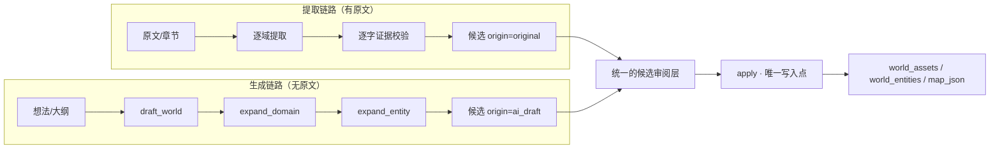

# Design: AI Progressive World Building

> 设计服从 proposal 的**梯子原则**：平台持有梯子（I1）、AI 只能踩梯子上加（I2）、平台永远能解析（I3）。

## 1. 梯子三层模型

世界数据的结构分三层，三层的**主权与可变性**各不相同，这是整个设计的地基：

```text
┌ 第 1 层：域（domain）        ← 平台内置 + 项目自定义/AI 建议      主权：平台，扩充需过闸
│   例：location / faction / religion / cyberware（自定义）
│
├ 第 2 层：属性 schema（attributes） ← 内置字段 + 项目追加字段     主权：平台，只增不减
│   例：location: [aliases, kind, region, significance] + [气候带]（追加）
│
└ 第 3 层：值（value）         ← 原文提取 或 AI 生成               主权：用户，AI 可自由填
    例：{name: "徐家老宅", kind: "民居", region: "徐家村", 气候带: "温带季风"}
```

**为什么这么切**：
- 第 1、2 层是「平台能否解析」的关键，必须收敛（否则数据变泥巴）→ 由 `world_domain_definitions` 承载，AI 只有**提议权**
- 第 3 层是「创作自由度」所在，可以放开（AI 怎么填都不影响解析）→ 存 `attributes_json`

这一层切分直接对应既有实现：域契约在 `contracts.DOMAIN_SPECS`，项目级覆盖在 `world_domain_definitions`（迁移 038，任务 21.5 已落地），值在 `world_entities.attributes_json`。

## 2. 与既有提取链路的关系：并列且语义隔离



| 维度 | 提取链路 | 生成链路 |
|---|---|---|
| 输入 | 原文快照 | 想法/大纲/已有设定 |
| 证据 | **必须**逐字命中，否则丢弃 | **没有原文可引用**，禁止伪造证据 |
| 来源标记 | `original` / `ai_inferred` | `ai_draft` |
| 失败语义 | 单域失败 → 运行变 `partial` | 单档失败 → 保留已生成部分，可重试 |
| 写入 | 经 `apply` | 经 `apply`（同一通道） |

**红线**：生成链路**绝不**为内容编造证据锚点。用户必须能一眼分辨「原文可考」与「AI 创作」。

## 3. 三档生成动作

三档共用同一套 prompt 组装与 schema 产出机制，差别只在输入粒度：

| 动作 | 输入 | 产出 | 落点 | 需求 |
|---|---|---|---|---|
| `draft_world` | 想法 + 项目域清单 + 模板 | 多域粗略候选 + **结构建议** | 候选表 + `ai_suggested` 定义 | R1 |
| `expand_domain` | 域 key + 层次策略 + 已有条目 | 该域新增/细化的候选 | 候选表 | R2 |
| `expand_entity` | 实体 + 待补字段清单 | 字段值（JSON，按 schema） | 候选/实体的 `attributes_json` | R3 |

### 3.1 产出必须 schema-guided

模型输出统一走 Pydantic schema（复用既有 `DomainExtractionSchema` 的形状）：

```jsonc
{
  "items": [
    { "name": "徐家老宅",
      "attributes": { "kind": "民居", "region": "徐家村", "significance": "主角家" }
    }
  ],
  "suggested_fields": [              // 结构建议（I2 过闸）
    { "domain": "location", "field": "气候带", "reason": "现有字段无法表达环境" }
  ],
  "suggested_domains": [
    { "key": "cyberware", "label": "义体改造", "attributes": ["等级","副作用"] }
  ]
}
```

`items` 是内容（可自由填），`suggested_*` 是结构（必须确认）——这两者在**响应结构里就分开**，从源头杜绝「AI 偷偷改 schema」。

### 3.2 字段级补充的最小改动原则

`expand_entity` 只回写用户勾选并确认的字段：

```text
已填字段：kind=民居, region=徐家村
缺失字段：aliases, significance, first_appearance   ← 用户勾选 significance
→ 只写 significance；已填字段不动；用户可在确认前逐字段改
```

## 4. 提示词模板

模板是项目级资产，结构如下（存项目级配置，复用既有设置存储模式）：

```jsonc
{
  "name": "地理层级模板",
  "layers": ["世界", "大陆", "国家", "地区", "地点"],   // 层次策略，可任意改名/增删
  "prompts": {
    "draft_world":  "按以下层次从粗到细搭建世界骨架：{layers}。每个条目只给名称与一句话定位。",
    "expand_domain":"针对 {domain} 域，按层次 {layers} 细化，补齐 {attributes} 字段。",
    "expand_entity":"为 {entity} 补充字段 {fields}。只输出字段值，不要复述已知信息。"
  }
}
```

- 内置模板：洋葱模型、地理层级、势力剧构、七层世界观（地理/历史/文化/政治/经济/宗教/科技）
- 每个动作执行前提供 `prompt-preview`（与地图生图 prompt-preview 同一产品范式），预览不消耗配额
- 单次覆盖（改了不保存）与项目级保存（存为模板）两种编辑粒度

## 5. 不变式与防御

| 不变式 | 实现机制 | 失效后果 |
|---|---|---|
| 内置字段不可删除 | `resolve_specs` 始终以内置字段为前缀，追加在后 | 旧数据无法解析 |
| 内置域的 `entity_type` 不可改 | upsert 时非空校验并忽略 | 实体索引错乱 |
| AI 建议不自动生效 | `source=ai_suggested` 且默认 `is_enabled=False`，确认转 `custom` | 结构被模型污染 |
| 生成内容不伪造证据 | 生成链路不产出 `evidence`，写入时保留 `ai_draft` | 用户误把 AI 创作当原文 |
| 未知字段不丢 | `attributes_json` 原样保留全量 JSON，解析只读已知字段 | schema 演进丢数据 |
| 写入通道唯一 | 全部经 `apply` | 正典出现旁路写入 |

## 6. 风险与权衡

1. **成本**：生成链路按档调用模型，`draft_world` 一次跨多域最贵 → 默认限制域数量与条目数，提供 `prompt-preview` 与成本预估（复用既有 `plan_domains` 的 estimated_cost 机制）。
2. **质量参差**：AI 生成的设定可能自相矛盾 → 复用既有跨域调和（`reconcile_run`、矛盾检测）作为生成后的复核步骤，不新增机制。
3. **结构膨胀**：用户/AI 不断加域加字段可能失控 → UI 需展示「自定义域/字段」的来源与启用状态，支持禁用与重置。
4. **与提取链路混用**：同一项目既有原文提取又有 AI 生成 → 来源标记必须贯穿到 UI 与导出，禁止合并展示时不区分。

## 7. 双使用者：真人与智能体

**本系统的使用者有两类，任何能力都必须同时提供两种入口，缺一不算完成**：

| | 真人 | 智能体 |
|---|---|---|
| 入口 | 前端页面（查看/操作/编辑） | Skill + HTTP API / Agent 工具 |
| 契约 | 与智能体**完全一致** | 与真人**完全一致** |
| 纪律 | 先预览后确认 | 先预览后确认（同样不得自动写入正典） |
| 写入 | `apply` 唯一写入点 | `apply` 唯一写入点 |

- 两者**共用同一服务层**，不存在「给 Agent 的简化版」或「给页面的特供逻辑」
- 每个生成动作都要回答两个问题：真人在页面上点哪里？智能体调哪个工具/接口？
- 结构变更（建议字段/域）同样双入口可见：页面有确认 UI，智能体有对应工具，且**必须经确认**（智能体不得自行批准自己建议的结构）

## 8. Decisions（原 Open Questions 已定稿）

- `D-1`（原 OQ-1）：世界构建模板**新建 `world_building_templates` 表**——需按项目查询、需内置模板种子、需版本与启用状态，项目设置 JSON 不足以承载。
- `D-2`（原 OQ-2）：`draft_world` 默认域范围 = **基础层 + 模板指定域**（不默认全量启用域），以控制成本与噪声；用户可显式勾选更多域。
- `D-3`（原 OQ-3）：生成运行记录**复用 `WorldExtractionRun` 并新增 `kind` 字段**（`extract` / `generate`），复用既有的运行、游标、局部失败与诊断机制，不引入第二套运行表。
- `D-4`（原 OQ-4）：`expand_entity` **不直接修改已确认正典**——一律先产生候选，经确认后由 `apply` 写入，保持「先预览后确认」的写入纪律。
