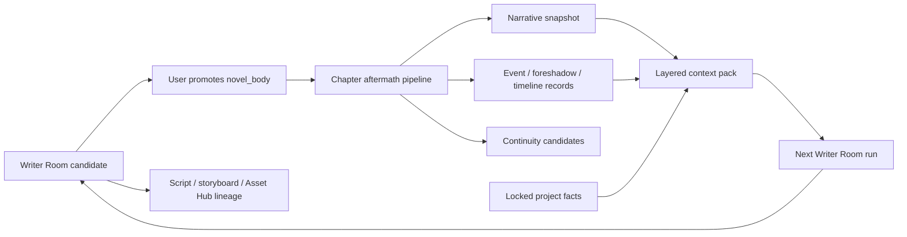

# Design: Creative Project Narrative Runtime

## Product Boundary

The narrative runtime is project-scoped. It turns approved prose into durable narrative state, then assembles the next chapter's bounded context. It does not replace Writer Room, Asset Hub, Agent Runtime or Canvas.



## Canon and Proposal Rules

| State | Source | May enter generation context | May change automatically |
| --- | --- | --- | --- |
| `novel_body` | user-promoted chapter version | yes | no |
| locked `project_bible` / `world_asset` | user-confirmed fact | yes, hard constraint | no |
| `ProjectNarrativeSnapshot` | approved prose aftermath | yes, bounded state | only by source version replay |
| `ProjectStoryEvent` / `ProjectForeshadowing` | approved prose extraction | yes, as soft state after review policy | status only through explicit action or deterministic source replay |
| `ProjectContinuityCandidate` | review/extraction proposal | no | pending decision only |
| Writer Room candidate | model output | no, except as explicit current input | no |
| Canvas / asset / agent thread data | external workflow data | no, unless explicitly linked and promoted | no |

`ProjectNarrativeSnapshot`, events and ledger rows always carry `project_id`, `source_content_id`, `source_version`, `chapter_number`, source fingerprint and extraction/run provenance. A replacement approved prose version supersedes derived state from the old version; it does not destroy it.

## Chapter Aftermath Pipeline

The pipeline is scheduled only after a `novel_body` is created or explicitly replayed. It must be idempotent by `source_content_id + source_fingerprint + pipeline_version`.

```text
approved novel_body
  -> validate chapter number and content integrity
  -> produce bounded chapter summary and event delta
  -> extract character state / locations / timeline changes
  -> register foreshadowing candidates and consumption evidence
  -> extract continuity candidates without auto-accepting them
  -> calculate style/tension measurements
  -> refresh semantic retrieval index when configured
  -> persist NarrativeSnapshot + run trace + diagnostics
```

Failures are isolated. The approved prose remains valid if enrichment fails. The run is marked `partial` with retryable failed stages. Replays use the same source version, never the latest chapter merely because it has a matching number.

## Data Model

### `ProjectNarrativeSnapshot`

One current snapshot per approved content version, with historical snapshots retained.

```json
{
  "project_id": "uuid",
  "source_content_id": "uuid",
  "source_version": 3,
  "chapter_number": 12,
  "summary": "bounded chapter summary",
  "character_state": [{"entity_id": "...", "state": "injured", "evidence_anchor": {}}],
  "timeline_delta": [{"event": "...", "order": 12}],
  "open_questions": ["..."],
  "context_fingerprint": "sha256",
  "status": "success|partial|failed|superseded"
}
```

### `ProjectStoryEvent`

Events are normalized with type, participants, location, timeline order, chapter provenance and evidence anchor. They are queryable for the graph and context pack.

### `ProjectForeshadowing`

```json
{
  "kind": "clue|promise|object|relationship|rule",
  "statement": "...",
  "planted_chapter": 3,
  "expected_window": {"start": 5, "end": 8},
  "status": "pending_review|active|advanced|resolved|overdue|ignored|superseded",
  "source_content_id": "uuid",
  "evidence_anchor": {"paragraph_index": 7}
}
```

AI extraction creates `pending_review`; only user confirmation activates it as a generation input. Deterministic consumption evidence may propose `advanced` or `resolved`, but still requires user confirmation in the first release.

### `ProjectStyleMeasurement`

Records length, dialogue ratio, sentence rhythm, exposition estimate, tension score, voice similarity and measured source. A style baseline is built from user-selected approved chapters, not arbitrary AI candidates.

### `ProjectNarrativeRun`

Persistent manual/batch/autopilot run state: project, target chapters, steps, source snapshots, current cursor, retry counts, token/cost summary, status and failure diagnostics. It follows the existing task/trace conventions instead of adding a second generic agent runtime.

## Context Pack V2

The server builds one typed context pack before a Writer Room call and persists an inspectable summary/snapshot. Layers have strict priority and independently configurable budgets:

```text
T0 locked canon: project_bible / world_asset / explicit user constraints
T1 active narrative state: current character state, timeline and unresolved conflicts
T2 active foreshadowing: confirmed active/overdue ledger entries near the chapter
T3 chapter contract: chapter plan, chapter outline, selected upstream candidate
T4 local continuity: previous approved chapter summaries and ending hooks
T5 semantic recall: bounded relevant approved excerpts and events
T6 style and genre: user-selected style baseline plus compatible creative Skills
```

Rules:

- T0 is never silently truncated; the run reports an explicit `context_overflow` instead.
- T1-T6 are budgeted and record included/excluded source IDs and reasons.
- Pending candidates, unapproved ledger records, agent memories and loose canvas data never enter T0-T5.
- The current candidate content may be supplied as an explicit rewrite source, but is labelled as candidate, not canon.
- The user can inspect the summary, source cards and fingerprint; full sensitive prompts remain in generation logs under existing access rules.

## Story Cockpit

`/story` becomes a stable three-column writing workspace at desktop sizes:

```text
left  : collapsible project/volume/chapter rail with version and health states
center: approved prose and selected candidate workspace with diff/source/log access
right : contextual Writer Room inspector: context, run trace, review, facts, ledger, quality
```

The right inspector is contextual, not a permanent pile of cards. It uses tabs or a compact segment: `Context`, `Review`, `Facts`, `Foreshadowing`, `Run`. Existing project graph remains a project view; a new narrative graph reads `ProjectStoryEvent`, confirmed facts and confirmed ledger rows only.

## Narrative Graph

The narrative graph is separate from project lineage and Canvas. It contains typed nodes: character, location, organization, item/clue, event, world rule, foreshadowing and chapter. Typed edges include `knows`, `opposes`, `holds`, `occurs_in`, `causes`, `reveals`, `plants`, `advances`, `resolves` and `constrained_by`. Every node/edge links back to content evidence.

Default view is current chapter plus a bounded neighborhood, not the entire novel graph. Users can filter confirmed versus pending proposals and open the source paragraph.

## Skill Routing

Creative Skills are process constraints, not hidden prompt text. A project declares genre and optional user-selected skills. The runtime selects compatible Skills, validates their declared input/output contract, writes applied Skill IDs to the context snapshot and generation log, and exposes them in the cockpit. A Skill cannot write facts, promote prose or publish.

## Guarded Autopilot

Modes:

- `manual`: user triggers one action.
- `batch`: user selects chapters/steps; dependencies and skips are visible.
- `guarded_autopilot`: durable queue advances only through candidate generation, review and aftermath. It stops before promote, fact acceptance, ledger activation and publication.

Circuit breaker opens for repeated provider failures, context overflow, invalid structured output, budget breach or sustained quality-floor failure. Resume requires explicit user action. Async image generation remains an external production task and cannot make a prose run successful until task completion and Asset Hub lineage writeback are verified.

## API Direction

The first implemented path is:

```text
POST /creative-projects/{id}/contents/{content_id}/aftermath
```

It creates derived state from one formal `novel_body` version and is idempotent
by source content/version fingerprint. The remaining surface is implemented
incrementally:

```text
GET  /creative-projects/{id}/narrative/health
POST /creative-projects/{id}/contents/{content_id}/aftermath
GET  /creative-projects/{id}/narrative/snapshots
GET  /creative-projects/{id}/narrative/context-preview
GET  /creative-projects/{id}/foreshadowing
POST /creative-projects/{id}/foreshadowing/{id}/accept|ignore|resolve
GET  /creative-projects/{id}/narrative-graph
POST /creative-projects/{id}/narrative-runs
GET  /creative-projects/{id}/narrative-runs/{run_id}
POST /creative-projects/{id}/narrative-runs/{run_id}/pause|resume|cancel
```

New routes require API surface regeneration, frontend client types, architecture docs and focused tests.

## Migration and Rollout

1. Add tables and read-only diagnostics first; do not backfill aggressively on app startup.
2. Provide an explicit per-project `rebuild narrative state` action that processes approved `novel_body` versions in chapter order.
3. Ship aftermath in manual mode and validate idempotence/partial retry.
4. Ship Context Pack V2 and cockpit inspection before enabling any autopilot.
5. Autopilot starts disabled behind a project-level setting.

## Verification

- Project isolation, idempotent aftermath, source-version supersession and partial retry tests.
- Context pack tests prove pending candidates and noncanonical sources cannot leak into generation.
- Version/read tests prove one latest approved chapter per number in the reader while candidates remain inspectable in Writer Room.
- Frontend build plus external-browser desktop/mobile smoke for the cockpit.
- End-to-end smoke: create/import project -> outline -> plan -> Writer Room candidate -> promote -> aftermath -> inspect context -> script/storyboard -> image task -> Asset Hub/project lineage.
