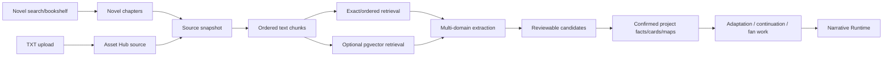

# Design: Novel Source to World Project

## Boundary

The source layer owns immutable imported material and its versions. The Creative Project owns the user's adaptation, continuation or fan-work intent. The Narrative Runtime owns confirmed derivative continuity after the user promotes new prose. Asset Hub owns files and derived media. The Character Library owns reusable character cards, while project links hold world-specific overrides.



## Source lifecycle

1. Ingest TXT or selected bookshelf chapters into Asset Hub/NovelChapter-compatible records.
2. Normalize encoding, remove only transport noise, preserve the original file and checksum.
3. Detect chapters and paragraph/scene boundaries; retain source offsets.
4. Create a `NovelSourceSnapshot` with `status=completed|serial`, source revision and selected chapter boundary.
5. Create `NovelTextChunk` rows with chapter/position metadata. Generate embeddings asynchronously when configured.
6. Run extraction domains independently so character extraction can finish even if map or embedding work fails.

Completed sources use a stable snapshot by default. Serial sources append revisions and maintain a checkpoint containing the last processed chapter and extraction version.

## Retrieval strategy

Use hybrid retrieval:

- exact normalized name/alias/term lookup for recall and evidence validation;
- ordered neighboring chunks for scene and chronology context;
- vector top-k retrieval for semantic descriptions, implicit relationships and rule explanations;
- source snapshot and project filters on every query.

Vector retrieval is an accelerator and context selector, not a canon writer. Evidence must always point to a concrete chunk/offset in the selected source snapshot.

## Extraction pipeline

```text
source snapshot
  -> inventory pass: entities, aliases, terms, places, groups, rules, evidence
  -> domain passes: character / world / economy / power / geography / faction / timeline
  -> reconciliation: aliases, duplicates, contradictions, cross-chapter updates
  -> candidate cards with confidence and provenance
  -> human/Agent review
  -> explicit accept/merge/ignore
  -> project facts, CharacterStoryLink, map documents and glossary
```

The first pass is conservative and evidence-first, following the existing two-pass character extraction direction. Directly stated facts become extracted drafts with evidence; only ambiguous, conflicting or inferred fields are candidates requiring a decision before hard canon use.

## Setting domain taxonomy and profiles

The system uses a **basic layer** available to every project plus independently assessed domains. AI does not switch on one overall expansion profile. At project creation or source recognition, AI evaluates each module separately and returns whether it is `detected`, `not_detected`, `uncertain` or `user_requested`, with reasons, evidence and estimated extraction cost. The user or Agent may accept, edit or disable any individual module. These are extraction-planning decisions, never canon facts. Each module then has `disabled|not_applicable|enabled|extracting|draft|confirmed` state, source evidence and extraction progress.

### Basic layer (default for every project)

- story premise, tone and format
- characters, aliases, goals, arcs and relationships
- key locations
- plot/episode timeline and historical events directly relevant to the story
- organizations/factions when they affect the plot
- rules/constraints and important items
- unresolved questions, secrets and unknowns
- dynamic state changes that become true during the narrative

### Optional extended domains

- **Physical world**: planets/realms, geography, climate, biomes, ecology, natural resources and travel constraints.
- **People and life**: species, populations, biology, heredity, life cycle, abilities, diseases and human/non-human relations.
- **Culture and society**: customs, values, family structure, class, gender roles, food, clothing, arts, religion, mythology, philosophy and language/writing.
- **History and chronology**: eras, calendars, dynasties, wars, disasters, revolutions, founders, historical causes and current consequences.
- **Historical events**: event type (`war`, `disaster`, `dynasty_change`, `revolution`, `discovery`, `migration`, `founding`, `personal`), time expression, location, participants, causes, consequences, certainty and affected domains.
- **Power and technology**: magic/ability rules, costs, limits, progression, technology stack, infrastructure, weapons and compatibility constraints.
- **Economy and institutions**: currency, prices, resources, trade routes, labor, finance, taxation, corporations, government and law.
- **Politics and factions**: states, organizations, alliances, rivalries, hierarchy, territory, goals and influence.
- **Maps and spatial relations**: map layers, regions, points of interest, routes, borders, territory ownership and evidence-backed coordinates.
- **Story bible and production**: visual language, adaptation constraints, season/arc plan, episode rules, audience, rating and continuity locks.
- **Objects and resources**: items, artifacts, materials, food, medicine, technology components, rarity, ownership and effects.
- **Lineage and networks**: family trees, inheritance, bloodlines, mentorship, affiliation and other reusable relationship graphs.

The extraction planner should detect which expandable domains are evidenced, explain the signal, and ask for confirmation when confidence is low. It should not force a genre label. A project can enable one domain at a time.

### Fact lifecycle and progressive expansion

Extraction is data normalization, not a single summary operation. The pipeline keeps four distinct layers:

1. **Evidence observations**: immutable quotes, source anchors, chapter order and detected mentions.
2. **Extracted drafts**: normalized entity/fact payloads assembled from observations; direct facts may be high-confidence, while inferred fields are explicitly marked.
3. **Confirmed canon**: user- or Agent-approved facts used as hard context for generation.
4. **Derivative and dynamic state**: adaptation changes, continuation/fan-work additions and facts that become true as new chapters are written.

`candidate` is reserved for ambiguous, conflicting or inferred drafts that need a decision. It is not the default name for every extracted record. New chapters run delta extraction, merge against stable identities and append new evidence; they do not rebuild or duplicate the whole world. Domain-specific UI views may use typed cards, but storage should prefer generic versioned facts plus domain payloads and evidence relations to avoid one table per setting category.

| Profile | Default domains | Optional domains |
| --- | --- | --- |
| `basic` | characters, relationships, locations, plot timeline, rules/items, unknowns | any expandable domain |
| `expandable` | AI-detected and user-selected domains only | any remaining domain |

Species and historical events are first-class optional domains rather than mandatory fields inside the character or world form. This keeps a contemporary urban short drama usable with a small amount of setup while preserving enough structure for fantasy, science-fiction, historical, apocalypse and game worlds.

This modularity follows the useful pattern seen in established worldbuilding tools, where maps, timelines, characters, species, religions, languages and encyclopedic notes are separate modules rather than one mandatory form. citeturn0search0turn0search1turn0search5

## Data model direction

Reuse existing `AssetNode`, `NovelChapter`, `CreativeProject`, `Character`, `CharacterStoryLink`, `ProjectContinuityCandidate`, `world_asset`, `ProjectContent` and generation-log conventions. The existing Character Library remains the authoritative character entity and extraction should create or link `Character` plus `CharacterStoryLink`; this change must not introduce a second character table.

Use dedicated tables for large, reusable entities with their own relationships, lifecycle and UI: `Faction/Organization`, `Location/Region`, `Species/Population`, `HistoricalEvent`, `PowerSystem/TechnologySystem`, `WorldMap/MapRegion`, `Item/Resource` and optionally `Culture/Religion/Language`. Use typed relation tables or graph edges for membership, ownership, conflict, geography, lineage and causality. Use generic versioned world facts only for small attributes, observations, unresolved questions and domain-specific extensions that do not justify a first-class entity.

Add or extend:

- `NovelSourceSnapshot`: source asset, source kind, completed/serial status, revision, chapter boundary, checksum, parent snapshot and indexing status.
- `NovelTextChunk`: snapshot, chapter, ordinal, paragraph/scene offsets, content, normalized content hash and optional pgvector embedding metadata.
- `WorldExtractionRun`: snapshot/project, mode, selected domains, checkpoint, status, retry diagnostics and model/index versions.
- `WorldFactCandidate`: domain, normalized key, structured payload, evidence anchors, confidence, provenance, review status and optional target entity ID.
- `ProjectSourceBinding`: read-only source snapshot plus derivative mode and attribution metadata.

Every dedicated entity still follows the shared evidence/revision lifecycle. The table is the stable identity and relationship boundary; extracted fields, source observations and revisions remain append-only and can be promoted to confirmed canon without copying the entity.

Maps should start as structured `ProjectContent(content_type=world_map)` documents: nodes, edges, regions, coordinates, labels, evidence and confidence. A generated bitmap is a derived visual asset, never the source of map truth.

## Derivative project rules

- `adaptation`: source facts are context; output can transform plot and format but source remains unchanged.
- `continuation`: source snapshot is read-only canon; new content is a child branch after the selected endpoint.
- `fan_work`: source attribution and provenance are required; output content is still separate and publication requires explicit confirmation.

The context pack should expose separate layers: `source_canon`, `confirmed_project_facts`, `derivative_delta`, `pending_candidates`. Pending candidates cannot enter hard canon.

## API direction

Proposed API surface, subject to implementation naming review:

```text
POST /api/v1/novel-sources/import-txt
POST /api/v1/novel-sources/{source_id}/snapshots
GET  /api/v1/novel-sources/{source_id}/snapshots
POST /api/v1/novel-sources/{source_id}/index
GET  /api/v1/novel-sources/{source_id}/chunks
POST /api/v1/novel-sources/{source_id}/extract
GET  /api/v1/world-extraction-runs/{run_id}
GET  /api/v1/world-extraction-runs/{run_id}/candidates
POST /api/v1/world-extraction-runs/{run_id}/candidates/decide
POST /api/v1/creative-projects/from-novel-source
POST /api/v1/creative-projects/{project_id}/source-sync
GET  /api/v1/creative-projects/{project_id}/world-knowledge
```

Existing `/creative-projects/from-novel` and `/extract-characters` remain compatible during migration; the new source workflow can initially delegate to the existing service methods.

## Failure and cost controls

- Indexing and extraction are durable tasks with per-domain progress.
- Embedding failures fall back to exact/ordered retrieval.
- Completed-source full extraction is user-triggered and can be batched by domain.
- Serial sync defaults to new chapters only and reports affected prior facts.
- Paid model calls require the existing generation/confirmation policy.
- No successful run is reported until source provenance and candidate persistence are complete.
