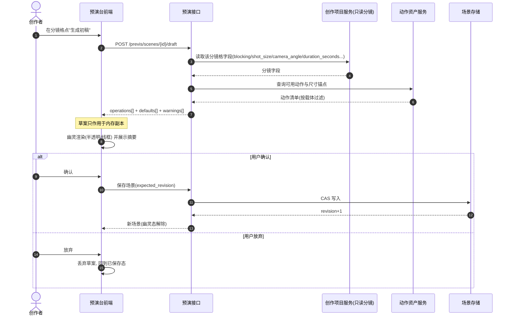
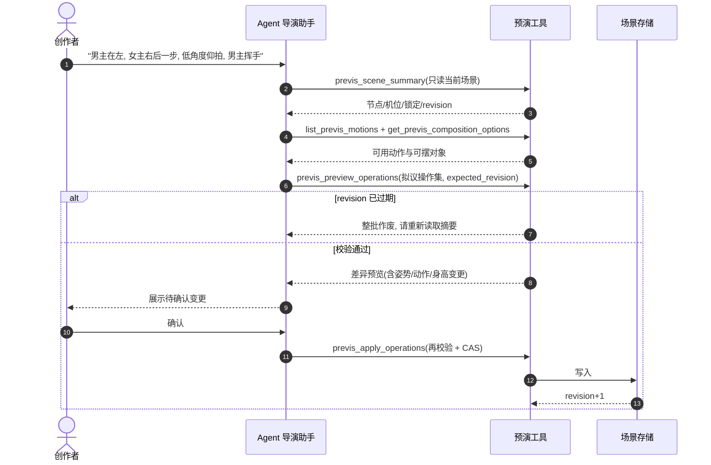

# Design

> 能力定位：把 3D 预演台从"人手摆的工具"升级为"可被 AI 编排、也可被人微调的场景层"，并补齐它唯一缺失的内容供给——动作与姿势资产。
> 落点范围：后端（FastAPI + SQLModel）与前端（React 18 + three）双侧，端到端链路。

## Context

### 背景

来自 `proposal.md`：预演台已能摆场景、出截图、合成真帧率视频，但场景只能手工搭建；分镜格里已经写好的调度、景别、镜头角度、时长只流向生图/生视频，生成前没有空间校验；人形占位只有极少数固定姿势且姿势没有时间维度；AI 侧虽已具备受控写场景的通道，但参数无校验、确认环节只给数值差异，且姿势/动作不是可引用数据。本变更补齐"AI 编排"与"动作供给"两条线。

### 当前状态（代码现实）

1. **场景持久化已就绪**：`PrevisSceneDocument`（`backend/app/db/models/previs.py:13`，表 `previs_scene_documents`）保存 `project_id` / `storyboard_content_id` / `panel_number` / `scene_json` / `revision`，并以 `(project_id, storyboard_content_id, panel_number)` 建索引；并发写靠 `expected_revision` 做 CAS。
2. **受控操作通道已就绪**：`backend/app/services/previs/operations.py` 定义操作词表 `PREVIS_OPERATION_TYPES`（`add_node` / `update_transform` / `set_camera` / `add_keyframe` / `remove_keyframe` / `capture_reference`）与关键帧通道 `_KEYFRAME_PROPERTIES`（含 `animation_clip`），上限 `_MAX_NODES=200` / `_MAX_CAMERAS=50` / `_MAX_KEYFRAMES=2000`；`find_target`（`:82`）按稳定 ID 定位；`capture_reference` 被显式拒绝（需浏览器渲染）。
3. **Agent 工具已就绪**：`previs_preview_operations`（只读校验 + 差异预览）与 `previs_apply_operations`（再校验 + CAS 落库）注册在 `backend/app/services/agent/tools/previs_tools.py`，授权给 `creative-director` 与 `storyboard-director`（`backend/app/services/agent/profile.py:124,351`）。
4. **逐帧纯函数求值已就绪**：`frontend/src/pages/previs/timeline.ts` 的 `sampleChannel` / `sampleFromKeys` / `currentChannelValue` / `upsertKeyframe` 均为无 React / 无 three 依赖的纯函数，已被单测覆盖；`interpolationFor('animation_clip')` 为 `step`。
5. **人形占位已就绪但供给单薄**：`frontend/src/components/three/humanProxy.tsx` 的 `HUMAN_PROXY_POSES` 提供 6 个**静态**姿势（`stand` / `tpose` / `walk` / `sit` / `wave` / `point`），姿势数据是 16 个关节角度（左右肩各 3、左右肘、左右髋各 3、左右膝）；`HumanProxyMesh`（`frontend/src/pages/previs/SceneViewport.tsx:130`）可切换胶囊 / UE 白模 / Vanguard，后两者走 `AnimatedModel` 吃 `animation_clip`，但 UE 白模自带 0 条动画、Vanguard 仅 4 条。
6. **分镜字段比预期丰富**：`backend/app/services/creative_project/service.py` 已按 `blocking`（调度）/`shot_size`/`camera_angle`/`camera_motion`/`composition`/`action`/`emotion`/`props`/`dialogue_bubbles` 组装提示词（`:9592-9612`），并有 `_normalize_storyboard_duration`（`:9428`，把时长归一到 3–6 秒）与 `_build_storyboard_video_prompt`（`:9446`）两个可复用静态方法。
7. **导出链路已就绪**：`POST /api/v1/previs/scenes/{scene_id}/export-frames`（JPEG 序列 ZIP）与 `POST /api/v1/previs/scenes/{scene_id}/export-video`（后台任务，`FFmpegService.images_to_video` 以 `-framerate` 保证真帧率）已实现并端到端验证。

### 约束与来源

| # | 约束 | 来源 |
|---|------|------|
| C1 | 动作求值必须是"按帧号取值"的纯函数，禁止依赖实时播放状态 | `3d-director-previs` #16 实测：MediaRecorder 按墙上时钟打时间戳，视口帧率一抖就录出时长漂移的视频 |
| C2 | 同一帧必须永远对应同一姿态；重复导出同一帧区间结果可复现 | 同上 + `3d-director-previs` #14/#15 既有性质 |
| C3 | 动作与姿势不得成为素材库资产 | `proposal.md` 已确认项 #2 |
| C4 | 写场景必须经人工确认，且带 `expected_revision` 做并发保护 | `3d-director-previs` 既有契约 + `operations.py` 现有实现 |
| C5 | 不新增骨骼绑定、重定向与 IK 能力 | `proposal.md` 非目标 |
| C6 | 滚动/缩放、四元数存储、稳定 ID、`locked` 语义沿用既有场景契约 | `3d-director-previs` design §场景数据契约 |
| C7 | 非人形与特殊造型才使用素材库模型，人形默认用通用人形占位 | `proposal.md` 已确认项 #3 |
| C8 | 本机 GitNexus 与 API Registry MCP 均未启用 | `project-profile.yaml`（`gitnexus.available: false`、`api_registry_mcp.endpoint: ""`）→ 本 design 的代码调研以源码检索与文件行号为准 |

## Goals / Non-Goals

### Goals

1. 从分镜格一键生成"人形数量 + 相对站位 + 身高 + 机位与镜头光学 + 时长"的场景初稿，草稿可编辑、可确认、可放弃。
2. 用自然语言下达场景指令，走与初稿同一条"提议 → 可视化预览 → 人工确认 → CAS 落库"通道。
3. 动作与姿势成为独立资产：人形参数型（**23 通道时间序列**：四肢 16 + 躯干/头颈/重心 7）+ 无骨骼通用变换型两类先行，骨骼型留作后续阶段。
4. 通用人形占位按真人比例重建，身高可调，且能同时承载静态姿势与动态动作。
5. AI 提交的每一次写入都经过参数校验；确认前能在 3D 视口观察结果。
6. 面向 AI 暴露只读的"可摆对象 / 可用动作 / 尺寸锚点"清单，杜绝编造引用。

### Non-Goals

- 不做通用建模、网格编辑、地形、材质编辑。
- 不做 IK、物理、布料与解算。
- 不做骨骼绑定（绑骨）、不做骨骼重定向、不为非人形对象生成骨骼动画。
- 不替代 Blender / Maya / Unreal 等专业 DCC。
- 不改造下游视频生成是否接受"参考视频"（由后续变更对接）。
- 不新增导出能力（截图、帧序列、视频导出均沿用既有实现）。
- 不把动作资产并入素材库的检索、血缘与版本体系。

## Decisions

### D1：动作与姿势资产独立建表，以引用方式进入场景

- **决策**：新建独立的动作资产表（每行一个动作或姿势），场景节点只保存动作标识；动作不写入素材库，也不复制进 `scene_json`。
- **理由**：动作是**驱动参数**而非素材——脱离骨架/载体没有任何可看表现，素材库的缩略图、向量检索、血缘对它都是无效成本；而场景保存的是"选了哪个动作"，动作本体更新后所有引用自动生效（`proposal.md` 已确认项 #2）。同时必须先建**后端**资产，因为 AI 需要一份可检索的动作清单，纯前端常量无法被 AI 引用。
- **替代方案**：① 存进素材库（新增 `motion` 资产类型）；② 前端常量数组（沿用 `HUMAN_PROXY_POSES` 的做法）；③ 只放文件、元数据写死在代码。
- **拒绝原因**：① 把驱动参数塞进素材体系会污染检索与血缘，且素材库的资产需要独立视觉表现；② 前端常量对后端与 AI 不可见，AI 只能猜动作名，直接违背本次目标；③ 无法携带骨架规格、时长、循环与许可信息，也无法做"只列可用动作"的过滤。

### D2：动作求值采用纯函数逐帧采样，禁止依赖实时播放

- **决策**：动作/姿势的求值统一收敛为 `sample(动作, 帧号) → 该帧的载体状态` 的纯函数，与 `timeline.ts` 现有 `sampleChannel` 同范式；渲染层只消费求值结果。
- **理由**：C1/C2 是硬约束，且已被实测证明——实时录制会因视口帧率抖动而出时长漂移的视频。纯函数还带来两个直接收益：可单测（现有 `timeline.test.ts` 已覆盖同范式），以及"同一帧永远同一姿态"可被断言。
- **替代方案**：① 直接用 three 的动画混合器实时播放，导出时录屏；② 求值放渲染组件内、按需读取播放头。
- **拒绝原因**：① 已实测失败（丢帧率确定性，正是 #16 否掉 MediaRecorder 的原因）；② 求值散落在渲染层则无法单测，也做不出"重复导出逐帧一致"的验收。

### D3：人形占位只保留程序化参数载体（骨骼型载体已下线）

- **决策**：人形占位**只有程序化胶囊人一种载体**，驱动数据是 16 个关节通道的时间序列（即 `HumanProxyPose` 的时间序列版）。原先可切换的 UE 白模已下线；历史场景里记录的 `metadata.proxyStyle`（`ue` / `vanguard`）一律忽略、按通用人形渲染。
- **理由**：参数型载体**天然不存在"两套骨架朝向不一致"**——关节朝向由代码定义，因此不需要绑骨、推断映射、改名或重定向，而这些正是 `3d-rigging-digital-human` 上耗费最多的坑；同时预演只要求"走位与姿态可读"，不要求影视级表演。
- **白模下线的依据是实测而非偏好**：`frontend/public/models/ue-mannequin.glb` 自带 **0 条动画**（`animations: []`，73 节点 / 1 蒙皮 / 67 关节），既播不了自带 clip，又不在参数型动作的驱动范围内（动作通道是胶囊人的 16 个关节），选中它只能站着不动。**"能选却动不了"比没有这个选项更像 bug**——用户会当成缺陷反复报，且切换后姿势与动作控件整块消失却没有任何解释。白模的文件与许可记录保留，等"参数型动作烘焙成 GLB 动画"（P2）落地后接回来：它是仓库里**唯一的带蒙皮人形**，是验证蒙皮变形与穿模的唯一载体（胶囊人是刚性零件拼的，验证不了这件事）。
- **替代方案**：① 保留载体下拉（只剩胶囊人一个选项）；② 保留白模并立即为它烘焙动作；③ 只做骨骼型（所有动作都走重定向）。
- **拒绝原因**：① 单选项下拉是噪音，还掩盖"白模不可用"这一事实；② "16 关节 → UE 骨架"要先做一次轴系换算（UE 的 rest 是 T-pose、我们的角度是相对静止姿态的偏移），属于 P2，现在做会阻塞主链路；③ 需要为每个角色做一次骨骼映射，成本与失败面都大，而收益只在"更像真人"。

### D4：非人形对象不做骨骼重定向，用"自带动画优先 + 通用变换兜底"

- **决策**：非人形对象（动物、载具、道具、怪兽）若自带骨骼动画，优先提供其自带动画；否则用不依赖骨骼的通用变换动作（位置/旋转/缩放曲线）表达运动。
- **理由**：`skeleton_report.py` 的映射推断建立"根骨分叉出脊柱与双腿、脊柱顶端分出双臂"的人形假设，四足多肢推不出来；而预演产物是参考图/参考视频，读的是剪影、走势与节奏，通用变换足以表达"从左侧扑向镜头"。这同时使"怪兽怎么办"不再依赖昂贵的绑定链路。
- **替代方案**：① 扩展骨骼推断以支持四足与多肢；② 引入外部自动绑骨服务解决非人形。
- **拒绝原因**：① 推断规则要为每种拓扑重写，且缺少可校验的参照物（人形靠"左右手性与 Xbot 校验"才敢用），投入与收益严重倒挂；② 与 `proposal.md` 非目标冲突，且会重新引入付费供应商与配额依赖（`3d-rigging-digital-human` #16 的实际阻塞点）。

### D5：初稿生成与 AI 编排复用同一条"提议 → 预览 → 确认 → CAS 落库"通道

- **决策**：不新增写入通道。初稿生成产出的是一批**未落库**的场景操作；前端把它作为"幽灵状态"在 3D 视口渲染；人确认后走既有 `previs_apply_operations`（或等价的场景保存接口，带 `expected_revision`）落库。
- **理由**：既有通道已经具备锁定校验、revision 过期整批作废、授权（仅 `creative-director` / `storyboard-director`）与人工确认，这些正是让 AI 写场景能用于生产的前提；新开通道会把它们绕过去。
- **替代方案**：① 初稿直接写入场景、用户再撤销；② 前端本地生成草案并本地保存。
- **拒绝原因**：① 违背 C4，且 AI 幻觉会直接污染已保存场景（现在连参数校验都没有）；② 绕过 `revision` 并发保护与锁定语义，且前端无法访问分镜与动作资产。

### D6：动作/姿势引用放在节点 metadata，不新增节点类型

- **决策**：`human_proxy` 等节点通过 `metadata` 中的动作标识与姿势标识表达绑定；不新增 `motion` 之类的节点 kind。
- **理由**：动作没有独立空间位置，它描述的是"某个载体怎么动"；新增节点 kind 会污染 `PrevisNodeKind` 的空间语义（`asset_model` / `human_proxy` / `primitive` / `panorama` / `light` 都是空间对象），并迫使图层列表、变换面板、关键帧目标等全部处理一类"没有 transform 的节点"。
- **替代方案**：新增 `motion` 节点类型，让动作成为一等空间对象。
- **拒绝原因**：动作不是空间对象，图层与变换语义都要为它开特例（现有代码大量按 `node.transform` 取值）。

### D7：参数校验落在服务层，白名单与范围与服务同源

- **决策**：`add_node` 等操作在服务层校验节点 kind 白名单、身高范围、姿势/动作存在性与可用性、模型引用可用性；校验规则与前端可选项由同一份定义派生（后端为准，前端选项同步）。
- **理由**：当前 `add_node` **整包接收** `payload.node`，不校验 kind 与 metadata——AI 幻觉出非法值会静默落库（这是本次最现实的缺陷）。前端校验只能防手误，防不住 AI；且校验口径必须单一，否则前后端会各说各话。
- **替代方案**：① 只在前端限制输入控件；② 把校验放到前端并把结果传给后端。
- **拒绝原因**：① AI 不经过前端控件，等于不校验；② 前端是可绕过的，且会造成"两套校验口径"（项目已因"标签写入侧与读取侧不是同一份数据"踩过同类问题）。

### D8：初稿生成走同步请求，不建异步任务

- **决策**：初稿生成与预览是同步请求，只读分镜与动作清单、无外部调用、不落库；仅当用户确认后才发生一次写库。
- **理由**：全过程是本地计算（读分镜字段、查动作、算默认值），无第三方往返；且草案必须立刻可见才能被确认——异步化只会引入轮询与中间态。
- **替代方案**：① 建 `previs_draft` 异步任务；② 复用任务中心统一排队。
- **拒绝原因**：① 无长耗时环节，异步只增加状态机与失败分支；② 任务中心是给"慢且需可观测"的操作用的，把毫秒级只读计算排队会拖慢交互（既有 video 导出走异步是因为要逐帧上传与合成）。

### D9：关节语义（轴向与镜像）由单一函数定义，并用反向解算测试钉住

- **决策**：`spread` / `twist` 一律乘 `side` 做镜像；肘与膝都绕 X 弯曲，但符号相反（**肘负值 = 向前抬、膝正值 = 向后收**，两者都是"生理方向的弯曲"，符号不同不是笔误）。四条语义各由一个导出函数承担，渲染层不再手写欧拉角；新增反向解算测试，用**同一份尺寸常量**重建骨链并断言不变量。
- **理由**：本轮实测发现原实现的六个姿势里有一半以上是坏的，而且**没有一个是肉眼能稳定发现的**——① T 字两臂对穿（两侧肩点分居 ∓X 却共用同一套局部轴，`spread` 不镜像就会让两条手臂朝同一侧移动，实测左手落到 +0.55）；② 挥手时手穿进躯干并落在身后 0.46m（肘绕 Z 是左右横扫，只有绕 X 才是屈肘）；③ 行走膝盖反折、两脚同时收到中线（膝的符号与髋的 `spread` 镜像同时错）。这些在 320×480 的视口里只表现为"好像有点怪"，说不清哪里怪；此前一轮只改了比例，轴向错误照样藏在下面。
- **替代方案**：① 反复调数值直到"看着顺眼"；② 把左右命名改成与角色自身一致并依赖该约定；③ 用真实骨骼与蒙皮替掉程序化关节。
- **拒绝原因**：① 视觉微调不收敛，且没人能保证下一次改动不再次破坏（本项目已有"同一个缺陷反复出现两次"的前例，最终都是靠抽纯函数 + 加测试收口）；② 命名不解决数学问题——错在"两套局部轴被当成同一套"，改名字只会让它更隐蔽；③ 与 D3 冲突：程序化参数载体正是为了绕开骨骼朝向与绑定的全部成本（见 `3d-rigging-digital-human` 的实测坑）。

### D10：姿势既可整体套预设，也可逐关节手调；自定义角度存在节点 metadata 并优先于预设

- **决策**：节点 `metadata` 增加 `poseJoints`（完整的 16 关节角度）。存在时**覆盖**预设 `pose`；选择预设或点"重置为预设"会清空 `poseJoints`。解析入口只有一个纯函数（自定义与预设合并后返回），渲染层与界面共用。各关节带生理限位：**只硬挡不可能的方向**（肘只能向前屈、膝只能向后收），其余只做范围收敛。
- **理由**：① 预设是有限的、参数是无限的——手调姿势能让同一套素模覆盖更多构图需求，且与 AI 编排**写的是同一份数据**（AI 提出姿势后，人能在面板上看到滑块位置并微调后再确认）；② 关节语义在 D9 修好并被测试钉住之后，"拖滑块"的方向才是可预期的，生理限位也才有依据（旧实现里轴向是错的，给滑块只会一拉就穿模）；③ 限位若也挡"手交叉到身体另一侧"这类**现实中可能**的动作，会把合法的构图诉求挡掉，所以只挡生理不可能的方向。
- **替代方案**：① 继续只用预设，需要新姿势就加预设条目；② 做拖手/拖脚的 IK 吸引；③ 让用户直接写 JSON 放进 metadata。
- **拒绝原因**：① 每加一个构图需求就加一条预设，条目会膨胀且永远追不上组合数；② IK 需要反向解算与关节限位，属于 design 非目标，成本与收益不匹配（预演只需姿态可读）；③ 手写 JSON 没有校验与限位，等于把 D7 的隐患重新引进来。

### D11：动作通道补齐躯干 / 头颈 / 重心；中线部位不镜像，且与四肢共用同一旋向

- **决策**：人形参数载体由 16 通道扩到 **23 通道**——新增 `torso.0/1/2`（前后倾 / 转身 / 侧倾）、`head.0/1/2`（低头抬眼 / 转头 / 侧头）、`bodyOffsetY`（整体重心升降，米）。三元组**下标一律等于轴序**（0 = 绕 X、1 = 绕 Y、2 = 绕 Z）；中线部位**不乘 `side`**（不镜像）；`head` 是"含脖子一起转"的一条独立关节。
- **理由（来自 tasks 1.8 的实测缺口）**：原 16 通道只有四肢，**做不出"低头 / 抬眼 / 回望 / 点头 / 摇头 / 鞠躬 / 半蹲"**——外部动作库里的这整类动作（kunpeng 的「视线」6 条 +「交流」7 条、storyai 的 crouch / bow / think）全部落在这三个部位上。补通道是"扩动作条数"的前置：通道不够时加条目，等于加了一批在视口里静默失效的动作。
- **符号约定（最容易看错的一处，刻意如此）**：中线部位朝上，所以**同一个"绕 +X 正转"在这里表现为前倾 / 低头**；四肢朝下，同一旋向表现为"向身后摆"。即两条"正 pitch"的**含义相反、旋向相同**。这样照抄外部动作数值（kunpeng 的 `spine: v(38)`、`neck: v(22)` 本就是以"前倾/低头为正"）时**不必反号**，代价是必须记住含义差异——由 `humanProxy.test.ts` 的朝向断言钉住（低头看鼻子高度、转头看鼻子 x、侧头看头顶）。
- **层级同时修正**：双臂改为**躯干的子级**（原来是与躯干并列的兄弟节点）。肩长在胸上，躯干前倾时手臂必须跟着走，否则鞠躬会出现"上身转了、双臂留在原地"的断体。骨盆与腿保持在躯干之外（它们是髋部，跟着前倾转会把鞠躬变成整体前倒）。
- **替代方案**：① 只加"低头""鞠躬"两个预设姿势、不动通道；② 中线部位也按 `side` 镜像（复用四肢那套函数）；③ 给蹲姿做 IK 以保持脚底贴地。
- **拒绝原因**：① 预设条目数会随构图需求无限膨胀，且 AI 与外部动作仍无法表达这些姿态（同 D10 的理由）；② 镜像对居中部位没有意义，只会把"向左看"变成"向右看"——制造难以察觉的左右错位；③ IK 属本变更非目标。改为**显式声明耦合**：`bodyOffsetY` 是位移，单独下沉必然让脚陷地，蹲姿必须与髋/膝屈曲配套，判据（脚底贴地）由不变量测试钉住，种子动作 `crouch` 给出可用数值（下沉 0.165m + 髋前抬 52° + 膝后收 52°）。
- **代价与边界**：`bodyOffsetY` 是"缺失即 0"的单值通道，解析入口总会补上它，以免命令式写入在切换动作后残留（其余通道仍是"动作没说到就保持"）；限位表改为逐字段映射，替代原来的 `endsWith('Shoulder')` 三目链——那种写法每加一个部位就要改一处判断，漏掉一个的表现是"该字段静默不受限"。

### D12：运镜模板按"参数化生成关键帧"实现，只覆盖现有通道能表达的动作

- **决策**：新增 `pages/previs/cameraMoves.ts`——**26 类**运镜模板（清单对齐 kunpeng-director 的 28 类），纯函数 `buildCameraMove(模板, 起点机位) → 关键帧序列`；面板提供"选模板 → 套用"两步，套用时以**第 0 帧求值后的机位**为起点、把关键帧铺满 `0 → durationFrames`。**滚转类（`roll-left` / `roll-right`）不纳入**。
- **理由**：① 运镜是"起点 + 时长 → 关键帧"的确定性映射，与 `timeline.ts` 的逐帧求值同一范式，因此能脱开 React 与 three 单测（本模块 28 例）；② **关键帧疏密就是缓动**——"快起慢收"（甩镜）只能靠把 62% 的转角压进前 25% 的时间来表达，这是逐通道关键帧体系里唯一的手段，也说明模板不能做成"只给终点"。
- **滚转为何不纳入**：机位由 `position` + `camera_target` + `camera_fov` 驱动，相机永远看向目标点、**没有滚转通道**。加它要动通道契约、后端关键帧词表与视口渲染，属另一个变更；宁可少两条，也不要一条"选中了看不出效果"的模板（`cameraMoves.test.ts` 有一条断言守住"清单里不含 roll"）。
- **两条硬约束**：① **确定性**——所有抖动来自**整数频率**的 `sin/cos`，**不用 `Math.random()`**，否则同一段运镜重播两次画面不同，直接破坏"重复导出同一帧区间逐帧一致"这条验收；② **同一起点**——首个关键帧精确等于传入机位（`rotateY` / `rotateAxis` 在 0° 时原样返回、`aimedTarget` / `orbitPosition` 据此快照），否则 `from + (target − from)` 的浮点漂移会让"起点没被改动"这条断言失败（实测 0.8 变成 0.7999999999999998）。
- **复用了库里的两条口径**：分类（稳定 / 推拉 / 横移 / 摇摄 / 升降 / 弧线 / 跟拍 / 表现性）与强度档位（克制 0.6 / 标准 1 / 强烈 1.5）——它们是"这套运镜该有多大动作"的经验值，比自己拍脑袋可靠。
- **替代方案**：① 每条运镜写成手打关键帧的预设值（不按起点计算）；② 引入贝塞尔曲线做缓动；③ 连滚转一起做（先扩通道）。
- **拒绝原因**：① 预设值只在某一组机位上成立，换个机位就"飞"，而用户几乎总会先摆机位再套运镜；② 插值是逐通道线性 / 球面（`timeline.ts` 已定的契约），引入贝塞尔要改求值内核，收益仅是"更顺滑"；③ 见上。

### D13：中性素模必须带"方向线索"，但不带角色特征

- **决策**：给通用人形占位加两组**方向标记**——头部：加大加深的眼睛 + 眉毛 + **凸出的锥形鼻子** + 嘴 + **只覆盖头顶与后脑勺的碗状头发**与后脑凸起；躯干：正面一个小深色标记。五官**按"能被看见"而不是按真实比例**做（眼睛半径取头半径 0.2、鼻子凸出球面约 0.04 头半径）。
- **理由**：实测在预演视口里角色只有几十像素高，此前按真实比例画的五官（眼宽约 3cm、还压扁到 0.35 厚度）、以及**与头部同色的**"面部凸起"，在那个尺度上等于不存在 → **头看上去就是一个球，转头与低头完全读不出来**。而 D11 新增的头颈通道恰恰全靠"能看出朝向"才有意义：**读不出朝向的动作等于没做**。后脑一侧的头发与后脑凸起解决"从背后看不出哪边是脸"，躯干正面标记解决"圆柱躯干绕自身轴转 20° 在画面上没有差别"。
- **与"人形占位只要中性、不要造型"的边界（D3 / 已澄清项 14）**：这是**方向线索**而不是角色特征——全身仍是同一个中性灰（头发用深一档的中性灰 `#6E747D`），没有任何"具体是谁 / 穿什么"的暗示，不会往下游生成模型传造型语义。本决策不改变那条边界，只是把它解释清楚。
- **替代方案**：① 保持写实比例的五官；② 加"正面箭头 / 坐标轴"式的方向指示；③ 不给头部线索，让用户自己在视口里转视角判断朝向。
- **拒绝原因**：① 已在实测中失效（就是本次要修的问题）；② 箭头是调试标记而不是人形，会被当作画面元素带进参考图；③ 预演图的用途是让人**快速**判断站位与朝向，让人反复转视角核对等于把成本转嫁给使用者。

### D14：批量初稿"批的是导航，不是确认"；队列放 URL 上，当前格由 `scene_id` 定位

- **决策**：分镜卡片可**勾选多格**，面板右上「批量初稿（N）」一次把这批格的场景**备齐**并按分镜号顺序排成队列（`queue=场景ID,...` 放在 URL 上），进入预演台后**从第一格开始逐格生成草案、逐格确认**；「确认并保存」与「放弃」都会推进到下一格，末格收尾并摘掉队列。
- **理由（"不得绕过逐格确认"落在结构里，而不是靠自觉）**：① 入口**一格草案都不生成**——草案由预演台在每一格各自生成，确认必须逐格点，所以批量在实现上根本不存在"一次应用多格"的代码路径；② 推进只由两个用户动作触发，且**确认路径先落库成功再推进**（`handleSave` 改为返回布尔）——存不上还跳下一格，等于这一格的确认白丢了，而用户再也回不到那一格；③ **队列放 URL 而不是 sessionStorage / 全局状态**：刷新、前进后退、把链接发给别人，队列都还成立，而"批量到第几格"本来就是这条链接的状态；放 sessionStorage 会出现"另一个标签页里操作导致这边队列错位"；④ **不额外传 `queue_index`**：当前格由 `scene_id` 在队列里的位置定位，多一个参数就多一个可能与 `scene_id` 不一致的真相来源（两者不一致时该信谁？）；定位不到即视为"不是批量进来的"，批量 UI 整块不显示。
- **为什么是"勾选几格"而不是"整章一键"**：批量初稿的语义是逐格确认，整章一键会让人连着点十几次确认；让用户先圈出真正要过的那几格，其余留到需要时单独生成。
- **顺带修掉一个批量必然踩到的老缺陷**：**切换场景时没有清理上一格的编辑态**。上一格的幽灵草案会留在新场景上（看着像新场景已生成草案），且"未保存标记"被继承后 `draftBlockedReason` 会以 dirty 为由**拒绝新场景的初稿确认**——批量会卡在第二格。现按 `sceneId` 重置 draft/dirty/选中节点。这类缺陷在单场景使用下几乎看不见，是批量把它放大了。
- **替代方案**：① 队列放 sessionStorage / 组件状态；② 用 `queue_index` 显式记进度；③ 整章一键批量；④ 自动推进（生成完自动落库、不必逐格点确认）。
- **拒绝原因**：① 见上（跨标签页错位）；② 两个真相来源必然漂移；③ 逐格确认的量不能这么堆；④ **直接违背已确认项 17**——批量不得绕过逐格确认。
- **边界**：队列长度上限 50（理由不是性能而是 URL 长度：`scene_id` 是 36 字符的 UUID）；末格文案必须点明"最后一格"，否则用户不知道按完还有没有下一格——这是逐格确认能被接受的前提。

## 数据归属判定

> 本项目不是 CSF/BSV/PSV 体系（`project-profile.yaml` 明示未填 `center_type`，`backend` 为单体 FastAPI 应用），因此不存在跨中心归属问题；此段按"数据域归属"给出判定。

| 数据域 | 目标表/模型 | 归属 | 判断依据 |
|---|---|---|---|
| 预演场景 | `previs_scene_documents`（既有） | 预演域 | 已存在，本次仅扩展 `scene_json` 内的节点 metadata 语义，**不改表结构** |
| 动作与姿势资产 | 新建表（动作资产域） | 预演域 | 动作只服务预演台的载体驱动，与素材库、模型任务账本无归属交集 |
| 分镜字段读取 | 无新表，只读 `project_contents` 中的分镜内容 | 创作项目域（只读） | 初稿生成只读分镜，不回写、不复制（`proposal.md` 验收标准 1） |
| 动作资产落地文件 | 不新增二进制存储 | — | 参数型动作为结构化数据随记录存储；骨骼型动作复用既有模型文件与素材库引用，不复制 |

**跨域调用路径**：预演域 → 只读创作项目域的分镜内容（复用既有内容读取）；预演域 → 只读素材库（复用 `search_assets` / 资产服务）；**无反向写入**。

## 同步/异步处理决策

| 环节 | 处理模式 | 判断依据 | 用户体验影响 | 失败与补偿边界 |
|---|---|---|---|---|
| 初稿生成 | **同步** | 纯本地计算：读分镜字段 + 查动作清单 + 生成默认值，无外部调用 | 点击后立即看到草案与幽灵预览 | 失败则返回可读原因并保持场景不变；无中间态需补偿 |
| AI 编排预览 | **同步** | 既有 `previs_preview_operations` 已是只读同步 | 立即得到差异与可视图 | 同上 |
| AI 编排落库 | **同步** | 既有 `previs_apply_operations` 为 CAS 单次写入 | 确认即生效 | revision 过期则整批作废并提示重读（既有行为） |
| 参考视频合成 | **异步（沿用既有，本次不改）** | 需逐帧上传 + 服务端 ffmpeg 合成 | 走既有任务中心与进度提示 | 既有行为：合成成功即删帧序列，失败保留现场 |

## 异步业务组件设计

**本变更不新增异步业务组件。** 参考视频导出沿用既有 `previs_export_video` 任务（`backend/app/api/v1/previs.py` 的 `_run_previs_video_export` + `FFmpegService.images_to_video`），本次只保证其输入端——动作求值的确定性（D2）——因此不需要新的幂等键、状态回写或异常分类设计。

## 详细设计

### 后端服务层

**预演域新增：动作资产服务**

| 方法 | 参数 | 返回 | 说明 |
|---|---|---|---|
| `list_motions` | `carrier`（`params` / `transform` / `bone`，可选）、`skeleton_standard`（可选）、`tags`（可选） | 动作条目列表（标识、名称、语义标签、载体、兼容规格、时长秒、帧率、循环、来源、许可、许可状态） | 供前端选择器与 AI 只读清单共用；`license` 为空时标记为"未核实" |
| `get_motion` | `motion_id` | 单条动作（含数据体） | 缺失时返回可读错误，不抛 500 |
| `sample_motion` | `motion`、`frame`、`context`（如身高） | 该帧的载体状态 | **纯函数**（D2）；非循环动作越界取末帧、循环动作取模 |

**预演域扩展：场景操作**

| 方法 | 变更 | 说明 |
|---|---|---|
| `validate_operations`（既有校验入口） | 扩展 | `add_node` 增加节点 kind 白名单与 metadata 校验；新增语义操作 `assign_motion`（把动作标识写入节点 metadata）、`set_human_proxy`（身高与姿势）；保持"逐条拒绝 + 可读原因"的既有策略，`revision` 过期仍为整批作废 |
| `find_target`（既有，`:82`） | 复用 | 语义操作按稳定 ID 定位节点，复用锁定与存在性校验 |
| `_rig_...` 无关 | — | 与绑骨链路无耦合 |

**校验的三条实现约定（tasks 3.1–3.5 落地时定下）**：

1. **纯函数 + 事实注入**：`validate_operations` 不碰数据库（因此可完整单测），"动作是否存在、载体是否匹配"这条事实由调用方通过 `motion_carriers` 传入（`motion_service.motion_carriers`，工具层在同一个会话里查一次）。**传 `None` 表示清单不可用，此时任何动作引用都被拒绝**而不是放过——与 `capture_reference` 同一条原则：放过一个拼错的引用，表现是"下拉里没有它、选了没反应"，排查成本远高于当场拒绝。
2. **范围规则两份实现，但解释必须唯一**：`HUMAN_PARAM_LIMITS`（后端，用于拒绝）与前端 `HUMAN_PROXY_LIMITS`（滑块用）是同一条规则的两种表达（与 `CHANNEL_SIGN_RULES` 同一约定）。后端也要留一份的原因：AI 提交的越界值若只靠前端 `sanitizeHumanProxyPose` 兜，会被**静默夹到边界**——那是"悄悄改掉别人的意图"，事后无从发现。拒绝原因还要**分得清两种越界**：`leftKnee=-20` 是违反生理约束（膝只能向后收），`leftKnee=999` 是超出范围（上限 140）——说反了会把人引到错误方向。
3. **白名单宁可严一点**：`add_node` 的节点种类、metadata 里的姿势与动作引用全部走白名单，未知值拒绝并列出可用值。放过的代价是"落库成功但前端不认"（`normalizeSceneData` 把它丢掉），比拒绝贵得多。

**初稿翻译的四条实现约定（tasks 4.1–4.4 落地时定下）**

1. **纯函数 + 事实注入**：`services/previs/draft.py` 的 `build_previs_draft(scene, panel, prop_assets=...)` 不碰数据库。分镜格由接口层按 `(storyboard_content_id, panel_number)` 读出（面板号只在各自分镜内容内唯一，所以必须带 content_id），"道具 → 素材"由接口层查好后传入。翻译逻辑因此可完整单测。
2. **档位匹配"最长命中优先"，备选词按短语声明**：`medium close-up` 同时含 `medium`（中景）与 `close`（特写），按声明顺序或按空格切词都会落到中景——这类错在画面上只表现为"机位比想象远一点"，不靠测试很难发现。俯仰同理：档位给的是**俯角**，机位高度 = 眼高 + 距离 × tan(俯角)，并夹在 0.2–6m（鸟瞰在 12m 距离下会算出十几米，对预演没有意义）。构图则**偏移注视点而不是挪机位**——机位代表"从哪拍"、构图代表"主体落在画面哪里"，偏移量按真实光学换算（画面宽 = 成像面宽 ÷ 焦距 × 距离）。
3. **不翻译就不生成**：文字形态的 `movement_path`、非静止的 `camera_motion`、`location`（全景当前只支持纯色）只写 `warnings[]` + `defaults[]`，并指路到既有能力（机位面板的 26 类运镜模板）。**生成一个渲染不出来的节点比不生成更糟**。
4. **同批内可引用新建对象**：初稿的形状是"先建人、再给这个人打位移关键帧"，因此 `add_node` 的应用逻辑改为每轮先把本地集合写回场景，`validate_operations` 也改为维护"进行中的场景副本"。此前两侧语义不一致（落库能成功、校验先拒绝），属于既有缺陷，本次一并修掉。

**创作项目域：分镜只读适配（复用）**

| 方法 | 复用方式 |
|---|---|
| `_normalize_storyboard_duration`（`:9428`） | 直接复用：初稿的场景时长与导出默认时长按它的 3–6 秒口径取值 |
| `_build_storyboard_video_prompt`（`:9446`） | **不直接复用**（它面向生视频提示词）；但其字段读取口径作为初稿翻译的字段依据：`action` / `shot_size` / `camera_angle` / `camera_motion` / `location` / `emotion` |

**分镜字段 → 空间参数映射（初稿翻译表）**

| 分镜字段 | 目标 | 缺失时默认 |
|---|---|---|
| `characters` / `character_ids` | 人形对象数量与命名 | 1 个人形，命名为"角色 1" |
| `blocking`（调度） | 各人形相对站位（左右/前后/远近） | 单人居中；多人按人形序列横向等距、间距 0.8m |
| `character_positions` | 站位覆盖 `blocking` 的更精确补充 | 忽略 |
| `movement_path` | 位移关键帧（首帧/末帧位置） | 不打位移关键帧，保持在 `blocking` 得到的位置 |
| `shot_size`（景别） | 机位距离与镜头焦距档位 | 中景（对应视距 4m、中焦档） |
| `camera_angle`（镜头角度） | 机位高度与俯仰 | 平视（机位高度 1.5m，无俯仰） |
| `camera_motion`（镜头运动） | 机位关键帧（推近/拉远/平移等） | 静止，不打机位关键帧 |
| `composition`（构图） | 主体在画面中的占位（三分/居中） | 居中 |
| `duration_seconds` | 场景时长与导出帧数 | 走 `_normalize_storyboard_duration` 的 3–6 秒口径 |
| `props` | 从素材库匹配模型放置 | 不放置 |
| `location` | 背景/全景引用匹配 | 不设置背景 |

**尺寸锚点（极薄，供 AI 与默认值使用）**

| 类别 | 锚点值 | 说明 |
|---|---|---|
| 人形身高 | 1.55 / 1.70 / 1.85 m | 三档；默认 1.70 |
| 桌面 | 0.75 m | 站姿角色与桌面的关系判断 |
| 座椅 | 0.45 m | 坐姿关键 |
| 门洞 | 2.00 m | 室内空间尺度 |
| 轿车 | 1.50 m（高）· 4.60 m（长） | 非人形比例参照 |
| 乔木 | 6.00 m | 室外背景参照 |
| 素材库模型 | 以模型自带包围盒为准 | **不手写尺寸**，避免与实际模型不符 |

**Agent 工具层**

| 工具 | 风险等级 | 变更 |
|---|---|---|
| `previs_preview_operations`（既有） | read | 参数说明补充新增语义操作；预览需能表达"动作/姿势/身高"的变更 |
| `previs_apply_operations`（既有） | write | 沿用；落库前的参数校验由服务层统一提供 |
| `previs_scene_summary`（既有，#17） | read | 场景摘要补充人形对象的姿势/动作/身高信息，使 AI 能基于当前事实提议 |
| **新增** `list_previs_motions` | read | 只读动作清单（名称、语义标签、载体、兼容规格、时长、循环、许可状态），与前端选择器同源 |
| **新增** `get_previs_composition_options` | read | 一次返回"可摆对象种类 + 素材库可用模型 + 尺寸锚点"，供 AI 先查后摆 |
| **新增** `generate_previs_draft` | read | 按分镜格生成初稿操作集（**只读，返回草案不落库**），供 AI 或前端调用 |

> 授权沿用既有边界：写操作仅 `creative-director` 与 `storyboard-director`；新增的三个工具均为 `read`，可按同一授权集开放。

### API 路由（对外接口层）

| Method | Path | 入参 | 出参 | 说明 |
|---|---|---|---|---|
| GET | `/api/v1/previs/motions` | `carrier?`、`skeleton_standard?`、`tags?` | `motions[]`（标识/名称/语义标签/载体/兼容规格/时长秒/帧率/循环/来源/许可/许可状态） | 前端动作选择器与 AI 清单同源 |
| POST | `/api/v1/previs/scenes/{scene_id}/draft` | `panel_number?`（缺省用场景绑定的分镜格）、`options{include_background?, include_props?}` | `operations[]`（草案操作集）、`defaults[]`（哪些值取自默认值）、`warnings[]` | **只读**：不落库、不改场景；沿用 `scene_id` 与既有绑定关系 |
| POST | `/api/v1/previs/scenes/{scene_id}/export-frames` | 既有 | 既有 | **不改** |
| POST | `/api/v1/previs/scenes/{scene_id}/export-video` | 既有 | 既有 | **不改** |

> 场景保存沿用既有接口（`PrevisSceneSaveRequest` 带 `expected_revision`）；本变更**不新增写入端点**（D5）。
> 落地时须同步 `docs/architecture/API_SURFACE.md` 与 `api_surface.json`（项目规范要求）。

### 前端设计

**技术栈（锁定版本，取自 `frontend/package.json`）**：React 18.2 · TypeScript 5.3 · Vite 5.1 · Ant Design 5.14 · three 0.184 · @react-three/fiber 8.18 · @react-three/drei 9.122 · Vitest 1.6。

| 位置 | 变更 |
|---|---|
| `/story` 分镜面板 | 既有"3D 预演"入口旁新增"生成初稿"动作；生成后进入预演台并处于"待确认幽灵态" |
| 预演台左栏 | 新增"动作"选择区（按当前节点的载体与兼容规格过滤，来源 `GET /api/v1/previs/motions`）；人形对象新增身高与姿势控件 |
| 预演台视口 | 新增幽灵渲染：把草案操作集应用到内存态，用半透明/线框呈现，标注"待确认"；确认或放弃后回到已保存态 |
| 预演台确认条 | 展示草案摘要（新增/修改了哪些对象、哪些值来自默认值），提供"确认/放弃" |
| 预演台机位面板 | 新增"运镜模板"选择区（26 类，来源 `pages/previs/cameraMoves.ts`）+「套用」：以第 0 帧求值后的机位为起点，把关键帧铺满 `0 → 末帧`，并记录一条 `add_keyframe` 操作（可撤销） |
| `pages/previs/draftQueue.ts` | 新增：批量初稿的队列纯函数（解析/序列化/进度/推进参数，D14）；批量进度文案挂在确认条上，推进由确认或放弃触发 |
| 分镜卡片 | 新增勾选框 + 分镜面板右上「批量初稿（N）」：**批量批的是导航，不是确认**（D14） |
| `pages/previs/cameraMoves.ts` | 新增：26 类运镜模板 + 纯函数 `buildCameraMove`（D12）；确定性抖动、同一起点、fov 与机位高度夹取 |
| `components/three/humanProxy.tsx`（头部与躯干） | **方向线索**（D13）：五官加大加深 + 眉毛 + 凸出锥形鼻 + 碗状后脑头发与后脑凸起 + 躯干正面深色标记——解决"头是个球、看不出转头" |
| 左侧面板区块顺序 | 图层列表移到「场景图层」之下（D13 之外的用户实测修正，见已澄清项 21）；相机为空时给出"先点新增"的可操作说明 |
| `components/three/humanProxy.tsx` | 载体收敛为**单一**通用胶囊人（造型化示范模型与 UE 白模先后下线，历史 `metadata.proxyStyle` 一律忽略并按通用人形渲染；已落地）；默认配色由彩色改为**中性中灰**（已落地）；真人比例修正已落地；姿势从 6 个静态姿势升级为**时间序列**（23 通道：四肢 16 + 躯干/头颈/重心 7，见 D11）；层级改为「重心组 → 躯干组 → 头颈组 / 双臂」，腿挂在重心组上 |
| `pages/previs/SceneViewport.tsx` | `HumanProxyMesh` 接入动作求值结果（按帧），驱动通用人形的**参数型**动作；带骨骼的模型节点沿用既有的模型自带 clip 通道（**骨骼型动作条目留作后续阶段**，见 Goals 3、D3 与 proposal 变更点「不做骨骼重定向」） |
| `pages/previs/timeline.ts` | 新增动作通道的逐帧求值接缝（复用 `sampleChannel` 范式），保持纯函数与可单测 |
| `components/three/humanProxy.test.ts` | 新增：姿势不变量测试（54 例）——六个姿势 × 两侧的手不越中线 / 手不穿躯干（含前后方向）/ 膝不相对大腿前折 / 脚底不陷地，外加各姿势的特有落点（T 字水平且不交叉、行走两脚分开、挥手举过肩、指向朝前、坐姿小腿垂下）；另有姿势解析与限位 9 例 |
| `pages/previs/HumanProxyJointPanel.tsx` | 新增：关节微调面板（左右各 6 组滑块 + 躯干/头颈 6 组 + 重心 1 个，共 23 个通道；重置为预设、自定义状态提示）；写入的是**完整姿势**，避免只写一个字段把其余关节拉成 0 |
| `api/index.ts` | 新增动作清单与初稿生成两个调用 |

**关键前端逻辑（伪代码）**

```ts
// 幽灵预览：草案只作用于内存副本，不触碰已保存场景
const ghostScene = useMemo(
  () => draft ? applyOperationsLocally(savedScene, draft.operations) : savedScene,
  [draft, savedScene],
)
// 确认：走既有保存通道，带 expected_revision，冲突则整批作废并提示重读
async function confirmDraft() {
  await saveScene(scene.id, { expected_revision: savedScene.revision, scene: ghostScene })
  setDraft(null)
}
// 逐帧求值：同一帧永远同一姿态（D2）
const pose = sampleMotion(motion, frame, { height: node.metadata.height })
```

**敏感信息处理**：本变更不新增任何密钥、令牌或外部凭证；动作资产不含用户隐私数据。

## 前后端接口契约

| 调用方 | 接口 | 入参 | 出参 | 异常表现 |
|---|---|---|---|---|
| 预演台前端 | `GET /api/v1/previs/motions` | `carrier?` / `skeleton_standard?` / `tags?` | `{ success, motions: [{ id, name, tags, carrier, skeleton_standard, duration_seconds, fps, loopable, origin, license, license_status }] }` | 空结果返回空数组并给出说明文案；失败时选择器置为不可用并提示重试 |
| 预演台前端 | `POST /api/v1/previs/scenes/{scene_id}/draft` | `{ panel_number?, options? }` | `{ success, operations, defaults, warnings }` | 分镜信息不足时仍返回草案 + `defaults[]`（不是错误）；场景不存在返回 404 可读原因 |
| 预演台前端 | 既有场景保存 | `{ expected_revision, title, scene }` | 新场景 + `revision+1` | revision 过期返回冲突，前端提示重读并放弃幽灵态 |
| Agent 工具 | `previs_preview_operations` / `previs_apply_operations` | 既有 + 新增语义操作 | 既有 accepted/rejected | 逐条拒绝并给可读原因；revision 过期整批作废 |
| Agent 工具 | `list_previs_motions` / `get_previs_composition_options` / `generate_previs_draft` | 见工具定义 | 只读结果 | 无匹配时返回空集并说明，不编造引用 |

## 数据流图





## 异常处理与兜底策略

| 场景 | 后端处理 | 前端表现 | 兜底 |
|---|---|---|---|
| 分镜格缺调度/景别/角度 | 用映射表默认值补齐，并在 `defaults[]` 中列出被默认的字段 | 确认条高亮"以下值取自默认：景别、机位高度" | 默认值固定为：单人居中 · 中景 · 平视 · 静止机位 |
| 分镜格无人物信息 | 生成 1 个人形（默认身高 1.70） | 提示"未识别到人物，已放置 1 个人形" | 用户可在幽灵态直接改人数与身高 |
| `characters` 名称与素材库模型无匹配 | 不放置模型，只放人形占位 | 列出未匹配项 | 人形占位本身即可完成构图，不阻塞 |
| 动作清单为空或全部不兼容 | 返回空数组 + 说明 | 动作选择区置灰并说明原因 | 静态默认姿势（站立）仍可用 |
| 动作标识在场景中被引用但资产已下线 | 校验时拒绝该操作并给出可读原因 | 提示"该动作已不可用，请另选" | 节点保留原姿势，不产生空引用 |
| AI 提交非法参数 | 逐条拒绝，附可读原因；不写入任何非法值 | 逐条展示被拒原因 | 合法操作按既有策略继续，被拒目标保持不变 |
| 场景被他人改动（revision 过期） | 整批作废 | 提示"场景已被修改，请重新读取"并丢弃幽灵态 | 用户重读后可再次生成初稿 |
| 目标节点被锁定 | 拒绝该操作（既有行为） | 提示"该对象已锁定" | 用户解锁后重试 |
| 初稿生成内部异常 | 记录事件日志，返回可读错误，不改场景 | 提示失败原因并提供重试 | 直接手工搭建的既有路径不受影响 |
| 动作许可未记录 | 清单中标记 `license_status = unverified` | 选择器上显示"许可未核实" | 不阻断使用，但不得宣称已获商用授权 |

## Risks / Trade-offs

- **R1：文本→空间参数的翻译质量不可控**。分镜文本模糊、3D 参数精确，初稿必然要做假设。**Mitigation**：把定位固定为"可编辑初稿"，用 `defaults[]` 显式暴露所有被默认的字段（而不是假装是推导出来的）；幽灵预览让人在落库前看到结果；验收标准按"需要几处修改"衡量而非"一次到位"。
- **R2：程序化走路出现"脚下打滑"**。位移速度与步频不匹配时视觉上会滑。**Mitigation**：优先用"步频 = 速度 ÷ 步幅"由速度反推步频（参数型动作独有的能力）；仍不达标则退回"原地做动作 + 位移另打关键帧"（既有取舍，也是外部参考平台的做法）。
- **R3：参数校验口径分叉**。前端可选项与服务层白名单若各写一份，会重演本项目"标签写入侧与读取侧不是同一份数据"的同类缺陷。**Mitigation**：可选项定义只保留一份（后端），前端通过动作清单与选项接口获取并据此渲染控件；新增校验项须同时加拒绝路径的单测。
- **R4：动作资产成为新的"半成品平台"**。若动作数量长期停在个位数，独立表与接口的维护成本会显得不划算。**Mitigation**：首批只做 6 个参数型动作（待机/走/跑/挥手/坐下/指向）与通用变换动作；动作条目的必填字段收敛为"名称 + 载体 + 兼容规格 + 来源"，其余可选。
- **R5：人形占位的造型与造型化模型混用**。人形对象若被换成带具体造型的模型，会向生成模型引入无关造型与颜色暗示，反而降低参考质量。**Mitigation**：人形占位**只保留通用胶囊人一种载体**——造型化示范模型先移出选项、其文件与许可文件已删除（已落地）；随后骨骼型载体（UE 白模）也因"自带 0 条动画、又不在参数型动作的驱动范围内"而下线（见 D3 与已澄清项 #18），历史场景里记录的载体取值一律回落为通用人形；确实需要造型化角色时按普通模型从素材库添加。

## 可复用接口清单

### 后端

| 方法/常量 | 归属 | 用途 | 调用阶段 |
|---|---|---|---|
| `PREVIS_OPERATION_TYPES` / `_KEYFRAME_PROPERTIES` | `services/previs/operations.py:22,35` | 操作词表与关键帧通道（含 `animation_clip`） | 校验与预览 |
| `find_target` | `services/previs/operations.py:82` | 按稳定 ID 定位节点/机位 | 语义操作 |
| 既有校验与 CAS 落库入口 | `services/previs/operations.py` | revision 过期整批作废、锁定校验、逐条拒绝 | 预览与落库 |
| `previs_preview_operations` / `previs_apply_operations` | `services/agent/tools/previs_tools.py` | Agent 侧只读预览与写落库 | AI 编排 |
| `previs_scene_summary`（#17） | Agent 预演工具 | 只读场景摘要（含覆盖率视角） | AI 前置读取 |
| `search_assets` | `services/agent/tools/asset_tools.py:84` | AI 按关键词/类型/标签检索素材库模型 | 可摆对象查询 |
| `AssetNodeService.get_tags_map` | `services/asset_hub/node_service.py` | 批量取真实标签（避免 N+1） | 模型可用性判定 |
| `_normalize_storyboard_duration` | `services/creative_project/service.py:9428` | 分镜时长归一到 3–6 秒 | 初稿时长 |
| 分镜字段读取口径 | `services/creative_project/service.py:9592-9612` | `blocking` / `shot_size` / `camera_angle` / `camera_motion` / `composition` / `action` / `props` | 初稿翻译 |
| `FFmpegService.images_to_video` | `core/ffmpeg.py` | 图片序列 → 真帧率视频（`-framerate` 在 `-i` 前、`-pix_fmt yuv420p`、偶数尺寸） | 既有导出（不改） |
| `PrevisSceneDocument` | `db/models/previs.py:13` | 场景持久化与 `revision` | 全流程 |
| `get_task_queue` + 既有后台任务模式 | `core/task_queue.py`、`api/v1/previs.py` | 参考视频导出（沿用，不新增） | 导出 |

### 前端

| 接口/组件 | 归属 | 用途 |
|---|---|---|
| `sampleChannel` / `sampleFromKeys` / `currentChannelValue` / `upsertKeyframe` / `interpolationFor` | `pages/previs/timeline.ts` | 逐帧求值内核（D2 的范式来源） |
| `HUMAN_PROXY_POSES` / `HumanProxyPose` / `humanProxyPoseKey` / `ProceduralHumanProxy` | `components/three/humanProxy.tsx` | 姿势参数与程序化人形（本次升级为时间序列） |
| `humanProxyShoulderRotation` / `humanProxyElbowRotation` / `humanProxyHipRotation` / `humanProxyKneeRotation` | `components/three/humanProxy.tsx` | 关节语义的唯一实现（镜像与轴向），渲染层与测试共用（D9） |
| `HUMAN_PROXY_ARM` / `HUMAN_PROXY_LEG` / `HUMAN_PROXY_TORSO` | `components/three/humanProxy.tsx` | 肢链尺寸常量，供测试反向解算重建骨链（D9） |
| `HumanProxyMesh` / `AssetModelMesh` / `PrimitiveMesh` / `PanoramaMesh` / `LightNode` | `pages/previs/SceneViewport.tsx` | 节点渲染（幽灵态在此叠加） |
| `AnimationContext` | `pages/previs/SceneViewport.tsx:155` | 逐帧动画上下文（播放头/fps/关键帧/回调节点） |
| `writeNodeAnimationClip` / `modelClips` / `SceneCaptureFn` | `pages/previs/index.tsx` | 动作通道写入、可选动作清单、逐帧采集 |
| `TransformControls` + 变换面板 | `pages/previs/SceneViewport.tsx` / `index.tsx` | 幽灵态下仍允许人工微调 |
| `animationDisplay` | `utils/animationLabels.ts` | 动作/动画名称的中文展示口径 |

## 已澄清项

| # | 问题 | 结论 | 来源 |
|---|---|---|---|
| 1 | 预演台是否只做静态 | 静态 + 动态都要，动态是参考视频来源 | `proposal.md` 已确认项 1 |
| 2 | 动作是否进素材库 | 不进；独立表 + 引用式 | 已确认项 2；本 design D1 |
| 3 | 人形是否必须用用户模型 | 不必须；通用人形 + 动作即可 | 已确认项 3；本 design D3 |
| 4 | 非人形怎么动 | 自带动画优先 + 通用变换兜底；不做骨骼重定向 | 已确认项 4；本 design D4 |
| 5 | AI 编排主入口 | 分镜格一键初稿为主，自然语言为辅 | 已确认项 5；本 design D5 |
| 6 | 是否阻塞于下游参考视频 | 不阻塞 | 已确认项 6 |
| 7 | AI 产出质量预期 | 定位为"可编辑初稿" | 已确认项 7；本 design R1 |
| 8 | 首批动作清单与命名 | 参数型 6 个：`idle` 待机 / `walk` 走 / `run` 跑 / `wave` 挥手 / `sit` 坐下 / `point` 指向；标识用 kebab-case 英文，中文作语义标签；通用变换型按需要创建。**第二批 9 个**（由 tasks 1.8 的缺口结论驱动、依赖 D11 的通道扩充）：`look-down` 低头 / `look-up` 抬眼 / `look-side` 侧头张望 / `look-back` 回望 / `nod` 点头 / `shake-head` 摇头 / `bow` 鞠躬 / `ponder` 沉思 / `crouch` 半蹲 | 本 design D3 + D11 + R4（与既有 `HUMAN_PROXY_POSES` 命名对齐，`walk`/`sit`/`wave`/`point` 直接升级为时间序列） |
| 9 | 分镜字段到空间参数的映射 | 见"分镜字段 → 空间参数映射"表，逐字段给出目标与默认值 | 本 design 详细设计段 |
| 10 | 尺寸锚点表口径 | 只保留人形三档身高 + 桌面/座椅/门洞/轿车/乔木六项；素材库模型一律以自带包围盒为准，不手写尺寸 | 本 design 详细设计段 |
| 11 | 动作许可是否必填 | `origin` 必填、`license` 可空；为空时清单标记为"未核实"，界面对应提示，不阻断使用 | 本 design D1 + 异常兜底表 |
| 12 | 动态视频默认时长与帧率 | 帧率沿用场景固定帧率（24）；时长取 `_normalize_storyboard_duration` 的 3–6 秒口径 | 本 design 复用清单 |
| 13 | 自然语言指令入口位置 | 第一阶段在 Agent 对话侧（复用既有确认与授权机制）；预演台内嵌指令框放后续阶段 | 本 design D5（先内嵌会绕开既有确认/授权） |
| 14 | 造型化示范模型是否继续保留在人形占位选项中 | **移出**。人形占位只保留中性载体；该模型文件与许可文件已一并删除（2.16MB，原本会随构建产物发布），需要时按普通模型从素材库添加或从上游（MIT）重新引入。**注：本条当时的"两种中性载体（胶囊人 / UE 白模）"已由 #18 收敛为单载体** | 用户确认（2026-09-19）；已落地 |
| 15 | 人形占位的默认外观配色 | **中性中灰**（不再用彩色）。判断依据：影响下游识别的不是颜色的绝对色值，而是**人形与背景的明度对比**；在同样对比度下，中灰比纯白更稳——纯白易被读成"白衣/白皮肤"这类具体材质，且打光下高光溢出让形体结构糊掉，中灰则保持中性、结构可读。颜色保留为节点级可覆盖项 | 用户确认（2026-09-19）；已落地 |
| 16 | 参数型动作的时长 / 循环口径 | 按 24fps 的动画通行口径定档（经典走循环 = 24 帧 = 1 秒，即每秒 2 步）：`idle` 72 帧 / 3.0s 循环 · `walk` 24 帧 / 1.0s 循环 · `run` 16 帧 / 0.667s 循环 · `wave` 36 帧 / 1.5s 不循环 · `sit` 36 帧 / 1.5s 不循环 · `point` 18 帧 / 0.75s 不循环。与位移联动按"步频 = 速度 ÷ 步幅"换算：走 24 帧含 2 步、步幅 0.65m → 1.3 m/s（真人常速 1.2–1.4）；跑 16 帧含 2 步、步幅 1.2m → 3.6 m/s（中速跑） | 用户确认（2026-09-19）+ 动画通行口径（24fps 下走循环 24 帧、跑 12–16 帧） |
| 17 | 初稿生成是批量还是单格 | **两者都要**：单格入口（分镜格上直接生成）与批量入口（对多格一次出草案，逐格展示与确认）并存；批量不得绕过逐格人工确认 | 用户确认（2026-09-19） |
| 18 | UE 白模是否继续作为人形占位载体 | **下线**，人形占位只剩通用胶囊人一种载体。依据：白模自带 0 条动画（实测 `animations: []`、73 节点 / 1 蒙皮 / 67 关节），且参数型动作的通道是胶囊人的 16 个关节，选中它只能站着不动——"能选却动不了"比没有这个选项更像 bug。载体下拉随之移除（单选项下拉是噪音），历史场景的 `ue` / `vanguard` 取值一律忽略并按通用人形渲染；白模文件与许可记录保留，待 P2「参数型动作烘焙成 GLB」接回作为蒙皮验证载体 | 用户确认（2026-09-19）；已落地 |
| 19 | 运镜模板的来源与范围 | 对齐 kunpeng-director（MIT）的 28 类清单，**实现其中 26 类**（滚转类 `roll-left` / `roll-right` 因"机位没有滚转通道"不纳入，避免"选了看不出效果"）；全部按"起点机位 + 时长"**参数化生成关键帧**，不是手打预设值 | 本 design D12 + `docs/reference/REF_PROJECTS.md`；已落地 |
| 20 | 素模的可读性与"不造型"的边界 | 加**方向线索**（加大加深的五官 + 眉毛 + 凸出锥形鼻 + 只盖后半侧的头发与后脑凸起 + 躯干正面标记），不加**角色特征**（仍是同一中性灰、无任何身份或服饰暗示） | 本 design D13；已落地（用户实测反馈"头就是个球，看不出转头"） |
| 21 | 左侧面板的信息层级 | 图层列表放在**「场景图层」标题与添加按钮之后**（原顺序是"场景图层 → 变换 → 相机 → 图层列表"，导致人形节点那行显示在「相机」标题下、被当成机位）；相机为空时给出可操作说明 | 用户实测（2026-09-19）；已落地 |
| 22 | 批量初稿的"批量"批到哪一步 | **只批导航，不批确认**：勾选多格 → 备齐场景并排队 → 逐格生成草案、逐格确认（确认或放弃都推进到下一格，末格收尾）。队列放 URL 上、当前格由 `scene_id` 定位 | 本 design D14 + 已确认项 17；已落地 |
| 22 | 预演台整页高度与左栏滚动 | 三层原因，逐层修：① 预演台根节点高度由 `calc(100vh - 72px)` 改为 **`100%`**（外层 `Content` 已是 `calc(100vh - 52px)` 且带 16px 内边距、全局 `box-sizing: border-box`，按"导航 72px"硬算会比可用空间多出 12px）；② **左栏自己滚**（`overflowY: auto` + 子区块一律 `flexShrink: 0`）——左栏区块总高远超一屏，不留滚动就会溢出到页面上；③ **外层布局的幽灵滚动**：`AppLayout` 内层 `Layout` 原为 `minHeight: 100vh`，却位于 52px 顶栏之下 → 整页被撑成 `100vh + 52px`，**每个页面都多出 52px 滚动**；因为顶栏是 `position: sticky`，页面一滚它钉住不动、页面上方的工具栏被滚出去，看上去像"工具栏被导航栏遮住 / 画布太大"。改为 `flex: 1, minHeight: 0`（占满剩余空间），总高恒等于 100vh，内部需要滚动交给 `Content` 的 `overflow: auto` | 用户实测（2026-09-19）；已落地 |

## 待确认项

| # | 问题 | 影响 | 建议确认人 |
|---|---|---|---|
| 1 | 中性中灰相对纯白的实际收益需要真实生成链路验证（已排入 tasks 7.9：用不消耗额度的免费生图后端做同机位 A/B） | 若实测无差异则维持现状并撤回该约定；若有差异则写入架构文档作为查看器/占位取值约定 | 开发（自验，无需用户介入） |
| 2 | 参数型动作的进阶档位（快走 / 冲刺 / 待机呼吸幅度）是否在首批之后补齐 | 影响动作库丰富度与维护成本；首批刻意只做 6 个基础动作 | 视觉 / 导演负责人（用户） |
| 3 | 程序化姿势的"左右命名"按画面视角（+X 在画面右侧，与 Mixamo 的角色自身左右相反）是否保持 | 目前无功能影响（参数型姿势自用；骨骼型动作驱动真实骨架、不读这套命名），但接骨骼型动作时容易看错 | 开发（自决，已在 `humanProxy.tsx` 头部写明） |
