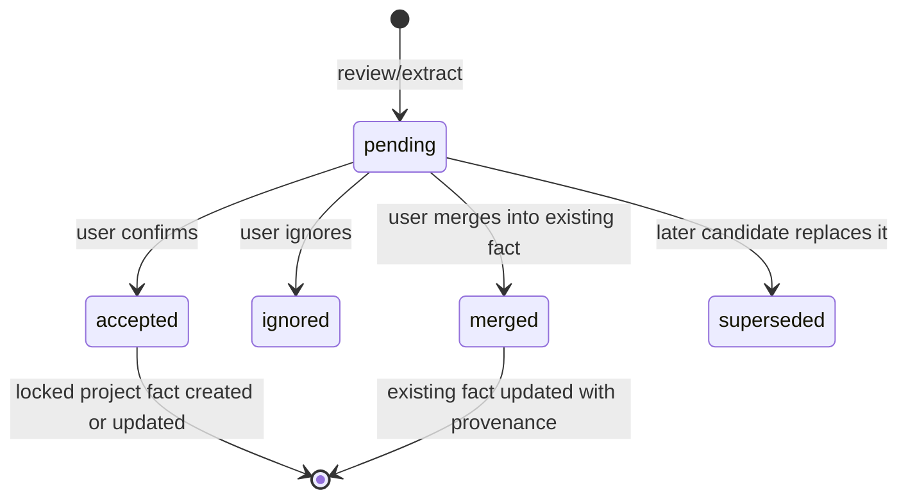

# Design: Creative Project Continuity Facts

## Design Principles

1. `CreativeProject`, `ProjectContent`, existing project bible/world assets and `ProjectGenerationLog` remain the only project facts and audit sources.
2. A continuity candidate is a proposal with provenance, not an accepted memory.
3. A locked fact is immutable for generation until the user unlocks or explicitly edits it.
4. Candidate promotion must be idempotent: rerunning review must not create duplicate facts for the same claim and source.
5. Every write is explicit and reversible. AI may recommend a rewrite but never apply it silently.

## Contract

```json
{
  "id": "uuid",
  "project_id": "uuid",
  "source_content_id": "uuid",
  "source_generation_log_id": "uuid|null",
  "entity_type": "character|location|item|event|timeline|relationship|foreshadow|world_rule|other",
  "entity_name": "string",
  "claim": "string",
  "evidence_excerpt": "string",
  "evidence_anchor": {"chapter_number": 3, "paragraph_index": 7},
  "severity": "info|warning|conflict",
  "suggested_action": "create_fact|update_fact|resolve_conflict|rewrite_excerpt|ignore",
  "target_fact_type": "project_bible|world_asset",
  "dedupe_fingerprint": "sha256",
  "status": "pending|accepted|ignored|merged|superseded",
  "resolved_fact_id": "uuid|null",
  "created_at": "datetime",
  "resolved_at": "datetime|null"
}
```

`evidence_excerpt` is bounded. The canonical prose stays in `ProjectContent`; the candidate only stores an anchor and an auditable excerpt.

## Lifecycle



### Extraction and Promotion

1. Writer Room editorial review returns regular reader feedback plus structured candidate payloads.
2. Backend validates fields, bounds excerpts, computes a source-aware fingerprint and upserts only `pending` candidates.
3. UI shows the evidence, target fact type and suggested action. It never presents a candidate as already true.
4. On accept, the service creates/updates the selected `project_bible`/`world_asset` card, marks it locked, and records candidate/source provenance in card metadata.
5. On ignore or merge, the candidate receives its terminal decision without changing prose.
6. Future context packs read only the locked cards, therefore a user-approved fact naturally enters later generation.

## Context Summary

The server already builds the actual context pack. Each generation response/log should expose a summary rather than duplicate the pack:

```json
{
  "locked_fact_count": 12,
  "fact_types": {"project_bible": 5, "world_asset": 7},
  "source_chapters": [1, 2],
  "character_count": 1830,
  "fingerprint": "sha256:..."
}
```

The UI may request an authorized, bounded detail view for the current generation. It must show card titles/source anchors, not persist a second complete prompt in browser state.

## Conflict Check and Rewrite

- Conflict check compares a selected candidate/current prose against locked facts and bounded prior chapters.
- Result uses the same entity/evidence/severity shape, with `suggested_action` set to `resolve_conflict` or `rewrite_excerpt`.
- Paragraph rewrite accepts `content_id`, paragraph anchor and user instruction. It creates a new candidate version; it cannot mutate approved prose in place.
- If the backend cannot resolve the paragraph anchor, it returns a structured `anchor_not_found` result. The UI offers explicit whole-chapter candidate rewrite rather than guessing.

## API Sketch

```text
GET    /api/v1/creative-projects/{project_id}/continuity-candidates
POST   /api/v1/creative-projects/{project_id}/continuity-candidates/extract
POST   /api/v1/creative-projects/{project_id}/continuity-candidates/{candidate_id}/accept
POST   /api/v1/creative-projects/{project_id}/continuity-candidates/{candidate_id}/ignore
POST   /api/v1/creative-projects/{project_id}/continuity-candidates/{candidate_id}/merge
POST   /api/v1/creative-projects/{project_id}/chapters/{chapter_number}/check-continuity
POST   /api/v1/creative-projects/{project_id}/contents/{content_id}/rewrite-paragraph
GET    /api/v1/creative-projects/{project_id}/generation-logs/{log_id}/context-summary
```

Exact route names may change during implementation, but `docs/architecture/API_SURFACE.md` and `api_surface.json` must be regenerated and reviewed in the same change.

## Migration Decision

Start with a dedicated `ProjectContinuityCandidate` table because candidates need independent lifecycle queries, unique fingerprints, source provenance and user decisions. Do not hide this operational data in `settings_json` or an overloaded content record.

## Verification

- Candidate extraction is scoped to one project and does not leak facts from another project.
- Repeated extraction is idempotent by source-aware fingerprint.
- Accept writes a locked fact with provenance; ignore writes no fact.
- Locked accepted facts appear in the next context pack; pending facts do not.
- Paragraph rewrite always produces a candidate content version and leaves approved prose unchanged.
- API, service, Writer Room and frontend smoke tests cover success, conflict, anchor-not-found and failed model paths.
